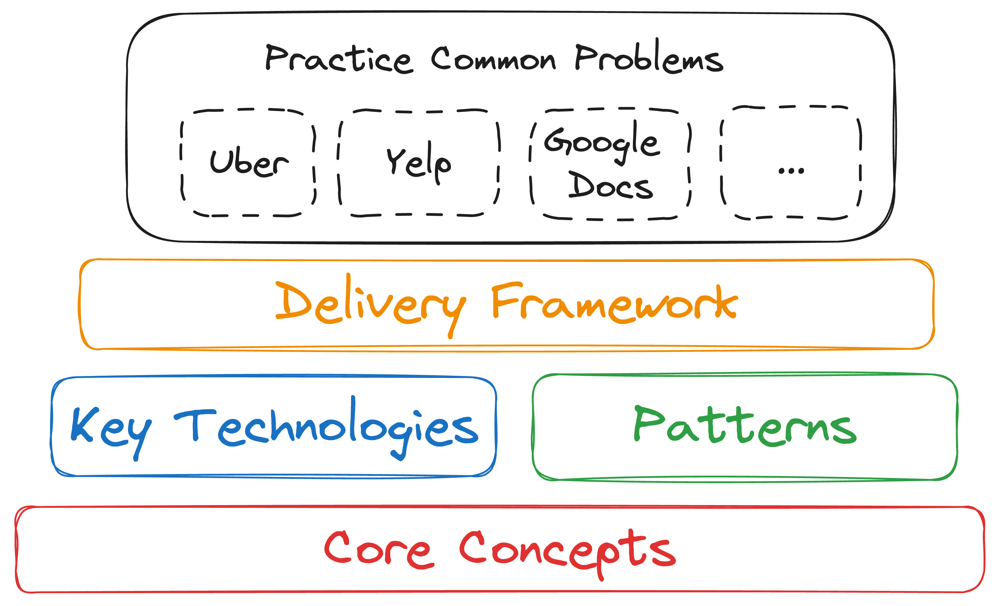

# Learn System Design in a Hurry

While conducting thousands of mock system design interviews with Hello Interview, we frequently work with candidates who have an upcoming interview in a few days or even tomorrow. Let's be real: no one is going to become a system design master overnight. Instead, what we've put together is 'System Design in a Hurry' - using data from hundreds of mock interview sessions across companies and interviewers, we've identified the most common flags and outlined the content to help you eliminate them. Wherever possible, we link to in-depth information should you wish to learn more.

The intent here is to cover the last and most impactful 20%, not to teach you from scratch. While 'System Design in a Hurry' won't build mastery, it's still high-leverage. The key concepts we cover are relevant for system design in the real world - and interviewers generally will try to align their interviews with these concepts because they're practical, not strictly academic.

Other system design materials are either ChatGPT spew or go to a level of depth that you'll never possibly cover in an interview (and might be a yellow flag if you do). We aimed to make 'System Design in a Hurry' dense, practical, and efficient. Moreover, it's 100% free forever. While we could charge for this material we think it's far more important to level the playing field of system design interviews.

If you want to support us, we have supplementary content available via our [**premium**](https://www.hellointerview.com/premium) offering and our [**expert interviewers are available for mock interviews**](https://www.hellointerview.com/mock/schedule) and can pinpoint the primary areas for you to focus much better than any guide can!

:::info
Our free content is intended to cover all you need to succeed in tech interviews and has been used by thousands of candidates to nail their system design interviews. It will remain free forever.

Our paid content (via [Premium](https://www.hellointerview.com/premium)) goes a tick deeper and is useful for candidates who want more detail or to go deeper in their studies. You'll see references to Premium with a lock icon. Use whichever works for you!
:::

Let's go.

## How to Use This Guide
At a high level, preparing for system design interviews is really about assembling the right pieces: you'll need to know some core concepts, key technologies, and common patterns. On this base, you'll establish a strategy or delivery framework for executing the interview. And finally, you'll need to practice to ensure you're comfortable the day of your actual interview.

For more experienced candidates, this may be just organizing things you already know to be ready for your interview. For others, you may need to do some deep dives to learn more about relevant topics so you're prepared for detailed questions from your interviewer.

For your preparation, we recommend that you read this guide in order, skipping any sections you already know. While we link off to additional material where relevant, we've tried to make this guide as self-contained as possible. Don't worry if you don't have time to read the additional material.

:::tip
Throughout the guide we've layered in commentary in these Tips and Warnings for common mistakes or things people tend to overlook in the interview. _Pay attention to these_ as they're the most likely things to end up as yellow flags in your interview.
:::