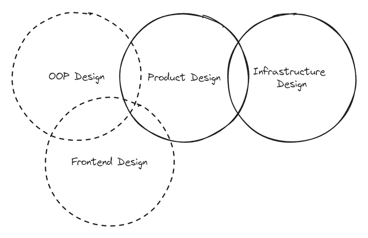

# Learn System Design in a Hurry

While conducting thousands of mock system design interviews with Hello Interview, we frequently work with candidates who have an upcoming interview in a few days or even tomorrow. Let's be real: no one is going to become a system design master overnight. Instead, what we've put together is 'System Design in a Hurry' - using data from hundreds of mock interview sessions across companies and interviewers, we've identified the most common flags and outlined the content to help you eliminate them. Wherever possible, we link to in-depth information should you wish to learn more.

The intent here is to cover the last and most impactful 20%, not to teach you from scratch. While 'System Design in a Hurry' won't build mastery, it's still high-leverage. The key concepts we cover are relevant for system design in the real world - and interviewers generally will try to align their interviews with these concepts because they're practical, not strictly academic.

Other system design materials are either ChatGPT spew or go to a level of depth that you'll never possibly cover in an interview (and might be a yellow flag if you do). We aimed to make 'System Design in a Hurry' dense, practical, and efficient. Moreover, it's 100% free forever. While we could charge for this material we think it's far more important to level the playing field of system design interviews.

If you want to support us, we have supplementary content available via our [**premium**](https://www.hellointerview.com/premium) offering and our [**expert interviewers are available for mock interviews**](https://www.hellointerview.com/mock/schedule) and can pinpoint the primary areas for you to focus much better than any guide can!

:::info
Our free content is intended to cover all you need to succeed in tech interviews and has been used by thousands of candidates to nail their system design interviews. It will remain free forever.

Our paid content (via [Premium](https://www.hellointerview.com/premium)) goes a tick deeper and is useful for candidates who want more detail or to go deeper in their studies. You'll see references to Premium with a lock icon. Use whichever works for you!
:::

Let's go.

## How to Use This Guide
At a high level, preparing for system design interviews is really about assembling the right pieces: you'll need to know some core concepts, key technologies, and common patterns. On this base, you'll establish a strategy or delivery framework for executing the interview. And finally, you'll need to practice to ensure you're comfortable the day of your actual interview.

For more experienced candidates, this may be just organizing things you already know to be ready for your interview. For others, you may need to do some deep dives to learn more about relevant topics so you're prepared for detailed questions from your interviewer.

For your preparation, we recommend that you read this guide in order, skipping any sections you already know. While we link off to additional material where relevant, we've tried to make this guide as self-contained as possible. Don't worry if you don't have time to read the additional material.

:::tip
Throughout the guide we've layered in commentary in these Tips and Warnings for common mistakes or things people tend to overlook in the interview. _Pay attention to these_ as they're the most likely things to end up as yellow flags in your interview.
:::

If you're _really_ short on time, we recommend covering the [**Delivery Framework**](https://www.hellointerview.com/learn/system-design/in-a-hurry/delivery) section, skimming the [Key Technologies](https://www.hellointerview.com/learn/system-design/in-a-hurry/key-technologies), and spending any remaining time studying the [**Core Concepts**](https://www.hellointerview.com/learn/system-design/in-a-hurry/core-concepts) section.

## Types of System Design Interviews
Each company (and sometimes, each interviewer) will conduct a system design interview a little differently. Often, the differences are not important and you can prepare for all of them with the same material. But some interview types require different preparation.

### Product Design
Product design interviews (sometimes called "Product Architecture" interviews, or ambiguously "System Design" interviews) are the most common type of system design interview. In these interviews, you'll be asked to design a system behind a product. For example, you might be asked to design the backend for a chat application, or the backend for a ride sharing application. Often these interviews are described in terms of a "use case" - for example, "design the backend for a chat application that supports 1:1 and group chats" and frequently referred to by the most noteworthy company that uses that use case. For example, "design the backend for a chat application like Slack".

This guide **will** be useful for Product Design interviews.

_Example Questions:_

- Design a ride-sharing service like Uber
- Design a chat application like Slack
- Design a social network like Facebook

### Infrastructure Design

Infrastructure design interviews are less common than product design interviews, but still relatively common. In these interviews, you'll be asked to design a system that supports a particular infrastructure use case. For example, you might be asked to design a message broker or a rate limiter. Since these interviews are deeper in the stack, your interviewer will be looking for more emphasis on system-level mastery (e.g. consensus algorithms, durability considerations) than high-level design.

This guide **will** be useful for Infrastructure Design interviews, with a stronger emphasis on the Concepts section.

_Example Questions:_

- Design a rate limiter
- Design a message broker
- Design a key-value store

### Object Oriented Design

Object oriented design (sometimes called "Low Level Design") interviews are less common than product design interviews, but still occur at particularly at companies that use an object-oriented language like Java (Amazon is notable for these interviews). In these interviews, you'll be asked to design a system that supports a particular use-case, but the emphasis on the interview is assembling the correct class structure, adhering to [SOLID principles](https://en.wikipedia.org/wiki/SOLID), coming up with a sensible entity design, etc. For example, you might be asked to design a Parking Lot reservation system or a Vending Machine, but rather than breaking this problem down into services and describing the backend database you're instead asked to describe the class structure of a solution.

This guide is **not** as useful for an Object Oriented Design interview. We instead recommend (until we get to it!) [Grokking the Low Level Design Interview](https://www.educative.io/courses/grokking-the-low-level-design-interview-using-ood-principles).

_Example Questions:_

- Design a parking lot reservation system
- Design a vending machine
- Design an elevator control system
    

### Frontend Design

Frontend design interviews are focused on the architecture of a complex frontend application. These interviews are most common with specialized frontend engineering roles at larger companies. For example, you might be asked to design the frontend for a spreadsheet application or a video editor.

This guide is **not** as useful for a Frontend Design interview. We instead recommend you [try Great Frontend for both material and practice problems for frontend design interviews](https://www.greatfrontend.com/).

_Example Questions:_
- Design the frontend for a spreadsheet application
- Design the frontend for a video editor
## Interview Assessment

Each company will have a different rubric for system design, but these rubrics are often similar and simply specifying the same overall competencies but with more specificity. System design interviews will vary by level. Most entry-level software engineering roles will _not_ have a system design interview (though there are plenty of exceptions). Once you've reached mid-level, system design interviews become more common. At the senior level, system design interviews are the norm.

The difference in levelling is most frequently the depth of the solution and your knowledge. While all candidates are expected to complete a full design satisfying the requirements, a mid-level engineer might only do this with 80% breadth and 20% depth, while a senior engineer might do this with 60% breadth and 40% depth.

:::tip
Remember that the top-level goal for your interview is to give your interviewer sufficient confidence to advocate for a hire decision. While the mechanics of your interview are important, they are ultimately in service of signaling to your interviewer that you are a strong candidate.
:::

:::warning
The most common reason for a candidate to fail a system design interview is not delivering a working system. This is often due to a lack of structure in their approach. We recommend following the structure outlined in the [**Delivery**](https://www.hellointerview.com/learn/system-design/in-a-hurry/delivery) section.
:::

### Problem Navigation

Your interviewer is looking to assess your ability to navigate a complex problem. This means that you should be able to break down the problem into smaller, more manageable pieces, prioritize the most important ones, and then navigate through those pieces to a solution. This is often the most important part of the interview, and the part that most candidates (especially those new to system design) struggle with.

The most common ways that candidates fail with this competency are:

- Insufficiently exploring the problem and gathering requirements.
- Focusing on uninteresting/trivial aspects of the problem vs the most important ones.
- Getting stuck on a particular piece of the problem and not being able to move forward.

### [High-Level Design](https://www.hellointerview.com/learn/system-design/in-a-hurry/delivery#high-level-design-10-15-minutes)

With a problem broken down, your interviewer wants to see how you can solve each of the constituent pieces. This is where your knowledge of the [Core Concepts](https://www.hellointerview.com/learn/system-design/in-a-hurry/core-concepts) comes into play. You should be able to describe how you would solve each piece of the problem, and how those pieces fit together into a cohesive whole.

The most common ways that candidates fail with this competency are:

- Not having a strong enough understanding of the core concepts to solve the problem.
- Ignoring scaling and performance considerations.
- "Spaghetti design" - a solution that is not well-structured and difficult to understand.

### Technical Excellence

To be able to design a great system, you'll need to know about best practices, current technologies, and how to apply them. This is where your knowledge of the [Key Technologies](https://www.hellointerview.com/learn/system-design/in-a-hurry/key-technologies) is important. You should be able to describe how you would use current technologies, with well-recognized patterns, to solve the problems.

The most common ways that candidates fail with this competency are:

- Not knowing about available technologies.
- Not knowing how to apply those technologies to the problem at hand.
- Not recognizing common patterns and best practices.

### Communication and Collaboration

Technical interviews are also a way to get to know what it would be like to work with you as a colleague. Interviews are frequently collaborative, and your interviewer will be looking to see how you work with them to solve the problem. This will include your ability to communicate complex concepts, respond to feedback and questions, and in some cases work together with the interviewer to solve the problem.

The most common ways that candidates fail with this competency are:

- Not being able to communicate complex concepts clearly.
- Being defensive or argumentative when receiving feedback.
- Getting lost in the weeds and not being able to work with the interviewer to solve the problem.

## Feedback and Suggestions

We're constantly updating our content based on your feedback. If you have questions, comments, or suggestions please leave them in the comments below. And thanks in advance!