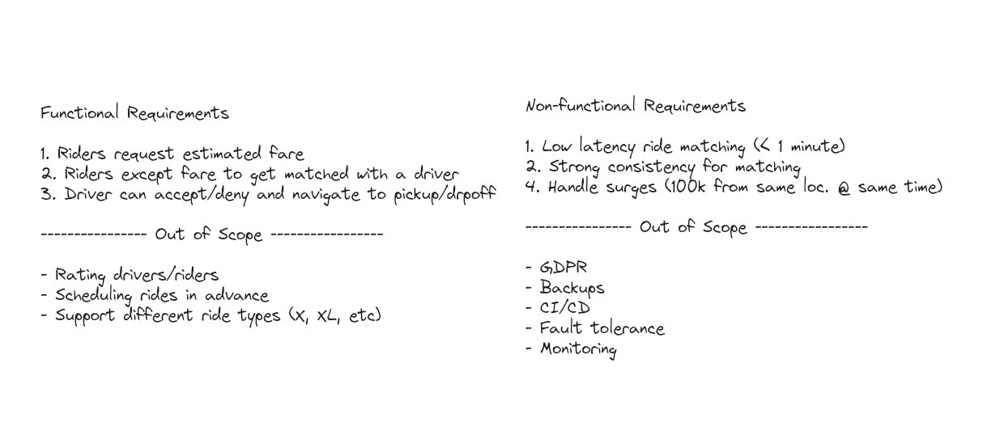
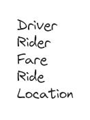
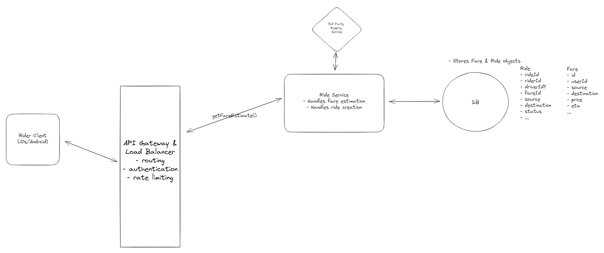
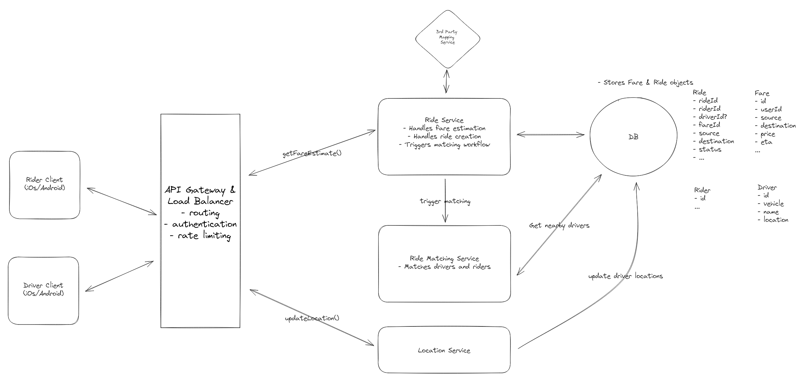
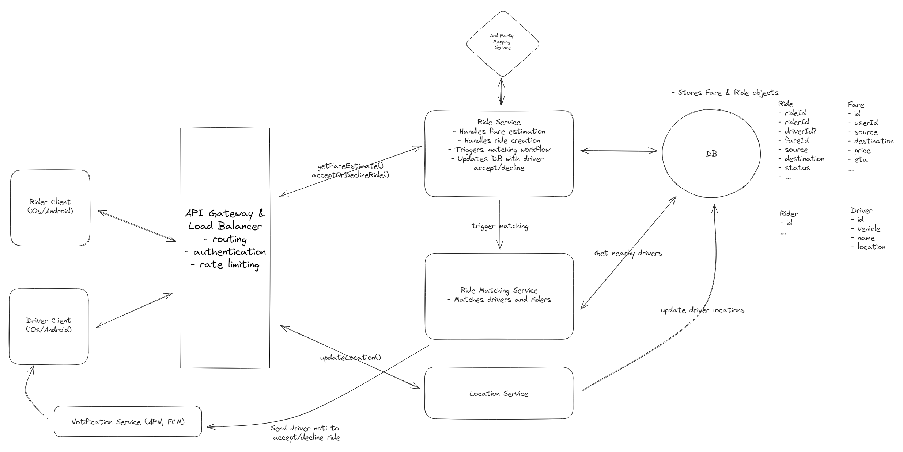
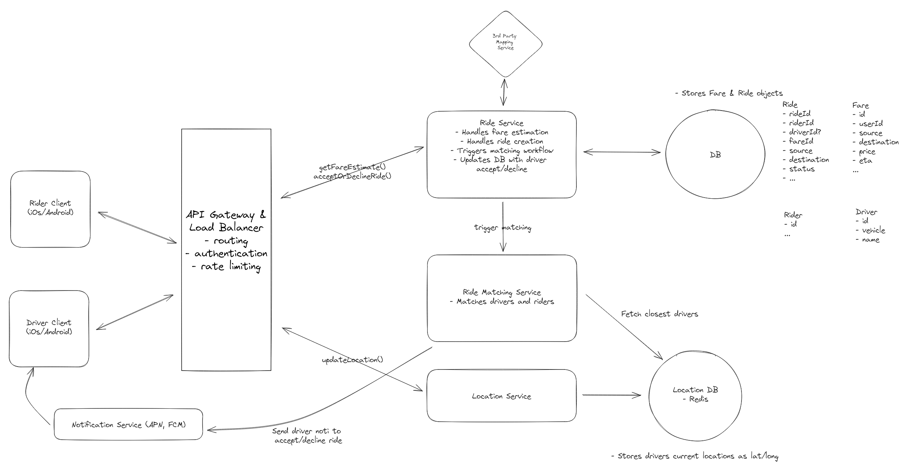
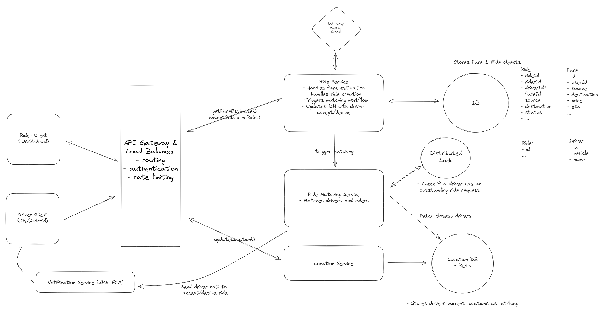
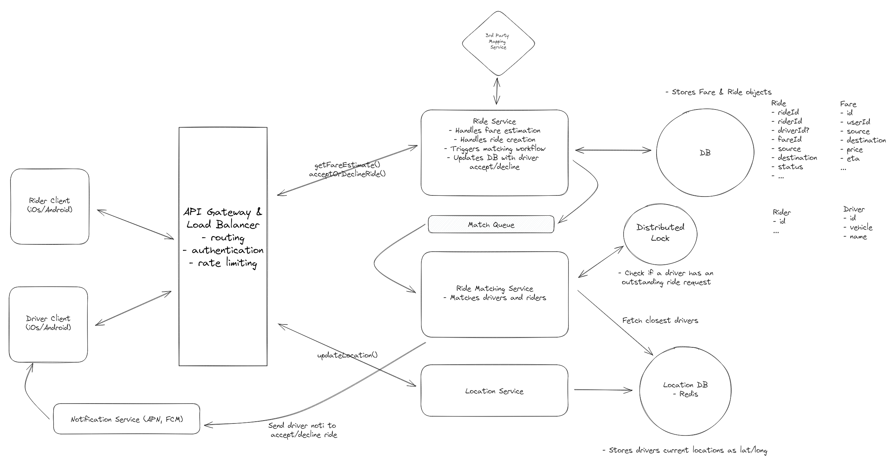
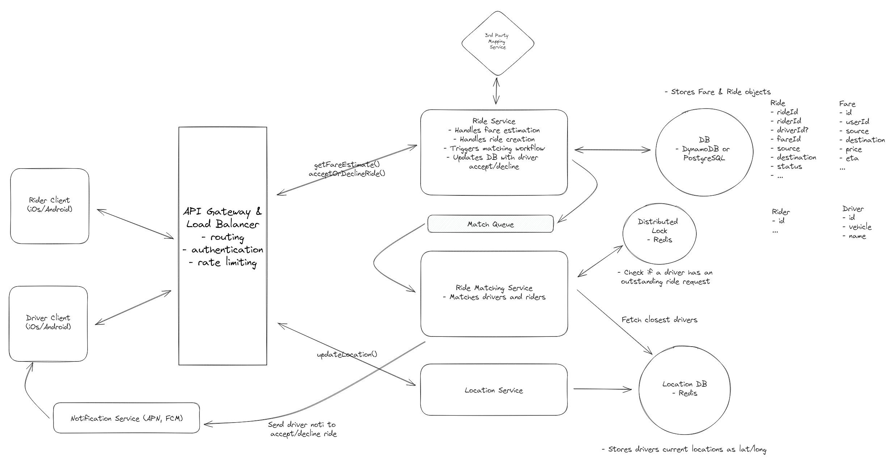

# Design a Ride Sharing App Like Uber

:::meta
LEVEL : MEDIUM |  [Watch on YouTube](https://www.youtube.com/watch?v=lsKU38RKQSo)
:::

## Understanding the Problem

:::problem
**🚗 What is [Uber](https://www.uber.com/)?** Uber is a ride-sharing platforms that connect passengers with drivers who offer transportation services in personal vehicles. It allows users to book rides on-demand from their smartphones, matching them with a nearby driver who will take them from their location to their desired destination.
:::

### [Functional Requirements](https://www.hellointerview.com/learn/system-design/in-a-hurry/delivery#1-functional-requirements)

:::tip
1. Start your interview by defining the functional and non-functional requirements. For user facing applications like this one, functional requirements are the "Users should be able to..." statements whereas non-functional defines the system qualities via "The system should..." statements.
    
2. Prioritize the top 3 functional requirements. Everything else shows your product thinking, but clearly note it as "below the line" so the interviewer knows you wont be including them in your design. Check in to see if your interviewer wants to move anything above the line or move anything down. Choosing just the top 3 is important to ensuring you stay focused and can execute in the limited time window.
    
3. When evaluating non-functional requirements, it's crucial to uncover the distinct characteristics that make this system challenging or unique. To help you identify these, consider the following questions:
    
    1. **CAP theorem:** Does this system prioritize availability or consistency? Note, that in some cases, the answer is different depending on the part of the system -- as you'll see is the case here.
        
    2. **Read vs write ratio:** is this a read heavy system or write heavy? Are either notably heavy for any reason?
        
    3. **Query access pattern:** Is the access pattern of the system regular or are their patterns or bursts that require particular attention. For example, the holidays for shopping sites or popular events for ticket booking.
        
:::

**Core Requirements**

1. Riders should be able to input a start location and a destination and get a fare estimate.
    
2. Riders should be able to request a ride based on the estimated fare.
    
3. Upon request, riders should be matched with a driver who is nearby and available.
    
4. Drivers should be able to accept/decline a request and navigate to pickup/drop-off.
    

**Below the line (out of scope)**

1. Riders should be able to rate their ride and driver post-trip.
    
2. Drivers should be able to rate passengers.
    
3. Riders should be able to schedule rides in advance.
    
4. Riders should be able to request different categories of rides (e.g., X, XL, Comfort).
    

### [Non-Functional Requirements](https://www.hellointerview.com/learn/system-design/in-a-hurry/delivery#2-non-functional-requirements)

**Core Requirements**

1. The system should prioritize low latency matching (< 1 minutes to match or failure)
    
2. The system should ensure strong consistency in ride matching to prevent any driver from being assigned multiple rides simultaneously
    
3. The system should be able to handle high throughput, especially during peak hours or special events (100k requests from same location)
    

**Below the line (out of scope)**

1. The system should ensure the security and privacy of user and driver data, complying with regulations like GDPR.
    
2. The system should be resilient to failures, with redundancy and failover mechanisms in place.
    
3. The system should have robust monitoring, logging, and alerting to quickly identify and resolve issues.
    
4. The system should facilitate easy updates and maintenance without significant downtime (CI/CD pipelines).
    



:::warning
Adding features that are out of scope is a "nice to have". It shows product thinking and gives your interviewer a chance to help you reprioritize based on what they want to see in the interview. That said, it's very much a nice to have. If additional features are not coming to you quickly, don't waste your time and move on.
:::

## The Set Up

### Planning the Approach

Before you move on to designing the system, it's important to start by taking a moment to plan your strategy. Fortunately, for these common users facing product-style questions, the plan should be straightforward: build your design up sequentially, going one by one through your functional requirements. This will help you stay focused and ensure you don't get lost in the weeds as you go. Once you've satisfied the functional requirements, you'll rely on your non-functional requirements to guide you through the deep dives.

### [Defining the Core Entities](https://www.hellointerview.com/learn/system-design/in-a-hurry/delivery#core-entities-2-minutes)

I like to begin with a broad overview of the primary entities. At this stage, it is not necessary to know every specific column or detail. We will focus on the intricacies, such as columns and fields, later when we have a clearer grasp. Initially, establishing these key entities will guide our thought process and lay a solid foundation as we progress towards defining the API.

To satisfy our key functional requirements, we'll need the following entities:

1. **Rider**: This is any user who uses the platform to request rides. It includes personal information such as name and contact details, preferred payment methods for ride transactions, etc.
    
2. **Driver**: This is any users who are registered as drivers on the platform and provide transportation services. It has their personal details, vehicle information (make, model, year, etc.), and preferences, and availability status.
    
3. **Fare**: This entity represents an estimated fare for a ride. It includes the pickup and destination locations, the estimated fare, and the estimated time of arrival. This could also just be put on the ride object, but we'll keep it separate for now but there is no right or wrong answer here.
    
4. **Ride**: This entity represents an individual ride from the moment a rider requests an estimated fare all the way until its completion. It records all pertinent details of the ride, including the identities of the rider and the driver, vehicle details, state, the planned route, the actual fare charged at the end of the trip, and timestamps marking the pickup and drop-off.
    
5. **Location**: This entity stores the real-time location of drivers. It includes the latitude and longitude coordinates, as well as the timestamp of the last update. This entity is crucial for matching riders with nearby drivers and for tracking the progress of a ride.
    

In the actual interview, this can be as simple as a short list like this. Just make sure you talk through the entities with your interviewer to ensure you are on the same page.




Now, let's proceed to design our system, tackling each functional requirement in sequence. This step-by-step approach will help us maintain focus and manage scope effectively, ensuring a cohesive build-up of the system's architecture.

:::tip
As you move onto the design, your objective is simple: create a system that meets all functional and non-functional requirements. To do this, I recommend you start by satisfying the functional requirements and then layer in the non-functional requirements afterward. This will help you stay focused and ensure you don't get lost in the weeds as you go.
:::

### [API or System Interface](https://www.hellointerview.com/learn/system-design/in-a-hurry/delivery#api-or-system-interface-5-minutes)

The API for retrieving a fare estimate is straightforward. We define a simple POST endpoint that takes in the user's current location and desired destination and returns a Fare object with the estimated fare and eta. We use POST here because we will be creating a new ride object in the database.

```http
POST /fare -> Fare
Body: {
  pickupLocation, 
  destination
}
```

**Request Ride Endpoint:** This endpoint is used by riders to confirm their ride request after reviewing the estimated fare. It initiates the ride matching process by signaling the backend to find a suitable driver, thus creating a new ride object.

```http
POST /rides -> Ride
Body: {
  fareId
}
```

:::info
Note that at this point in the flow, we match them with a driver who is nearby and available. However, this is all happening in the backend, so we don't need to explicitly list out an endpoint for this.
:::

**Update Driver Location Endpoint:** Before we can do any matching, we need to know where our drivers are. This endpoint is used by drivers to update their location in real-time. It is called periodically by the driver client to ensure that the driver's location is always up to date.

```http
POST /drivers/location -> Success/Error
Body: {
        lat, long
    }

- note the driverId is present in the session cookie or JWT 
  and not in the body or path params
```

:::tip
Always consider the security implications of your API. I regularly see candidates passing in data like `userId`, `timestamps`, or even `fareEstimate` in the body or query parameters. This is a red flag as it shows a lack of understanding of security best practices. Remember that you can't trust any data sent from the client as it can be easily manipulated. User data should always be passed in the session or JWT, while timestamps should be generated by the server. Data like `fareEstimate` should be retrieved from the database and never passed in by the client.
:::

**Accept Ride Request Endpoint:** This endpoint allows drivers to accept a ride request. Upon acceptance, the system updates the ride status and provides the driver with the pickup location coordinates.

```http
PATCH /rides/:rideId -> Ride
Body: {
  accept/deny
}
```

The `Ride` object is would contain information about the pickup location and destination so the client can display this information to the driver.

## [High-Level Design](https://www.hellointerview.com/learn/system-design/in-a-hurry/delivery#high-level-design-10-15-minutes)

### 1) Riders should be able to input a start location and a destination and get an estimated fare

The first thing that users will do when they open the app to request a ride is search for their desired destination. At this point, the client will make a request to our service to get an estimated price for the ride. The user will then have a chance to request a ride with this fare or do nothing.

Lets lay out the necessary components for communicating between the client and our microservices, adding our first service, “Ride Service” which will handle fare estimations


Uber Simple Fare Estimation

The core components necessary to fulfill fare estimation are:

1. **Rider Client**: The primary touchpoint for users is the Rider Client, available on iOS and Android. This client interfaces with the system's backend services to provide a seamless user experience.
    
2. **API Gateway**: Acting as the entry point for client requests, the API Gateway routes requests to the appropriate microservices. It also manages cross-cutting concerns such as authentication and rate limiting.
    
3. **Ride Service**: This microservice is tasked with managing ride state, starting with calculating fare estimates. It interacts with third-party mapping APIs to determine the distance and travel time between locations and applies the company's pricing model to generate a fare estimate. For the sake of this interview, we abstract this complexity away.
    
4. **Third Party Mapping API**: We use a third-party service (like Google Maps) to provide mapping and routing functionality. It is used by the Ride Service to calculate the distance and travel time between locations.
    
5. **Database:** The database is, so far, responsible for storing Fare entities. In this case, it creates a fare with information about the price, eta, etc.
    

Let's walk through exactly how these component interact when a rider requests a fare estimate.

1. The rider enters their pickup location and desired destination into the client app, which sends a POST request to our backend system via `/fare`
    
2. The API gateway receives the request and handles any necessary authentication and rate limiting before forwarding the request to the Ride Service.
    
3. The Ride Service makes a request to the Third Party Mapping API to calculate the distance and travel time between the pickup and destination locations and then applies the company's pricing model to the distance and travel time to generate a fare estimate.
    
4. The Ride Service creates a new Fare entity in the Database with the details about the estimated fare.
    
5. The service then returns the Fare entity to the API Gateway, which forwards it to the Rider Client so they can make a decision about whether accept the fare and request a ride.
    

### 2) Riders should be able to request a ride based on the estimated fare

Once a user reviews the estimated fare and ETA, they can request a ride. By building upon our existing design, we can extend it to support ride requests pretty easily.

We don't need to add any new entities at all, we just need to add a Ride table to our Database.



Then, when a request comes in, this is how we handle it.

1. The user confirms their ride request in the client app, which sends a POST request to our backend system with the id of the Fare they are accepting.
    
2. The API gateway performs necessary authentication and rate limiting before forwarding the request to the Ride Service.
    
3. The Ride Service receives the request and creates a new entry in the Ride table, linking to the relevant Fare that was accepted, and initializing the Ride's status as `requested`.
    
4. Next, it triggers the matching flow so that we can assign a driver to the ride (see below)
    

### 3) Upon request, riders should be matched with a driver who is nearby and available

Now we need to introduce some new components in order to facilitate driver matching.

1. **Driver Client**: In addition to the Rider Client, we introduce the Driver Client, which is the interface for drivers to receive ride requests and provide location updates. The Driver Client communicates with the Location Service to send real-time location updates.
    
2. **Location Service**: Manages the real-time location data of drivers. It is responsible for receiving location updates from drivers, storing this information in the database, and providing the Ride Matching Service with the latest location data to facilitate accurate and efficient driver matching.
    
3. **Ride Matching Service**: Handles incoming ride requests and utilizes a sophisticated algorithm (abstracted away for the purpose of this interview) to match these requests with the best available drivers based on proximity, availability, driver rating, and other relevant factors.
    




Let's walk through the sequence of events that occur when a user requests a ride and the system matches them with a nearby driver:

1. The user confirms their ride request in the client app, which sends a POST request to our backend system with the ID of the fare they are accepting.
    
2. The API gateway performs necessary authentication and rate limiting before forwarding the request to the Ride Matching Service.
    
3. We create a ride object as mentioned above, and then we trigger the matching workflow (we'll discuss ways to make this more robust later, keeping it simple for now).
    
4. Meanwhile, at all times, drivers are sending their current location to the location service, and we are updating our database with their latest location lat & long so we know where they are.
    
5. The matching workflow then uses these updated locations to query for the closest available drivers in an attempt to find an optimal match.
    

### 4) Drivers should be able to accept/decline a request and navigate to pickup/drop-off

Once a driver is matched with a rider, they can accept the ride request and navigate to the pickup location.

We only need to add one additional service to our existing design.

1. **Notification Service**: Responsible for dispatching real-time notifications to drivers when a new ride request is matched to them. It ensures that drivers are promptly informed so they can accept ride requests in a timely manner, thus maintaining a fluid user experience. Notifications are sent via APN (Apple Push Notification) and FCM (Firebase Cloud Messaging) for iOS and Android devices, respectively.
    




Let's walk through the sequence of events that occur when a driver accepts a ride request and completes the ride:

1. After the Ride Matching Service determines the ranked list of eligible drivers, it sends a notification to the top driver on the list via APN or FCM.
    
2. The driver receives a notification that a new ride request is available. They open the Driver Client app and accept the ride request, which sends a PATCH request to our backend system with the rideID. a) If they decline the ride instead, the system will send a notification to the next driver on the list.
    
3. The API gateway receives the requests and routes it to the Ride Service.
    
4. The Ride Service receives the request and updates the status of the ride to "accepted" and updates the assigned driver accordingly. It then returns the pickup location coordinates to the Driver Client.
    
5. With the coordinates in hand, the Driver uses on client GPS to navigate to the pickup location.
    

## [Potential Deep Dives](https://www.hellointerview.com/learn/system-design/in-a-hurry/delivery#deep-dives-10-minutes)

:::tip
With the core functional requirements met, it's time to dig into the non-functional requirements via deep dives. These are the main deep dives I like to cover for this question.
:::

The degree to which a candidate should proactively lead the deep dives is a function of their seniority. For example, it is completely reasonable in a mid-level interview for the interviewer to drive the majority of the deep dives. However, in senior and staff+ interviews, the level of agency and ownership expected of the candidate increases. They should be able to proactively look around corners and identify potential issues with their design, proposing solutions to address them.

### 1) How do we handle frequent driver location updates and efficient proximity searches on location data?

Managing the high volume of location updates from drivers and performing efficient proximity searches to match them with nearby ride requests is a difficult task, and our current high-level design most definitely does not handle this well. There are two main problems with our current design that we need to solve:

1. **High Frequency of Writes**: Given we have around 10 million drivers, sending locations roughly every 5 seconds, that's about 2 million updates a second! Whether we choose something like DynamoDB or PostgreSQL (both great choices for the rest of the system), either one would either fall over under the write load, or need to be scaled up so much that it becomes prohibitively expensive for most companies.
    
2. **Query Efficiency**: Without any optimizations, to query a table based on lat/long we would need to perform a full table scan, calculating the distance between each driver's location and the rider's location. This would be extremely inefficient, especially with millions of drivers. Even with indexing on lat/long columns, traditional B-tree indexes are not well-suited for multi-dimensional data like geographical coordinates, leading to suboptimal query performance for proximity searches. This is essentially a non-starter.
    
:::info
For DynamoDB in particular, 2M writes a second of ~100 bytes would cost you about 100k a day. Learn more about DynamoDB and it's limitations [here](https://www.hellointerview.com/learn/system-design/deep-dives/dynamodb)
:::

So, what can we do to address these issues?

:::solution-bad
#### Bad Solution: Direct Database Writes and Proximity Queries

**Approach**

The bad approach is what we briefly describe above, and what we have coming out of our high-level design. This approach involves directly writing each driver's location update to the database as it comes in, and performing proximity searches on this raw data. It's considered a bad approach because it doesn't scale well with the high volume of updates from millions of drivers, and it makes proximity searches inefficient and slow. This method would likely lead to system overload, high latency, and poor user experience, making it unsuitable for a large-scale ride-sharing application like this.
:::


:::solution-good
#### Good Solution: Batch Processing and Specialized Geospatial Database

**Approach**

Instead of writing each driver location update directly to the database, updates are aggregated over a short interval and then batch-processed. This reduces the number of write operations. For proximity searches, a specialized geospatial database with appropriate indexing is used to efficiently query nearby drivers.

Batch processing is a common technique for reducing the number of write operations to a database. It involves collecting data over a predefined time interval and then writing it to the database in a single batch operation. This can significantly reduce the number of write transactions, which can help in improving write throughput and reducing lock contention.

For proximity searches, a specialized geospatial database with appropriate indexing is used to efficiently query nearby drivers. Geospatial databases use specialized data structures, such as [quad-trees](https://en.wikipedia.org/wiki/Quadtree), to index driver locations, allowing for faster execution of proximity searches. Quad-trees are particularly well-suited for two-dimensional spatial data like geographic coordinates, as they partition the space into quadrants recursively, which can significantly speed up the process of finding all drivers within a certain area around a ride request.

If we were to go with PostgreSQL, it actually support a plugin called [PostGIS](https://postgis.net/) that allows us to use geospatial data types and functions without needing an additional database.

**Challenges**

The interval between batch writes introduces a delay, which means the location data in the database may not reflect the drivers' most current positions. This can lead to suboptimal driver matches.
:::

:::solution-good
#### Great Solution: Real-Time In-Memory Geospatial Data Store

**Approach**

We can address all the limitation of the previous solutions by using an in-memory data store like [Redis](https://www.hellointerview.com/learn/system-design/deep-dives/redis), which supports geospatial data types and commands. This allows us to handle real-time driver location updates and proximity searches with high throughput and low latency while minimizing storage costs with automatic data expiration.

Redis is an in-memory data store that supports geospatial data types and commands. It uses [geohashing](https://www.pubnub.com/guides/what-is-geohashing/) to encode latitude and longitude coordinates into a single string key, which is then indexed using a sorted set. This allows for efficient storage and querying of geospatial data.

Redis provides [geospatial commands](https://redis.io/commands/geoadd/) like `GEOADD` for adding location data and `GEOSEARCH` for querying nearby locations within a given radius or bounding box. These commands are highly optimized for geospatial data and can be used to efficiently handle real-time driver location updates and proximity searches. The `GEOSEARCH` command, introduced in Redis 6.2, replaces and enhances the functionality of the older `GEORADIUS` and `GEORADIUSBYMEMBER` commands, offering more flexibility and performance improvements.

We no longer have a need for batch processing since Redis can handle the high volume of location updates in real-time. Additionally, Redis automatically expires data based on a specified time-to-live (TTL), which allows us to retain only the most recent location updates and avoid unnecessary storage costs.

**Challenges**

The main challenge with this approach would be durability. Since Redis is an in-memory data store, there's a risk of data loss in case of a system crash or power failure. However, this risk can be mitigated in a few ways:

1. Redis persistence: We could enable Redis persistence mechanisms like RDB (Redis Database) or AOF (Append-Only File) to periodically save the in-memory data to disk.
    
2. Redis Sentinel: We could use Redis Sentinel for high availability. Sentinel provides automatic failover if the master node goes down, ensuring that a replica is promoted to master.
    

Even if we experience data loss due to a system failure, the impact would be minimal. Since driver location updates come in every 5 seconds, we would only need that long to recover and rebuild the state of our system. This quick recovery time ensures that our system remains robust and reliable, even in the face of potential failures.



:::

### 2) How can we manage system overload from frequent driver location updates while ensuring location accuracy?

High-frequency location updates from drivers can lead to system overload, straining server resources and network bandwidth. This overload risks slowing down the system, leading to delayed location updates and potentially impacting user experience. In most candidates original design, they have drivers ping a new location every 5 seconds or so. This follow up question is designed to see if they can intelligently reduce the number of pings while maintaining accuracy.

:::solution-good
#### Great Solution: Adaptive Location Update Intervals

**Approach**

We can address this issue by implementing adaptive location update intervals, which dynamically adjust the frequency of location updates based on contextual factors such as speed, direction of travel, proximity to pending ride requests, and driver status. This allows us to reduce the number of location updates while maintaining accuracy.

The driver's app uses ondevice sensors and algorithms to determine the optimal interval for sending location updates. For example, if the driver is stationary or moving slowly, updates can be less frequent. Conversely, if the driver is moving quickly or changing direction often, updates are sent more frequently.

**Challenges**

The main challenge with this approach is the complexity of designing effective algorithms to determine the optimal update frequency. This requires careful consideration and testing to ensure accuracy and reliability. But, if done well, it will significantly reduce the number of location updates and improve system efficiency.
:::

:::tip
Don't neglect the client when thinking about your design. Many candidates get in a habit of drawing a small client box and moving on. In many cases, we need client side logic to improve the efficiency and scalability of our system. As you saw, we can reduce the number of pings by using ondevice sensors and algorithms to determine the optimal interval for sending location updates. Similarly, in the case of a file upload service, the client is responsible for chunking and compression.
:::

### 3) How do we prevent multiple ride requests from being sent to the same driver simultaneously?

We defined consistency in ride matching as a key non-functional requirment. This means that we only request one driver at a time for a given ride request AND that each driver only receives one ride request at a time. That driver would then have 10 seconds to accept or deny the request before we move on to the next driver if necessary. If you've solved Ticketmaster before, you know this problem well -- as it's almost exactly the same as ensuring that a ticket is only sold once while being reserved for a specific amount of time at checkout.

:::solution-bad
#### Bad Solution: Application-Level Locking with Manual Timeout Checks

**Approach**

The key intuition is that we need to lock drivers to prevent multiple ride requests from being sent to the same driver simultaneously. The question then just becomes, "how"? One approach is to use application-level locking, where each instance of the Ride Matching Service marks a ride request as "locked" when it is sent to a driver. It then starts a timer for the lock duration. If the driver does not accept the ride within this period, the instance manually releases the lock and makes the request available to other drivers.

**Problems**

This approach has several issues, here are the main ones:

- **Lack of Coordination:** With multiple instances of the Ride Matching Service running, there's no centralized coordination, leading to potential race conditions where two instances might attempt to lock the same ride request simultaneously.
    
- **Inconsistent Lock State:** If one instance sets a lock but fails before releasing it (due to a crash or network issue), other instances have no knowledge of this lock, which can leave the ride request in a locked state indefinitely.
    
- **Scalability Concerns:** As the system scales and the number of instances increases, the problem of coordinating locks across instances becomes more pronounced, leading to a higher likelihood of errors and inconsistencies.
:::
    

:::solution-good
#### Good Solution: Database Status Update with Timeout Handling

**Approach**

To solve the coordination problem, we can move the lock into the database. This allows us to use the database's built-in transactional capabilities to ensure that only one instance can lock a ride request at a time. When we send a request to a driver, we would update the status of that driver to "outstanding_request", or something similar. If the driver accepts the request, we update the status to "accepted" and if they deny it, we update the status to "available". We can then use a simple timeout mechanism within the Ride Service to ensure that the lock is released if the driver does not respond within the 10 second window.

**Challenges**

While we solved the coordination issue, we still run into issues with relying on a in-memory timeout to handle unlocking if the driver does not respond. If the Ride Service crashes or is restarted, the timeout will be lost and the lock will remain indefinitely. This is a common issue with in-memory timeouts and why they should be avoided when possible. One solution is to have a cron job that runs periodically to check for locks that have expired and release them. This works, but adds unecessary complexity and introduces a delay in unlocking the ride request.
:::

:::solution-good
#### Great Solution: Distributed Lock with TTL

**Approach**

To solve the timeout issue, we can use a distributed lock implemented with an in-memory data store like Redis. When a ride request is sent to a driver, a lock is created with a unique identifier (e.g., `driverId`) and a TTL set to the acceptance window duration of 10 seconds. The Ride Matching Service attempts to acquire a lock on the `driverId` in Redis. If the lock is successfully acquired, it means no other service instance can send a ride request to the same driver until the lock expires or is released. If the driver accepts the ride within the TTL window, the Ride Matching Service updates the ride status to "accepted" in the database, and the lock is released in Redis. If the driver does not accept the ride within the TTL window, the lock in Redis expires automatically. This expiration allows the Ride Matching Service to consider the driver for new ride requests again.

**Challenges**

The main challenge with this approach is the system's reliance on the availability and performance of the in-memory data store for locking. This requires robust monitoring and failover strategies to ensure that the system can recover quickly from failures and that locks are not lost or corrupted. Given locks are only held for 10 seconds, this is a reasonable tradeoff as the emphemorality of the data makes it easier to recover from failures.



:::

### 4) How can we ensure no ride requests are dropped during peak demand periods?

During peak demand periods, the system may receive a high volume of ride requests, which can lead to dropped requests. This is particularly problematic during special events or holidays when demand is high and the system is under stress. We also need to protect against the case where an instance of the Ride Matching Service crashes or is restarted, leading to dropped rides.

:::solution-bad
#### Bad Solution: First-Come, First-Served with No Queue

**Approach**

The simplest approach is to process ride requests as they come in without any queuing system (as is currently done in our design). This is a first-come, first-served approach and what we currently have in our high-level design.

**Challenges**

The main issue with this approach is that it does not scale well during high-demand periods. As the number of incoming requests increases, the system may become overwhelmed and start dropping requests, leading to a poor user experience. We can scale our ride matching service horizontally to handle more requests, but with sudden surges in demand, we may not be able to scale quickly enough to prevent dropped requests.

Additionally, if a Ride Matching Service goes down, any ride requests that were being processed by that instance would be lost. This could result in riders waiting indefinitely for a match that will never come, leading to a poor user experience and potential loss of customers. There's no built-in mechanism for request recovery or failover in this approach.

:::

:::solution-good
#### Great Solution: Queue with Dynamic Scaling

**Approach**

To address this issue, we can introduce a [queueing system](https://www.hellointerview.com/learn/system-design/in-a-hurry/key-technologies#queue) with dynamic scaling. When a ride request comes in, it is added to the queue. The Ride Matching Service then processes requests from the queue in a first-come, first-served manner. If the queue grows too large, the system scales horizontally by adding more instances of the Ride Matching Service to handle the increased load. This allows us to scale the system dynamically based on demand, ensuring that no requests are dropped. We can also partition the queues based on geographic regions to further improve efficiency.

We could use a distributed message queue system like [Kafka](https://www.hellointerview.com/learn/system-design/deep-dives/kafka), which allows us to commit the offset of the message in the queue only after we have successfully found a match. This way, if the Ride Matching Service goes down, the match request would still be in the queue, and a new instance of the service would pick it up. This approach ensures that no ride requests are lost due to service failures and provides fault tolerance to our system.

**Challenges**

The main challenge with this approach is the complexity of managing a queueing system. We need to ensure that the queue is scalable, fault-tolerant, and highly available. We can address this by using a managed queueing service like Amazon SQS or Kafka, which provides these capabilities out of the box. This allows us to focus on the business logic of the system without worrying about the underlying infrastructure.

The other issue with this approach is that since it is a FIFO queue you could have requests that are stuck behind a request that is taking a long time to process. This is a common issue with FIFO queues and can be addressed by using a priority queue instead. This allows us to prioritize requests based on factors like driver proximity, driver rating, and other relevant factors. This ensures that the most important requests are processed first, leading to a better user experience.


:::

### 5) How can you further scale the system to reduce latency and improve throughput?

:::solution-bad
#### Bad Solution: Vertical Scaling

**Approach**

The simplest approach to scaling is vertical scaling, where we increase the capacity of our existing servers by adding more CPU, memory, or storage. This is a quick and easy way to increase capacity, but it has several limitations.

**Challenges**

This solution sucks for many reasons. First, it is expensive and requires downtime to upgrade the servers. Second, it is not infinitely scalable. At some point, we will hit the limits of vertical scaling and need to scale horizontally. Lastly, it is not fault tolerant. If the server fails, the system goes down. We can address this by adding redundancy, but that is a bandaid and not a real solution. In an interview, it's hardly worth discussing this options as it's not practical for a system of this scale.
:::

:::solution-good
#### Great Solution: Geo-Sharding with Read Replicas

**Approach**

A better approach is to scale horizontally by adding more servers. We can do this by sharding our data geographically and using read replicas to improve read throughput. This allows us to scale the system to handle more requests while reducing latency and improving throughput. Importantly, this not only allows us to scale but it reduces latency by reducing the distance between the client and the server. This applies to everything from our services, message queue, to our databses -- all of which can be sharded geographically. The only time that we would need to scatter gather (i.e., query multiple shards) is when we are doing a proximty search on a boundary.

**Challenges**

The main challenge with this approach is the complexity of sharding and managing multiple servers. We need to ensure that data is distributed evenly across shards and that the system can handle failures and rebalancing. We can address this by using consistent hashing to distribute data across shards and by implementing a replication strategy to ensure that data is replicated across multiple servers. This allows us to scale the system horizontally while maintaining fault tolerance and high availability.
:::

After applying the "Great" solutions, your updated whiteboard should look something like this:



## [What is Expected at Each Level?](https://www.hellointerview.com/blog/the-system-design-interview-what-is-expected-at-each-level)

Ok, that was a lot. You may be thinking, “how much of that is actually required from me in an interview?” Let’s break it down.

### Mid-level

**Breadth vs. Depth:** A mid-level candidate will be mostly focused on breadth (80% vs 20%). You should be able to craft a high-level design that meets the functional requirements you've defined, but many of the components will be abstractions with which you only have surface-level familiarity.

**Probing the Basics:** Your interviewer will spend some time probing the basics to confirm that you know what each component in your system does. For example, if you add an API Gateway, expect that they may ask you what it does and how it works (at a high level). In short, the interviewer is not taking anything for granted with respect to your knowledge.

**Mixture of Driving and Taking the Backseat:** You should drive the early stages of the interview in particular, but the interviewer doesn’t expect that you are able to proactively recognize problems in your design with high precision. Because of this, it’s reasonable that they will take over and drive the later stages of the interview while probing your design.

**The Bar for Uber:** For this question, an E4 candidate will have clearly defined the API endpoints and data model, landed on a high-level design that is functional and meets the requirements. They would have understood the need for some spatial index to speed up location searches, but may not have landed on a specific solution. They would have also implemented at least the "good solution" for the ride request locking problem.

### Senior

**Depth of Expertise**: As a senior candidate, expectations shift towards more in-depth knowledge — about 60% breadth and 40% depth. This means you should be able to go into technical details in areas where you have hands-on experience. It's crucial that you demonstrate a deep understanding of key concepts and technologies relevant to the task at hand.

**Advanced System Design**: You should be familiar with advanced system design principles. For example, knowing how to use a search-optimized data store like [Elasticsearch](https://www.hellointerview.com/learn/system-design/deep-dives/elasticsearch) for event searching is essential. You’re also expected to understand the use of a distributed cache or similar for locking drivers and to discuss detailed scaling strategies (it’s ok if this took some probing/hints from the interviewer), including sharding and replication. Your ability to navigate these advanced topics with confidence and clarity is key.

**Articulating Architectural Decisions**: You should be able to clearly articulate the pros and cons of different architectural choices, especially how they impact scalability, performance, and maintainability. You justify your decisions and explain the trade-offs involved in your design choices.

**Problem-Solving and Proactivity**: You should demonstrate strong problem-solving skills and a proactive approach. This includes anticipating potential challenges in your designs and suggesting improvements. You need to be adept at identifying and addressing bottlenecks, optimizing performance, and ensuring system reliability.

**The Bar for Uber:** For this question, E5 candidates are expected to speed through the initial high level design so you can spend time discussing, in detail, at least 2 of the solutions to speed up location searches, the ride request locking problem, or the ride request queueing problem. You should also be able to discuss the pros and cons of different architectural choices, especially how they impact scalability, performance, and maintainability.

### Staff+

**Emphasis on Depth**: As a staff+ candidate, the expectation is a deep dive into the nuances of system design — I'm looking for about 40% breadth and 60% depth in your understanding. This level is all about demonstrating that, while you may not have solved this particular problem before, you have solved enough problems in the real world to be able to confidently design a solution backed by your experience.

You should know which technologies to use, not just in theory but in practice, and be able to draw from your past experiences to explain how they’d be applied to solve specific problems effectively. The interviewer knows you know the small stuff (REST API, data normalization, etc) so you can breeze through that at a high level so you have time to get into what is interesting.

**High Degree of Proactivity**: At this level, an exceptional degree of proactivity is expected. You should be able to identify and solve issues independently, demonstrating a strong ability to recognize and address the core challenges in system design. This involves not just responding to problems as they arise but anticipating them and implementing preemptive solutions. Your interviewer should intervene only to focus, not to steer.

**Practical Application of Technology**: You should be well-versed in the practical application of various technologies. Your experience should guide the conversation, showing a clear understanding of how different tools and systems can be configured in real-world scenarios to meet specific requirements.

**Complex Problem-Solving and Decision-Making**: Your problem-solving skills should be top-notch. This means not only being able to tackle complex technical challenges but also making informed decisions that consider various factors such as scalability, performance, reliability, and maintenance.

**Advanced System Design and Scalability**: Your approach to system design should be advanced, focusing on scalability and reliability, especially under high load conditions. This includes a thorough understanding of distributed systems, load balancing, caching strategies, and other advanced concepts necessary for building robust, scalable systems.

**The Bar for Uber:** For a staff+ candidate, expectations are high regarding depth and quality of solutions, particularly for the complex scenarios discussed earlier. Great candidates are diving deep into at least 3+ key areas, showcasing not just proficiency but also innovative thinking and optimal solution-finding abilities. A crucial indicator of a staff+ candidate's caliber is the level of insight and knowledge they bring to the table. A good measure for this is if the interviewer comes away from the discussion having gained new understanding or perspectives.