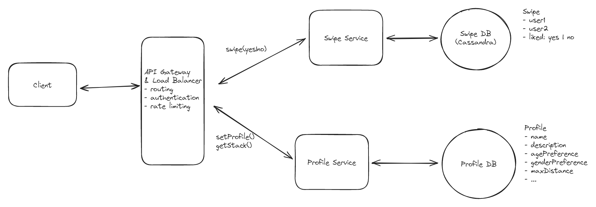
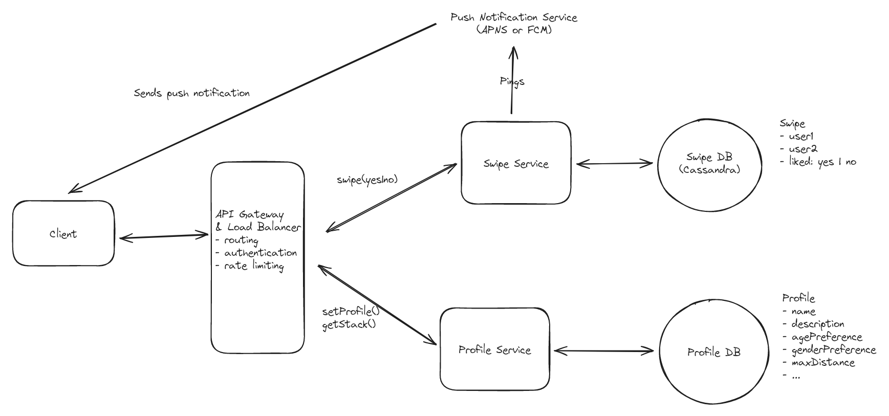
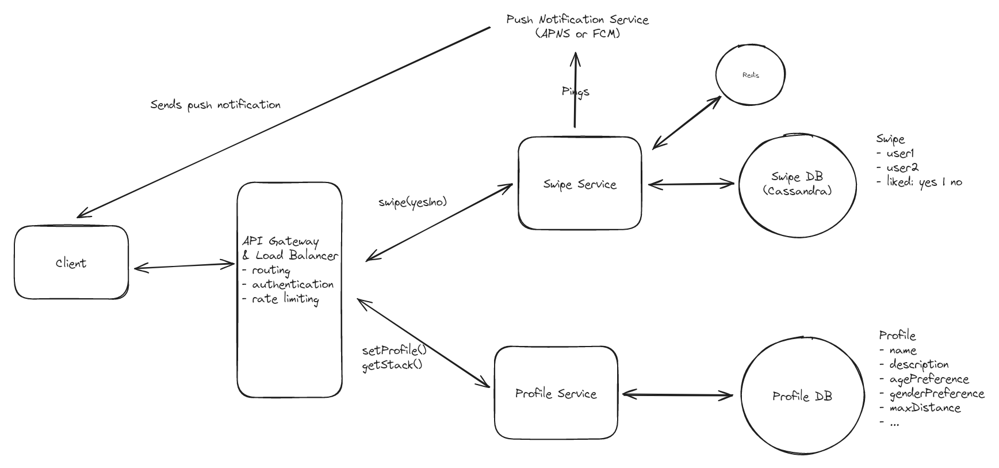
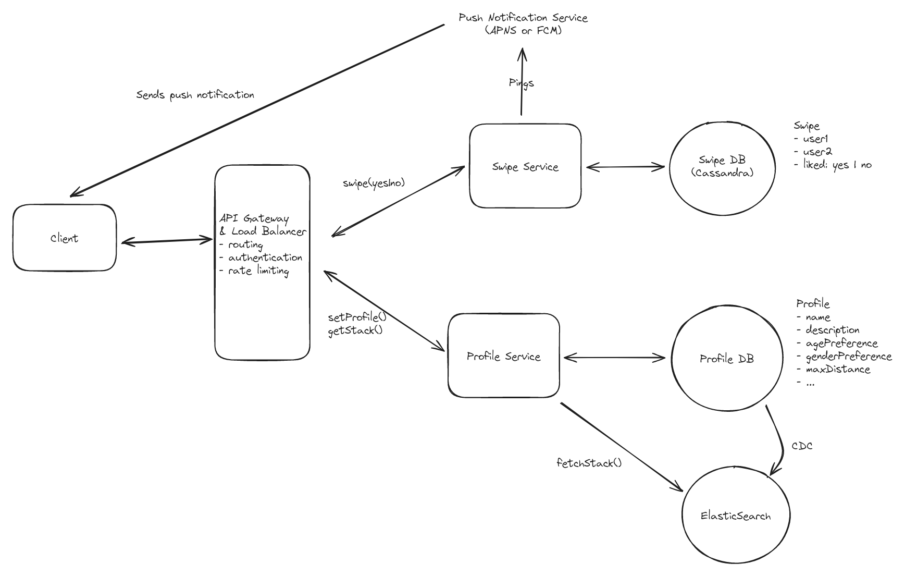
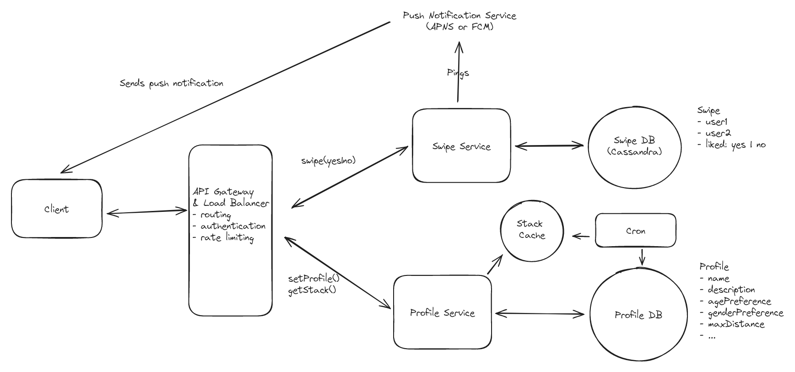
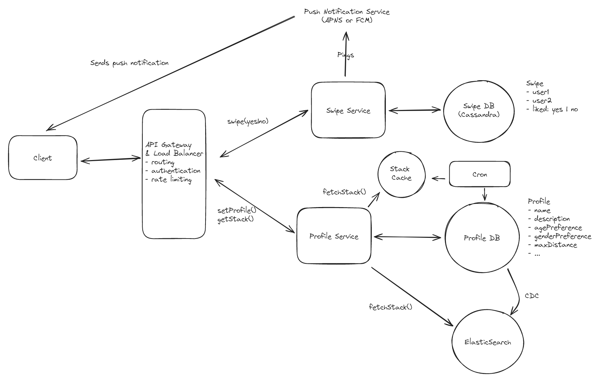
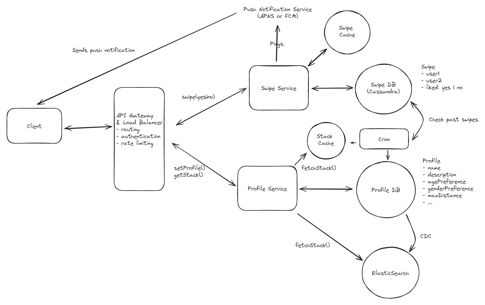

# Design a Dating App Like Tinder

:::meta
LEVEL : MEDIUM | [Watch on YouTube](https://www.youtube.com/watch?v=18Fg5Akhkqw)
:::

## Understand the Problem

:::problem
**❤️ What is [Tinder](https://tinder.com/)** Tinder is a mobile dating app that helps people connect by allowing users to swipe right to like or left to pass on profiles. It uses location data and user-specified filters to suggest potential matches nearby.
:::

### [Functional Requirements](https://www.hellointerview.com/learn/system-design/in-a-hurry/delivery#1-functional-requirements)

**Core Requirements**

1. Users can create a profile with preferences (e.g. age range, interests) and specify a maximum distance.
    
2. Users can view a stack of potential matches in line with their preferences and within max distance of their current location.
    
3. Users can swipe right / left on profiles one-by-one, to express "yes" or "no" on other users.
    
4. Users get a match notification if they mutually swipe on each other.
    

**Below the line (out of scope)**

- Users should be able to upload pictures.
    
- Users should be able to chat via DM after matching.
    
- Users can send "super swipes" or purchase other premium features.
    
:::info
It's worth noting that this question is mostly focused on the user recommendation "feed" and swiping experience, not on other auxiliary features. If you're unsure what features to focus on for an app like this, have some brief back and forth with the interviewer to figure out what part of the system they care the most about. It'll typically be the functionality that makes the app unique or the most complex.
:::

### [Non-Functional Requirements](https://www.hellointerview.com/learn/system-design/in-a-hurry/delivery#2-non-functional-requirements)

**Core Requirements**

1. The system should have strong consistency for swiping. If a user swipes "yes" on a user who already swiped "yes" on them, they should get a match notification.
    
2. The system should scale to lots of daily users / concurrent users (20M daily actives, ~100 swipes/user/day on average).
    
3. The system should load the potential matches stack with low latency (e.g. < 300ms).
    
4. The system should avoid showing user profiles that the user has previously swiped on.
    

**Below the line (out of scope)**

- The system should protect against fake profiles.
    
- The system should have monitoring / alerting.
    

Here's how it might look on a whiteboard:


## The Set Up

### Planning the Approach

Before you move on to designing the system, it's important to start by taking a moment to plan your strategy. Fortunately, for these [product design](https://www.hellointerview.com/learn/system-design/in-a-hurry/introduction#product-design) style questions, the plan should be straightforward: build your design up sequentially, going one by one through your functional requirements. This will help you stay focused and ensure you don't get lost in the weeds as you go.

Once we've satisfied the functional requirements, you'll rely on your non-functional requirements to guide you through the deep dives.

### [Defining the Core Entities](https://www.hellointerview.com/learn/system-design/in-a-hurry/delivery#core-entities-2-minutes)

Let's start by defining the set of core entities. Initially, establishing these key entities will guide our thought process and lay a solid foundation as we progress towards defining the API. We don't need to know every field or column at this point, but if you have a good idea of what they might be, feel free to jot them down.

For Tinder, the primary entities are pretty straightforward:

1. **User**: This represents both a user using the app and a profile that might be shown to the user. We typically omit the "user" concept when listing entities, but because users are swiping on other users, we'll include it here.
    
2. **Swipe**: Expression of "yes" or "no" on a user profile; belongs to a user (`swiping_user`) and is about another user (`target_user`).
    
3. **Match**: A connection between 2 users as a result of them both swiping "yes" on each other.
    

In the actual interview, this can be as simple as a short list like this. Just make sure you talk through the entities with your interviewer to ensure you are on the same page.


As you move onto the design, your objective is simple: create a system that meets all functional and non-functional requirements. To do this, I recommend you start by satisfying the functional requirements and then layer in the non-functional requirements afterward. This will help you stay focused and ensure you don't get lost in the weeds as you go.

### [The API](https://www.hellointerview.com/learn/system-design/in-a-hurry/delivery#api-design-5-minutes)

The API is the primary interface that users will interact with. You'll want to define the API early on, as it will guide your high-level design. We just need to define an endpoint for each of our functional requirements.

The first endpoint we need is an endpoint to create a profile for a user. Of course, this would include images, bio, etc, but we're going to focus just on their match preferences for this question.

```http
POST /profile
{
  "age_min": 20,
  "age_max": 30,
  "distance": 10,
  "interestedIn": "female" | "male" | "both",
  ... 
}
```

Next we need an endpoint to get the "feed" of user profiles to swipe on, this way we have a "stack" of profiles ready for the user:

```http
GET /feed?lat={}&long={}&distance={} -> User[]
```

:::info
We don't need to pass in other filters like age, interests, etc. because we're assuming the user has already specified these in the app settings, and we can load them server-side.

Unless you pay for the premium version (out of scope), Tinder will show users within a specific radius of your current location. Given that this can always change, we pass it in client-side as opposed to persisting server-side.
:::

:::warning
You might be tempted to proactively consider pagination for the feed endpoint. This is actually superfluous for Tinder b/c we're really generating recommendations. Rather than "paging", the app can just hit the endpoint again for more recommendations if the current list is exhausted.
:::

We'll also need an endpoint to power swiping:

```http
POST /swipe/{userId}
Request:
{
  decision: "yes" | "no"
}
```
:::tip
With each of these requests, the user information will be passed in the headers (either via session token or JWT). This is a common pattern for APIs and is a good way to ensure that the user is authenticated and authorized to perform the action while preserving security. You should avoid passing user information in the request body, as this can be easily manipulated by the client.

In the interview, you may want to just denote which endpoints require user authentication and which don't. In our case, all endpoints will require authentication.
:::

## [High-Level Design](https://www.hellointerview.com/learn/system-design/in-a-hurry/delivery#high-level-design-10-15-minutes)

We'll start our design by going one-by-one through our functional requirements and designing a single system to satisfy them. Once we have this in place, we'll layer on depth via our deep dives.

### 1) Users can create a profile with preferences (e.g. age range, interests) and specify a maximum distance.

The first thing we need to do in a dating site like Tinder is allow users to tell us about their preferences. This way we can increase the probability of them finding love by only showing them profiles that match these preferences.

We'll need to take the post request to `POST /profile` and persist these settings in a database.

We can do this with a simple client-server-database architecture.


1. **Client**: Users interact with the system through a mobile application.
    
2. **API Gateway**: Routes incoming requests to the appropriate services. In this case, the Profile Service.
    
3. **Profile Service**: Handles incoming profile requests by updating the user's profile preferences in the database.
    
4. **Database**: Stores information about user profiles, preferences, and other relevant information.
    

When a user creates a profile:

1. The client sends a POST request to `/profile` with the profile information as the request body.
    
2. The API Gateway routes this request to the Profile Service.
    
3. The Profile Service updates the user's profile preferences in the database.
    
4. The results are returned to the client via the API Gateway.
    

### 2) Users can view a stack of potential matches

When a user enters the app, they are immediately served a stack of profiles to swipe on. These profiles abide by filters that the user specified (e.g. age, interests) as well as the user's location (e.g. < 2 miles away, < 5 miles away, < 15 miles away).

Serving up this feed efficiently is going to be a key challenge of the system, but we'll start simple and optimize later during the deep dive.

The easiest thing we can do it just query the database for a list of users that match the user's preferences and return them to the client. We'll need to also consider the users current location as to make sure they only get serves profiles close to them.

The simple query would look something like this:

```sql
SELECT * FROM users
WHERE age BETWEEN 18 AND 35
AND interestedIn = 'female'
AND lat BETWEEN userLat - maxDistance AND userLat + maxDistance
AND long BETWEEN userLong - maxDistance AND userLong + maxDistance
```


When a user requests a new set of profiles:

1. The client sends a GET request to `/feed` with the user's location as a query parameter.
    
2. The API Gateway routes this request to the Profile Service.
    
3. The Profile Service queries the User Database for a list of users that match the user's preferences and location.
    
4. The results are returned to the client via the API Gateway.
    

:::warning
If you read any of our other write-ups you know this by now, this query would be incredibly inefficient. Searching by location in particular, even with basic indexing, would be incredibly slow. We'll need to look into more sophisticated indexing and querying techniques to improve the performance during our deep dives.
:::

### 3) Users can swipe right / left on profiles one-by-one, to express "yes" or "no" on other users

Once users have their "stack" of profiles they're ready to find love! They just need to swipe right if they like the `person a`nd left if they don't. The system needs to record each swipe and tell the user that they have a match if anyone they swipe right on has previously swiped right on them.

We need a way to persist swipes and check if they're a match. Again, we'll start with something simple and inefficient and improve upon it during our deep dives.

We'll introduce two new components:

1. **Swipe Service**: Persists swipes and checks for matches.
    
2. **Swipe Database**: Stores swipe data for users.
    
:::tip
Notice how we opt for a separate service and a separate DB this time, why?

My justification here would be that profile view and creation happens far less frequently than swipe writes. So by separating the services, we allow for the swipe service to scale up independently. Similarly, for the database, this is going to be a lot of swipe data. With `20M DAU x 100 swipes/day x 100 bytes per swipe` we're looking at ~200GB of data a day! Not only will this do best with a write optimized database like Cassandra (maybe not the right fit for our profile database), but this allows us to scale and optimize swipe operations independently. It also enables us to implement swipe-specific logic and caching strategies without affecting the profile service.

Separating isn't the right choice for all systems, but for this one the pros outweigh the cons.
:::

Given that the swipe interaction is so effortless, we can assume we're going to get a lot of writes to the DB. Additionally, there is going to be a lot of swipe data. If we assume 20M daily active users doing 200 swipes a day on average, that nets us 4B swipes a day. This certainly means we'll need to partition the data.

[Cassandra](https://www.hellointerview.com/learn/system-design/deep-dives/cassandra) is a good fit as a database here. We can partition by `swiping_user_id`. This means an access pattern to see if user A swiped on user B will be fast, because we can predictably query a single partition for that data. Additionally, Cassandra is extremely capable of massive writes, due to its write-optimized storage engine (`CommitLog + Memtables + SSTables`). A con of using Cassandra here is the element of eventual consistency of swipe data we inherit from using it. We'll discuss ways to avoid this con in later deep dives.



When a user swipes:

1. The client sends a POST request to `/swipe` with the profile ID and the swipe direction (right or left) as parameters.
    
2. The API Gateway routes this request to the Swipe Service.
    
3. The Swipe Service updates the Swipe Database with the swipe data.
    
4. The Swipe Service checks if there is an inverse swipe in the Swipe Database and, if so, returns a match to the client.
    

### 4) Users get a match notification if they mutually swipe on each other

When a match occurs, both people need to be notified that there is a match. To make things clear, let's call the first person who like the other `Person A`. The second person will be called `Person B`.

Notifying `Person B` is easy! In fact, we've already done it. Since they're the second person to swipe, immediately after they swipe right, we check to see if `Person A` also liked them and, if they did, we show a "You matched!" graphic on `Person B`'s device.

But what about `Person A`? They might have swiped on `Person B` weeks ago. We need to send them a push notification informing them that they have a new connection waiting for them.

To do this, we're just going to rely on device native push notifications like Apple Push Notification Service (APNS) or Firebase Cloud Messaging (FCM).



:::tip
APNS and FCM are both push notification services that we can use to send push notifications to user devices. They both have their own set of native APIs and SDKs that we can use to send users push notifications.
:::

Let's quickly recap the full swipe process again, now that we've introduced push notifications into the flow.

1. Some time in the past, `Person A` swiped right on `Person B` and we persisted this swipe in our Swipe DB.
    
2. `Person B` swipes right on `Person A`.
    
3. The server checks for an inverse swipe and finds that it does, indeed, exist.
    
4. We display a "You Matched!" message to `Person B` immediately after swiping.
    
5. We send a push notification via APNS or FCM to `Person A` informing them that they have a new match.
    
:::info
Since this design is less concerned with the after-match flow, we can avoid diving into the match storage details. Additionally, we can make an assumption that an external service can support push notifications. Be sure to clarify these assumptions with your interviewer!
:::

## [Potential Deep Dives](https://www.hellointerview.com/learn/system-design/in-a-hurry/delivery#deep-dives-10-minutes)

At this point, we have a basic, functioning system that satisfies the functional requirements. However, there are a number of areas we could dive deeper into to improve the system's performance, scalability, etc. Depending on your seniority, you'll be expected to drive the conversation toward these deeper topics of interest.

### 1) How can we ensure that swiping is consistent and low latency?

Let's start by considering the failure scenario. Imagine `Person A` and `Person B` both swipe right (like) on each other at roughly the same time. Our order of operations could feasibly look something like this:

1. `Person A` swipe hits the server and we check for inverse swipe. Nothing.
    
2. `Person B` swipe hits the server and we check for inverse swipe. Nothing.
    
3. We save `Person A` swipe on `Person B`.
    
4. We save `Person B` swipe on `Person A`.
    

Now, we've saved the swipe to our database, but we've lost the opportunity to notify `Person A` and `Person B` that they have a new match. They will both go on forever not knowing that they matched and true love may never be discovered.

:::info
It's worth mentioning that you could solve this problem without strong consistency. You could have some reconciliation process that runs periodically to ensure all matching swipes have been processed as a match. For those that haven't, just send both `Person A` and `Person B` a notification. They won't be any the wiser and will just assume the other person swiped on them in that moment. This would allow you to prioritize availability over consistency and would be an interesting trade-off to discuss in the interview. It makes the problem slightly less challenging, though, so there is a decent chance the interviewer will appreciate the conversation but suggest you stick with prioritizing consistency.
:::

Given that we need to notify the last swiper of the match immediately, we need to ensure the system is consistent. Here are a few approaches we could take to ensure this consistency:

:::solution-bad
#### Bad Solution: Database Polling for Matches

**Approach**

The first thing that comes to mind is to periodically poll the database to check for reciprocal swipes and create matches accordingly. This obviously does not meet our requirement of being able to notify users of a match immediately, so it's a non-starter, though worth mentioning.

**Challenges**

This approach introduces latency due to the intervals between polls, meaning users would not receive immediate feedback upon swiping. The lack of instant gratification can significantly diminish user engagement, as the timely dopamine hit associated with immediate match notifications is a critical component of the user experience. Additionally, frequent polling can place unnecessary load on the database, leading to scalability issues.
:::

:::solution-good
#### Good Solution: Transactions

**Approach**

If we need consistency, our mind should immediately jump to database transactions. We can make sure that both the swipe and the check for a reciprocal swipe happen in the same transaction, so that we either successfully save both or neither.

Cassandra does have basic support for what they call "lightweight transactions" (LWT), but they are not as powerful as true ACID transactions. LWTs use a Paxos consensus protocol to provide linearizable consistency for specific operations, but only within a single partition. Unlike true ACID transactions, they don't support multi-partition atomicity, isolation levels, or rollbacks. They also come with significant performance overhead since they require multiple round trips between nodes to achieve consensus. This makes them suitable for simple conditional updates but not complex transactional workflows.

**Challenges**

The main challenge thus becomes an issue of scale. With 20M DAU and 100 swipes per day, that's 2B swipes a day! There is no way this all fits on a single partition which means that transactions will need to span multiple partitions (something unsupported by LWTs).

In the next deep dive, we'll discuss how we can solve this problem by ensuring that reciprocal swipes are always in the same partition.
:::

:::solution-good
#### Great Solution: Sharded Cassandra with Single-Partition Transactions

**Approach**

We can leverage Cassandra's single-partition transactions to atomically handle swipes. The key is to ensure that all swipes between two users are stored in the same partition.

1. First, create a table with a compound primary key that ensures swipes between the same users are in one partition:
    

```sql
CREATE TABLE swipes (
    user_pair text,      -- partition key: smaller_id:larger_id
    from_user uuid,      -- clustering key
    to_user uuid,        -- clustering key
    direction text,
    created_at timestamp,
    PRIMARY KEY ((user_pair), from_user, to_user)
);
```

1. When a user swipes, we create the user_pair key by sorting the IDs to ensure consistency:
    

```python
def get_user_pair(user_a, user_b):
    # Sort IDs so (A->B) and (B->A) are in same partition
    sorted_ids = sorted([user_a, user_b])
    return f"{sorted_ids[0]}:{sorted_ids[1]}"

def handle_swipe(from_user, to_user, direction):
    user_pair = get_user_pair(from_user, to_user)
    
    # Both operations happen atomically in same partition
    batch = """
    BEGIN BATCH
        INSERT INTO swipes (user_pair, from_user, to_user, direction, created_at)
        VALUES (?, ?, ?, ?, ?);
        
        SELECT direction FROM swipes 
        WHERE user_pair = ? 
        AND from_user = ? 
        AND to_user = ?;
    APPLY BATCH;
    """
```

This approach is effective because Cassandra's single-partition transactions provide the atomicity guarantees we need. By ensuring all swipes between two users are stored in the same partition, we can atomically check for matches without worrying about distributed transaction complexities. The partition key design eliminates the need for cross-partition operations, making the solution both performant and reliable.

**Challenges**

While this solution elegantly handles the core matching functionality, it does introduce some operational challenges. As user pairs accumulate swipe history over time, partition sizes can grow significantly, potentially impacting performance. Additionally, highly active users could create hot partitions that receive a disproportionate amount of traffic. To address these issues, we need a robust cleanup strategy to archive or delete old swipe data, preventing partitions from growing unbounded while preserving important historical data.
:::

:::solution-good
#### Great Solution: Redis for Atomic Operations

**Approach**

Redis is a better fit for handling the consistency requirements of our swipe matching logic. While Cassandra excels at durability and storing large amounts of data, it's not designed for the kind of atomic operations we need for real-time match detection. Instead, we can use Redis to handle the atomic swipe operations while still using Cassandra as our durable storage layer.

The key insight remains the same as before - we need swipes between the same users to land on the same shard. We can achieve this by creating keys that combine both user IDs in a consistent way.

The key:value structure we'll use is as follows:

```json
Key: "swipes:123:456"
Value: {
    "123_swipe": "right", // or yes/no
    "456_swipe": "left"   // or yes/no
}
```

```python
def get_key(user_a, user_b):
    # Sort IDs so (A->B) and (B->A) map to same key
    sorted_ids = sorted([user_a, user_b])
    return f"swipes:{sorted_ids[0]}:{sorted_ids[1]}"

def handle_swipe(from_user, to_user, direction):
    key = get_key(from_user, to_user)
    
    # Use Redis hash to store both users' swipes
    # Each hash has two fields: user1_swipe and user2_swipe
    script = """
    redis.call('HSET', KEYS[1], ARGV[1], ARGV[2])
    return redis.call('HGET', KEYS[1], ARGV[3])
    """
    
    # Execute atomically using Lua script
    other_swipe = redis.eval(
        script,
        keys=[key],
        args=[
            f"{from_user}_swipe",  # field to set
            direction,             # our swipe
            f"{to_user}_swipe"     # field to check
        ]
    )
    
    # If other user swiped right too, it's a match!
    if direction == 'right' and other_swipe == 'right':
        create_match(from_user, to_user)
```

By using Redis's atomic operations via Lua scripts, we can ensure that swipe recording and match checking happen as a single operation. This gives us the consistency we need while maintaining low latency due to Redis's in-memory nature. The system scales horizontally as we can add more Redis nodes, with consistent hashing ensuring related swipes stay together.



**Challenges**

The main challenge with this approach is managing the Redis cluster effectively. While Redis provides excellent performance for atomic operations, we need to carefully handle node failures and rebalancing of the consistent hashing ring. However, these operational challenges are more manageable than trying to achieve consistency in Cassandra.

Memory management is another consideration, but since we're using Cassandra as our durable storage layer, we can be aggressive about expiring data from Redis. We can periodically flush swipe data to Cassandra and maintain only recent swipes in Redis. If we ever lose Redis data due to a node failure, we're only losing the ability to detect matches for very recent swipes - users can always swipe again, and we're not losing the historical record in Cassandra.

This hybrid approach gives us the best of both worlds: Redis's strong consistency and atomic operations for real-time match detection, combined with Cassandra's durability and storage capabilities for historical data. The system remains highly available and scalable while meeting our core requirement of consistent, immediate match detection.

:::

### 2) How can we ensure low latency for feed/stack generation?

When a user open the app, they want to immediately start swiping. They don't want to have to wait for us to generate a feed for them.

As we discussed in our high-level design, our current design has us running a slow query every time we want a new stack of users.

```sql
SELECT * FROM users
WHERE age BETWEEN 18 AND 35
AND interestedIn = 'female'
AND lat BETWEEN userLat - maxDistance AND userLat + maxDistance
AND long BETWEEN userLong - maxDistance AND userLong + maxDistance
```

This certainly won't meet our non-functional requirement of low latency stack generation. Let's see what else we can do.

:::solution-good
#### Good Solution: Use of Indexed Databases for Real-Time Querying

**Approach**

One method to achieve low latency is by utilizing indexed databases for real-time querying. By creating indexes on the fields most commonly used in feed generation—such as user preferences, age range, and especially geospatial data like location—we can significantly speed up query response times. Implementing a geospatial index allows the system to efficiently retrieve users within a specific geographic area.

To handle the scale and performance requirements of an application like Tinder, a search-optimized database such as Elasticsearch or OpenSearch can be employed. These databases are designed for fast, full-text search and complex querying, making them suitable for handling large volumes of data with minimal latency.

By leveraging the powerful indexing and querying capabilities of these databases, we can generate user feeds in real-time while keeping response times low. This approach ensures that users receive up-to-date matches that align closely with their current preferences and location.



**Challenges**

The main challenge here is maintaining data consistency between the primary transactional database and the indexed search database can be complex. Any delay or failure in synchronizing data updates may result in users seeing outdated profiles or missing out on new potential matches.

This can be solved via change data capture (CDC) mechanisms that keep the indexed database in sync with the primary transactional database. Depending on the rate of updates, we may want to use a batching strategy to reduce the number of writes to the indexed database, since Elasticsearch is optimized for read-heavy workloads, not write-heavy workloads.
:::

:::solution-good
#### Good Solution: Pre-computation and Caching

**Approach**

Another strategy is to pre-compute and cache user feeds asynchronously. Periodic background jobs can generate feeds based on users’ preferences and locations, storing them in a cache for instant retrieval when the user opens the app. This ensures that the feed is readily available without the need for real-time computation.

By serving these cached feeds, users experience immediate access to potential matches, enhancing their satisfaction. The pre-computation can be scheduled during off-peak hours to reduce the impact on system resources, and frequent updates ensure that the feeds remain relevant.



**Challenges**

The primary challenge with this approach is that highly active users may quickly exhaust their cached feeds, leading to delays while new matches are generated or fetched. Additionally, pre-computed feeds may not reflect the most recent changes in user profiles, preferences, or the addition of new users to the platform. This could result in less relevant matches and a diminished user experience.

What's worse is that if the user swipes through their pre-computed cached stack, we need to run the expensive query again to load new matches for them, which would be inefficient and slow.
:::

:::solution-good
#### Great Solution: Combination of Pre-computation and Indexed Database

**Approach**

The good news is we can have the best of both worlds by combining the benefits of both pre-computation and real-time querying using an indexed database.

We periodically pre-compute and cache feeds for users based on their preferences and locations. When a user opens the app, they receive this cached feed instantly, allowing for immediate interaction without any delay.

As users swipe through and potentially exhaust their cached feed, the system seamlessly transitions to generating additional matches in real-time. This is achieved by leveraging Elasticsearch of the indexed database we discussed above.

By combining the two methods, we maintain low latency throughout the user’s session. The initial cached feed provides instant access, while the indexed database ensures that even the most active users receive fresh and relevant matches without noticeable delays.

We can also trigger the refresh of the stack when a user has a few profiles left to swipe through. This way, as far as the user is concerned, the stack seemed infinite.


:::

Astute readers may realize that by pre-computing and caching a feed, we just introduced a new issue: stale feeds.

**How do we avoid stale feeds?**

Caching feeds of users might result in us suggesting "stale" profiles. A stale profile is defined as one that no longer fits the filter criteria for a user. Below are some examples of the ways a profile in a feed might become stale:

1. A user suggested in the feed might have changed locations and is no longer close enough to fit the feed filter criteria.
    
2. A user suggested in the feed might change their profile (e.g. changed interests) and no longer fits the feed filter criteria.
    

The above are real problems that might lead to a bad UX if the user sees a profile that doesn't actually match their preferred filters. To solve this issue, we might consider having a strict TTL for cached feeds (< 1h) and re-compute the feed via a background job on a schedule. We also might pre-computing feeds only for truly active users, vs. for all users. Doing upfront work for a user feed several times a day will be expensive at scale, so we might "warm" these caches only for users we know will eventually use the cached profiles. **A benefit of this approach is that several parameters are tunable: the TTL for cached profiles, the number of profiles cached, the set of users we are caching feeds for, etc.**

:::tip
When designing a system, it's very useful if the system has parameters that can be tuned without changing the overall logic of the system. These parameters can be modified to find an efficient configuration for the scale / use-case of the system and can be adjusted over time. This gives the operators of the system strong control over the health of the system without having to rework the system itself.
:::

A few user-triggered actions might also lead to stale profiles in the feed:

1. The user being served the feed changes their filter criteria, resulting in profiles in the cached feed becoming stale.
    
2. The user being served the feed changes their location significantly (e.g. they go to a different neighborhood or city), resulting in profiles in the cached feed becoming stale.
    

All of the above are interactions that could trigger a feed refresh in the background, so that the feed is ready for the user if they choose to start swiping shortly after.

### 3) How can the system avoid showing user profiles that the user has previously swiped on?

It would be a pretty poor experience if users were re-shown profiles they had swiped on. It could give the user the impression that their "yes" swipes were not recorded, or it could annoy users to see people they previously said "no" to as suggestions again.

We should design a solution to prevent this bad user experience.

:::solution-bad
#### Bad Solution: DB Query + Contains Check

**Approach**

Given our previous design, we can consider having our feed builder service query the swipe database and do a contains check to filter out users who have been swiped on before. The query to get all the swiped-on profiles will be efficient because it will be routed to the appropriate partition based on `swiping_user_id`.

**Challenges**

There's 2 challenges this approach presents:

1. If we're dealing with a system that prioritizes availability over consistency, not all swipe data might have "landed" in all replicas of a partition by the time a feed is being generated. This means we might risk missing swipes, and are at risk of re-showing profiles.
    
2. If a user has an extensive swipe history, there might be a lot of user IDs returned, and the contains check will get progressively more expensive.
    
:::

:::solution-good
#### Great Solution: Cache + DB Query + Contains Check

**Approach**

Building off the previous approach, we might consider doing contains queries on the backend and adding a cache that houses recent user swipes to avoid the problems presented with an availability-skewing system. _However_, we wouldn't manage this cache on the backend. We'd manage it client-side.

Managing a cache on the backend merely to store data before it "lands" on all partitions in a NoSQL system would be expensive. We can take advantage of the fact that the client is part of the system and have the client store recent swipe data (perhaps the K most recent swipes). This will allow the client to filter out profiles that might be suggested in a feed that have already been swiped on recently.

This cache is doubly useful in the situation where a user is close to depleting their initial stack of profiles while swiping. Imagine a user swiping through 200 pre-fetched profiles. When the user gets to profile ~150, the client can:

1. Ping the backend to generate a new feed for the user.
    
2. Request that feed once the backend is done generating the feed.
    
3. Filter out any profiles that the user eventually swipes on.
    

The client works as a part of this system because we can make the assumption that the user is only using this app on one device. Therefore, we can leverage the client as a place to manage and store data.



**Challenges**

This solution is still subjected to the problems created by users with extensive swipe histories and large user ID contains checks that get slower as the user swipes more.
:::

:::solution-good
#### Great Solution: Cache + Contains Check + Bloom Filter

**Approach**

:::warning
this approach skews somewhat "over-engineered", but is a legit usecase for a bloom filter to support feed building for users with large swipe histories.
:::

We might consider building on top of our previous approach even more. For users with large swipe histories, we might consider storing a [bloom filter](https://www.geeksforgeeks.org/bloom-filters-introduction-and-python-implementation/). If a user exceeds a swipe history of a certain size (a size that would make storage in a cache unwieldy or "contains" checks slow during a query), we can build and cache a bloom filter for that user and use it in the filtering process.

A bloom filter would sometimes yield false positives for swipes, meaning we'd sometimes assume a user swiped on a profile that they didn't swipe on. However, the bloom filter would _never_ generate false negatives, meaning we'd never say a user hadn't swiped on a profile they actually _did_ swipe on. This means we'd successfully avoid re-showing profiles, but there might be a small number of profiles that we might never show the user, due to false positives. Bloom filters have tunable error percentages that are usually tied to how much space they take up, so this is something that could be tuned to promote low false positives, reasonable space consumption, and fast filtering of profiles during feed building.


**Challenges**

The main challenge here is managing the bloom filter cache. It will need to be updated and also recovered if the cache goes down. A bloom filter is easy to re-create with the swipe data, but this would be expensive at scale in the event of a node outage.
:::

### Final Design


## [What is Expected at Each Level?](https://www.hellointerview.com/blog/the-system-design-interview-what-is-expected-at-each-level)

Ok, that was a lot. You may be thinking, “how much of that is actually required from me in an interview?” Let’s break it down.

### Mid-level

**Breadth vs. Depth:** A mid-level candidate will be mostly focused on breadth (80% vs 20%). You should be able to craft a high-level design that meets the functional requirements you've defined, but many of the components will be abstractions with which you only have surface-level familiarity.

**Probing the Basics:** Your interviewer will spend some time probing the basics to confirm that you know what each component in your system does. For example, if you add an API Gateway, expect that they may ask you what it does and how it works (at a high level). In short, the interviewer is not taking anything for granted with respect to your knowledge.

**Mixture of Driving and Taking the Backseat:** You should drive the early stages of the interview in particular, but the interviewer doesn’t expect that you are able to proactively recognize problems in your design with high precision. Because of this, it’s reasonable that they will take over and drive the later stages of the interview while probing your design.

**The Bar for Tinder:** For this question, an E4 candidate will have clearly defined the API endpoints and data model, landed on a high-level design that is functional for all of feed creation, swiping, and matching. I don't expect candidates to know in-depth information about specific technologies, but I do expect the candidate to design a solution that supports traditional filters and geo-spatial filters. I also expect the candidate to design a solution to avoid re-showing swiped-on profiles.

### Senior

**Depth of Expertise**: As a senior candidate, expectations shift towards more in-depth knowledge — about 60% breadth and 40% depth. This means you should be able to go into technical details in areas where you have hands-on experience. It's crucial that you demonstrate a deep understanding of key concepts and technologies relevant to the task at hand.

**Advanced System Design**: You should be familiar with advanced system design principles (different technologies, their use-cases, how they fit together). Your ability to navigate these advanced topics with confidence and clarity is key.

**Articulating Architectural Decisions**: You should be able to clearly articulate the pros and cons of different architectural choices, especially how they impact scalability, performance, and maintainability. You justify your decisions and explain the trade-offs involved in your design choices.

**Problem-Solving and Proactivity**: You should demonstrate strong problem-solving skills and a proactive approach. This includes anticipating potential challenges in your designs and suggesting improvements. You need to be adept at identifying and addressing bottlenecks, optimizing performance, and ensuring system reliability.

**The Bar for Tinder:** For this question, E5 candidates are expected to quickly go through the initial high-level design so that they can spend time discussing, in detail, how to handle feed efficient / scalable feed generation and management and how to ensure successful match creation. I expect an E5 candidate to be proactive in calling out the different trade-offs for feed building and to have some knowledge of the type of index that could be used to successfully power the feed. I also expect this candidate to be aware of when feed caches might become "stale".

### Staff+

**Emphasis on Depth**: As a staff+ candidate, the expectation is a deep dive into the nuances of system design — I'm looking for about 40% breadth and 60% depth in your understanding. This level is all about demonstrating that, while you may not have solved this particular problem before, you have solved enough problems in the real world to be able to confidently design a solution backed by your experience.

You should know which technologies to use, not just in theory but in practice, and be able to draw from your past experiences to explain how they’d be applied to solve specific problems effectively. The interviewer knows you know the small stuff (REST API, data normalization, etc.) so you can breeze through that at a high level so you have time to get into what is interesting.

**High Degree of Proactivity**: At this level, an exceptional degree of proactivity is expected. You should be able to identify and solve issues independently, demonstrating a strong ability to recognize and address the core challenges in system design. This involves not just responding to problems as they arise but anticipating them and implementing preemptive solutions. Your interviewer should intervene only to focus, not to steer.

**Practical Application of Technology**: You should be well-versed in the practical application of various technologies. Your experience should guide the conversation, showing a clear understanding of how different tools and systems can be configured in real-world scenarios to meet specific requirements.

**Complex Problem-Solving and Decision-Making**: Your problem-solving skills should be top-notch. This means not only being able to tackle complex technical challenges but also making informed decisions that consider various factors such as scalability, performance, reliability, and maintenance.

**Advanced System Design and Scalability**: Your approach to system design should be advanced, focusing on scalability and reliability, especially under high load conditions. This includes a thorough understanding of distributed systems, load balancing, caching strategies, and other advanced concepts necessary for building robust, scalable systems.

**The Bar for Tinder:** For a staff-level candidate, expectations are high regarding the depth and quality of solutions, especially for the complex scenarios discussed earlier. Exceptional candidates delve deeply into each of the topics mentioned above and may even steer the conversation in a different direction, focusing extensively on a topic they find particularly interesting or relevant. They are also expected to possess a solid understanding of the trade-offs between various solutions and to be able to articulate them clearly, treating the interviewer as a peer.