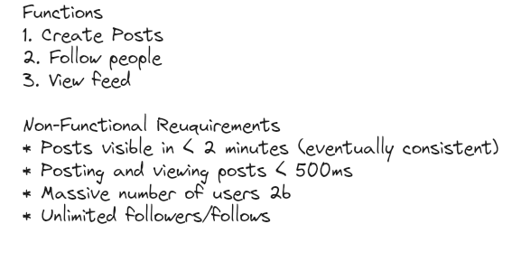
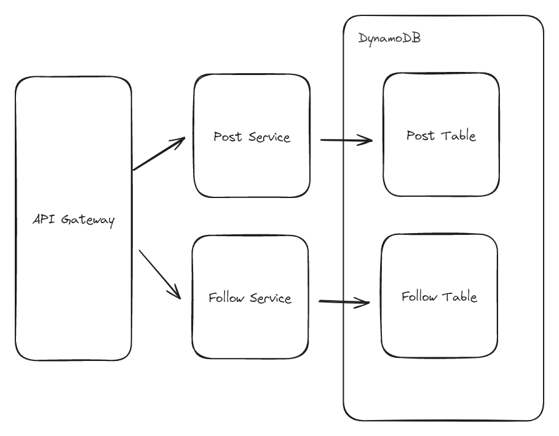
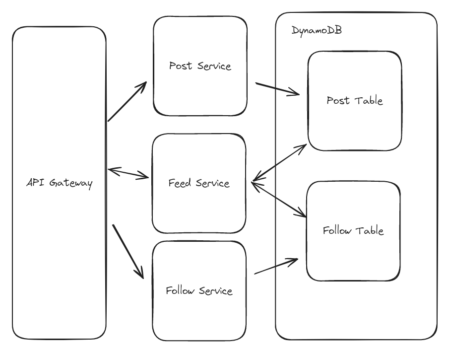
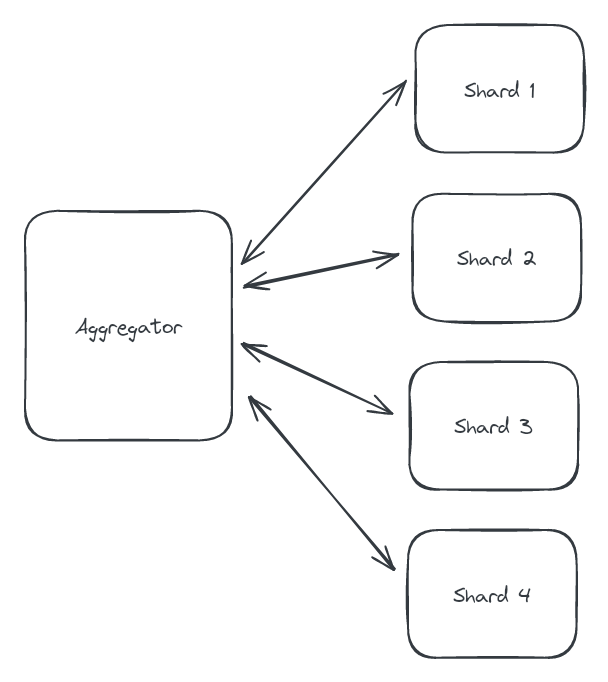
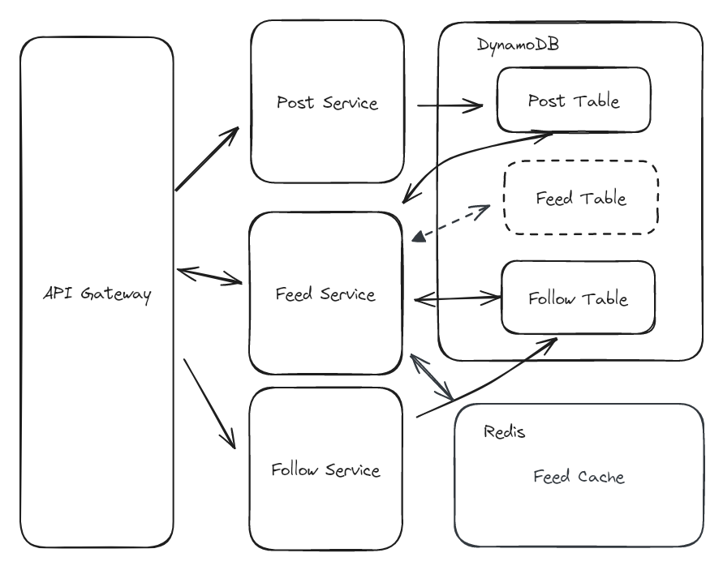
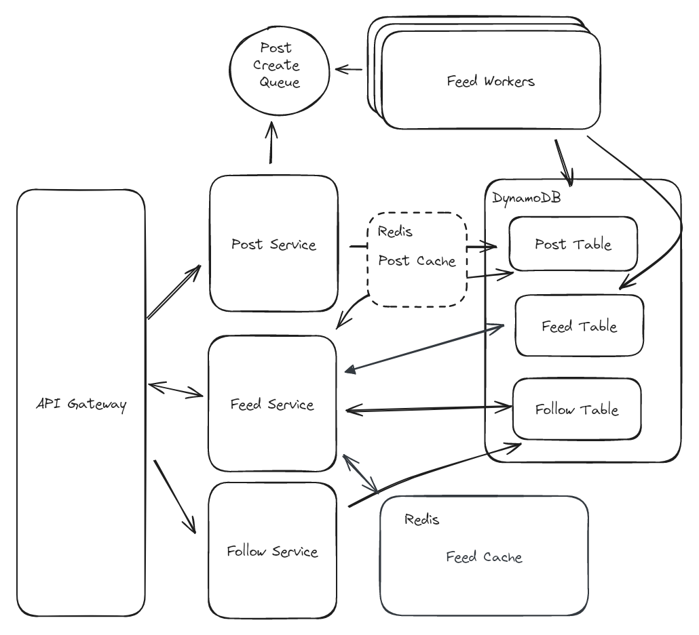
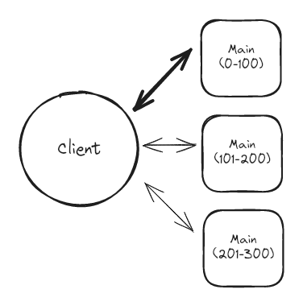

# Facebook News Feed

:::meta
LEVEL : HARD 
:::

## Understanding the Problem

:::problem
**📰 What is Facebok's News Feed** Facebook is a social network which pioneered the [News Feed](https://en.wikipedia.org/wiki/Feed_(Facebook)), a product which shows recent stories from users in your social graph.
:::

Let's assume we're handling uni-directional "follow" relationships as opposed to the bi-directional "friend" relationships which were more important for the earliest versions of Facebook.

### [Functional Requirements](https://www.hellointerview.com/learn/system-design/in-a-hurry/delivery#1-functional-requirements)

**Core Requirements**

1. Users should be able to create posts.
    
2. Users should be able to friend/follow people.
    
3. Users should be able to view a feed of posts from people they follow, in chronological order.
    
4. Users should be able to page through their feed.
    

**Below the line (out of scope):**

- Users should be able to like and comment on posts.
    
- Posts can be private or have restricted visibility.
    

For the sake of this problem (and most system design problems for what it's worth), we can assume that users are already authenticated and that we have their user ID stored in the session or JWT.

### [Non-Functional Requirements](https://www.hellointerview.com/learn/system-design/in-a-hurry/delivery#2-non-functional-requirements)

**Core Requirements**

1. The system should be highly available (prioritizing availability over consistency). Tolerate up to 2 minutes for eventual consistency.
    
2. Posting and viewing the feed should be fast, returning in < 500ms.
    
3. The system should be able to handle a massive number of users (2B).
    
4. Users should be able to follow an unlimited number of users, users should be able to be followed by an unlimited number of users.
    
:::tip
Having quantities on your non-functional requirements will help you make decisions during your design. A system which is single-digit millisecond fast requires a dramatically different architecture than a "fast" system which can take a second to respond.
:::

Here's how it might look on your whiteboard:




## The Set Up

### Planning the Approach

The hard part of this design is going to be dealing with the potential of users who are following a massive number of people, or people with lots of followers (a problem known as "fan out"). We'll want to move quickly to satisfy the base requirements so we can dive deep there. For this problem (like many!), following our functional requirements in order provides a natural structure to the interview, so we'll do that.

### [Defining the Core Entities](https://www.hellointerview.com/learn/system-design/in-a-hurry/delivery#core-entities-2-minutes)

Starting with core entities gives us a set of terms to use through the rest of the interview. This also helps us to understand the data model we'll need to support the functional requirements later.

For the News Feed, the primary entities are easy. We'll make an explicit entitity for the link between users

1. **User**: A users in our system.
    
2. **Follow**: A uni-directional link between users in our system.
    
3. **Post**: A post made by a user in our system. Posts can be made by any user, and are shown in the feed of users who follow the poster.
    

In the actual interview, this can be as simple as a short list like this. Just make sure you talk through the entities with your interviewer to ensure you are on the same page.


### [API or System Interface](https://www.hellointerview.com/learn/system-design/in-a-hurry/delivery#api-or-system-interface-5-minutes)

The API is the primary interface that users will interact with. It's important to define the API early on, as it will guide your high-level design. We just need to define an endpoint for each of our functional requirements.

For our first requirement, we need to create posts:

```http
POST /post/create
Request: 
{
    "content": {

    }
}
Response:
{
    "postId": // ...
}
```

We'll leave the content empty to account for rich content or other structured data we might want to include in the post. For authentication, we'll tell our interviewer that authentication tokens are included in the header of the request and avoid going into too much detail there unless requested.

Moving on, we need to be able to follow people.

```http
POST /user/[id]/follow
Request: 
{

}
```

Here the follow action is binary. We'll assume it's idempotent so it doesn't fail if the user clicks follow twice. We don't need a body but we'll include a stub just in case and keep moving.

Our last requirement is to be able to view our feed.

```http
GET /feed
Response: 
{
    items: POST[]
}
```

This can be a simple GET request. We'll avoid delving into the structure of Posts for the moment to give ourselves time for the juicier parts of the interivew.

:::warning
Especially for more senior candidates, it's important to focus your efforts on the "interesting" aspects of the interview. Spending too much time on obvious elements both deprives you of time for the more interesting parts of the interview but also signals to the interviewer that you may not be able to distinguish more complex pieces from trivial ones: a critical skill for senior engineers.
:::

## [High-Level Design](https://www.hellointerview.com/learn/system-design/in-a-hurry/delivery#high-level-design-10-15-minutes)

### 1. Users should be able to create posts.

Dealing with this requirement first, we only need to create posts and have them accessible by their ID. We're going to start very basic here and build up complexity as we go.

To start, and since we know this is going to scale, we'll put a [horizontally scaled service behind an API gateway/load balancer](https://www.hellointerview.com/learn/system-design/in-a-hurry/patterns#simple-db-backed-crud-service-with-caching). We can skip the caching aspect of the pattern since we'll get to that later. By having the API gateway and load balancer, we can scale up our service with more traffic by adding additional hosts. Since each host is _stateless_ as it's only writing to the database (and we're not dealing with reads yet), this is really easy to scale by just adding more hosts!

Users hit our API gateway with a new post request, this gets passed to one of the post service endpoints which creates an insert event that is sent to our database. Easy.


For our database, we can use any key-value store. For this application, let's use DynamoDB for its simplicity and scalability. DynamoDB allows us to provision a nearly limitless amount of capacity provided we spread our load evenly across our partitions.

### 2. Users should be able to friend/follow people.

Functionally, following or friending a person is establishing a relationship between two users. This is a many-to-many relationship, and we can model it as a graph. Typically, for a graph you'll use a purpose-built graph database (like Neo4j) or a [triple store](https://en.wikipedia.org/wiki/Triplestore). However, for our purposes, we can use a simple key-value store and model the graph ourselves.

Graph databases can be more useful when you need to do traversals or comprehensions of a graph. This usually requires stepping between different nodes, like capturing the friends of your friends or creating an embedding for a recommendation system. We only have simple requirements in this problem so we'll keep our system simple and save ourselves from scarier questions like "how do you scale Neo4j?"

To do this, we'll have a simple `Follow` table using the entire relation `userFollowing:userFollowed` as the primary key. This will allow us to quickly check if a user is following another user. We can use a partition key on the following user to ensure we can look up all the users they are following economically. We can also create a secondary index to allow us to look up all the followers of a given user.

We can put this data in another DynamoDB table for simplicity.




Ok, we're off to a good start. Let's keep going.

### 3. Users should be able to view a feed of posts from people they follow.

The challenge of viewing a feed of posts can be broken down into steps:

1. We get all of the users who a given user is following.
    
2. We get all of the posts from those users.
    
3. We sort the posts by time and return them to the user.
    

There is a lot of complexity here, but let's ignore it for now and create a naive base from which we can iteratively solve the problem.

:::tip
In a real interview, I'd explain this to the interviewer exactly like that "I know this is not going to scale but I'm going to start with a naive solution and then solve the scaling problems separately".

A very common failure mode for candidates we work with is that they get lost in the weeds of a particular scaling problem before having a (mostly) complete design. By covering the breadth of our requirements before we go into depth we can avoid this situation - as long as we keep moving quickly!
:::



Before we're done, while we have an index on our follow table to quickly look up all the users a user is following, we don't have an index on our post table to quickly look up all the posts from a set of users. We can solve this by adding a partition key on the Post table with the user ID and a sort key with the timestamp of the post. This will allow us to quickly pull all the posts from a set of users in chronological order.

Here we have a naive feed service. For a given user, we first request all of the users they follow from the `Follow` table. Then we request all the posts from those N users from the `Post` table. Then we sort all of those posts by timestamp and return the results to the user!

Several flags emerge here and your interviewer is going to expect you to see them immediately:

1. Our user may be following lots of users.
    
2. Each of those users may have lots of posts.
    
3. The total set of posts may be very large because of (1) or (2).
    

Before we dive into these complexities let's polish off our functional requirements.

### 4. Users should be able to page through their feed.

We want to be able support an "infinite scroll" -like experience for our users. To do this, we need to know what they've already seen in their feed and be able to quickly pull the next set of posts. Fortunately, "what they've already seen in their feed" can be described fairly concisely: a timestamp of the oldest post they've looked at. Since users are viewing posts from youngest to oldest, that one timestamp tells us where they've stopped a provides a great cursor for the next set of posts.

Since we can tolerate up to a minute of eventual consistency, we can accomplish this by keeping a cache of recent posts for the user in a distributed cache.

1. When the user requests their feed for the first time (or if we don't have a cache entry), we'll build it using the `Post` and `Follow` tables then store a large number of post IDs (say 500) with their timestamps in sorted order in the `Feed Cache` with a TTL lower than our consistency requirement (in this case, 1 minute).
    
2. When the user requests the next page, they'll send us a timestamp of the oldest post they've seen. We'll look up the user's recent posts in the cache and return posts older than that timestamp to the user. That might look like this:
    


This satisfies our initial requirements, but it's not very performant or scalable! Let's optimize.

## [Potential Deep Dives](https://www.hellointerview.com/learn/system-design/in-a-hurry/delivery#deep-dives-10-minutes)

### 1) How do we handle users who are following a large number of users?

If a user is following a large number of users, the queries to the `Follow` table will take a while to return and we'll be making a large number of queries to the `Post` table to build their feed. This problem is known as "fan-out" - a single requests fans out to create many more requests. Especially when latency is a concern, fanout can be a problem, so it makes for a good discussion point for system design interviews.

What can we do instead? Your instinct here should be to think about ways that we can compute the feed results on _write_ or post creation rather than at the time we want to read their feed. And in fact this is a fruitful line of thinking!

:::tip
While this particular question begs the question of how to handle a large number of follows, a sensible question for your interviewer might be "can we adjust the prouduct in these instances?" Facebook, for example, sets the max number of friends as 5,000. Setting a max number of follows, or having a slightly different experience for these users is a very common approach for production systems like this. Is your user with 100k follows really going to notice if their posts are appearing a couple minutes late?
:::

:::solution-bad
#### Bad Solution: Horizontal scaling via sharding

**Approach**

One naive solution is to shard follows and posts by user ID and scale horizontally. If, e.g., we have 4 shards where each shard contains (a) posts from user IDs which % 4 == N, and (b) follow relations for users following a user ID which % 4 == N, we can add an aggregator layer which takes the results from the 4 different shards and merges them together to get the user's feed. This reduces fanout by a factor of 4 for the leaf nodes of our aggregation.




**Challenges**

The problem with this approach is it introduces a latency tax (because we need to query via the aggregator) and inefficiency on _all_ users in favor of a minority of users who are following a large number of users. It also doesn't solve the problem! While we get a 4x improvement in the number of calls per host, those calls still _happen_, and a 4x improvement may not be enough for a user who is following hundreds of thousands of users.
:::

:::solution-good
#### Great Solution: Adding a feed table

**Approach**

For users following a large number of users we can keep a precomputed `Feed` table. Instead of querying the `Follow` and `Post` tables, we'll be able to pull from this precomputed table. Then, when a new post is created, we'll simply add to the relevant feeds.

The feed table itself is just a list of post IDs, stored in chronological order, and limited to a small number of posts (say 200 or so). We want this table to be compact so we can maximize the number of feeds we can keep track of at any one time. We'll use a partition key of the userId of the feed and its value will be a list of post IDs in order. Since we only ever access this table by user ID, we don't need to deal with any secondary indexes.




**Challenges**

While this dramatically improved read performance, it creates a new problem: when a user with a lot of followers creates a post, we need to write to millions of feeds efficiently. So let's dive into that next.

:::

### 2) How do we handle users with a large number of followers?

When a user has a large number of followers we have a similar fanout problem when we create a post: we need to _write_ to millions of `Feed` records!

Because we chose to allow some inconsistency in our non-functional requirements, we have a short window of time (< 1 minute) to perform these writes.

:::solution-bad
#### Bad Solution: Shotgun the Requests

**Approach**

The naive approach is simply to shotgun (do it all at once!) the requests from our Post Service when the post is created. In the worst case, we're trying to write to millions of feeds with the new Post entry.

**Challenges**

This approach is basically unworkable both due to limitations in the number of connections that can be made from our single Post Service host as well as the latency available. In the best case that it _does_ function, the load on our Post Service becomes incredibly uneven: one Post Service host might be writing to millions of feeds while another is basically idle. This makes the system difficult to scale.
:::

:::solution-good
#### Good Solution: Async Workers

**Approach**

A better option would be to make use of async workers behind a queue. Since our system tolerates some delay between when the post is written and when the post needs to be available in feeds, we can queue up write requests and have a fleet of workers consume these requests and update feeds.

Any queue will work here so long as it support at-least-once delivery of messages and is highly scalable. Amazon's Simple Queue Service (SQS) will work great here.

When a new post is created we create an entry in the SQS queue with the post ID and the creator user ID. Each worker will look up all the followers for that creator and prepend the post to the front of their feed entry.

(We could also get even more clever here! Some workers are doing a whole lot of work writing to millions of feeds while other works are only writing to a few. Instead of just writing a post ID and user ID, we could also include a partition of the followers so that we can stripe the work across many workers. Lots of options).


**Challenges**

The throughput of the feed workers will need to be enormous. For small accounts with limited followers, this isn't much of a problem: we'll only be writing to a few hundred feeds. For mega accounts with millions of followers, the feed workers have a lot of work to do. We consider this in our Great solution.
:::

:::solution-good
#### Great Solution: Async Workers with Hybrid Feeds

**Approach**

A great option would extend on Async Workers outlined above. We'll create async feed workers that are working off a shared queue to write to our precomputed feeds.


But we can be more clever here: we can choose which accounts we'd like to pre-calculate into feeds and which we do not.

For Justin Bieber (and other high-follow accounts), instead of writing to 90+ million followers we can instead add a flag onto the Follow table which indicates that this particular follow _isn't_ precomputed. In the async worker queue, we'll ignore requests for these users.

On the read side, when users request their feed via the Feed Service, we can grab their (partially) precomputed feed from the Feed Table and merge it with recent posts from those accounts which aren't precomputed.

This hybrid approach allows us to choose whether we fanout on read or write and for most users we'll do a little of both. This is a great system design principle! In most situations we don't need a one-size-fits-all solution, we can instead come up with clever ways to solve for different types of problems and combine them together.

**Challenges**

Doing the merging of feeds at read time vs at write time means more computation needs to be done in the Feed Service. We can tune the threshold over which an account is ignored in precomputation.
:::

### 3) How can we handle uneven reads of Posts?

To this point, our feed service has been reading directly from the Post table whenever a user requests to get their feed. For the vast majority of posts, they will be read for a few days and never read again. For some posts (especially those from accounts with lots of followers), the number of reads the post experiences in the first few hours will be _massive_.

DynamoDB, like many key value stores, offers nearly infinite scaling provided certain conditions like there being even load across the keyspace. If Post1 gets 500 requests per second and Post2 through Post 1000 get 0 requests per second, this is not even load!

Fortunately for us, Posts are far more likely to be created than they are to be edited. But how do we solve the issue of hot keys in our Post Table?

:::solution-good
#### Good Solution: Post Cache with Large Keyspace

**Approach**

A good solution for this problem is to insert a distributed cache between the readers of the Post table and the table itself. Since posts are very rarely edited, we can keep a long time to live (TTL) on the posts and have our cache evict posts that are least recently used (LRU). As long as our cache is big enough to house most recent posts, the vast majority of requests to the Post Table will instead hit our cache. If we have N hosts with M memory, our cache can fit as many posts as fit in N*M.

When posts are edited (not created!) we simply invalidate the cache for that post ID.



For consistency, let's use Redis again and key off the post ID so we can evenly distribute posts across our cluster.

**Challenges**

The biggest challenge with the Post Cache is it has the [same hot key problem that the Post Table did](https://www.hellointerview.com/learn/system-design/deep-dives/redis#hot-key-issues)! For the unlucky shard/partition that has multiple viral posts, the hosts that support it will be getting an unequal distribution of load (again) which makes this cache very hard to scale. Many of the hosts will be underutilized.


:::

:::solution-good
#### Great Solution: Redundant Post Cache

**Approach**

Like the Distributed Post Cache above, a great solution for this problem is to insert a replicated cache between the readers of the Post table and the table itself. Since posts are very rarely edited, we can keep a long time to live (TTL) on the posts and have our cache evict posts that are least recently used (LRU). As long as our cache is big enough to house our most popular posts, the vast majority of requests to the Post Table will instead hit our cache.

Unlike the Distributed Post Cache solution above, we can choose to have multiple distinct caches that our readers can hit. If we have N hosts with M memory, in the limit we'll create N distinct caches with a total effective cachable space of size M (instead of N*M above) but with N times as much throughput. This means we can evenly distribute the load of a viral post across our entire cache fleet.


**Challenges**

In this case, we will have a smaller number of posts across our cache than if we chose to distribute or partition the posts. This is probably ok since our DynamoDB backing store can handle _some_ variability in read throughput and is still fast.

:::

## [What is Expected at Each Level?](https://www.hellointerview.com/blog/the-system-design-interview-what-is-expected-at-each-level)

Ok, that was a lot. You may be thinking, “how much of that is actually required from me in an interview?” Let’s break it down.

### Mid-level

**Breadth vs. Depth:** A mid-level candidate will be mostly focused on breadth (80% vs 20%). You should be able to craft a high-level design that meets the functional requirements you've defined, but many of the components will be abstractions with which you only have surface-level familiarity.

**Probing the Basics:** Your interviewer will spend some time probing the basics to confirm that you know what each component in your system does. For example, if you add an API Gateway, expect that they may ask you what it does and how it works (at a high level). In short, the interviewer is not taking anything for granted with respect to your knowledge.

**Mixture of Driving and Taking the Backseat:** You should drive the early stages of the interview in particular, but the interviewer doesn’t expect that you are able to proactively recognize problems in your design with high precision. Because of this, it’s reasonable that they will take over and drive the later stages of the interview while probing your design.

**The Bar for News Feed:** For this question, an E4 candidate will have clearly defined the API endpoints and data model, and landed on a high-level design that is functional and meets the requirements. While they may have some of the "Good" solutions, they would not be expected to cover all the possible scaling edge cases in the Deep Dives.

### Senior

**Depth of Expertise**: As a senior candidate, expectations shift towards more in-depth knowledge — about 60% breadth and 40% depth. This means you should be able to go into technical details in areas where you have hands-on experience. It's crucial that you demonstrate a deep understanding of key concepts and technologies relevant to the task at hand.

**Advanced System Design**: You should be familiar with advanced system design principles. For example, knowing approaches for handling fan-out is essential. You'll also be expected to iteratively diagnose performance bottlenecks and suggest improvements. Your ability to navigate these advanced topics with confidence and clarity is key.

**Articulating Architectural Decisions**: You should be able to clearly articulate the pros and cons of different architectural choices, especially how they impact scalability, performance, and maintainability. You justify your decisions and explain the trade-offs involved in your design choices.

**Problem-Solving and Proactivity**: You should demonstrate strong problem-solving skills and a proactive approach. This includes anticipating potential challenges in your designs and suggesting improvements. You need to be adept at identifying and addressing bottlenecks, optimizing performance, and ensuring system reliability.

**The Bar for News Feed:** For this question, E5 candidates are expected to speed through the initial high level design so you can spend time discussing, in detail, at least 2 of the deep dives. They should also be able to discuss the pros and cons of different architectural choices, especially how they impact scalability, performance, and maintainability. They would be expected to proactively surface some of the potential issues around fanout and performance bottlenecks.

### Staff+

**Emphasis on Depth**: As a staff+ candidate, the expectation is a deep dive into the nuances of system design — I'm looking for about 40% breadth and 60% depth in your understanding. This level is all about demonstrating that, while you may not have solved this particular problem before, you have solved enough problems in the real world to be able to confidently design a solution backed by your experience.

You should know which technologies to use, not just in theory but in practice, and be able to draw from your past experiences to explain how they’d be applied to solve specific problems effectively. The interviewer knows you know the small stuff (REST API, data normalization, etc) so you can breeze through that at a high level so you have time to get into what is interesting.

**High Degree of Proactivity**: At this level, an exceptional degree of proactivity is expected. You should be able to identify and solve issues independently, demonstrating a strong ability to recognize and address the core challenges in system design. This involves not just responding to problems as they arise but anticipating them and implementing preemptive solutions. Your interviewer should intervene only to focus, not to steer.

**Practical Application of Technology**: You should be well-versed in the practical application of various technologies. Your experience should guide the conversation, showing a clear understanding of how different tools and systems can be configured in real-world scenarios to meet specific requirements.

**Complex Problem-Solving and Decision-Making**: Your problem-solving skills should be top-notch. This means not only being able to tackle complex technical challenges but also making informed decisions that consider various factors such as scalability, performance, reliability, and maintenance.

**Advanced System Design and Scalability**: Your approach to system design should be advanced, focusing on scalability and reliability, especially under high load conditions. This includes a thorough understanding of distributed systems, load balancing, caching strategies, and other advanced concepts necessary for building robust, scalable systems.

**The Bar for News Feed:** For a staff+ candidate, expectations are high regarding depth and quality of solutions, particularly for the complex scenarios discussed earlier. A staff candidate will likely cover all of the deep dives (and/or some that we haven't enumerated). They would be expected to surface potential issues in the system and talk about performance tuning for this problem.