# Design a Local Delivery Service like Gopuff

:::meta
LEVEL : EASY
:::

## Understanding the Problem

:::problem
**‍💨 What is [Gopuff](https://www.gopuff.com/)?** Gopuff delivers goods typically found in a convenience store via rapid delivery and 500+ micro-fulfillment centers.
:::

### [Functional Requirements](https://www.hellointerview.com/learn/system-design/in-a-hurry/delivery#1-functional-requirements)

We'll start by asking our interviewer about the extent of the functionality we need to build. Our goal for this section is to produce a concise set of functionalities that the system needs to support. In this case, we need to be able to query availability of items and place orders.

**Core Requirements**

1. Customers should be able to query availability of items, deliverable in 1 hour, by location (i.e. the effective availability is the union of all inventory nearby DCs).
    
2. Customers should be able to order multiple items at the same time.
    

**Below the line (out of scope)**

- Handling payments/purchases.
    
- Handling driver routing and deliveries.
    
- Search functionality and catalog APIs. (The system is strictly concerned with availability and ordering).
    
- Cancellations and returns.
    
:::tip
For this problem, the emphasis is on aggregating availability of items across local distribution centers and allowing users to place orders without double booking. In other problems you may be more concerned with the product catalog, search functionality, etc.
:::

### [Non-Functional Requirements](https://www.hellointerview.com/learn/system-design/in-a-hurry/delivery#2-non-functional-requirements)

**Core Requirements**

1. Availability requests should fast (<100ms) to support use-cases like search.
    
2. Ordering should be strongly consistent: two customers should not be able to purchase the same physical product.
    
3. System should be able to support 10k DCs and 100k items in the catalog across DCs.
    
4. Order volume will be O(10m orders/day)
    

**Below the line (out of scope)**

- Privacy and security.
    
- Disaster recovery.
    

Here’s how these might be shorthanded in an interview. Note that out-of-scope requirements usually stem from questions like “do we need to handle privacy?”. Interviewers are usually comfortable with you making assertions “I’m going to leave privacy out of scope for the start” and will correct you if needed.


## Set Up

### Planning the Approach

Before we go forward with designing the system, we'll think briefly through the approach we'll take.

For this problem, our requirements are fairly straightforward, so we'll take our default approach. We'll start by designing a system which simply supports our functional requirements without much concern for scale or our non-functional requirements. Then, in our deep-dives, we'll bring back those concerns one by one.

To do this we'll start by enumerating the "nouns" of our system, build out an API, and then start drawing our boxes.

### [Defining the Core Entities](https://www.hellointerview.com/learn/system-design/in-a-hurry/delivery#core-entities-2-minutes)

Core entities are the high level "nouns" for the system. We're not (yet) designing a full data model - for that, we'll need to have a better idea of how the system fits together overall. But by figuring out the entities we'll have the right blocks to build the rest of the system. Getting the right entities is particularly important for designing a good REST API as resources are the central anchor point for a REST API - which are very tightly related to our core entities.

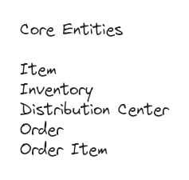

One important thing to note for this problem is the distinction between `Item` and `Inventory`. You might think of this like the difference between a Class and an Instance in object-oriented programming. While our API consumers are strictly concerned with items that they might see in a catalog (e.g. Cheetohs), we need to keep track of where the **physical** items are actually located. Our `Inventory` entity is a physical item at a specific location.

The remaining entities should be more obvious: we need `DistributionCenter` (from here after: DC) to keep up with where our inventory is physically located and and `Order` entity to keep track of the items being ordered.

- **Inventory**: A physical instance of an item, located at a DC. We'll sum up Inventory to determine the quantity available to a specific user for a specific `Item`.
    
- **Item**: A type of item, e.g. Cheetohs. These are what our customers will actually care about.
    
- **DistributionCenter**: A physical location where items are stored. We'll use these to determine which items are available to a user. `Inventory` are stored in DCs.
    
- **Order**: A collection of `Inventory` which have been ordered by a user (and shipping/billing information).
    
:::tip
Particularly in product design, outlining the **identity** of the entities in your system is important. By starting with the most concrete physical or business entities (e.g. items, users, etc.) and working your way up to more abstract entities (e.g. orders, carts, etc.) you can ensure that you don't miss any important entities.
:::

### Defining the API

Next, we can start with the APIs we need to satisfy, which should track closely to our functional requirements. There are a lot of extraneous details we could shove into these APIs, but we're going to start simple to avoid burning unnecessary time in the interview (a common mistake in practice!).

To meet our requirements we only need two APIs: the first API allows us to get availability of items given a location (and maybe a keyword), and the second API allows us to place an order. We'll include pagination in our availability API to avoid overwhelming the client with more data than it needs.

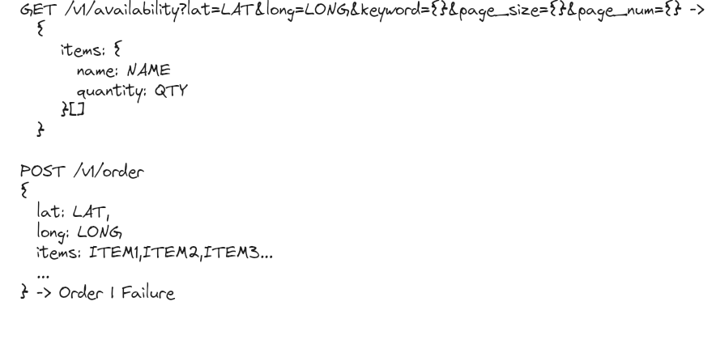

:::info
Note here that we're passing our location to both APIs: before the order can be processed by the backend we'll need to confirm the inventory is available close enough to the user's location to deliver within 1 hour.
:::

## [High-Level Design](https://www.hellointerview.com/learn/system-design/in-a-hurry/delivery#high-level-design-10-15-minutes)

### 1) Customers should be able to query availability of items

Let's move to the first requirement: customers should be able to query availability of items by location.

To do this, we have two steps. First, we need to find the DCs that are close enough to deliver in 1 hour. All of our inventory _lives_ in a DC, so we can shortcut having to check every item in our system. Once we have the list of serviceable DCs, we can check the inventory of them and return the union to the user. We need each step to be reasonably fast since our end-to-end latency

To find nearby DCs, we can build a simple internal API which takes a LAT and LONG and returns a list of DCs within 1 hour. Let's assume we have a table of DCs with their lat/long. Crudely, we can measure the distance to the user’s input with some simple math. A very basic version might use Euclidean distance while a more sophisticated example might use the Haversine formula to take into account the curvature of the Earth. Taking a simple threshold on this query would give us DCs within X distance as the crow flies. This isn't quite satisfying our functional requirement, but we'll come back to this in our deep dive.

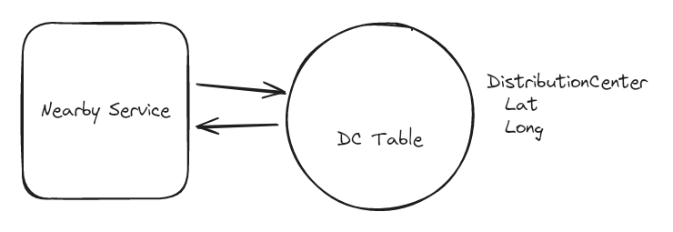


Next we need to check the inventory of the DCs we found. We can do this by querying our Inventory table and Items table. Let's assume we're using a Postgres database for these tables which will allow us to join this inventory table with our Item table to get the item name and description before returning with the quantity.

:::tip
In many ecommerce systems the "Catalog" is stored separately from the inventory because of the different consumers and workloads. We'll store them in the same database here to make our job easier and to adhere to our requirements, but we might note to our interviewer that we'd ideally separate these, add a search index (like Elasticsearch) to allow searching the catalog, etc.
:::

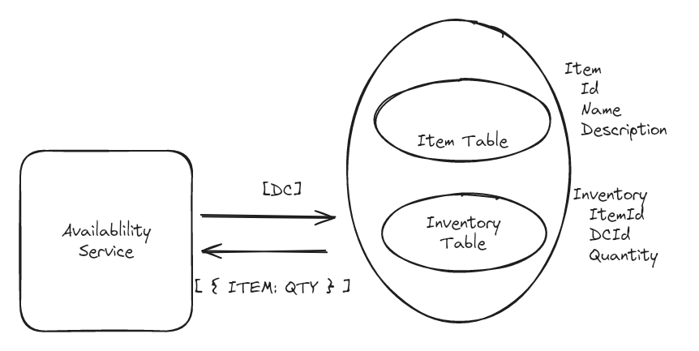


We now have:

1. **Availability Service** handles requests from our users for availability given a specific location.
    
2. **Nearby Service** syncs with the database of nearby DCs and uses an external "Travel Time Service" to calculate travel times from DCs (potentially including traffic).
    
3. **Inventory Table** a replicated SQL database table which returns the inventory available for each item and DC.
    

Putting it all together we have:

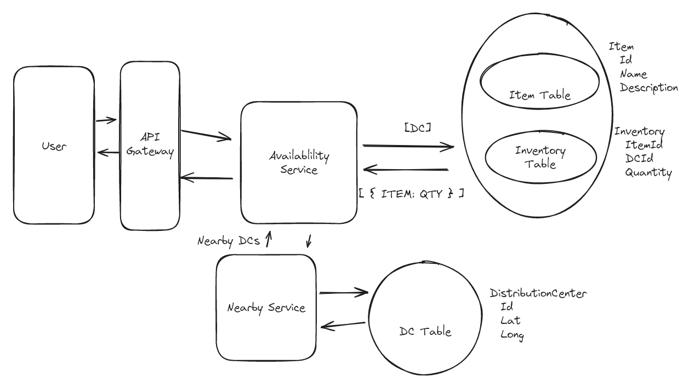

When a user makes a request to get availability for items A, B, and C from latitude X and longitude Y, here's what happens:

1. We make a request to the **Availability Service** with the user's location X and Y and any relevant filters.
    
2. The availability service fires a request to the **Nearby Service** with the user's location X and Y.
    
3. The nearby service returns us a list of DCs that can deliver to our location.
    
4. With the DCs available, the availability service query our database with those DC IDs.
    
5. We sum up the results and return them to our client.
    

Great! Our availability requirement is (mostly) satisfied.

### 2) Customers should be able to order items.

The last thing we need to complete our requirements is for us to enable placing orders. For this, we require _strong consistency_ to make sure two users aren't ordering the same item. To do this we need to check inventory, record the order, and update the inventory together atomically.

While latency is not a big concern here (our users will tolerate more latency here than they will on the reads), we definitely want to make sure we're not promising the same inventory to two users. How do we do this?

This idea of ensuring we're not "double booking" is a common one across system design problems. To ensure we don't allow two users to order the same inventory, we need some form of locking. The idea being that we need to "lock" the inventory while we're checking it and recording the order in a such a way that only one user can hold the lock at a time.

:::solution-good
#### Good Solution: Two data stores with a distributed lock

**Approach**

We can have separate databases for orders and inventory. When an order to placed we'll lock the relevant inventory records, create the order record, decrement the inventory, and release the lock.

This is a good solution because it allows us to use the best data store for each use case. For example, we can use a key-value store for inventory and a relational database for orders. But ...

**Challenges**

It has some nasty failure modes!

- What if our service crashes after we created the order but before we decremented the inventory? A subsequent user might order the inventory we had promised to the first user. We'll need to sweep for these failures and reverse them.
    
- What if two orders have overlapping inventory requirements? We might deadlock if both User1 and User2 are trying to buy A and B, but User1 has the lock for A and User2 has the lock for B - neither can proceed.
    

If you go this route you'll need to be able to address each of these failure modes.

:::

:::solution-good
#### Great Solution: Singular Postgres transaction

**Approach**

By putting both orders and inventory in the same database, we can take advantage of the ACID properties of our Postgres database. Using a singular transaction with isolation level `SERIALIZABLE` we can ensure that the entire transaction is atomic. This means that if two users try to order the same item at the same time, one of them will be rejected. This is because the transaction will fail to commit if the inventory is not available.

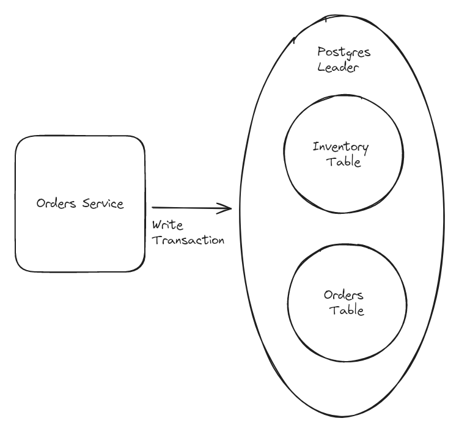

**Challenges**

While consolidating our data down to a single database has a lot of benefits, it's not without drawbacks. We're partly coupling the scaling of inventory and orders and we can't take advantage of the best data store for each use case.

:::

:::tip
When atomicity of transactions is a requirement, it's helpful to have your data colocated in an ACID data store. While it's possible to manage transactions across multiple data stores (and you may want this for other reasons), the additional complexity and overhead to support it is not what we want to focus on during this interview.
:::

By choosing the "great" option and leaning in to our existing Postgres database we can keep our system simple and still meet our requirements. For an order, the process looks like this:

1. The user makes a request to the **Orders Service** to place an order for items A, B, and C.
    
2. The **Orders Service** makes creates a singular transaction which we submit to our Postgres leader. This transaction: a. Checks the inventory for items A, B, and C > 0. b. If any of the items are out of stock, the transaction fails. c. If all items are in stock, the transaction records the order and updates the status for inventory items A, B, and C to "ordered". d. A new row is created in the Orders table (and OrderItems table) recording the order for A, B, and C. e. The transaction is committed.
    
3. If the transaction succeeds, we return the order to the user.
    

There are some downsides to this setup. In particular, if any of the items become unavailable in the users order the entire order fails. We'll want to return a more meaningful error message to the user in this case, but this is preferably to succeeding in an order that might not make sense (e.g. a device and its battery).

### Putting it all Together

With the two approaches listed, we can now pull everything together for a solution to our problem:

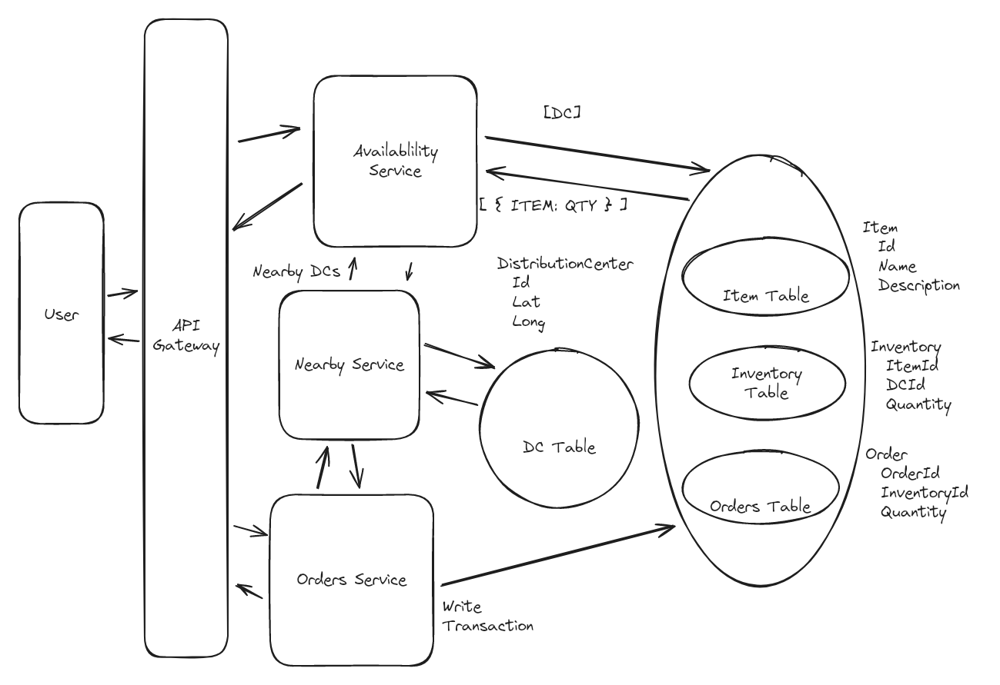

We have three services, one for Availability requests, one for Orders, and a shared service for Nearby DCs. Both our Availability and Orders service use the Nearby service to look up DCs that are close enough to the user. We have a singular Postgres database for inventory and orders, partitioned by region. Our Availability service reads via read replicas, our Orders service writes to the leader using atomic transactions to avoid double writes. A great foundation!

## Deep Dives

### 1) Make availability lookups incorporate traffic and drive time

So far our system is only determining nearby DCs based on a simple distance calculation. But if our DC is over a river, or a border, it may be close in miles but not close in drive time. Further, traffic might influence the travel times. Since our functional requirements mandate 1 hour of drive time, we'll need something more sophisticated. What can we do?

:::solution-bad
#### Bad Solution: Simple SQL Distance

**Approach**

We can put all the lat/long of our DC into a table, then measure the distance to the user’s input with some simple math. A very basic version might use Euclidean distance while a more sophisticated example might use the Haversine formula to take into account the curvature of the Earth. Taking a simple threshold on this query would give us DCs within X as the crow flies.


**Challenges**

- This is a very simple approach which doesn’t take into account traffic, road conditions, etc. It also doesn’t take into account the fact that we might have multiple DCs in the same city.
    
:::

:::solution-bad
#### Bad Solution: Use a Travel Time Estimation Service Against all DCs

**Approach**

Since our DCs are rarely going to change (they're buildings!), we can sync periodically (like every 5 minutes) from a DC table to memory of our service. We can use a travel time estimation service to find the travel times from our input location to each of our DCs by iterating over all of them.

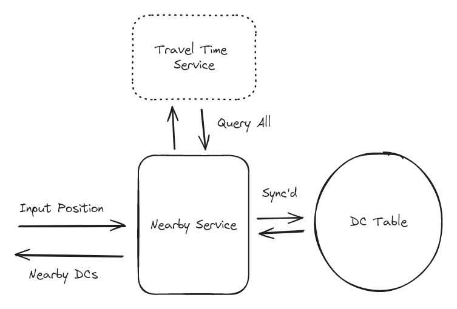

**Challenges**

We're making far too many queries to the travel time estimation service. Most of the DCs we're querying aren't close enough to ever plausibly be delivered in 1 hour.

:::

:::solution-good
#### Great Solution: Use a Travel Time Estimation Service Against Nearby DCs

We build on the previous solution to sync periodically (like every 5 minutes) from a DC table to memory of our service. When an input comes in, we can prune down the "candidate" DCs by taking a fixed radius (say 60 miles, the most optimistic distance we could drive over in 1 hour) and limiting ourselves to only evaluating those. We'll take these restricted candidatees and then pass to the external travel time service to create our final estimate.

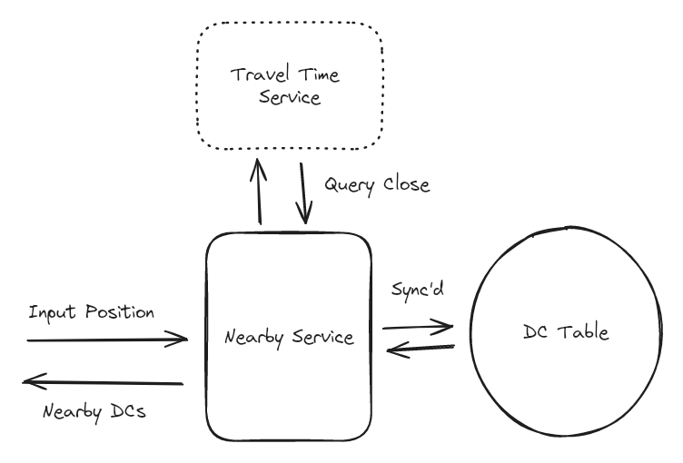
:::

### 2) Make availability lookups fast and scalable

Currently, once we have nearby DCs we use those DCs to look up availability directly from our database. This introduces a lot of load onto our database. Let's briefly detour into some estimates to figure out how much throughput we might expect.

:::tip
Using quantitative estimation where you've spotted a potential bottleneck can signficantly improve your interview performance. It gives you and your interviewer a common set of data from which to weigh tradeoffs and it shows you're able to make reasonable assumptions about the system.
:::

To figure out how many queries for availability we might have, we'll back in from our orders/day requirement which we set at 10m orders per day. All-in, we might estimate that each user will look at 10 pages across search, the homepage, etc. before purchasing 1 item. In addition, maybe only 5% of these users will end up buying where the rest are just shopping.

```
Queries: 10M orders/day / (100k seconds/day) * 10 / 0.05 = 20k queries/second
```

This is pretty sizeable number of queries per second. We clearly need to think about how we can scale this. What do we do?

:::solution-good
#### Great Solution: Query Inventory Through Cache

**Approach**

We can add a Redis instance to our setup. Our availability service can query the cache for a given set of inputs and, if the cache hits, return that result. If the cache misses we'll do a lookup on the underlying database and then write the results into the cache. Setting a low TTL (e.g. 1 minute) ensures that these results are fresh.

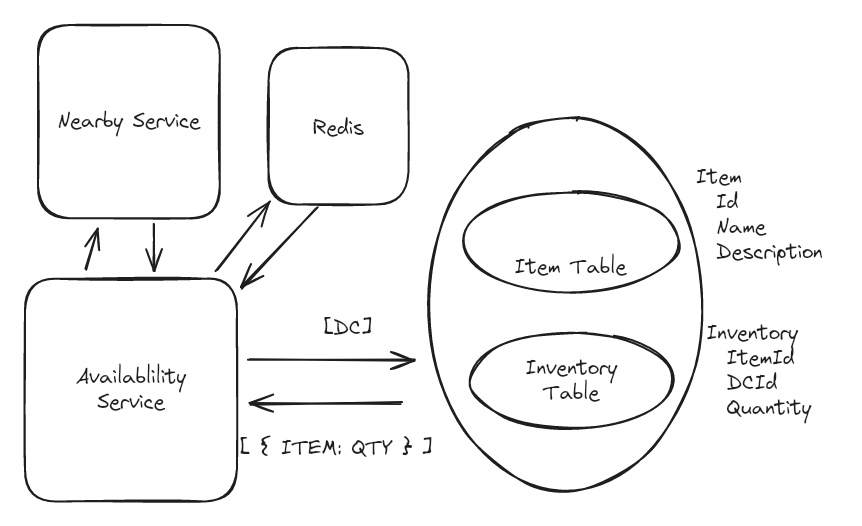

**Challenges**

We need to ensure that the cache is always up to date with the inventory table. Our Order Service will need to expire effected cache entries when it writes to the inventory table.
:::

:::solution-good
#### Great Solution: Postgres Read Replicas and Partitioning

**Approach**

Since we only ever read inventory from a nearby collection of DC’s, we can group them together with a region ID using the first 3 digits of their zipcode. Then we can partition our inventory based on this region IDs. This means all queries will go to mostly 1 or 2 partitions rather than the entire inventory dataset.

We can also use read replicas for availability since we can tolerate a small amount of inconsistency. Our orders need to be strongly consistent, so those transactions need to be sent to the Postgres leader, but our availability queries can go to our read replicas.

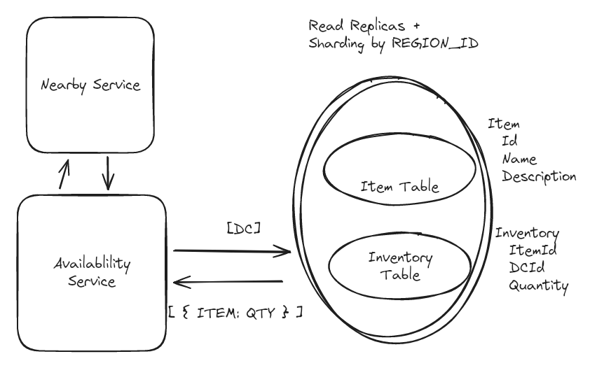

**Challenges**

We'll need to manage the sizing of our replicas to balance with traffic. We'll also need to manage the partitiioning of our data to ensure that we're not overloading any one replica.
:::

By choosing the "great" solutions for both challenges we net out with a solution that looks something like this:

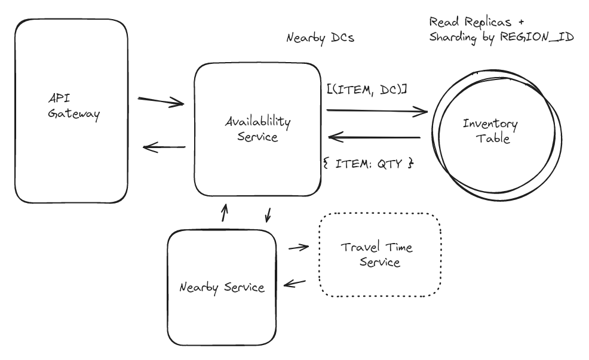

## [What is Expected at Each Level?](https://www.hellointerview.com/blog/the-system-design-interview-what-is-expected-at-each-level)

Your interviewer may even have you go deeper on specific sections, or ask follow-up questions. What might you expect in an actual assessment?

### Mid-Level

**Breadth vs. Depth**: A mid-level candidate will be mostly focused on breadth. As an approximation, you’ll show 80% breadth and 20% depth in your knowledge. You should be able to craft a high-level design that meets the functional requirements you've defined, but the optimality of your solution will be icing on top rather than the focus. **Probing the Basics**: Your interviewer spend some time probing the basics to confirm that you know what each component in your system does. For example, if you use DynamoDB, expect to be asked about the indexes available to you. Your interviewer will not be taking anything for granted with respect to your knowledge. **Mixture of Driving and Taking the Backseat**: You should drive the early stages of the interview in particular, but your interviewer won't necessarily expect that you are able to proactively recognize problems in your design with high precision. Because of this, it’s reasonable that they take over and drive the later stages of the interview while probing your design. **The Bar for GoPuff**: For this question, interviewers expect a mid-level candidate to have clearly defined the API endpoints and data model, and created both routes: availability and orders. In instances where the candidate uses a “Bad” solution, the interviewer will expect a good discussion but not that the candidate immediately jumps to a great (or sometimes even good) solution.

### Senior

**Depth of Expertise**: As a senior candidate, your interviewer expects a shift towards more in-depth knowledge — about 60% breadth and 40% depth. This means you should be able to go into technical details in areas where you have hands-on experience. **Advanced System Design**: You should be familiar with advanced system design principles. Certain aspects of this problem should jump out to experienced engineers (read volume, trivial partitioning) and your interviewer will be expecting you to have reasonable solutions. **Articulating Architectural Decisions**: Your interviewer will want you to clearly articulate the pros and cons of different architectural choices, especially how they impact scalability, performance, and maintainability. You should be able to justify your decisions and explain the trade-offs involved in your design choices. **Problem-Solving and Proactivity**: You should demonstrate strong problem-solving skills and a proactive approach. This includes anticipating potential challenges in your designs and suggesting improvements. You need to be adept at identifying and addressing bottlenecks, optimizing performance, and ensuring system reliability. **The Bar for GoPuff**: For this question, a senior candidate is expected to speed through the initial high level design so we can spend time discussing, in detail, how to optimize the critical paths. Senior candidates would be expected to have optimized solutions for both the atomic transactions of the orders service as well as the scaling of the availability service.

### Staff+

**Emphasis on Depth**: As a staff+ candidate, the expectation is a deep dive into the nuances of system design — the interviewer is looking for about 40% breadth and 60% depth in your understanding. This level is all about demonstrating that "been there, done that" expertise. You should know which technologies to use, not just in theory but in practice, and be able to draw from your past experiences to explain how they’d be applied to solve specific problems effectively. Your interviewer knows you know the small stuff (REST API, data normalization, etc) so you can breeze through that at a high level so we have time to get into what is interesting. **High Degree of Proactivity**: At this level, your interviewer expects an exceptional degree of proactivity. You should be able to identify and solve issues independently, demonstrating a strong ability to recognize and address the core challenges in system design. This involves not just responding to problems as they arise but anticipating them and implementing preemptive solutions. **Practical Application of Technology**: You should be well-versed in the practical application of various technologies. Your experience should guide the conversation, showing a clear understanding of how different tools and systems can be configured in real-world scenarios to meet specific requirements. **Complex Problem-Solving and Decision-Making**: Your problem-solving skills should be top-notch. This means not only being able to tackle complex technical challenges but also making informed decisions that consider various factors such as scalability, performance, reliability, and maintenance. **Advanced System Design and Scalability**: Your approach to system design should be advanced, focusing on scalability and reliability, especially under high load conditions. This includes a thorough understanding of distributed systems, load balancing, caching strategies, and other advanced concepts necessary for building robust, scalable systems. **The Bar for GoPuff**: For a staff+ candidate, expectations are set high regarding depth and quality of solutions, particularly for the complex scenarios discussed earlier. Your interviewer will be looking for you to be diving deep into at least 2-3 key areas, showcasing not just proficiency but also innovative thinking and optimal solution-finding abilities. They should show unique insights for at least a couple follow-up questions of increasing difficulity. A crucial indicator of a staff+ candidate's caliber is the level of insight and knowledge they bring to the table. A good measure for this is if the interviewer comes away from the discussion having gained new understanding or perspectives.