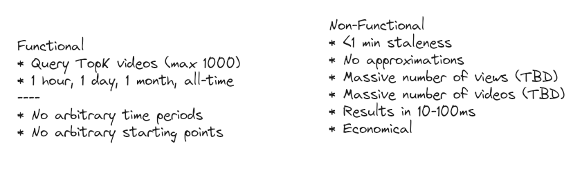
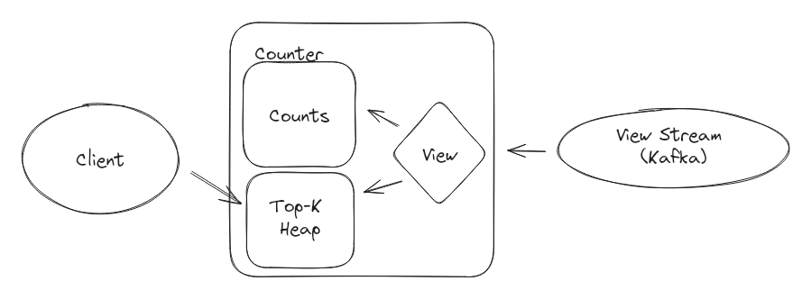
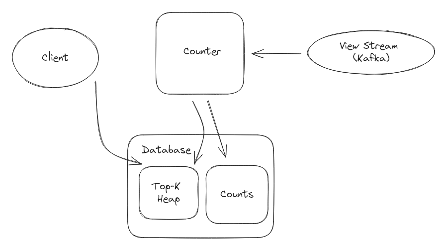
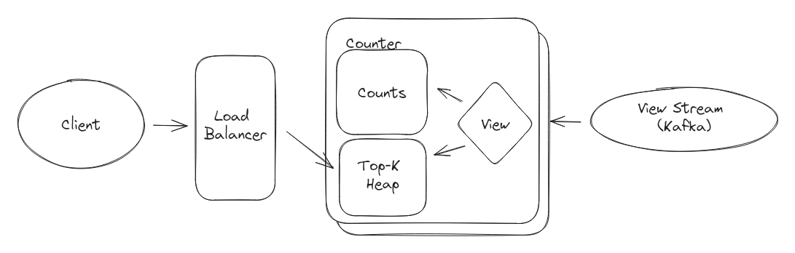
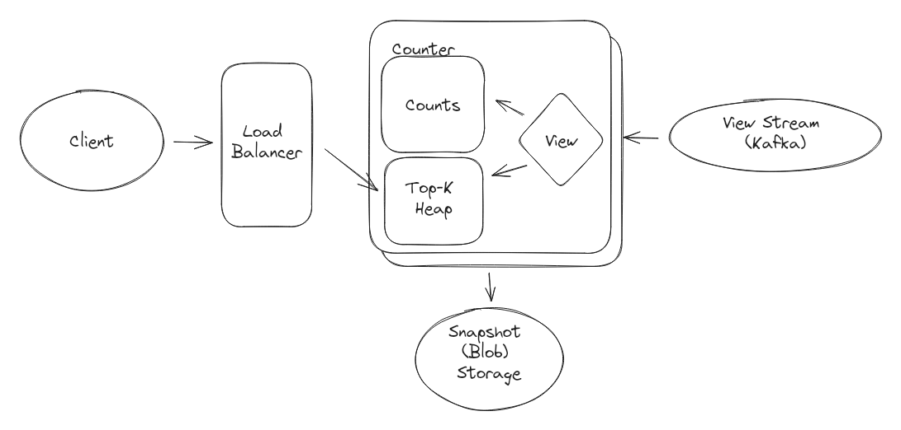
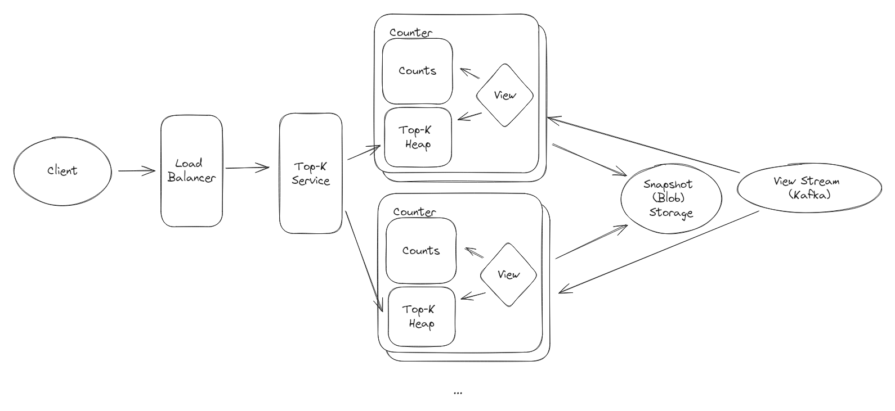
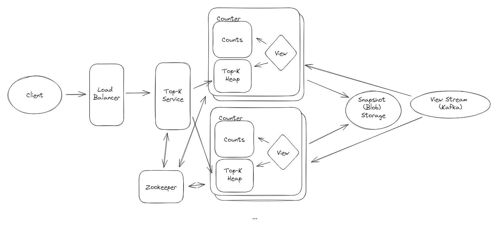
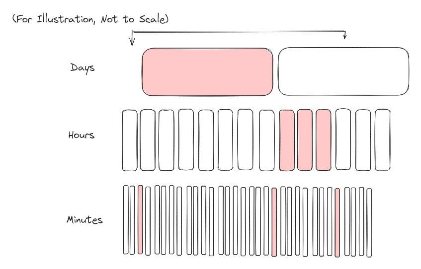
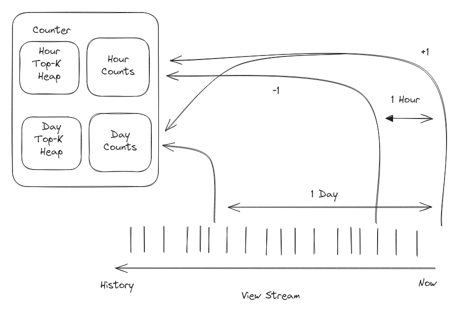
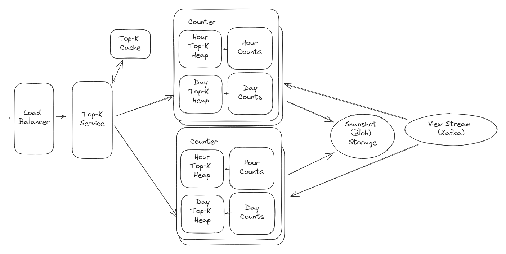

# Top-K Youtube Videos

:::meta
LEVEL : MEDIUM | [Watch on YouTube](https://www.youtube.com/watch?v=1lfktgZ9Eeo)
:::

## Understanding the Problem

Let's assume we have a very large stream of views on YouTube (our stream is a firehose of VideoIDs). At any given moment we'd like to be able to query, **precisely**, the top K most viewed videos for a given time period (say 1 hour, 1 day, 1 month, all time) together with their counts.

:::info
The word precisely here has dramatic implications on this problem. It's a bit unrealistic for most applications, but an _approximate_ solution leans heavily into probabilistic/approximate solutions which, for many roles, rely on esoteric knowledge of e.g. [count-min sketch](https://en.wikipedia.org/wiki/Count%E2%80%93min_sketch). Except in specialist situations, most reasonable interviewers are going to test general knowledge rather than something you'd learn on the job after reading some papers.
:::

Our interviewer might give us some quantities to help us understand the scale of the system: Youtube Shorts had 70 billion views per day and approximately 1 hour of Youtube content is uploaded every second. Big!

### [Functional Requirements](https://www.hellointerview.com/learn/system-design/in-a-hurry/delivery#1-functional-requirements)

**Core Requirements**

1. Clients should be able to query the top K videos (max 1000) for a given time period.
    
2. Time periods should be limited to 1 {hour, day, month} and all-time.
    

**Below the line (out of scope):**

- Arbitrary time periods.
    
- Arbitrary starting/ending points (we'll assume all queries are looking back from the current moment).
    

### [Non-Functional Requirements](https://www.hellointerview.com/learn/system-design/in-a-hurry/delivery#2-non-functional-requirements)

**Core Requirements**

1. We'll tolerate at most 1 min delay between when a view occurs and when it should be tabulated.
    
2. Our results must be precise, so we should not approximate. (Note: This would be unusual for most production systems)
    
3. Our system should be able to handle a massive number (TBD - cover this later) of views per second.
    
4. We should support a massive number (TBD - cover this later) of videos.
    
5. We should return results within 10's of milliseconds.
    
6. Our system should be economical. We shouldn't need a 10k host fleet to solve this problem.
    
:::tip
Having quantities on your non-functional requirements will help you make decisions during your design. Note here that a system returning within 10's of milliseconds eliminates many candidates from the solution space - we'll need to favor precomputation.

For quantities that are important to our design but that we can't estimate out of hand, we'll reserve some time to do so.
:::

Here's how it might look on your whiteboard:




## Scale Estimation

We've earmarked two quantities important to our design: (a) the number of views per second, and (b) the total number of videos. The first will help us understand the overall throughput of the system while the second is important for bounding the storage we'll need.

First let's look at throughput:

```
70B views/day / (100k seconds/day) = 700k tps
```

Woo, that's a lot. We're definitely going to need to look for ways to shard this across many different hosts.

Now, let's talk storage. First we need the number of videos:

```
Videos/Day 
    = 1 hour content/second / (6 minutes content/video) * (100k seconds/day) 
    = 1M videos/day
Total Videos = 1M videos/day * 365 days/year * 10 years = 3.6B videos
```

With that let's estimate how big a naive table of IDs and counts would be:

```
Naive Storage = 4B videos * (8 bytes/ID + 8 bytes/count) = 64 GB
```

Ok, probably something we can keep in memory if we're clever, especially if we use a number of hosts.

:::tip
The goal of estimations isn't actually to see if you can do mental math (so don't be afraid of fudging the numbers). Your reflections on the implications of the quantities on your design, like which architectures are on or off the table as a result, is often the most important factor.
:::

## The Set Up

### Planning the Approach

Based on our requirements, we know we're going to make some observations for our interviewer:

:::tip
Sharing your thought process is a great way to demonstrate seniority by showing you're thinking a step ahead.
:::

- First, we need to index data from a very high volume stream. Most quantities will need to be precomputed in order to meet the latency requirements.
    
- Next, problems like this typically have bottlenecks that are hidden behind bottlenecks: solving one problem creates (at least) one more. So we'll aim to solve the simplest problem first, and then add complexity as we go.
    
- Finally, we'll note that the sliding time window adds more challenge. So we'll start with all-time and then try to figure out the rest.
    

Our rough plan is thus:

1. Generate a basic (but not scalable solution) to the all-time top K problem.
    
2. Solve the primary issues of our basic solution.
    
3. Add a solution for the time period inputs.
    
4. Deep dive remaining bottlenecks until we run out of time.
    

### [Defining the Core Entities](https://www.hellointerview.com/learn/system-design/in-a-hurry/delivery#core-entities-2-minutes)

In our problem, we have some basic entities we're going to work with to build our API:

1. Video
    
2. View
    
3. Time Window
    

From a conceptual perspective this problem is straightforward so we're not going to spend any more time here. We might even skip this section to save time.

### [API or System Interface](https://www.hellointerview.com/learn/system-design/in-a-hurry/delivery#api-or-system-interface-5-minutes)

Our API guides the rest of the interview, but in this case it's really basic too! We simply need an API to retrieve the top K videos.

```http
GET /views/top?window={WINDOW}&k={K}
Response:
{
    "videos": [
        {
            "videoId": // ...
            "views": // ...
        }
    ]
}
```

We're not going to dawdle here and keep moving on to the meat of the interview.

:::warning
Especially for more senior candidates, it's important to focus your efforts on the "interesting" aspects of the interview. Spending too much time on obvious elements both deprives you of time for the more interesting parts of the interview but also signals to the interviewer that you may not be able to distinguish more complex pieces from trivial ones: a critical skill for senior engineers.
:::

## [High-Level Design](https://www.hellointerview.com/learn/system-design/in-a-hurry/delivery#high-level-design-10-15-minutes)

### 1) A Basic Solution for All-Time

Let's start with a simple solution for all-time top K videos which we'll build on a gigantic single host, then we can start to whittle away at optimization.

:::tip
Especially for infrastructure-style interviews, I highly recommend reasoning about a solution first from the lense of a single host. Oftentimes the path to scale is straightforward from there. On the other hand if you solve scale first without thinking about how the actual mechanics of your solution work underneath, you're likely to back yourself into a corner.
:::

We can do this by maintaining a table of video IDs and counts. This gets us an up-to-date count of every video, but iterating over all 4B keys to find the largest values is untenable, so we'll keep a heap of the top K videos which we can update with each increment. The vast majority of views will never touch this heap since they'll be below the threshold of the top 1000 (the max K we established in our functional requirements).




The basic function is this: when a request comes in, we atomically increment the counter in the hash table with the incoming ID. We retrieve the updated count and test it against the floor of our heap. If the count is higher than our floor (i.e. the video belongs in the top 1,000) we update/insert it into the heap and heapify. Our clients query directly from that heap to retrieve the top K videos.

This is really simple and fast because we run it on a single host. And while this is possible conceptually, in memory, on a single host, we wouldn't want to do that. First, because the throughput we can support is likely more than an order of magnitude shy of the 700k TPS we need and secondly because that host becomes a single point of failure. What to do here?

### 2) Primary Issues of the Basic Solution

We have two issues we need to address: how to maintain reliability in the presence of failures and how to scale the write throughput of the system. Let's talk about them in order.

In order for our system to be reliable, we need to be able to gracefully handle node failures. In our single-node system we're going to be in the job search again if that host fails. No good.

:::solution-good
#### Bad Solution: Write out to a database

**Approach**

One option for us is to write our counts and heap out to a database. Because our database keeps all the state, our service is stateless and we can simple sub in a new host and pick up from there.



**Challenges**

While attractive, this simply moves the problem to our database. We now need our counters to handle two round trip latencies to our database and the writes to the Counts need to be atomic. Furthermore, we introduce a data race in updating our heap or, worse, we're keeping a secondary index on all 4B videos which needs to be updated with every write.

:::

:::solution-good
#### Good Solution: Replication

**Approach**

Another option for us is to maintain multiple replicas of our Counter instances. This not only allows us to scale out reads from our Client, but in the case of a failure we can simply remove those nodes from our load balancer. We'll enable retention on our stream so that, if we fail we can rebuild from scratch.



**Challenges**

While replicas improve our availability, they increase the load on our View stream and multiply the hardware we need to deploy. Further they still really don't handle total failures elegantly, we still need to bring up a new instance if one fails and having it "catch up" may take a very long time depending on how many views we can process per second. Ultimately we have to start at the beginning of the stream!

:::

:::solution-good
#### Great Solution: Replicas with Snapshots

**Approach**

A great option for us is to maintain multiple replicas of our Counter instances and periodically snapshot our memory. This not only allows us to scale out reads from our Client, but we can also recover quickly in the case of a failure - we'll load the most recent snapshot and re-read from our stream until we "catch up". While we still need retention on the stream, we can now cap how long the stream is retained. Once we have snapshots of all our partitions, we can drop retention after that.



**Challenges**

While our snapshots significantly improve recovery time, we still need to be concerned about the processing throughput. If we need to process 700k views/second and our system can only do 1,400k views/second, we'll need 1 second to recover for every second that has passed since the last snapshot. Further these snapshots are going to be _big_, multi-GB images. The overhead of snapshotting may introduce additional load (dragging down our throughput) and we'll need a mechanism to make sure the snapshots are internally consistent.

:::

Ok, with some replicas and snapshots we're in a much more fault-tolerant state. Next, we need to scale the write throughput of our system as our replicas don't solve for the problem of having a massive firehose of incoming data. Your mind should immediately go to sharding/partitioning here.

:::solution-good
#### Bad Solution: Fixed partitioning by ID

**Approach**

The most basic idea is for us to create P shards which each "own" a subset of the ID space. We can apply some modulo P to the incoming IDs so that we can route video views to the host who "owns" ID % P. This means each host+replica has a mutually exclusive, cumulatively exhaustive subset of all the videos.

This isn't complete (yet) because we now have P distinct top-K heaps, so our client needs to query every heap and merge them in order to return the global top-K. We add a service with the responsibility of querying each Counter shard (or its replica) and merging the result. We can use static DNS entries to refer to each shard and its replicas in a round-robin fashion: topk-shard-1, topk-shard-2, etc.



**Challenges**

This approach has some tradeoffs. Because our partitions are fixed, our snapshots map perfectly to each shard. But this breaks if we need to increase P or the number of partitions which we would expect since new videos are being added to YouTube every day. Secondly, if P becomes large the Top-K service needs to make a large number of calls.
:::

:::solution-good
#### Good Solution: Elastic partitioning

**Approach**

We can update our partitioning approach to allow for scaling. Like the Good solution we can create P shards of our Counter workers (+replica) which each own a subset of the ID space _using a [consistent hash](http://highscalability.com/blog/2023/2/22/consistent-hashing-algorithm.html)_. Instead of fixing the partitioning parameters, we can make them variable so we can scale up or down. When we need to add more capacity, new shards are spun up which read from two different snapshots (to the left and the right in our consistent hash ring) and filtered down to the ID space owned by this new shard.



**Challenges**

Since our partitions are no longer fixed, we need to have a registry like [Zookeeper](https://zookeeper.apache.org/) so that each shards knows its assignment and the top-k service knows which shards to query for a given configuration. We'll need some orchestration for when we're increasing or decreasing the number of shards. And we still have the problem of if P becoming large requiring a large, scatter-gather operation.

:::

Ok cool, now we have a basic in-memory solution which is both fault-tolerant and (somewhat) scalable. But we haven't solved all our functional requirements yet. On to those pesky time windows.

## [Potential Deep Dives](https://www.hellointerview.com/learn/system-design/in-a-hurry/delivery#deep-dives-10-minutes)

### 1) Handling Time Windows

While our "All-Time" solution conveniently can aggregate views forever, to handle time windows we need to age out views that happened outside that window. As an example, if a video got a single view at time T=0, if our time window is 1, by T=2 we need to make sure that video has a count of 0.

One advantage we have is that the time windows we're working with are fixed and small: we only have 3. One disadvantage is they are very different granularities: from 1 minute to 1 month.

This is complicated so our best strategy is to start with something basic and probably bad then use it as inspiration to try come up with alternative solutions.

:::warning
Some candidates are so afraid of saying something wrong that they get stuck in a spot where they can't iterate to an optimal answer. The trick is communication! Let your interviewer know you understand the complexity and that you're going to start with something poor then iterate toward something good.

This avoids two common failure modes: (1) getting stuck trying to jump two steps, and (2) having your interviewer hop in to correct you prematurely because they think your initial bad idea is ... well ... bad.
:::

Your interviewer is going to be looking for how you can think through this problem, not (necessarily) that you get the _optimal_ answer. Identifying pinch points, solving them, and not getting stuck is critical. But if you can think of the best solution go for it!

:::solution-bad
#### Bad Solution: Naive micro-buckets

**Approach**

Instead of keeping all-time counts, we can keep counts for each video for every minute. When a request comes in, we truncate the non-minute components of the timestamp and add it to our count map at [videoId, minute]. Then, for each duration (1 minute, 1 hour, 1 day), we'll sum up all of the [videoId, minute] in that duration and add that to a separate top-K heap for that duration.

![[BROKEN] Start](i-13-top-k-d7.jpg)

**Challenges**

This pretty clearly doesn't work. What's wrong?

1. We have entries in the heap which could be stale (this video was in the top-K with 100 views last hour but has gotten none this hour).
    
2. Summing over every [videoId, minute] for an entire month is expensive.
    
3. The memory required balloons.
    
:::

:::solution-good
#### Good Solution: Heap expirations

**Approach**

We can take the "bad" approach, and try to correct for its deficiencies.

First, to address the heap staleness problem we can augment our heap with a "oldest increment" field. In it, we'll store the oldest timestamp in the aggregation that produced that total count for the window. Before querying, we'll need to walk our heap and check for "stale" entries which we'll refresh by summing over the constituent time windows. After our heap is "fresh" we can return our top k. (Note: that sometimes this refresh process may drop an entry out of the top-k which was previously in it, so we'll need to make our heap larger than the largest k, so maybe 2,000 rather than 1,000).

Next, to deal with the aggregations, we can maintain multiple grains. In addition to 1 minute granularities, we might also maintain 1/2 of each of our durations (30 minutes, 12 hours, 15 days). We multiply our storage by (more than - because of sparsity of lower granularities) 3x in doing so, but significantly reduce the number of reads we need for any particular request. Now instead of trying to sum 1 month of minutes (43k) we can sum (1x(15 days) + 29*(12 hours) + 23*(30 minutes) + 29*(1 minute)) or 82 entries. Not too bad.

Lastly, we need a way to deal with the ballooning memory. We can definitely expire data older than 1 month since we no longer need it. But we might need the 1 minute data from 30 days ago to complete our window. Yuck.



**Challenges**

This solution is complicated. We partly solved our heap staleness problem, but at read time we may be rebuilding much of its contents. We improved our aggregation performance by many orders of magnitude but we still need to maintain 1 minute granularities for a whole month. In the process we've built a system which can answer questions about counts of arbitrary time windows but we don't need that from our requirements!

As an interviewer: I'll give you partial credit for this. While this isn't a system I'd want to pull into production for this particular problem, you've shown your understanding of the deficiencies and demonstrated you have a toolbox for making fixes.

:::

:::solution-good
#### Great Solution: Use two pointers

**Approach**

Since we're reading off a durable stream like Kafka, we can have pointers which pull messages at different offsets. We'll have 1 ["rising edge"](https://en.wikipedia.org/wiki/Signal_edge) which is when we **add** to the count and 3 "falling edges" where we decrement the count. For the falling edges we'll start reading from the stream with the appropriate offset (e.g. 1 hour, 1 month) and pause consuming when we get to an entry which is more recent than our current time minus that duration. This means we have a way to increment and decrement counts at just the right time.

So, concretely, when a new view comes in the system adds this view to the current count for all active time windows, which means the view count for the last minute, last hour, and last month are all increased by one. After a certain amount of time, a view no longer falls within a time window and must be removed from the count—this is known as our "falling edge." Since our pointers for the "falling edge" are delayed by exactly the time window (like 1 hour old for the 1-hour window, 1 month old for the 1-month window), any views they process can be decremented from the respective counts.




We'll need to maintain separate Counts for each time window (so we multiply our storage by 4x) as well as separate top-k heaps. But the Counts will never be stale.

By keeping pointers into our stream that are lagged by the time window, we can decrement when those views fall outside the time windows.

**Detailed Explanation**

Let's work an example. Assume that the following sequence of actions are going to take place:

- At 0:05, a view of video A
    
- At 0:20, a view of video B
    
- At 0:40, a view of video B
    

Now we can walk through the state of the system at different time points to drive this home.

- At 0:00, all our heaps are empty and our counts are 0.
    
    - 1 Hour Counter: Counts: { }, Falling Edge at -1:00
        
    - 1 Day Counter: Counts: { }, Falling Edge at -24:00
        
    - All Time Counter: Counts: { }, No Falling Edge
        
    
- At 0:05, we have a new view hit the top of the stream. This is a _rising edge_ event for all our time periods. At this stage we increment the counts for every time window (1 hour, 1 day, 1 month, all time).
    
    - 1 Hour Counter: Counts: { A: 1 }, Falling Edge at -0:55
        
    - 1 Day Counter: Counts: { A: 1 }, Falling Edge at -23:55
        
    - All Time Counter: Counts: { A: 1 }, No Falling Edge
        
    
- At 0:20, we have another new view. Again, this is a _rising edge_ event for all our time periods and we increment the counts for every time window.
    
    - 1 Hour Counter: Counts: { A: 1, B: 1 }, Falling Edge at -0:40
        
    - 1 Day Counter: Counts: { A: 1, B: 1 }, Falling Edge at -23:40
        
    - All Time Counter: Counts: { A: 1, B: 1 }, No Falling Edge
        
    
- At 0:40, again a view on B.
    
    - 1 Hour Counter: Counts: { A: 1, B: 2 }, Falling Edge at -0:20
        
    - 1 Day Counter: Counts: { A: 1, B: 2 }, Falling Edge at -23:20
        
    - All Time Counter: Counts: { A: 1, B: 2 }, No Falling Edge
        
    
- At 1:05, things get interesting. Our 1 hour falling edge pointer is now reading events that happened at 0:05 (a view on A). This means we are decrementing this count for the Hour counts, which is what we expect since that view has expired outside the window. Our 1 day counts are undisturbed.
    
    - 1 Hour Counter: Counts: { B: 2 }, Falling Edge at 0:05
        
    - 1 Day Counter: Counts: { A:1, B: 2 }, Falling Edge at -22:55
        
    - All Time Counter: Counts: { A:1, B: 2 }, No Falling Edge
        
    
- At 1:20, the same thing happens for one of our B views. The falling edge has advanced to 0:20 where we're reading that a view happened and decrementing since this is the job of our falling edge pointer.
    
    - 1 Hour Counter: Counts: { B: 1 }, Falling Edge at 0:20
        
    - 1 Day Counter: Counts: { A:1, B: 2 }, Falling Edge at -22:40
        
    - All Time Counter: Counts: { A:1, B: 2 }, No Falling Edge
        
    
- And at 1:40, the last B view expires for the hourly window.
    
    - 1 Hour Counter: Counts: { }, Falling Edge at 0:40
        
    - 1 Day Counter: Counts: { A:1, B: 2 }, Falling Edge at -22:20
        
    - All Time Counter: Counts: { A:1, B: 2 }, No Falling Edge
        
    
- Finally, for illustration, at 24:05, we expire the view that happened at 0:05 from the 1 day window.
    
    - 1 Hour Counter: Counts: { }, Falling Edge at 23:05
        
    - 1 Day Counter: Counts: { B: 2 }, Falling Edge at 0:05
        
    - All Time Counter: Counts: { A:1, B: 2 }, No Falling Edge
        
    

**Challenges**

This puts a firm requirement on our stream processing that we need at least a 1 month (+ time since our last snapshot) retention. While we're probably storing at least a few days for disaster recovery, this significantly increases the costs of our Kafka deployment. We've also 4x'd our read load.

Because videos may fall out of the top 1,000, we need to make sure our heaps are storing significantly more than 1,000 (say, 2,000) so that we leave room for new entrants to the top as old impressions "expire".

:::

### 2) Large number of incoming requests

So far we've been talking about how to handle a lot of views/writes, but what about reads? Given we have 1 minute between when a view happens and when it needs to be tabulated, the most natural solution is to add a cache. We can put a 1 minute TTL on the cache so results are never more stale than our requirement. When a request comes in, we can either serve it from cache or we query _all_ Counters for the given heap of the request and then store the merged values back in the case.



Full design with cache

## [What is Expected at Each Level?](https://www.hellointerview.com/blog/the-system-design-interview-what-is-expected-at-each-level)

Ok, that was a lot. You may be thinking, “how much of that is actually required from me in an interview?” Let’s break it down.

### Mid-level

**Breadth vs. Depth:** A mid-level candidate will be mostly focused on breadth (80% vs 20%). You should be able to craft a high-level design that meets the functional requirements you've defined, but many of the components will be abstractions with which you only have surface-level familiarity.

**Probing the Basics:** Your interviewer will spend some time probing the basics to confirm that you know what each component in your system does. For example, if you add an API Gateway, expect that they may ask you what it does and how it works (at a high level). In short, the interviewer is not taking anything for granted with respect to your knowledge.

**Mixture of Driving and Taking the Backseat:** You should drive the early stages of the interview in particular, but the interviewer doesn’t expect that you are able to proactively recognize problems in your design with high precision. Because of this, it’s reasonable that they will take over and drive the later stages of the interview while probing your design.

**The Bar for Top K:** For this question, an Mid-Level candidate will be able to come up with an end-to-end solution that probably isn't optimal. They'll have some insights into pinch points of the system and be able to solve some of them. They'll have familiarity with relevant technologies.

### Senior

**Depth of Expertise**: As a senior candidate, expectations shift towards more in-depth knowledge — about 60% breadth and 40% depth. This means you should be able to go into technical details in areas where you have hands-on experience. It's crucial that you demonstrate a deep understanding of key concepts and technologies relevant to the task at hand.

**Advanced System Design**: You should be familiar with advanced system design principles. For example, knowing about how to use consistent hashes to elastically scale partitioned data. You'd also be expected to understand how log-based event streaming (e.g. like implemented via Kafka or Redis Streams) functions. Your ability to navigate these advanced topics with confidence and clarity is key.

**Articulating Architectural Decisions**: You should be able to clearly articulate the pros and cons of different architectural choices, especially how they impact scalability, performance, and maintainability. You justify your decisions and explain the trade-offs involved in your design choices.

**Problem-Solving and Proactivity**: You should demonstrate strong problem-solving skills and a proactive approach. This includes anticipating potential challenges in your designs and suggesting improvements. You need to be adept at identifying and addressing bottlenecks, optimizing performance, and ensuring system reliability.

**The Bar for Top K:** For this question, a Senior candidate should be able to come up with an end-to-end solution that is near optimal. They'll identify most bottlenecks and proactively work to resolve them. They'll be familiar with relevant technologies and might even weigh the pros and cons of each.

### Staff+

**Emphasis on Depth**: As a staff+ candidate, the expectation is a deep dive into the nuances of system design — I'm looking for about 40% breadth and 60% depth in your understanding. This level is all about demonstrating that, while you may not have solved this particular problem before, you have solved enough problems in the real world to be able to confidently design a solution backed by your experience.

You should know which technologies to use, not just in theory but in practice, and be able to draw from your past experiences to explain how they’d be applied to solve specific problems effectively. The interviewer knows you know the small stuff (caches, key-value stores, etc) so you can breeze through that at a high level so you have time to get into what is interesting.

**High Degree of Proactivity**: At this level, an exceptional degree of proactivity is expected. You should be able to identify and solve issues independently, demonstrating a strong ability to recognize and address the core challenges in system design. This involves not just responding to problems as they arise but anticipating them and implementing preemptive solutions. Your interviewer should intervene only to focus, not to steer.

**Practical Application of Technology**: You should be well-versed in the practical application of various technologies. Your experience should guide the conversation, showing a clear understanding of how different tools and systems can be configured in real-world scenarios to meet specific requirements.

**Complex Problem-Solving and Decision-Making**: Your problem-solving skills should be top-notch. This means not only being able to tackle complex technical challenges but also making informed decisions that consider various factors such as scalability, performance, reliability, and maintenance.

**Advanced System Design and Scalability**: Your approach to system design should be advanced, focusing on scalability and reliability, especially under high load conditions. This includes a thorough understanding of distributed systems, load balancing, caching strategies, and other advanced concepts necessary for building robust, scalable systems.

**The Bar for Top K:** For a staff+ candidate, expectations are high regarding depth and quality of solutions, particularly for the complex scenarios discussed earlier. A staff candidate will expand to cover deep dives that we haven't enumerated.