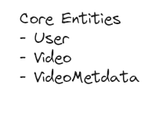
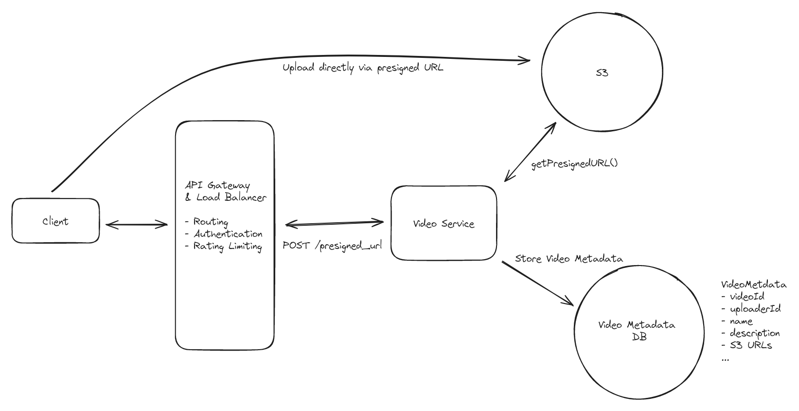
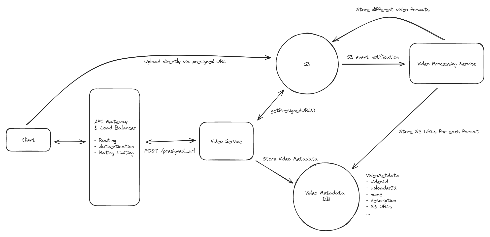
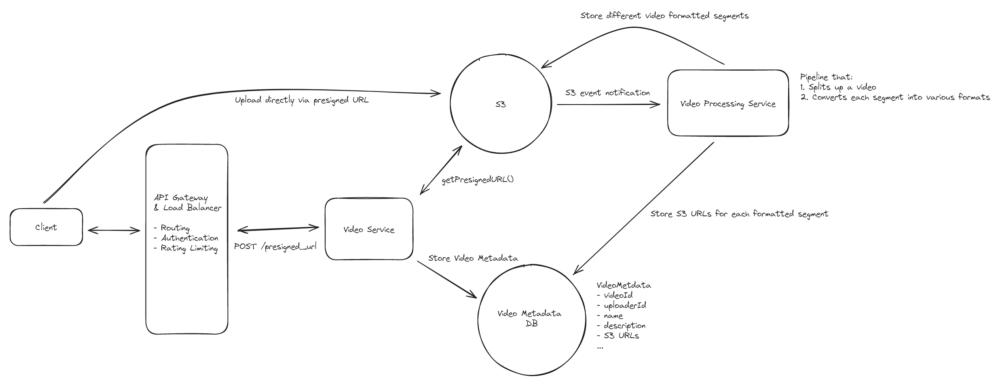
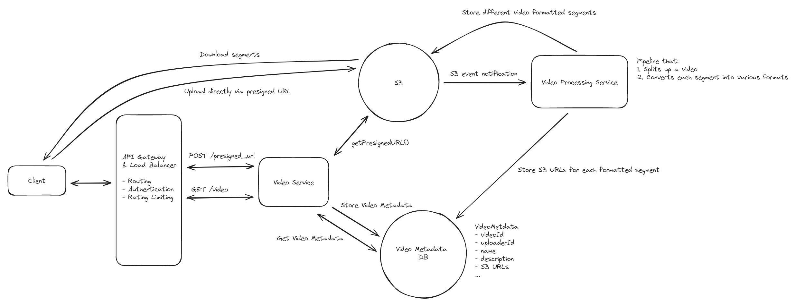
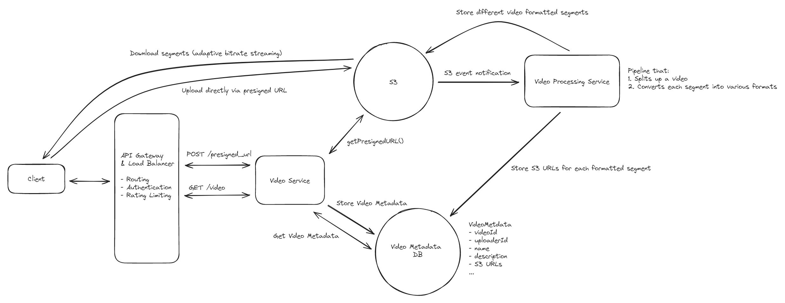
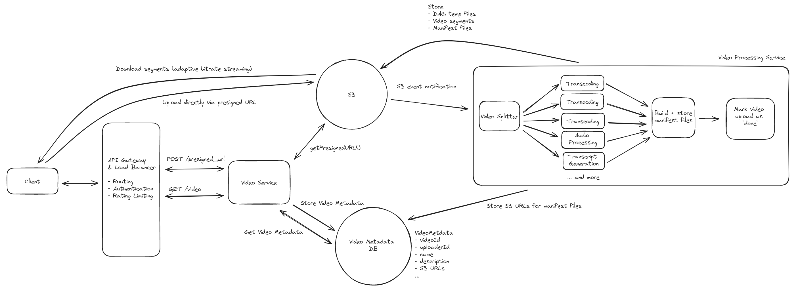
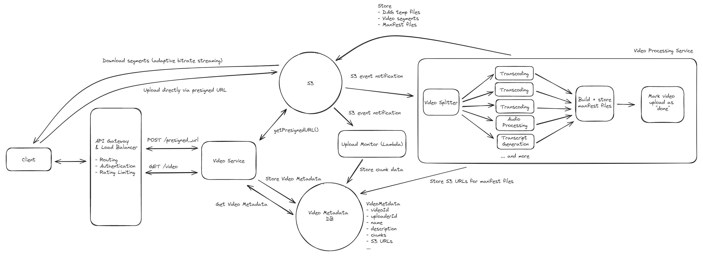

# Design YouTube

:::meta
LEVEL : MEDIUM
:::

## Understand the Problem

:::problem
**📹 What is YouTube?**

YouTube is a video-sharing platform that allows users to upload, view, and interact with video content. As of this writing, it is the second most visited website in the world 🤯.
:::

:::warning
There's some conceptual overlap between this question and designing [Dropbox](https://www.hellointerview.com/learn/system-design/problem-breakdowns/dropbox). If you're less familiar with system design principles for file upload / download designs, I'd recommend reading that guide first.
:::

### [Functional Requirements](https://www.hellointerview.com/learn/system-design/in-a-hurry/delivery#1-functional-requirements)

**Core Requirements**

1. Users can upload videos.
    
2. Users can watch (stream) videos.
    

**Below the line (out of scope)**

- Users can view information about a video, such as view counts.
    
- Users can search for videos.
    
- Users can comment on videos.
    
- Users can see recommended videos.
    
- Users can make a channel and manage their channel.
    
- Users can subscribe to channels.
    
:::info
It's worth noting that this question is mostly focused video-sharing aspects of YouTube. If you're unsure what features to focus on for a feature-rich app like YouTube or similar, have some brief back and forth with the interviewer to figure out what part of the system they care the most about.
:::

### [Non-Functional Requirements](https://www.hellointerview.com/learn/system-design/in-a-hurry/delivery#2-non-functional-requirements)

**Core Requirements**

1. The system should be highly available (prioritizing availability over consistency).
    
2. The system should support uploading and streaming large videos (10s of GBs).
    
3. The system should allow for low latency streaming of videos, even in low bandwidth environments.
    
4. The system should scale to a high number of videos uploaded and watched per day (~1M videos uploaded per day, 100M videos watched per day).
    
5. The system should support resumable uploads.
    

**Below the line (out of scope)**

- The system should protect against bad content in videos.
    
- The system should protect against bots or fake accounts uploading or consuming videos.
    
- The system should have monitoring / alerting.
    

Here's how it might look on a whiteboard:


:::warning
For this question, given the small number of functional requirements, the non-functional requirements are even more important to pin down. They characterize the complexity of these deceptively simple "upload" and "watch" interactions. Enumerating these challenges is important, as it will deeply affect your design.
:::

## The Set Up

### Planning the Approach

Before you move on to designing the system, it's important to start by taking a moment to plan your strategy. Generally, we recommend building your design up sequentially, going one by one through your functional requirements. This will help you stay focused and ensure you don't get lost in the weeds as you go. Once you've satisfied the functional requirements, you'll rely on your non-functional requirements to guide you through the deep dives.

### [Defining the Core Entities](https://www.hellointerview.com/learn/system-design/in-a-hurry/delivery#core-entities-2-minutes)

I like to start with a broad overview of the primary entities. At this stage, it is not necessary to know every specific column or detail. We will focus on these intricacies later when we have a clearer grasp of the system (during the high-level design). Initially, establishing these key entities will guide our thought process and lay a solid foundation as we progress towards defining the API.

For YouTube, the primary entities are pretty straightforward:

1. **User**: A user of the system, either an uploader or viewer.
    
2. **Video**: A video that is uploaded / watched.
    
3. **VideoMetadata**: This is metadata associated with the video, such as the uploading user, URL reference to a transcript, etc. We'll go into more detail later about what specifically we'll be storing here.
    

In the actual interview, this can be as simple as a short list like this. Just make sure you talk through the entities with your interviewer to ensure you are on the same page.



### [The API](https://www.hellointerview.com/learn/system-design/in-a-hurry/delivery#api-design-5-minutes)

The API is the primary interface that users will interact with. It's important to define the API early on, as it will guide your high-level design. We just need to define an endpoint for each of our functional requirements.

Let's start with an endpoint to upload a video. We might have an endpoint like this:

```http
POST /upload
Request:
{
  Video,
  VideoMetadata
}
```

To stream a video, our endpoint might retrieve the video data to play it on device:

```http
GET /videos/{videoId} -> Video & VideoMetadata
```

:::warning
Be aware that your APIs may change or evolve as you progress. In this case, our upload and stream APIs actually evolve significantly as we weigh the trade-offs of various approaches in our high-level design (more on this later). You can proactively communicate this to your interviewer by saying, "I am going to outline some simple APIs, but may come back and improve them as we delve deeper into the design."
:::

## [High-Level Design](https://www.hellointerview.com/learn/system-design/in-a-hurry/delivery#high-level-design-10-15-minutes)

### Background: Video Streaming

Before jumping into each requirement, it's worth laying out some fundamental information about video storage and streaming that is worth knowing.

:::info
To succeed in designing YouTube, you don't need to be an expert on video streaming or video storage. This would be an unreasonable ask. However, it's worth understanding the fundamentals at a high level to be able to successfully navigate this question.
:::

- **[Video Codec](https://api.video/what-is/codec/)** - A video codec compresses and decompresses digital video, making it more efficient for storage and transmission. Codec is an abbreviation for "encoder/decoder." Codecs attempt to reduce the size of the video while preserving quality. Codecs usually trade-off on the following: 1) time required to compress a file, 2) support on different platforms, 3) compression efficiency (a.k.a. how much the original file is reduced in size), and 4) compression quality (lossy or not). Some popular codecs include: H.264, H.265 (HEVC), VP9, AV1, MPEG-2, and MPEG-4.
    
- **[Video Container](https://callaba.io/difference-between-video-codecs-and-containers)** - A video container is a file format that stores video data (frames, audio) and metadata. A container might house information like video transcripts as well. It differs from a codec in the sense that a codec determines how a video is compressed / decompressed, whereas a container dictates file format for how the video is stored. Support for video containers varies by device / OS.
    
- **[Bitrate](https://api.video/what-is/bitrate/)** - The bitrate of a video is the number of bits transmitted over a period of time, typically measured in kilobytes per second (kbps) or megabytes per second (mbps). The size and quality of the video affect the bitrate. High resolution videos with higher framerates (measured in FPS) have significantly higher bitrates vs. low resolution videos at lower framerates. This is because there's literally more data that needs to be transferred in order for the video to play. Compression via codecs can also have an effect on bitrate, as more efficient compression can lead to a larger video being compressed to a much smaller size prior to transmission.
    
- **[Manifest Files](https://api.video/what-is/video-manifest/)** - Manifest files are text-based documents that give details about video streams. There's typically 2 types of manifest files: _primary_ and _media_ files. A _primary_ manifest file lists all the available versions of a video (the different formats). The primary is the "root" file and points to media manifest files, each representing a different version of the video. A video version is typically split into small segments, each a few seconds long. Media manifest files list out the links to these clip files and are used by video players to stream video by serving as an "index" to these segments.
    

Throughout this write-up, a "video format" will be a shorthand term we use for referring to a container and codec combination. Now, let's jump into the functional requirements!

### 1) Users can upload videos

One of the main requirements of YouTube is to allow users to upload videos that are eventually viewed by other users. When we upload a video, we need to consider a few fundamental things:

1. Where do we store the video metadata (name, description, etc.)?
    
2. Where do we store the video data (frames, audio, etc.)?
    
3. What do we store for video data?
    

For the video metadata, we are assuming an upload rate of ~1M videos/day. This means, over the course of the year, we'll have ~365M records in the database representing videos. As a result, we should consider storing video metadata in a database that can be horizontally partitioned, such as Cassandra. Cassandra offers high availability and enables us to choose a partition key for our data. We can partition on the `videoId`, since we aren't really worried about bulk-accessing videos in this design, just querying individual videos.

:::info
When designing a data storage solution that needs to scale, it's worthwhile to think about partitioning. Some systems necessitate careful partitioning such that data can be read from a single or a handful of nodes. Other systems require consistency within some scoped domain, necessitating a relational DB (with ACID guarantees) sharded by a key that represents that domain, e.g. Ticketmaster might shard by concert ID to ensure consistency of ticket purchases. However, there's some systems that don't require careful partitioning at all; for this system, we can shard by `videoId` because we'd only ever do a point look-up by `videoId`.
:::

For storing video data, we can see some overlap with this problem and the [Dropbox interview question](https://www.hellointerview.com/learn/system-design/problem-breakdowns/dropbox#1-users-should-be-able-to-upload-a-file-from-any-device). The TL;DR is that it's most efficient to upload data directly to a blob store like S3 via a presigned URL with [multi-part upload](https://www.hellointerview.com/learn/system-design/problem-breakdowns/dropbox#1-how-can-you-support-large-files). Feel free to read our write-up on Dropbox for an analysis of that part of the system.

:::info
The design decision to upload directly to S3 means we have to change our `POST /upload` API to a `POST /presigned_url` API. The server will create a presigned URL to enable the client to upload directly to S3. The request payload will just be the video metadata, vs. the metadata and the video file.
:::

At this point, the system will look like this:



Finally, when it comes to storing video, it's worthwhile to consider what we'll be storing. Understanding this will inform what deep dives we'll need to do later to clarify how we'll process videos to enable our system to successfully service our functional and non-functional requirements. Let's look at some options.

:::solution-bad
#### Bad Solution: Store the raw video

**Approach**

This approach basically ignores the fact that we'll need to do any video post-processing. We store just the file the user provides and don't perform any post-processing.

**Challenges**

This is a naive design and one that won't work in practice because different devices require diffrent video formats in order to play back video. We need to be more sophisticated when it comes to how we store videos.
:::

:::solution-good
#### Good Solution: Store different video formats

**Approach**

This approach involves doing some sort of post-processing of a video to ensure we convert the video into different formats playable on different devices. Once the user uploads a video, S3 will fire an event notification to a video processing service. This service will do the work to convert the original video into different formats. It will store each format as a file in S3. It will also update the video metadata record with the file URLs representing the different formats.



**Challenges**

This approach fails to anticipate the need to store small segments of video for streaming later. If we store the entire video, there's no way for the client to download "part" of a video. As we will see later, downloading "part" of a video is really important for streaming for various reasons.
:::

:::solution-good
#### Great Solution: Store different video formats as segments

**Approach**

This approach post-processes videos by splitting them into small segments (each a playable unit that's a few seconds in length) and then converts each segment into different formats playable on different devices. This is a strictly better design than the previous design because it enables more efficient video streaming later, which we will clarify as we design our system.



**Challenges**

This approach introduces some complexity. Firstly, it makes our post-processing service more complex, turning it into a "pipeline." It first must split up the video into segments, and then generate video formats per segment. In addition, the system needs to store references to these segments in a sane way and use them downstream in our streaming flow effectively. This will be a key system to clarify when we get to the "deep dive" portion of the interview.
:::

### 2) Users can watch videos

Now that we're storing videos, users should be able to watch them. When initially watching a video, we can assume the system fetches the VideoMetadata from the video metadata DB. Given that we'll be storing video content in S3, we'll want to modify our GET /video endpoint to return just the VideoMetadata, as that record will contain the URL(s) necessary to watch the video.

Let's look at the options we have when it comes to enabling users to watch videos.

:::solution-bad
#### Bad Solution: Download the video file

**Approach**

This approach involves the client downloading the whole video to play it. Technically, this isn't "streaming", but rather video download and playback. The video would be downloaded from S3 via a URL.

**Challenges**

In order to play the video, the client needs to download the video in its entirety. Even if the video is extensively compressed and has a low resolution, it can still be large, leading to a long download time. This can be problematic for 2 reasons:

1. If the entire video needs to be downloaded before playback, the user could be waiting to watch the video for a long time. For example, a 10GB video would take 13+ minutes to download on 100 MBPS internet, which is an unreasonable amount of time.
    
2. If the client requests the video in a single HTTP request and experiences a network disruption during that request, the download could fail and any download progress would be lost, resulting a lot of time wasted on a re-attempt.
    

In general, this approach is not viable when building a video streaming service.
:::

:::solution-good
#### Good Solution: Download segments incrementally

**Approach**

Rather than forcing a full video download all at once, the system can instead download video segments to properly "stream" the video.

The client would choose a video format based on the user's device, bandwidth, and preferences (e.g. if the user specified HD video, the client would stream 1080p video). The client would then load the first segment for the video, which would be a few seconds in length. This would allow the user to start watching the video quickly without excess loading. In the background, the client would start loading more segments so that it could continue playing the video seamlessly.



**Challenges**

This approach is more complex and relies on the uploaded videos being stored as segments (which was a previous design decision). Additionally, this approach doesn't take into account fluctuating network constraints _while_ a user is watching a video. If a 1080p video is streamed and network conditions get worse, loading 1080p segments might get slower, resulting in buffering for the user.

:::info
On the surface, it may seem like the "good" approach just seems like a 'chunked' download of the video, but it is actually a distinct approach and strictly better / more clear. Some video formats could be stored in order, meaning downloading the file in chunks (e.g. 5MB at a time), it will result in a file stream that is actually playable. However, this isn't always the case for all video formats, and it might be unclear to the interviewer that this approach is actually resulting in data that can be played back to the user with a quick turnaround time. Because the "good" solution involves dividing a video into playable segments, it more clearly conveys the means by which the video can be quickly and incrementally played, and it's strictly _closer_ to the "great" solution below.
:::
:::

:::solution-good
#### Great Solution: Adaptive bitrate streaming

**Approach**

[Adaptive bitrate streaming](https://www.cloudflare.com/learning/video/what-is-adaptive-bitrate-streaming/) relies on having stored segments of videos in different formats. It also relies on a manifest file being created during video upload time, which references all the video segments that are available in different formats. Think of a manifest file as an "index" for all the different video segments with different formats; it will be used by the client to stream segments of video as network conditions vary (see an example [here](https://api.video/what-is/video-manifest/)).

The client will execute the following logic when streaming the video:

1. The client will fetch the `VideoMetadata`, which will have a URL pointing to the manifest file in S3.
    
2. The client will download the manifest file.
    
3. The client will choose a format based on network conditions / user settings. The client retrieves the URL for this segment in its chosen format from the manifest file. The client will download the first segment.
    
4. The client will play that segment and begin downloading more segments.
    
5. If the client detects that network conditions are slowing down (or improving), it will vary the format of the video segments it is downloading. If network conditions get worse (e.g. the bitrate is lower), the client will attempt to download more compressed, lower resolution segments to avoid any interruption in streaming.
    



**Challenges**

This approach is the most complex and involves the client being a more active participant in the system (which isn't a bad thing). It also relies on upstream design decisions involving video splitting by segments, variance of format storage, and the creation of manifest files.
:::

## [Potential Deep Dives](https://www.hellointerview.com/learn/system-design/in-a-hurry/delivery#deep-dives-10-minutes)

### 1) How can we handle processing a video to support adaptive bitrate streaming?

Smooth video playback is key for the user experience of this system. In order to support smooth video playback, we need to support adaptive bitrate streaming, so the client can incrementally download segments of videos with varying formats to adapt to fluctuating network conditions. To support such a design, it is important to dig into the details of how video data is processed and stored.

When a video is uploaded in its original format, it needs to be post-processed to make it available as a streamable video to a wide range of devices. As indicated previously, post-processing a video ends up being a "pipeline". The output of this pipeline is:

1. Video segment files in different formats (codec and container combinations) stored in S3.
    
2. Manifest files (a primary manifest file and several media manifest files) stored in S3. The media manifest files will reference segment files in S3.
    

In order to generate the segments and manifest files, the stepwise order of operations will be:

1. Split up the original file into segments (using a tool like [`ffmpeg` or similar](https://rustyguts.dev/chunk-based-transcoding/)). These segments will be transcoded (converted from one encoding to another) and used to generated different video containers.
    
2. Transcode (convert from one encoding to another) each segment and process other aspects of the segments (audio, transcript generation).
    
3. Create manifest files referencing the different segments in different video formats.
    
4. Mark the upload as "complete".
    
:::info
Of note, this design assumes that we upload the original video in full first, before we start processing / splitting. Some video services start processing earlier if the client splits up the video on upload into segments. This enables a "pipeline" where the client uploads part of the video and the downstream work can happen before the client is even done uploading the full original foramt. For the sake of simplicity, we avoid this approach, but this is an additional optimization we can consider if we want to speed up the upload experience for the user.
:::

This series of operations can be thought of as a "graph" of work to be done. Each operation is a step with some fan-out / fan-in of work based on what "dependencies" exist. The segment processing (transcoding, audio processing, transcription) can be done in parallel on different worker nodes since there's no dependencies between segments and the segments have been "split up". Given the graph of work and the one-way dependencies, the work to be done here can be considered a directed, acyclic graph, or a "DAG."

For this DAG of work, the most expensive computation to be performed is the video segment transcoding. Ideally, this work is done with extreme parallelism and on many different computers (and cores), given the CPU-bound nature of converting a video from one codec to another.

Additionally, for actually orchestrating the work of this DAG, an orchestrator system can be used to handle building the graph of work to be done and assigning worker nodes work at the right time. We can assume we're using an existing technology to do this, such as [Temporal](https://temporal.io/blog/media-processing-workflows).

Finally, for any temporary data produced in this pipeline (segments, audio files, etc), S3 can be used to avoid passing files between workers. URLs can be passed around to reference said files.

Below is how our system might look with our post-processor DAG drawn out:



:::info
We don't need to draw out a full DAG with exact steps and precise examples of transcoding, audio processing, etc. Rather, it's important to dive into the explicit inputs and outputs of video post-processing, and understand how we can process videos in a scalable and efficient way. Given the parallelism and orchestration that is required to efficiently process a video, detailing a DAG solution makes sense here.
:::

### 2) How do we support resumable uploads?

In order to support resumable uploads for larger videos, we'll need to consider how we'll track progress for the video upload flow. Of note, this refers to tracking progress of the _original_ upload.

If you've read our Dropbox guide, you'll recognize this deep dive has strong overlap with the Dropbox deep dive involving [how to support large file uploads](https://www.hellointerview.com/learn/system-design/problem-breakdowns/dropbox#1-how-can-you-support-large-files). The TL;DR is that:

1. The client would divide the video file into chunks, each with a [fingerprint](https://en.wikipedia.org/wiki/Fingerprint_(computing)) hash. A chunk would be small, ~5-10MB in size.
    
2. `VideoMetadata` would have a field called `chunks` which would be a list of chunk JSONs, each with `fingerprint` and `status` field.
    
3. The client would POST request to the backend to update the `VideoMetadata` with the list of `chunks`, each with status `NotUploaded`.
    
4. The client would upload each chunk to S3.
    
5. S3 would fire [S3 event notifications](https://docs.aws.amazon.com/AmazonS3/latest/userguide/EventNotifications.html) to an AWS Lambda that would update the `VideoMetadata` by marking the chunk (identified by its fingerprint) as `Uploaded`.
    
6. If the client stopped uploading, it could resume by fetching the `VideoMetadata` to see the uploaded chunks and to skip chunks that had been uploaded already.
    

Below is how the system looks after we implement resumable uploads:



:::info
The above, in practice, is handled by [AWS multipart upload](https://docs.aws.amazon.com/AmazonS3/latest/userguide/mpuoverview.html). However, diving into the details in an interview like this is important to represent your depth of understanding of how file uploads occur in practice.
:::

### 3) How do we scale to a large number of videos uploaded / watched a day?

Our system assumes that ~1M videos are uploaded per day and that 100M videos are watched per day. This is a lot of traffic and necessitates that all of our systems scale and ensure a solid experience for end users.

Let's walk through each major system component to analyze how it will scale:

- **Video Service** - This service is stateless and will be responsible for responding to HTTP requests for presigned URLs and video metadata point queries. It can be horizontally scaled and has a load balancer proxying it.
    
- **Video Metadata** - This is a Cassandra DB and will horizontally scale efficiently due to Cassandra's leaderless replication and internal consistent hashing. Videos will be uniformly distributed as the data will be partitioned by `videoId`. _Of note, a node that houses a popular video might become "hot" of that video is popular, which could be a bottleneck._
    
- **Video Processing Service** - This service can scale to a high number of videos and can have internal coordination around how it distributes DAG work across worker nodes. Of note, this service will likely have some internal queuing mechanism that we don't visualize. This queue system will allow it to handle bursts in video uploads. Additionally, the number of jobs in the queue might be a trigger for this system to elastically scale to have more worker nodes.
    
- **S3** - S3 scales extremely well to high traffic / high file volumes. It is multi-region and can elastically scale. _However, the data center that houses S3 might be far from some % of users streaming the video if the video is streamed by a wide audience, which might slow down the initial loading of a video or cause buffering for those users._
    

Based on the above analysis, we identified a few opportunities to improve our design's ability to scale and provide a great user experience to a wide userbase.

To address the "hot" video problem, we can consider tuning Cassandra to replicate data to a few nodes that can share the burden of storing video metadata. This will mean that several nodes can service queries for video data. Additionally, we can add a cache that will store accessed video metadata. This cache can store popular video metadata to avoid having to query the DB for it. The cache can be distributed, use the least-recently-used (LRU) strategy, and partitioned on `videoId` as well. The cache would be a faster way to retrieve data for popular videos and would insulate the DB a bit.

To address the streaming issues for users who might be far away from data centers with S3, we can consider employing CDNs. CDNs could cache popular video files (both segments _and_ manifest files) and would be geographically proximate to many users via a network of edge servers. This would mean that video data would have to travel a significantly shorter distance to reach users, reducing slowness / buffering. Also, if all the data (manifest files and segments) was in the CDN, then the service would never need to interact with the backend at all to continue streaming a video.

Below is our final system, with the above enhancements applied:


### Some additional deep dives you might consider

YouTube is a complex and interesting application, and it's hard to cover every possible consideration in this guide. Here are a few additional deep dives you might consider:

1. **Speeding up uploads**: Our design above assumes that the client uploads the entire video file first, before it's post-processed (segmented, transcoded, manifest files generated). To speed up uploads, we might consider "pipelining" the upload and post-processing. The client can segment the video and upload segments, and the backend can take those segments and immediately operate on them. This requires the client to play a role in video processing and could create "garbage" video segments if a video isn't fully uploaded, but on average, this would help improve the user experience and make uploads faster.
    
2. **Resume streaming where the user left off**: A lot of applications offer the ability to resume watching a video where the user previously left off. This would require storing more data per user per video.
    
3. **View counts**: If the interviewer wishes to include more features in scope for the system, you might consider discussing the different options for maintaining video counts, either exact or estimated. This can easily be a dedicated deep-dive on its own.
    

## [What is Expected at Each Level?](https://www.hellointerview.com/blog/the-system-design-interview-what-is-expected-at-each-level)

Ok, that was a lot. You may be thinking, "how much of that is actually required from me in an interview?" Let’s break it down.

### Mid-level

**Breadth vs. Depth:** A mid-level candidate will be mostly focused on breadth (80% vs 20%). You should be able to craft a high-level design that meets the functional requirements you've defined, but many of the components will be abstractions with which you only have surface-level familiarity.

**Probing the Basics:** Your interviewer will spend some time probing the basics to confirm that you know what each component in your system does. For example, if you add an API Gateway, expect that they may ask you what it does and how it works (at a high level). In short, the interviewer is not taking anything for granted with respect to your knowledge.

**Mixture of Driving and Taking the Backseat:** You should drive the early stages of the interview in particular, but the interviewer doesn’t expect that you are able to proactively recognize problems in your design with high precision. Because of this, it’s reasonable that they will take over and drive the later stages of the interview while probing your design.

**The Bar for YouTube:** For this question, a mid-level candidate will have clearly defined the API endpoints and data model, landed on a high-level design that is functional for video upload / playback. I don't expect candidates to know in-depth information about video streaming, but the candidate should converge on ideas involving multipart upload and segment-based streaming. I also expect the candidate to understand the need to interface with a system like S3 directly for upload / streaming. I expect the candidate to drive some clarity about one relevant "deep dive" topic.

### Senior

**Depth of Expertise**: As a senior candidate, expectations shift towards more in-depth knowledge — about 60% breadth and 40% depth. This means you should be able to go into technical details in areas where you have hands-on experience. It's crucial that you demonstrate a deep understanding of key concepts and technologies relevant to the task at hand.

**Advanced System Design**: You should be familiar with advanced system design principles (different technologies, their use-cases, how they fit together). Your ability to navigate these advanced topics with confidence and clarity is key.

**Articulating Architectural Decisions**: You should be able to clearly articulate the pros and cons of different architectural choices, especially how they impact scalability, performance, and maintainability. You justify your decisions and explain the trade-offs involved in your design choices.

**Problem-Solving and Proactivity**: You should demonstrate strong problem-solving skills and a proactive approach. This includes anticipating potential challenges in your designs and suggesting improvements. You need to be adept at identifying and addressing bottlenecks, optimizing performance, and ensuring system reliability.

**The Bar for YouTube:** For this question, senior candidates are expected to quickly go through the initial high-level design so that they can spend time discussing, in detail, how to handle video post-processing and the details of uplaods. I expect the candidate to know about multipart upload and discuss how it would be used to handle resumable uploads. I also expect the candidate to know how a video a would be post-processed efficient to create files to enable streaming in an adaptive way.

### Staff+

**Emphasis on Depth**: As a staff+ candidate, the expectation is a deep dive into the nuances of system design — I'm looking for about 40% breadth and 60% depth in your understanding. This level is all about demonstrating that, while you may not have solved this particular problem before, you have solved enough problems in the real world to be able to confidently design a solution backed by your experience.

You should know which technologies to use, not just in theory but in practice, and be able to draw from your past experiences to explain how they’d be applied to solve specific problems effectively. The interviewer knows you know the small stuff (REST API, data normalization, etc.) so you can breeze through that at a high level so you have time to get into what is interesting.

**High Degree of Proactivity**: At this level, an exceptional degree of proactivity is expected. You should be able to identify and solve issues independently, demonstrating a strong ability to recognize and address the core challenges in system design. This involves not just responding to problems as they arise but anticipating them and implementing preemptive solutions. Your interviewer should intervene only to focus, not to steer.

**Practical Application of Technology**: You should be well-versed in the practical application of various technologies. Your experience should guide the conversation, showing a clear understanding of how different tools and systems can be configured in real-world scenarios to meet specific requirements.

**Complex Problem-Solving and Decision-Making**: Your problem-solving skills should be top-notch. This means not only being able to tackle complex technical challenges but also making informed decisions that consider various factors such as scalability, performance, reliability, and maintenance.

**Advanced System Design and Scalability**: Your approach to system design should be advanced, focusing on scalability and reliability, especially under high load conditions. This includes a thorough understanding of distributed systems, load balancing, caching strategies, and other advanced concepts necessary for building robust, scalable systems.

**The Bar for YouTube:** For a staff-level candidate, expectations are high regarding the depth and quality of solutions, especially for the complex scenarios discussed earlier. Exceptional candidates delve deeply into each of the topics mentioned above and may even steer the conversation in a different direction, focusing extensively on a topic they find particularly interesting or relevant. They are also expected to possess a solid understanding of the trade-offs between various solutions and to be able to articulate them clearly, treating the interviewer as a peer.