# Design a Collaborative Document Editor like Google Docs

:::meta
LEVEL : MEDIUM
:::

## Understanding the Problem

:::problem
**📄 What is [Google Docs](https://docs.google.com/)?** Google Docs is a browser-based collaborative document editor. Users can create rich text documents and collaborate with others in real-time.
:::

In this writeup we'll design a system that supports the core functionality of Google Docs, dipping into websockets and collaborative editing systems. We'll start with the requirements (like a real interview), then move on to complete the design following our [Delivery Framework](https://www.hellointerview.com/learn/system-design/in-a-hurry/delivery).

### [Functional Requirements](https://www.hellointerview.com/learn/system-design/in-a-hurry/delivery#1-functional-requirements)

**Core Requirements**

1. Users should be able to create new documents.
    
2. Multiple users should be able to edit the same document concurrently.
    
3. Users should be able to view each other's changes in real-time.
    
4. Users should be able to see the cursor position and presence of other users.
    

**Below the line (out of scope)**

1. Sophisticated document structure. We'll assume a simple text editor.
    
2. Permissions and collaboration levels (e.g. who has access to a document).
    
3. Document history and versioning.
    

### [Non-Functional Requirements](https://www.hellointerview.com/learn/system-design/in-a-hurry/delivery#2-non-functional-requirements)

**Core Requirements**

1. Documents should be eventually consistent (i.e. all users should eventually see the same document state).
    
2. Updates should be low latency (< 100ms).
    
3. The system should scale to millions of concurrent users across billions of documents.
    
4. No more than 100 concurrent editors per document.
    
5. Documents should be durable and available even if the server restarts.
    
:::tip
Some non-functional requirements make your job _easier_! In this case, limiting the number of concurrent editors per document is a great constraint to have. It means we can avoid worrying massive throughput on a single document and instead focus on the core functionality.

For what it's worth, this is a choice that Google docs also made - beyond a certain number of concurrent users, everyone new can only join as readers (implying a bit about their architectural choices).

Here's how it might look on your whiteboard:
:::


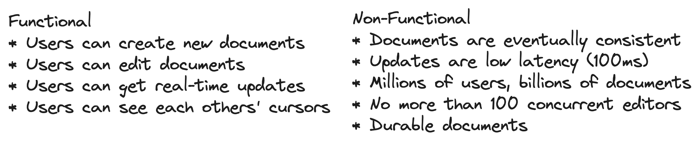

## Set Up

### Planning the Approach

Before we start designing the system, we need to think briefly through the approach we'll take.

For this problem, we'll start by designing a system which simply supports our functional requirements without much concern for scale or our non-functional requirements. Then, in our deep-dives, we'll bring back those concerns one by one.

To do this we'll start by enumerating the "nouns" of our system, build out an API, and then start drawing our boxes.

### [Defining the Core Entities](https://www.hellointerview.com/learn/system-design/in-a-hurry/delivery#core-entities-2-minutes)

First we'll define some core entities. These help to define terms between you and the interviewer, understand the data central to your design, and gives us a clue as to our APIs and how the system will fit together. The easiest way to do this is to look over your functional requirements and think about what nouns are involved in satisfying them. Asking yourself deeper questions about the behavior of the system ("what happens when...") will help you uncover the entities that are important to your design.

For this problem, we'll need just a few entities on our whiteboard:

<figure>
    
    <figcaption>Core Entities</figcaption>
</figure>

We'll explain these to our interviewer as we go through the problem.

- **Editor**: A user editing a document.
    
- **Document**: A collection of text managed by an editor.
    
- **Edit**: A change made to the document by an editor.
    
- **Cursor**: The position of the editor's cursor in the document (and the presence of that user in a document).
    

### Defining the API

Next, we can move to the APIs we need to satisfy which will very closely track our functional requirements. For this problem, we probably want some REST APIs to manage the document itself. We also know we're going to need lots of bi-directional communication between each editor and the document they're collectively editing. In this case it makes sense to assume we'll need some sort of websocket-based approach for the editor experience, so we'll define a few of the messages that we'll send over the wire.

Each interviewer may put more of less emphasis on this step. Some interviewers may want to really understand the intricacies of the messages (veering into a low-level design question) while others may be happy to know that you have a few messages defined opaquely and can move on. We'll assume the latter here!

```http
POST /docs
{
  title: string
} -> {
  docId
}

WS /docs/{docId}
  SEND {
    type: "insert"
    ....
  }

  SEND {
    type: "updateCursor"
    position: ...
  }

  SEND { 
    type: "delete"
    ...
  }

  RECV { 
    type: "update"
    ...
  }
```

:::info
When your API involves websockets, you'll be talking about _messages_ you send over the websocket vs endpoints you hit with HTTP. The notation is completely up to you, but having some way to describe the protocol or message schema is helpful to convey what is going over the wire.
:::

## [High-Level Design](https://www.hellointerview.com/learn/system-design/in-a-hurry/delivery#high-level-design-10-15-minutes)

With a sketch of an API we'll move to our high-level design. Tactically, it can be helpful to tell your interviewer that you're sure there are more details of the API to work through but you'll come back to those later as you flesh out the problem.

:::tip
While it's _awesome_ to be able to polish a perfect answer, you're in a time crunch! Acknowledging issues that you might get to later and leaving space to adjust your design as you learn more is a great way to keep the interview moving productively.
:::

### 1) Users should be able to create new documents.

Our first step in our document editor is to allow users to create new documents. This is a simple API that takes a title and returns a document ID. There's a lot of interesting metadata that we may want to hang off of the document (e.g. permissions, history, tags, etc.) so it's sensible for us to assume there will be some separation of the document itself and the metadata. For this API, we'll tackle the first part.

From an interviewing perspective the pattern we're using here of a simple horizontally scaled CRUD service fronted by an API gateway is so common you should be able to sling them out really quickly! Don't spend too much time setting the stage.


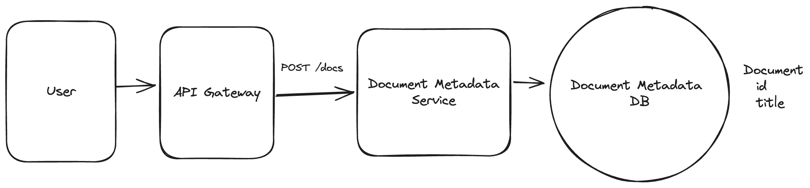

Our interviewer is likely to ask us what database we're going to use here. For this problem, let's assume a simple Postgres database for now because it gives us flexible querying and, if we need to scale, we can always partition and replicate later.

### 2) Multiple users should be able to edit the same document concurrently.

For our next requirement, we'll have to deal with writing to the document itself which has both consistency and scaling problems. This is where things start to get interesting. In a collaborative editor multiple users are making high frequency edits to the same document at the same time — a recipe for consistency problems and contention!

We're going to defer the scaling concerns for our deep dive later in the interview, so we'll make a note to our interviewer that we'll come back to that so we can focus on consistency.

#### Collaborative Edits Breakdown

First, let me explain why achieving consistency in a collaborative editor is not easy by starting with a deficient solution and then building up to a more correct one.

:::info
I'm going to walk through the fundamentals here to explain how we can solve the consistency problems here but, like before, this is a place where it's good to have the background knowledge to be able to field questions from your interviewer but you probably won't use the interview time to teach these concepts to your interviewer. Skip ahead if you already understand them!
:::

##### Sending Snapshots (Wrong)

Let's pretend on each edit the users send their entire document over to a Document Service. The `Document Service` will then store the document in a blob storage system like S3.


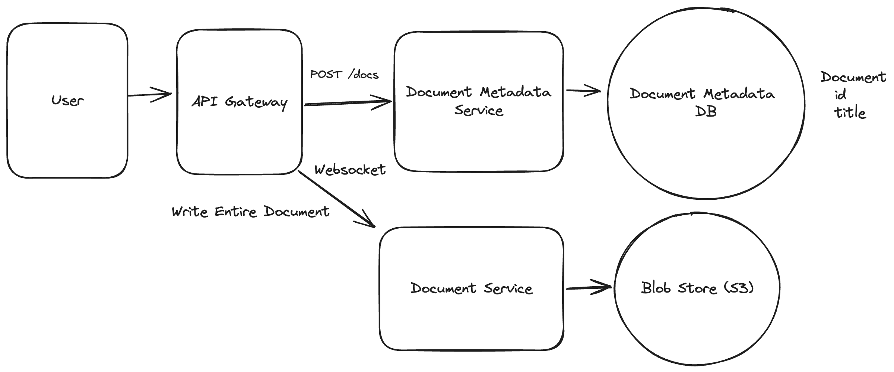

Simple enough, right? Not so fast. First, this design is incredibly inefficient: we're transferring the entire document over the wire for every edit. For a fast typer, this could mean 100s of KBs per keystroke, yuck. But a more serious problem looms.

Assume User A and User B are editing the same document concurrently. The document starts with a single paragraph of text:
```
Hello!
```

- User A adds "`, world`" to produce `Hello, world!` which they submit.
    
- User B deletes the "`!`" to produce `Hello` which they submit.
    

Both submit their edits at the same time. The actual document that gets stored to our blob storage is entirely dependent on which request arrives first. If User A's edit arrives first, the document will be `Hello, world!` If User B's edit arrives first, the document will be `Hello`. The user experience is terrible, we're losing all concurrent edits!

##### Sending Edits (Getting Warmer)

We can take a crack at solving these problems by recognizing that we're making **edits** to the document. Instead of transmitting the entire document over the wire, we can transmit just the edits themselves.

- User A adds "`, world`" and sends `INSERT(5, ", world")`
    
- User B deletes the "`!`" and sends `DELETE(6)`
    

We solved our first problem! We're no longer transmitting the entire document over the wire, so now we don't need to send 100s of KB on every keystroke. But we have a new problem.

User B's deletion assumes that the character at position 6 is an exclamation mark. If User A's edit arrives after User B's deletion, we'll end up with `Hello, world` - ok, good. But if User B's edit arrives after User A's edit, we'll end up with `Hello world!` - we deleted the comma instead of the exclamation mark!

##### Collaborative Editing Approaches

The critical missing piece here is that each edit is contextual: it's an edit based on a specific state of the document. Dealing with a stream of edits presents a bunch of consistency problems! We have two options to solve this problem:

:::solution-good
#### Good Solution: Operational Transformation (OT)

**Approach**

One way to thread the needle is to reinterpret or _transform_ each edit before it's applied. The idea here is that each user's edit can be adjusted based on the edits that came before it.

We'll collect all of the edits to the document on a single server. From there, we can, in batches, transform each edit based on the edits that came before it. While an exhaustive treatment of OT is beyond the scope of this design (you can read more [on the wikipedia page](https://en.wikipedia.org/wiki/Operational_transformation)), let's consider a simple worked example.

User B's `DELETE(6)` is trying to delete the character at position 6, which for them was a ! at the time the edit was created. The problem occurs when User A's edit `INSERT(5, ", world")` arrives first. If we don't transform User B's edit, we'll end up with `Hello, world` instead of `Hello, world!`.

The OT approach is to transform the operations before they're applied (and, later, before they're sent back to the client). In this case, if User A's edit arrives before User B's deletion, we can transform User B's `DELETE(6)` to `DELETE(12)` so that when User A's edit is applied, it deletes the exclamation mark instead of the comma.

OT is low memory and fast, but comes with a big tradeoff.

**Challenges**

OT requires a central server which can provide a final ordering of operations. This allows us to scale to a small number of collaborators, but not an enormous number. Our non-functional requirements help us here. OT is also tricky to implement correctly and easy to get wrong.


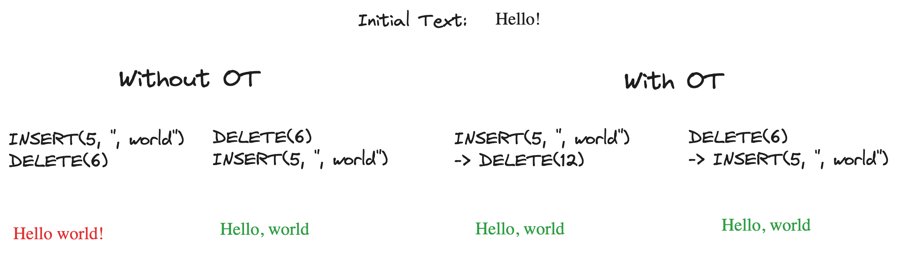
:::

:::solution-good
#### Good Solution: Conflict-free Replicated Data Types (CRDTs)

**Approach**

The alternative to reinterpreting every edit is to make every edit commutative or, able to be applied in any order. This is the approach taken by Conflict-free Replicated Data Types (CRDTs).

CRDTs allow us to represent edits as a set of operations that can be applied in any order but still produce the exact same output.

For simple text operations, CRDTs do this with two tricks:

1. CRDTs represent positions using real numbers rather than integers. These positions _never change_ even in light of insertions. If we need to create more "space", real numbers allow us to do so infinitely (like adding 1.5 between 1 and 2).
    
2. CRDTs keep "tombstones" for deleted text. The text is never actually removed from the document, but we remember that it is deleted before displaying the document to the user.
    

Note: We won't be able to go into too much depth to explain CRDTs (a deep research topic!) though you're free to read more on [the wikipedia page](https://en.wikipedia.org/wiki/Conflict-free_replicated_data_type). But to give you some intuition, let's consider a simple worked example.

Assume we have two users looking at "Hello!" where each character has a position number under it:

```
H  e  l  l  o  !

0  1  2  3  4  5
```

Both users want to insert something after "Hello". User A wants to insert "," and User B wants to insert " there". This would be tricky in OT because we'd need to transform one edit based on the other. But with CRDTs, we just need to make sure each new character gets its own unique position number between 4 and 5.

When User A's wants to insert "," she picks an arbitrary number between 4 and 5 as the position for her comma, in this case she chooses 4.6:

```
H    e    l    l    o    ,    !

0    1    2    3    4    4.3    5
```

User B does the same, assigning arbitrary numbers between 4 and 5 for each of the characters he wants to insert:

```
H     e     l     l     o         t     h     e     r     e    !

0     1     2     3     4    4.1  4.2   4.4   4.5   4.7   4.8  5
```

The magic is that these position numbers create a total ordering - no matter what order the edits arrive in, every client will sort the characters the same way and see the same final text.

In this case, the resulting string is "Hello t,here!" which is a consequence of both users editing in the same position. There are a lot of tricks to prevent conflicts like this, but the core guarantee of a CRDT is that no matter what order the edits arrive in, every client will converge on the same document.

CRDTs are elegant in that they remove the need for a central server. As long as all updates eventually reach all clients, the clients will converge on the same document. This makes it a good solution for peer-to-peer applications. CRDTs are also more easily adaptable to offline use-cases - you can just keep all of the edits in local storage and add them to the bag of updates once the editor comes back online.

A great commercial implementation of CRDTs is [Yjs](https://github.com/yjs/yjs) which I would highly recommend for lightweight collaborative applications.

**Challenges**

The benefits of CRDTs come with some big downsides. The memory usage is higher because we need to remember every edit, including tombstones for text that has long been deleted. This means our document only grows in size, never shrinks. CRDTs are also less efficient computationally, though there are workarounds! And finally the handling of conflicts can be inelegant. For most real-time use cases this isn't as much a problem, simply having a cursor indicator is enough for you and I to avoid editing the same part of the same document, but as clients need to buffer or go offline it can become a major issue.
:::

For this problem, we're going to use the Operational Transformation (OT) approach. This is the approach that Google Docs takes and it benefits from requiring low memory, being more adaptable to text in particular, and making use of a centralized server.

If we needed to support a larger number of collaborators, or a Peer-to-Peer system (maybe using WebRTC!), we could use CRDTs. There are plenty of examples of industrial CRDTs which cut some corners (Figma being a notable one) - there's a healthy amount of research and development happening on both approaches.

With that in mind, we can update our design to solve the collaborative edit problem. Our updated design sends edits to a central server as operations, which are transformed by the server before being recorded in a database.


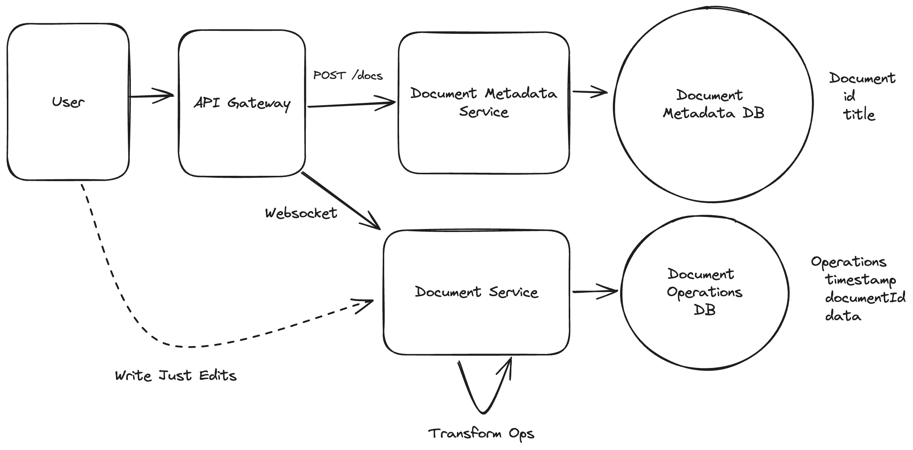

For our new `Document Operations DB`, we want to use something that we can write very quickly in an append-only fashion (for now). Cassandra should do the trick. We'll partition by `documentId` and order by timestamp (which will be set by our document service). Once the edit has been successfully recorded in the database, we can acknowledge/confirm it to the user. We satisfied our durability requirement!

### 3) Users should be able to view each other's changes in real-time.

Ok, now that we have a write path let's talk about the most important remaining component: reads! We need to handle two paths:

- First, when a document is just created or hasn't been viewed in a while, we need to be able to load the document from our database and transfer it to the connected editors.
    
- Next, when another editor makes an edit, we need to get notified so that our document stays up-to-date.
    

#### When the Document is Loaded

When a user first connects, they need to get the latest version of the document. In this case when the Websocket connection is initially established for the document we can push to the connection all of the previous operations that have been applied. Since everyone is connecting to the same server, this allows us to assume that all connections are starting from the same place.


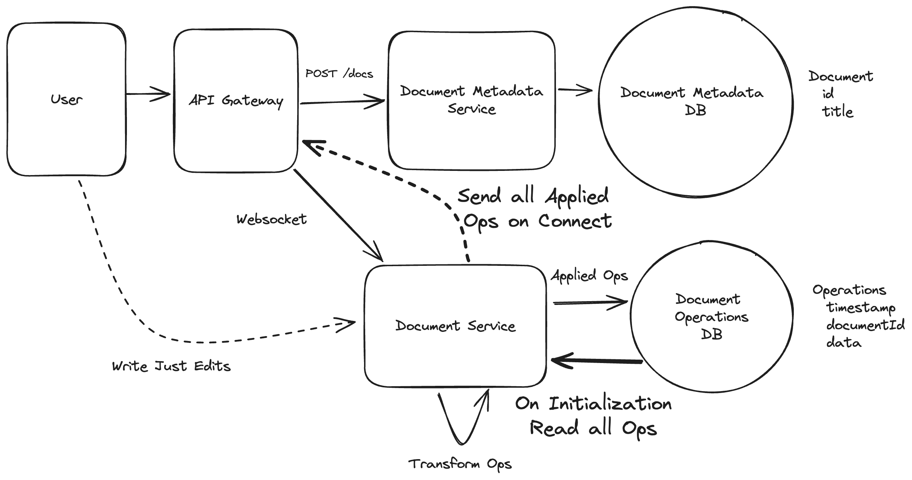

#### When Updates Happen

When an edit is made successfully by another collaborator, every remaining connected editor needs to receive the updates. Since all of our editors are connected to the same server, this is straightforward: after we record the operation to our database, we can also send it to all clients who are currently connected to the same document.

The next step might surprise you: On the client, we **also** have to perform the operational transformation. Let's talk briefly about why this is.

When users make edits to their own document, they expect to see the changes _immediately_. In some sense, their changes are always applied first to their local document and then shipped off to the server. What happens if another user lands an edit on the server _after_ we've applied our local change but _before_ it can be recorded to the sever?

Our OT gives us a way of handling out of order edits. Remember that OT takes a sequence of edits in an arbitrary order and rewrites them so they consistently return the same final document. We can do the same thing here!

So so if User A submits `Ea` to the server, and User B submits `Eb` (which arrives after `Ea`), the perceived order of operations from each site is:

```
Server: Ea, Eb
User A: Ea, Eb
User B: Eb, Ea
```

Regardless of the ordering, by applying OT to the operations we can guarantee that each user sees the same document!


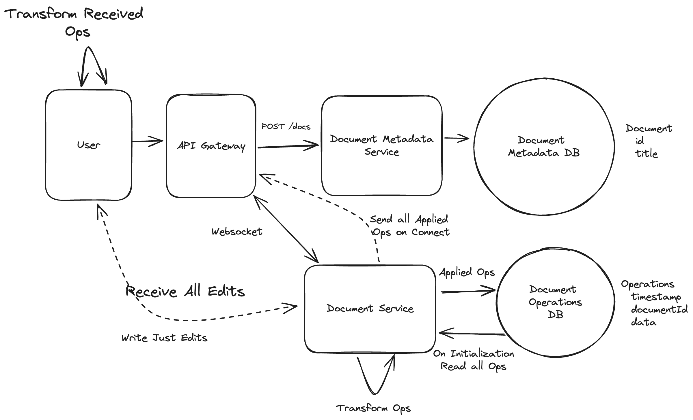

### 4) Users should be able to see the cursor position and presence of other users.

One of the more important features of a collaborative editor is "awareness" or being able to see where your collaborators are editing. This helps to avoid situations where you're simultaneously editing the same content (always a mess!) or repeating work. Awareness is inherently transient, we only really care about where our collaborators' cursor is **now** not where it was an hour ago. We also don't care about where the user's cursor is when they aren't currenty connected - it doesn't make sense. This data is **ephemeral** with the connection.

These properties help us to decide that we don't need to keep cursor position or the presence of other users in the document data itself. Instead, we can have users report changes to their cursor position to the `Document Service` which can store it in memory and broadcast it to all other users via the same websocket. When a new user connects, the `Document Service` can read the properties of other users out of memory and send them to the connecting user. Finally, the `Document Service` can keep track of socket hangups/disconnects and remove those users from the list (sending a broadcast when it happens to any remaining users).

And with that, we have a functional collaborative editor which scales to a few thousand users!

## [Potential Deep Dives](https://www.hellointerview.com/learn/system-design/in-a-hurry/delivery#deep-dives-10-minutes)

With the core functional requirements met, it's time to cover non-functional requirements and issues we introduced.

### 1) How do we scale to millions of websocket connections?

One of the weakest assumptions we made as we built out the system is that we'll be able to serve everyone from a single `Document Service` server. This won't scale to millions of concurrent users and introduces a single point of failure for availability.

Wwe need to scale the number of `Document Service` servers to the number of concurrent connections. When I connect to the `Document Service`, I either (a) need to be co-located with all other users connected to the same document or (b) know where all the other users are connected. (See [Whatsapp](https://www.hellointerview.com/learn/system-design/problem-breakdowns/whatsapp#1-how-can-we-handle-billons-of-simultaneous-users) for a similar problem.)

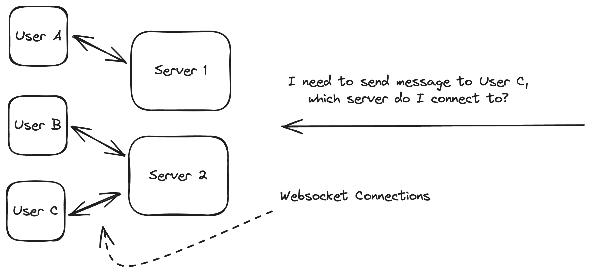

:::tip
When you introduce websockets into your design, you're probably doing it because they are _bi-directional_, you can send messages back to your clients. With a traditional client-server architecture you're mostly talking about left-to-right arrows: how can clients connect to the servers to send messages and receive a response. The jump that many candidates fail to make is to think about the **right-to-left** arrows on their diagrams: how do your internal services talk to the clients?

Because the statefulness of websockets is a pain, it can be useful to handle them at the "edge" of your design. By terminating websockets early and exposing an "internal" API to the rest of our system, other systems can retain statelessness and don't need to concern themselves with the details of websocket connections.

:::

The solution here is to horizontally scale the `Document Service` and use a consistent hash ring to distribute connections across servers. Each server in our system joins a the hash ring, with each server responsible for a range of hash values. This means we always know both which server is responsible for the document and all connections go there. We use Apache Zookeeper to maintain the hash ring configuration and coordinate between servers.

When a client needs to connect:

1. They can initially open an HTTP connection to any of the document servers (potentially via round robin) with the document ID requested.
    
2. That server will check the hash ring configuration for the given document ID and if it's not responsible for that hash range, it will respond with a redirect to the correct server's address. This way, clients eventually connect directly to the right server without an intermediary.
    
3. Once the correct server is found, the HTTP connection is upgraded to a websocket connection. The socket server maintains a map from the document ID to the corresponding websocket for use later.
    
4. We load all the stored ops (if they aren't already loaded) from our `Document Operations DB` and are ready to process operations.
    

Since all of the users of a document are connecting to the same server, when updates happen we can simply pass them to all connected clients.

The beauty of consistent hashing is that when we add or remove servers, only a small portion of connections need to be redistributed. Servers periodically check Zookeeper for ring changes and can initiate connection transfers when needed.


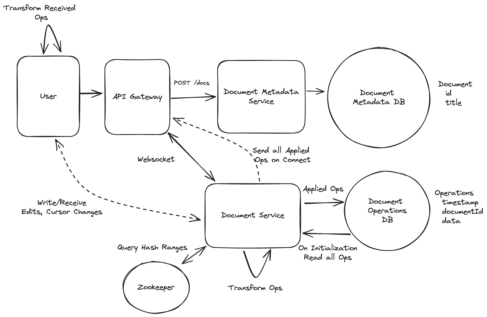

The downside of this approach is that in these scaling events we need to move a lot of state. Not only do we need to move websocket connections for displaced users (by disconnecting them and forcing them to reconnect to the right server), but we also need to ensure document operations are moved to the correct server.

In an interview, we may be asked to expand on this further:

**Scaling complexity**

- Need to track both old and new hash rings when adding servers
    
- Requests may need to be sent to multiple servers during transitions
    
- Server failures require quick redistribution of connections and hash ring updates
    

**Connection state management challenges**

- Need robust monitoring for server failures and connection issues
    
- Must implement client-side reconnection logic for server unavailability
    

**Capacity planning requirements**

- Must ensure servers have sufficient resources for their connection load
    
- Need to monitor connection distribution to prevent server hotspots
    

### 2) How do we keep storage under control?

With billions of documents, we need to be thoughtful about how we manage storage. By choosing OT vs CRDTs, we can already reduce the amount of storage we need by a factor. Still, if each document is 50kb, we're looking at 50TB of storage! Worse, if we have a document with millions of operations, each of these operations will need to be transferred and applied to each client that joins the document!

Remember also that all _active_ documents need to be held in memory in our `Document Service`. We need to keep that space small in order to avoid being memory bottlenecked.

One of the most natural solutions here is we'll want to periodically snapshot/compact operations. The idea here is that we don't need all of the operations in our `Document Operations DB` to be stored (exception being if we want to manage some sort of versionining), and we can collapse many operations into one to save on both processing and space.

Lots of options to pull this off!

:::solution-good
#### Good Solution: Offline Snapshot/Compact

**Approach**

One approach we can take is to introduce a new `Compaction Service` which periodically reads operations out of the `Document Operations DB` and writes a snapshot back to the DB collapsing those instructions. The exact schedule has lots of potential parameters: we may look for large documents, that haven't been recently compacted, and probably haven't been written recently.

Because this necessarily changes the operations that follow, we need to make sure that what we're writing isn't impacting a live document. This is a tricky distributed transaction that we need to pull off and, because we're using Cassandra for the `Document Operations DB`, we only have row-level transactions to work with.

To ensure document-level atomicity, we'll introduce a new `documentVersionId` to the `Document Metadata DB`. Before loading a document, we'll grab this `documentVersionId` out of the `Document Metadata DB` so we know which document operations to retrieve.

Whenever we want to change operations, we can write new operations and the _flip_ the `documentVersionId`. We'll make sure all _flips_ go through the Document Service so we don't have (yet another) race condition.

The `Compaction Service` can:

1. Read the document operations out for a given document out of the DB.
    
2. Compact these operations into as few operations as possible (probably a singular insert operation!).
    
3. Write the resulting operations to a new `documentVersionId`.
    
4. Tell the `Document Service` to _flip_ the `documentVersionId`.
    

If the `Document Service` has a loaded document, it will discard the flip command to defer compaction which might corrupt existing operations.


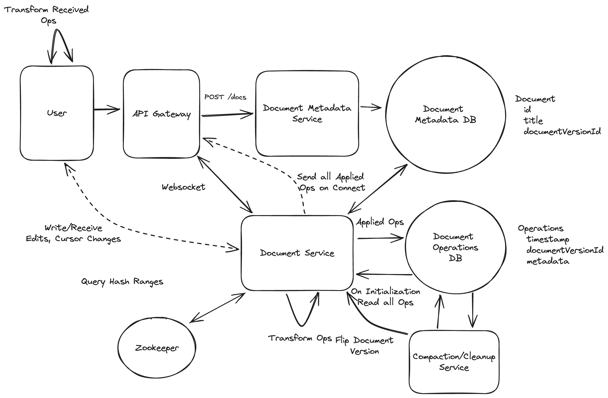

**Challenges**
:::

:::solution-good
#### Great Solution: Online Snapshot/Compact Operations

**Approach**

A different approach we can take is to have our `Document Service` periodically snapshot/compact operations. Since the `Document Service` has exclusive ownership of a document when we're not scaling up the cluster, we can safely compact operations without worrying about coordination/consistency. In fact, a natural time to do this is when the document is idle and has no connections - something the document service will know about immediately. We also already have all of the existing document operations in memory at that time, making our job easier.

When the last client disconnects we can then:

1. Take all of the existing operations and offload them to a separate (low CPU nice) process for compaction.
    
2. Write the resulting operations to the DB under a new `documentVersionId`.
    
3. Flip the `documentVersionId` in the Document Metadata DB.
    

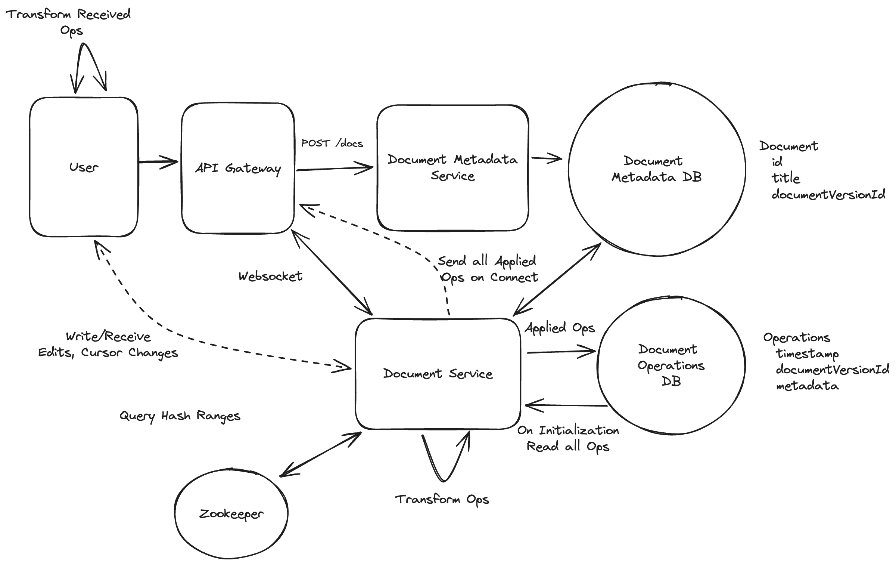

**Challenges**

Moving compaction into the document service risks increasing latency for document operations (especially at the tail P99), we need to make sure they're not hogging our CPUs unnecessarily. One option for this is to run them in a separate process with lower CPU priority.
:::

### Some additional deep dives you might consider

Google Docs is a beast with hundreds to thousands of engineers working on it, so we can't cover everything here. Here are some additional deep dives you might consider:

1. **Read-Only Mode**: Google Docs has a "read-only" mode where users can view documents without interfering with others. It's also considerably more scalable, millions of readers can be viewing the same document. How might we implement this?
    
2. **Versioning**: Google Docs allows users to revert to previous versions of a document. How can we extend our snapshot/compact approach to support this?
    
3. **Memory**: The memory usage of our `Document Service` can be a bottleneck. How can we further optimize it?
    
4. **Offline Mode**: How might we expand our design if we want to allow our clients to operate in an offline mode? What additional considerations do we need to bring into our design?
    

## [What is Expected at Each Level?](https://www.hellointerview.com/blog/the-system-design-interview-what-is-expected-at-each-level)

### Mid-level

Personally, I probably wouldn't ask this question of a mid-level candidate. That's not to say you won't get it, but I wouldn't. With that out of the way, I'd be looking for a candidate who can create a high-level design and then think through (together with some assistance) some of the issues that you'll encounter in a high concurrency problem like this. I want to see evidence that you can think on your feet, spitball solutions, and have a small (but growing) toolbox of technologies and approaches that you can apply to this problem.

### Senior

For senior candidates, I would expect them to immediately start to grok some of the consistency and durability challenges in this problem. They may start with a very basic, inefficient solution but I expect them to be able to proactively identify bottlenecks and solve them. While I would not expect a candidate to necessarily know the distinction between OT and CRDT, I would expect them to be able to talk about database tradeoffs and limitations, and how they might impact our design. We might have time for an additional deep dive.

### Staff

For staff engineers, I'm expecting a degree of mastery over the problem. I'd expect them to be loosely familiar with CRDTs (if they're not, they'll make it up somewhere else) but intimately familiar with scaling socket services, consistency tradeoffs, serialization problems, transactions, and more. I'd expect to get through the deep dives and probably tack on an extra one if we're not too deep in optimizations.

## References

- [Real-Time Mouse Pointers](https://www.canva.dev/blog/engineering/realtime-mouse-pointers/): How Canva enables collaborative editing using WebRTC.