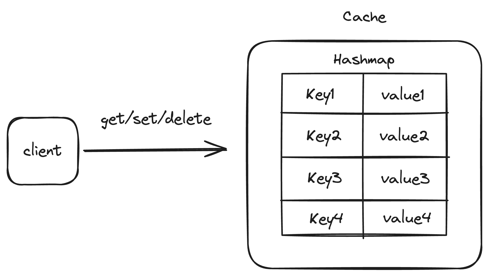
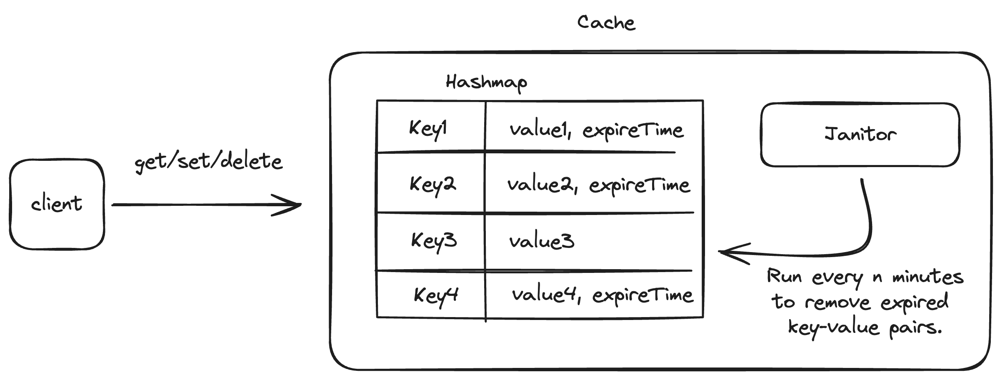
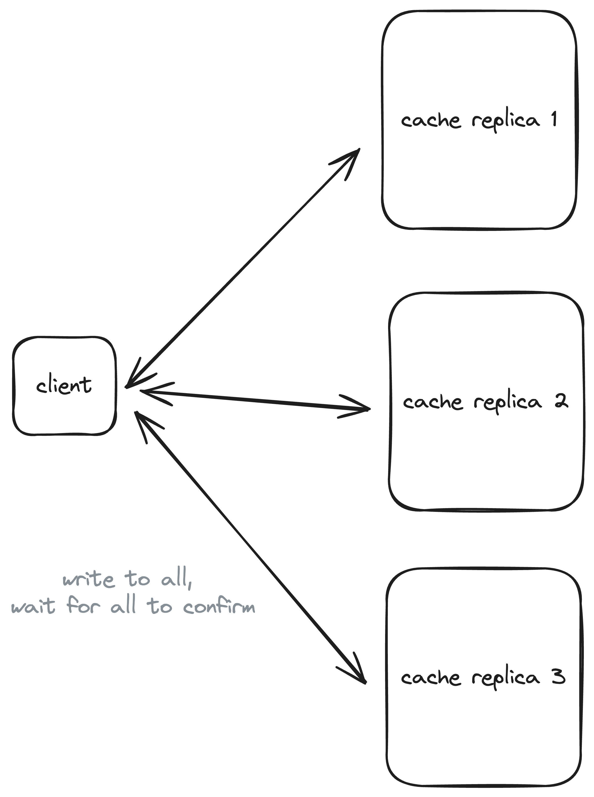
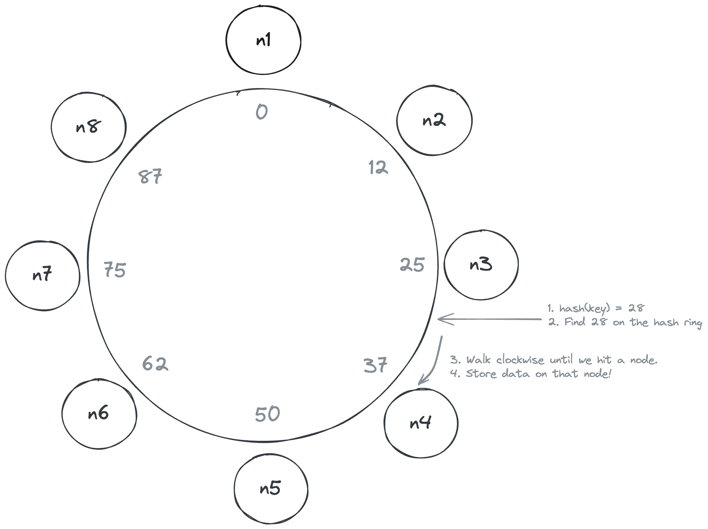
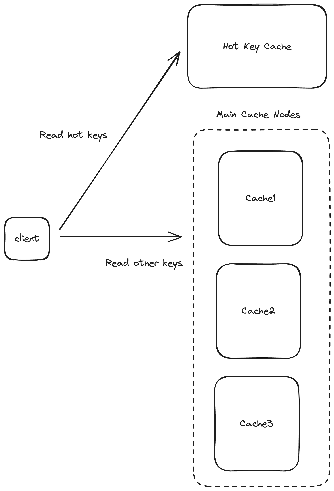
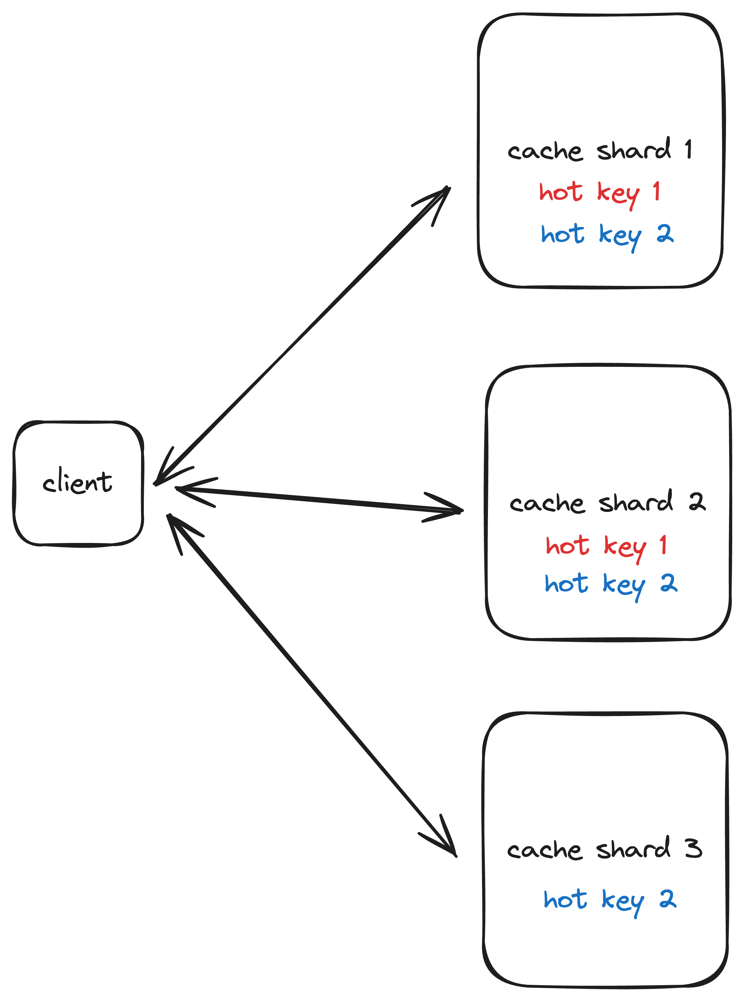
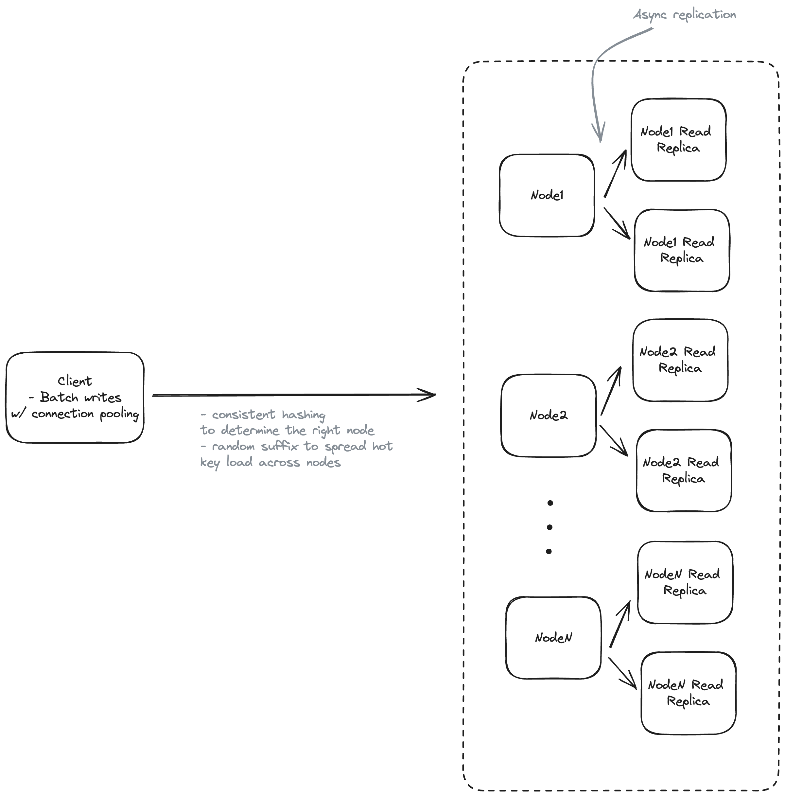

# Design a Distributed, In-Memory Cache

:::meta
LEVEL | HARD
:::

## Understanding the Problem

:::problem
**💾 What is a Distributed Cache?** A distributed cache is a system that stores data as key-value pairs in memory across multiple machines in a network. Unlike single-node caches that are limited by the resources of one machine, distributed caches scale horizontally across many nodes to handle massive workloads. The cache cluster works together to partition and replicate data, ensuring high availability and fault tolerance when individual nodes fail.
:::

### [Functional Requirements](https://www.hellointerview.com/learn/system-design/in-a-hurry/delivery#1-functional-requirements-1)

**Core Requirements**

1. Users should be able to `set`, `get`, and `delete` key-value pairs.
    
2. Users should be able to configure the expiration time for key-value pairs.
    
3. Data should be evicted according to Least Recently Used (LRU) policy.
    

**Below the line (out of scope)**

- Users should be able to configure the cache size.
    
:::info
We opted for an LRU eviction policy, but you'll want to ask your interviewer what they're looking for if they weren't explicitly upfront. There are, of course, other eviction policies you could implement, like LFU, FIFO, and custom policies.
:::

### [Non-Functional Requirements](https://www.hellointerview.com/learn/system-design/in-a-hurry/delivery#2-non-functional-requirements-1)

At this point in the interview, you should ask the interviewer what sort of scale we are expecting. This will have a big impact on your design, starting with how you define the non-functional requirements.

If I were your interviewer, I would say we need to store up to 1TB of data and expect to handle a peak of up to 100k requests per second.

**Core Requirements**

1. The system should be highly available. Eventual consistency is acceptable.
    
2. The system should support low latency operations (< 10ms for get and set requests).
    
3. The system should be scalable to support the expected 1TB of data and 100k requests per second.
    

**Below the line (out of scope)**

- Durability (data persistence across restarts)
    
- Strong consistency guarantees
    
- Complex querying capabilities
    
- Transaction support
    
:::tip
Note that I'm making quite a few strong assumptions about what we care about here. Make sure you're confirming this with your interviewer. Chances are you've used a cache before, so you know the plethora of potential trade-offs. Some interviewers might care about durability, for example, just ask.
:::

## The Set Up

### Planning the Approach

For a problem like this, you need to show flexibility when choosing the right path through the [Hello Interview Delivery Framework.](https://www.hellointerview.com/learn/system-design/in-a-hurry/delivery) In fact, this is a famous question that is asked very differently by different interviewers at different companies. Some are looking for more low-level design, even code in some instances. Others are more focused on how the system should be architected and scaled.

In this breakdown, we'll follow the most common path (and the one I take when I ask this question) where we balance low-level design with a high-level design that is scalable and handles the expected load.

I'm going to opt for documenting the core entities and the API, but in an actual interview I would not spend a lot of time on these two sections, recognizing they're largely trivial. I'd either skip them, or rush through them to spend time on my high-level design and deep dives.

### [Defining the Core Entities](https://www.hellointerview.com/learn/system-design/in-a-hurry/delivery#core-entities-2-minutes)

The core entities are right there in front of our face! We're building a cache that stores key-value pairs, so our entities are `keys` and `values`.

In other words, the data we need to persist (in memory) are the `keys` and their associated `values`.

### [The API](https://www.hellointerview.com/learn/system-design/in-a-hurry/delivery#4-api-or-system-interface)

According to our functional requirements, we have three key operations that we'll need to expose via an API: `set`, `get`, and `delete`.

These should each be rather straightforward, so we can breeze through this.

:::tip
Identifying where to spend more and less time in a system design interview based on where the challenges are is an important skill to have. Spending time on simple, auxiliary, or otherwise less important parts of the system is a recipe for running out of time.
:::

Setting a key-value pair:

```
POST /:key
{
  "value": "..."
}
```

Getting a key-value pair:

```
GET /:key -> {value: "..."}
```
Deleting a key-value pair:

```
DELETE /:key
```

## [High-Level Design](https://www.hellointerview.com/learn/system-design/in-a-hurry/delivery#high-level-design-10-15-minutes-1)

We start by building an MVP that works to satisfy the core functional requirements. This doesn't need to scale or be perfect. It's just a foundation for us to build upon later. We will walk through each functional requirement, making sure each is satisfied by the high-level design.

### 1) Users should be able to set, get, and delete key-value pairs

Let's start with the absolute basics. No fancy distributed systems yet - just a working cache that handles `gets`, `sets`, and `deletes`.

At its core, a cache is just a hash table. Every programming language has one: Python's dict, Java's HashMap, Go's map. They're perfect for this because they give us `O(1)` lookups and inserts.

Your interviewer may ask you to sketch out some pseudocode. Here is what that might look like:

```python
class Cache:
    data = {}  # Simple hash table

    get(key):
        return self.data[key]

    set(key, value):
        self.data[key] = value

    delete(key):
        delete self.data[key]
```

:::warning
When asked to write pseudocode in a design interview, don't worry about the syntax. Just focus on the logic. You'll note that I don't handle corner cases like key not found or key already exists. No worries, that's not the point here.

That said, as always, it's worth confirming this with your interviewer. "I'm going to write some pseudocode, is it ok that it's not syntactically correct or missing some details?"
:::

That's it. Three operations, all `O(1)`. The hash table handles collision resolution and dynamic resizing for us.

We can host this code on a single server. When a user makes a API request, we'll parse the request, and then call the appropriate method on our `Cache` instance, returning the appropriate response.




Now, this isn't production-ready. It'll fall over if we try to handle real traffic or store too much data. But it's a solid foundation that meets our core functional requirement: storing and retrieving key-value pairs.

### 2) Users should be able to configure the expiration time for key-value pairs

Let's add expiration functionality to our cache. We'll need to store a timestamp alongside each value and check it during reads. We'll also need a way to clean up expired entries.

The pseudocode below shows how we can modify our cache to support TTLs (Time To Live). The key changes are:

1. Instead of storing just values, we now store tuples of (value, expiry_timestamp)
    
2. The `get()` method checks if the entry has expired before returning it
    
3. The `set()` method takes an optional TTL parameter and calculates the expiry timestamp
    

This gives us the ability to automatically expire cache entries after a specified time period, which is necessary for keeping the cache fresh and preventing stale data from being served.

```python
# Check the expiry time of the key on get
get(key):
    (value, expiry) = data[key]
    if expiry and currentTime() > expiry:
        # Key has expired, remove it
        delete data[key]
        return null
        
    return value

# Set the expiry time of the key on set
set(key, value, ttl):
    expiry = currentTime() + ttl if ttl else null
    data[key] = (value, expiry)
```

This handles the basic TTL functionality, but there's a problem: expired keys only get cleaned up when they're accessed. This means our cache could fill up with expired entries that nobody is requesting anymore.

To fix this, we need a background process (often called a "janitor") that periodically scans for and removes expired entries:

```python
cleanup():    
    # Find all expired keys and delete
    for key, value in data:
        if value.expiry and current_time > value.expiry:
            delete data[key]
```




This cleanup process can run on a schedule (say every minute) or when memory pressure hits certain thresholds. The trade-off here is between CPU usage (checking entries) and memory efficiency (removing expired data promptly).

Now we have TTL support, but we still need to handle memory constraints. That's where our next requirement comes in: LRU eviction.

### 3) Data should be evicted according to LRU policy

Now we need to handle what happens when our cache gets full. We'll use the Least Recently Used (LRU) policy, which removes the entries that haven't been accessed for the longest time.

:::warning
Make sure you've confirmed with your interviewer that you're implementing an LRU cache. They may have a different eviction policy in mind, or even ask that your implementation is configurable.
:::

We have a challenge: we need to find items quickly AND track which items were used least recently. If we just used a hash table, we could find items fast but wouldn't know their access order. If we just used a list, we could track order but would be slow to find items.

The solution is to combine two data structures:

1. A hash table for `O(1)` lookups - This gives us instant access to any item in the cache
    
2. A doubly linked list to track access order - This lets us maintain a perfect history of which items were used when
    

Together, these structures let us build an efficient LRU cache where both get and set operations take `O(1)` time.

When we add or access an item:

1. We create a Node object containing the key, value, and expiry time
    
2. We add an entry to our hash table mapping the key to this Node
    
3. We insert the Node at the front of our doubly-linked list (right after the dummy head)
    
4. If we're at capacity, we remove the least recently used item from both the hash table and the linked list
    

The doubly-linked list maintains the exact order of access - the head of the list contains the most recently used items, and the tail contains the least recently used. When we need to evict an item, we simply remove the node right before our dummy tail.

For example, if we add items A, B, C to a cache with capacity 2:

1. Add A: [A]
    
2. Add B: [B -> A]
    
3. Add C: Cache is full, evict A (least recently used), resulting in [C -> B]
    

When we access an existing item, we:

1. Look up its Node in our hash table (`O(1)`)
    
2. Remove the Node from its current position in the list (`O(1)`)
    
3. Move it to the front of the list (`O(1)`)
    

This way, frequently accessed items stay near the head and are safe from eviction, while rarely used items drift towards the tail where they'll eventually be removed when space is needed.

The hash table gives us `O(1)` lookups, while the doubly-linked list gives us `O(1)` updates to our access order. By combining them, we get the best of both worlds - fast access and efficient LRU tracking.

Here is some pseudocode for the implementation:

```python
class Node # Node in our doubly-linked list storing values and expiry times

class Cache:
    get(key):
        # get the node from the hash table
        node = data[key]
        
        # Check if the entry has expired
        if node.expiry and currentTime() > node.expiry:
            # Remove expired node from both hash table and linked list
            delete data[key]
            delete node
            return null
            
        # Move node to front of list
        move_to_front(node)
        return node.value

    set(key, value, ttl):
        # Calculate expiry timestamp if TTL is provided
        expiry = currentTime() + ttl if ttl else null
        
        if key in data:
            # Update existing entry
            node = data[key]
            node.value = value
            node.expiry = expiry
            move_to_front(node)
        else:
            # Add new entry
            node = Node(key, value, expiry)
            data[key] = node
            add_node(node)
            
            # If over capacity, remove least recently used item
            if size > capacity:
                lru = tail.prev
                delete lru
                delete data[lru.key]

    cleanup():
        expired_keys = []
        
        # Scan from LRU end towards head
        current = tail.prev
        while current != head:
            if current.expiry and currentTime() > current.expiry:
                expired_keys.add(current.key)
            current = current.prev
            
        # Remove expired entries
        for key in expired_keys:
            node = data[key]
            delete data[key]
            delete node
```

:::warning
The code examples provided here are meant to illustrate core concepts and are intentionally simplified for clarity. A production implementation would need to handle many additional concerns including thread safety, error handling, monitoring, and performance optimizations.
:::


The clever part about this implementation is that all operations (`get`, `set`, and even `eviction`) remain `O(1)`. When we access or add an item, we move it to the front of the list. When we need to evict, we remove from the back.

## [Potential Deep Dives](https://www.hellointerview.com/learn/system-design/in-a-hurry/delivery#deep-dives-10-minutes-1)

Ok, truth be told, up until this point this has been more of a low level design interview than pure system design, but the deep dives is where that changes and we discuss how we turn our single, in-memory cache instance into a distributed system that can meet our non-functional requirements.

For these types of deeper infra questions, the same pattern applies where you should try to lead the conversation toward deep dives in order to satisfy your non-functional requirements. However, it's also the case that your interviewer will likely jump in and hit you with probing questions, so be prepared to be flexible.

Here are some of the questions I'll usually ask (or a candidate could do this proactively).

### 1) How do we ensure our cache is highly available and fault tolerant?

Our high-level design works great on a single node, but what happens when that node fails? In a production environment, we need our cache to stay available even when things go wrong. Let's look at how we can make that happen.

The key challenge here is data replication - we need multiple copies of our data spread across different nodes. But this opens up a whole new set of questions:

1. How many copies should we keep?
    
2. Which nodes should store the copies?
    
3. How do we keep the copies in sync?
    
4. What happens when nodes fail or can't communicate?
    

There are several well-established patterns for handling this. Each has its own trade-offs between consistency, availability, and complexity.

:::tip
These patterns extend far beyond distributed caches - they're fundamental building blocks for achieving high availability and fault tolerance in any distributed system, from databases to message queues.
:::

:::solution-bad
#### Bad Solution: Synchronous Replication

**Approach**

The simplest approach is to maintain a few replicas of each shard. When a write comes in, we update all replicas synchronously and only respond once all replicas have acknowledged the write. While straightforward, this approach can impact write latency and availability if any replica is slow or down.

Synchronous replication is preferred for caches that need strong consistency guarantees (which ours does not).



**Challenges**

The main drawbacks of this stem from its synchronous nature. Write operations must wait for confirmation from all replicas before completing, which can significantly impact latency. If any replica becomes unavailable, the entire system's availability suffers since writes cannot proceed without full consensus. Additionally, as you add more replicas to the system, these problems compound - each new replica increases the likelihood of delays or failures, making it difficult to scale the system horizontally.

For our use case at least, this is not a good fit. We need to prioritize availability and performance over consistency.
:::

:::solution-good
#### Good Solution: Asynchronous Replication

**Approach**

Another option is to update one primary copy immediately and then propagate changes to replicas asynchronously -- confirming the write once only the primary has acknowledged the change. This aligns well with the eventual consistency model that most caches adopt (and is a non-functional requirement for us), making it more suitable for a cache with our requirements than synchronous replication.

The asynchronous nature provides several key advantages. First, it enables better write performance since we don't need to wait for replica acknowledgement. It also offers higher availability, as writes can proceed even when replicas are down. The system scales better with additional replicas since they don't impact write latency. Finally, it's a natural fit for cache use cases where some staleness is acceptable.


**Challenges**

The main trade-offs come from the asynchronous nature. Replicas may temporarily have stale data until changes fully propagate through the system. Since all writes go through a single primary node, there's no need for complex conflict resolution - the primary node determines the order of all updates. However, failure recovery becomes more complex since we need to track which updates may have been missed while replicas were down and ensure they get properly synchronized when they come back online. Additionally, if the primary node fails, we need a mechanism to promote one of the replicas to become the new primary, which can introduce complexity and potential downtime during the failover process.
:::

:::solution-good
#### Good Solution: Peer-to-Peer Replication

**Approach**

In peer-to-peer replication, each node is equal and can accept both reads and writes. Changes are propagated to other nodes using [gossip protocols](https://en.wikipedia.org/wiki/Gossip_protocol), where nodes periodically exchange information about their state with randomly selected peers.

This provides scalability and availability since there's no single point of failure. When a node receives a write, it can process it immediately and then asynchronously propagate the change to its peers. The gossip protocol ensures that changes eventually reach all nodes in the cluster.


**Challenges**

While peer-to-peer replication offers great scalability and availability, it comes with some significant challenges. The implementation is more complex than other approaches since each node needs to maintain connections with multiple peers and handle conflict resolution. The eventual consistency model means that different nodes may temporarily have different values for the same key. Additionally, careful consideration must be given to conflict resolution strategies when concurrent updates occur at different nodes.
:::

:::info
All of the above approaches could be good depending on your specific use case and constraints. Redis, for example, uses asynchronous replication by default, though it does provide a WAIT command that allows clients to wait for replica acknowledgement if needed (sometimes called "semi-synchronous" behavior). Other distributed systems allow you to configure the replication type in order to choose the right trade-offs for your workload.

In your interview, I'd discuss the options with your interviewer. It's likely they care less about you making a decision here and more about seeing that you're aware of the options and trade-offs.
:::

Given our requirements, I'd discuss two options with my interviewer:

1. Asynchronous replication for a good balance of availability and simplicity
    
2. Peer-to-peer for maximum scalability
    

The reality is, there is no single right answer here.

### 2) How do we ensure our cache is scalable?

Designing a reliable, single-node cache is a good start, but it won't meet the lofty non-functional requirements of handling 1TB of data or sustaining 100k requests per second. We need to spread the load across multiple machines to maintain low latency and high availability as we grow. This is where scaling strategies come into play, and one of the core tactics is to distribute data and requests intelligently.

We can't fit 1TB of data efficiently on a single node without hitting memory and performance limits. We need to split—or **shard**—our key-value pairs across multiple nodes. If done well, each node will hold a manageable portion of the dataset, allowing us to scale horizontally by simply adding more machines.

:::tip
What is the difference between partitioning and sharding? Technically, partitioning refers to splitting data within a single database/system, while sharding specifically means splitting data across multiple machines/nodes. However, you'll hear these terms used interchangeably in practice - when someone mentions "partitioning" in a distributed systems context, they very likely mean distributing data across different nodes (sharding). The key thing is to understand the core concept of splitting data, regardless of which term is used.
:::

We can estimate the number of nodes needed by considering both our throughput and storage requirements. Let's start with throughput. Let's assume we've benchmarked a single host to be able to perform 20,000 requests per second - we would need at least `100,000 / 20,000 = 5` nodes to handle our throughput requirements. Adding some buffer for traffic spikes and potential node failures, we should plan for around 8 nodes minimum to handle our throughput needs.

For storage requirements, we need to consider that a typical AWS instance with 32GB RAM can reliably use about 24GB for cache data after accounting for system overhead. Since we need to store 1TB (1024GB) of data, we would need approximately `1024GB / 24GB = 43` nodes just for storage. Adding some buffer for data growth and operational overhead, we should plan for about 50 nodes.

:::warning
Note that the throughput (20k requests/second) and memory capacity (24GB usable from 32GB RAM) estimates used above are rough approximations for illustration. Actual performance will vary significantly based on hardware specs, cache configuration, access patterns, and the nature of your cached data. Always benchmark with your specific workload to determine true capacity needs.
:::

Since our storage-based calculation (50 nodes) exceeds our throughput-based calculation (8 nodes), we should provision based on the storage needs. This higher node count actually works in our favor, as it gives us plenty of headroom for handling our throughput requirements. Of course, these are rough estimates and the actual numbers would vary based on several factors including our choice of instance types, the average size of our cached values, read/write ratio, replication requirements, and expected growth rate. But, for our purposes, we are going to say we'll have 50 nodes in our cluster!

So we have 50 nodes, but how do we know which node a given key-value pair should be stored on?

### 3) How can we ensure an even distribution of keys across our nodes?

The answer? Consistent hashing.

I'm sure you've read about consistent hashing before, but let's quickly review the core concept.

Without consistent hashing, the naive solution would be to use a simple modulo operation to determine which node a key-value pair should be stored on. For example, if you had 4 nodes, you could use `hash(key) % 4` and the result would be the node number that that key-value pair should be stored on.

This works great when you have a fixed number of nodes, but what happens when you add or remove a node?

Consistent hashing is a technique that helps us distribute keys across our cache nodes while minimizing the number of keys that need to be remapped when nodes are added or removed. Instead of using simple modulo arithmetic (which would require remapping most keys when the number of nodes changes), consistent hashing arranges both nodes and keys in a circular keyspace.

So, instead of using `hash(key) % 4`, we use a consistent hashing function like [MurmurHash](https://en.wikipedia.org/wiki/MurmurHash) to get a position on the circle. Given that position, we move clockwise around the circle until we find the first node. That is the node that should store the key-value pair on!




Why go through all this trouble?

Because now if a node is added or removed, only the keys that fall within that node's range need to be remapped, rather than having to redistribute all keys across all nodes as would be the case if our modulo operation went from `hash(key) % 4` to `hash(key) % 5` or `hash(key) % 3`.

To read more about consistent hashing, I'd recommend checking out the [Cassandra deep dive](https://www.hellointerview.com/learn/system-design/deep-dives/cassandra#partitioning).

### 4) What happens if you have a hot key that is being read from a lot?

You're bound to get the classic interview follow up question: What about hot keys?

:::warning
To be honest, this is usually a property of the client or user of the cache, not the cache itself. Still, it comes up frequently in interviews, so it's best to be prepared with a thoughtful answer.
:::

Hot keys are a common challenge in distributed caching systems. They occur when certain keys receive disproportionately high traffic compared to others - imagine a viral tweet's data or a flash sale product's inventory count. When too many requests concentrate on a single shard holding these popular keys, it creates a hotspot that can degrade performance for that entire shard.

There are two distinct types of hot key problems we need to handle:

1. **Hot reads**: Keys that receive an extremely high volume of read requests, like a viral tweet's data that millions of users are trying to view simultaneously
    
2. **Hot writes**: Keys that receive many concurrent write requests, like a counter tracking real-time votes.
    

Let's first explore strategies for handling hot reads, then we'll discuss approaches for hot writes afterwards.

:::solution-bad
#### Bad Solution: Vertical Scaling all Nodes

**Approach**

The simplest approach is to scale up the hardware of all nodes in the cluster to handle hot keys. This means upgrading CPU, memory, and network capacity across the board. While straightforward, this treats all nodes equally regardless of their actual load.

**Challenges**

This is an expensive and inefficient solution since we're upgrading resources for all nodes when only some are experiencing high load. It also doesn't address the root cause of hot keys and can still lead to bottlenecks if keys become extremely hot. The cost scales linearly with node count, making it unsustainable for large clusters.
:::

:::solution-good
#### Good Solution: Dedicated Hot Key Cache

**Approach**

This strategy involves creating a separate caching layer specifically for handling hot keys. When a key is identified as "hot" through monitoring, it gets promoted to this specialized tier that uses more powerful hardware and is optimized for high throughput. This tier can be geographically distributed and placed closer to users for better performance.




**Challenges**

Managing consistency between the main cache and hot key cache adds complexity. We need sophisticated monitoring to identify hot keys and mechanisms to promote/demote keys between tiers. There's also additional operational overhead in maintaining a separate caching infrastructure. The system needs careful tuning to determine when keys should be promoted or demoted.
:::

:::solution-good
#### Good Solution: Read Replicas

**Approach**

We talked about this in high availability with replication. As a refresher, this is where we create multiple copies of the same data across different nodes. It makes it easy to distribute read requests across the replicas.

**Challenges**

While read replicas can effectively distribute read load, they come with significant overhead in terms of storage and network bandwidth since entire nodes need to be replicated. This approach also requires careful management of replication lag and consistency between primary and replica nodes. Additionally, the operational complexity increases as you need to maintain and monitor multiple copies of the same data, handle failover scenarios, and ensure proper synchronization across all replicas. This solution may be overkill if only a small subset of keys are actually experiencing high load.

:::

:::solution-good
#### Great Solution: Copies of Hot Keys

**Approach**

Unlike read replicas which copy entire nodes, this approach selectively copies only the specific keys that are experiencing high read traffic. The system creates multiple copies of hot keys across different nodes to distribute read load, making it a more targeted solution for handling specific traffic hotspots.

Here's how it works:

1. First, the system monitors key access patterns to detect hot keys that are frequently read
    
2. When a key becomes "hot", instead of having just one copy as `user:123`, the system creates multiple copies with different suffixes:
    
    - `user:123#1` -> Node A stores a copy
        
    - `user:123#2` -> Node B stores a copy
        
    - `user:123#3` -> Node C stores a copy
        
    
3. These copies get distributed to different nodes via consistent hashing
    
4. For reads, clients randomly choose one of the suffixed keys, spreading read load across multiple nodes
    
5. For writes, the system must update all copies to maintain consistency
    

For example, if "product:iphone" becomes a hot key during a flash sale with 100,000 reads/second but only 1 write/second:

- Without copies: A single node handles all 100,000 reads/second
    
- With 4 copies: Each copy handles ~25,000 reads/second, but writes need to update all 4 copies
    

This approach is specifically designed for read-heavy hot keys. If you have a key that's hot for both reads and writes, this approach can actually make things worse due to the overhead of maintaining consistency across copies.



**Challenges**

The main challenge is keeping all copies in sync when data changes. When updating a hot key, we need to update all copies of that key across different nodes. While we could try to update all copies simultaneously (atomic updates), this adds significant complexity. However, most distributed caching systems, including ours, are designed to be eventually consistent - meaning it's acceptable if copies are briefly out of sync as long as they converge to the same value. This makes the consistency challenge much more manageable since we don't need perfect synchronization.

There's also overhead in monitoring to detect hot keys and managing the lifecycle of copies - when to create them and when to remove them if a key is no longer hot. The approach works best when hot keys are primarily read-heavy with minimal writes.

:::

The key takeaway for your interviewer is demonstrating that you understand hot keys are a real operational concern that can't be ignored. By proactively discussing these mitigation strategies, you show that you've thought through the practical challenges of running a distributed cache at scale and have concrete approaches for addressing them. This kind of operational awareness is what separates theoretical knowledge from practical system design experience.

### 5) What happens if you have a hot key that is being written to a lot?

Hot writes are a similar problem to hot reads, but they're a bit more complex and have a different set of trade-offs.

:::solution-good
#### Great Solution: Write Batching

**Approach**

Write batching addresses hot writes by collecting multiple write operations over a short time window and applying them as a single atomic update. Instead of processing each write individually as it arrives, the client buffers writes for a brief period (typically 50-100ms) and then consolidates them into a single operation. This approach is particularly effective for counters, metrics, and other scenarios where the final state matters more than tracking each individual update.

Consider a viral video receiving 10,000 view updates per second. Rather than executing 10,000 separate operations to set new values (e.g. views=1, views=2, views=3, etc), write batching might collect these updates for 100ms, then execute a single operation to set the final value 1,000 higher. This reduces the write pressure on the cache node by an order of magnitude while still maintaining reasonable accuracy. The trade-off is a small delay in write visibility, but for many use cases, this delay is acceptable given the substantial performance benefits.

**Challenges**

The main challenge with write batching is managing the trade-off between batching delay and write visibility. Longer batching windows reduce system load but increase the time until writes are visible. There's also the complexity of handling failures during the batching window - if the batch processor fails, you need mechanisms to recover or replay the buffered writes. Additionally, batching introduces slight inconsistency in read operations, as there's always some amount of pending writes in the buffer. This approach works best for metrics and counters where eventual consistency is acceptable, but may not be suitable for scenarios requiring immediate write visibility.
:::

:::solution-good
#### Great Solution: Sharding Hot Key With Suffixes

**Approach**

Key sharding takes a different approach to handling hot writes by splitting a single hot key into multiple sub-keys distributed across different nodes. This is the one we talk about in many other Hello Interview breakdowns.

Instead of having a single counter or value that receives all writes, the system spreads writes across multiple shards using a suffix strategy. For example, a hot counter key "views:video123" might be split into 10 shards: "views:video123:1" through "views:video123:10". When a write arrives, the system randomly selects one of these shards to update.

This approach effectively distributes write load across multiple nodes in the cluster. For our viral video example with 10,000 writes per second, using 10 shards would reduce the per-shard write load to roughly 1,000 operations per second. When reading the total value, the system simply needs to sum the values from all shards. This technique is particularly powerful because it works with any operation that can be decomposed and recomposed, not just simple counters.

**Challenges**

The primary challenge with key sharding is the increased complexity of read operations, which now need to aggregate data from multiple shards. This can increase read latency and resource usage, effectively trading write performance for read performance. There's also the challenge of maintaining consistency across shards during failure scenarios or rebalancing operations. The number of shards needs to be carefully chosen - too few won't adequately distribute the load, while too many will make reads unnecessarily complex. Finally, this approach may not be suitable for operations that can't be easily decomposed, such as operations that need to maintain strict ordering or atomicity across all updates.
:::

### 6) How do we ensure our cache is performant?

Our single-node design started off simple and snappy—lookups and writes were O(1) and served straight out of memory. But as we grow our system into a large, distributed cache spanning dozens or even hundreds of nodes, the problem changes. Suddenly, performance isn’t just about how fast a hash table runs in memory. It’s about how quickly clients can find the right node, how efficiently multiple requests are bundled together, and how we avoid unnecessary network chatter.

Once we start scaling out, we can no longer rely solely on local performance optimizations. Even if each individual node is blazing fast, the interaction between nodes and clients, and the overhead of network hops, can introduce significant latency. It’s not unusual for a request that was once served in microseconds to slow down when it has to traverse the network multiple times, deal with connection setups, or handle many small requests individually.

The good news is, we already solved this problem with each of our previous solutions. Request batching, which helped us with our hot writes, is also an effective general technique for reducing latency since it reduces the number of round trips between the client and server.

Consistent hashing, which we talked about in our sharding solution, is also an effective general technique for reducing latency since it means we don't need to query a central routing service to find out which node has our data -- saving us a round trip.

The only other thing I may consider mentioning in an interview if asking this question is connection pooling. Constantly tearing down and re-establishing network connections between the client and servers is a recipe for wasted time. Instead of spinning up a fresh connection for every request, clients should maintain a pool of open, persistent connections. This ensures there’s always a ready-to-use channel for requests, removing expensive round-trip handshakes and drastically reducing tail latencies (like those p95 and p99 response times that can make or break user experience).

## Tying it all together

Ok, tying it all together, on each node, we'll have two data structures:

1. A hash table for storing our key-value pairs
    
2. A linked list for our LRU eviction policy
    

When it comes to scaling, it depends on which of the above approaches you choose, as you can end up with a slightly different design. Assuming you opted for:

1. Asynchronous replication for high availability and handling hot key reads.
    
2. Consistent hashing for sharding and routing.
    
3. Random suffixes for distributing hot key writes across nodes.
    
4. Write batching and connection pooling for decreasing network latency/overhead.
    

Your final design might look something like this:




## [What is Expected at Each Level?](https://www.hellointerview.com/blog/the-system-design-interview-what-is-expected-at-each-level)

### Mid-level

For mid-level candidates, we'll typically spend more time on the high-level design section (aka the low-level design) and less time on the scale section. I expect that they can reason about the right combination of data structures to achieve our latency requirements and that they can problem-solve their way to basic answers about scalability and availability. For example, understanding the need for replication and figuring out the different ways that could be implemented.

### Senior

For senior candidates, I expect that the low-level design portion is relatively straightforward and that we instead spend most of our time talking about scale. I want to see their ability to weigh tradeoffs and make decisions given the requirements of our system. They should know basic strategies for handling hot reads/writes and be able to talk about things like consistent hashing as if they are second nature.

### Staff

I don't typically ask this of staff engineers because, by the time you are staff, these concepts likely come naturally, which means it isn't the best question to evaluate a staff engineer.