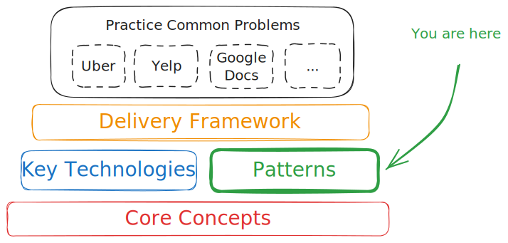

<!-- f2bfa8dc37102f43c9ff745e6dfb9e79 -->
Patterns
========

By taking the [key technologies](/learn/system-design/in-a-hurry/key-technologies) and [core concepts](/learn/system-design/in-a-hurry/core-concepts) we've discussed and combining them, you can build a wide variety of systems. But success in the time-constrained environment of interviewing is all about patterns. If you're able to identify the patterns that are required for a specific design, not only can you fall back to best practices but you'll save a bunch of time trying to reinvent the wheel.

What follows are some common patterns that you can use to build systems. These patterns are not mutually exclusive, and you'll often find yourself combining them to build a system. Further examples can be found in our Problem Guides like [Design Ticketmaster](/learn/system-design/problem-breakdowns/ticketmaster) which walk you through an entire system design interview.

Simple DB-backed CRUD service with caching
------------------------------------------

The most common pattern is a simple CRUD service that uses a database for storage and caching to improve performance. This is the pattern you'll use for most web applications. You'll use a database to store your data, and a cache to improve performance. You'll also use a load balancer to distribute traffic across multiple instances of your service.

Many designs will start with this pattern and then add additional complexity as requirements are added. For example, you might start with a simple CRUD service and then add a search index to improve search performance. Or you might start with a simple CRUD service and then add a queue to handle asynchronous processing.

:::tip

This design is too simple for all but the most junior roles, *but it's a good start*. For all levels, we recommend moving quickly in your interview to solve requirements so you can spend ample time optimizing your design and handling deep dives. So pound it out, and then move on to the next thing.

:::

Async job worker pool
---------------------

If you have a system which needs to handle a lot of processing and can tolerate some delay, you might use an async job worker pool. This pattern is common in systems that need to process a lot of data, like a social network that needs to process a lot of images or videos. You'll use a queue to store jobs, and a pool of workers to process them.

A popular option for the queue is SQS, and for the workers, you might use a pool of EC2 instances or Lambda functions. SQS guarantees at least once delivery of messages and the workers will respond back to the queue with heartbeat messages to indicate that they are still processing the job. If the worker fails to respond with a heartbeat, the job will be retried on another host.

Another option is for your queue to be a log of events coming from something like Kafka. Kafka gives you many of the same guarantees as SQS, but since the requests are written to an append-only log, you can replay the log to reprocess events if something goes wrong.

Two stage architecture
----------------------

A common problem in system design is in "scaling" an algorithm with poor performance characteristics. Consider the problem of trying to find two images that look about the same. There are many available algorithms that can compare two images and give you a score for how similar they are, but these are wholly inappropriate for a system that needs to compare a large number of images -- even thousands will be too slow.

So what can we do? We can use a two-stage architecture. In the first stage, we use a fast algorithm to filter out the vast majority of dissimilar images. In the second stage, we use a slower algorithm to compare the remaining images.

This architecture occurs in recommendation systems (e.g. candidate generators), search engines (e.g. inverted indexes), route planning (e.g. ETA services), and many other systems.

Event-Driven Architecture
-------------------------

Event-Driven Architecture (EDA) is a design pattern centered around events. This architecture is particularly useful in systems where it is crucial to react to changes in real-time. EDA helps in building systems that are highly responsive, scalable, and loosely coupled.

The core components of an EDA are event producers, event routers (or brokers), and event consumers. Event producers generate a stream of events which are sent to an event router. The router, such as Apache Kafka or AWS EventBridge, then dispatches these events to appropriate consumers based on the event type or content. Consumers process the events and take necessary actions, which could range from sending notifications to updating databases or triggering other processes.

:::tip

One of the more important design decisions in event-driven architectures is how to handle failures. Technologies like Kafka keep a durable log of their events with configurable retention which allows processors to pick up where they left off. This can be a double-edged sword! If your system can only process N messages per second, you may quickly find yourself in a situation where you'll take hours or even days to catch back up with the service substantially degraded the entire time. Be careful about where this is used.

:::

An example use of EDA could be in an e-commerce system where an event is emitted every time a new order is placed. This event can trigger multiple downstream processes like order processing, inventory management, and notification systems simultaneously.

This architectural pattern supports flexibility in system interactions and can easily adapt to changes in process or business requirements. Additionally, it can significantly enhance the system’s ability to handle high loads and facilitate complex workflows.

Durable Job Processing
----------------------

Some systems need to manage long-running jobs that can take hours or days to complete. For example, a system that needs to process a large amount of data might need to run a job that takes a long time to complete. If the system crashes, you don't want to lose the progress of the job. You also want to be able to scale the job across multiple machines.

A common pattern is to use a log like Kafka to store the jobs, and then have a pool of workers that can process the jobs. The workers will periodically checkpoint their progress to the log, and if a worker crashes, another worker can pick up the job where the last worker left off. Another option is to use something like [Uber's Cadence](https://github.com/uber/cadence) (more popularly [Temporal](https://www.temporal.io)).

:::warning

Setups like this can be difficult to evolve with time. For example, if you want to change the format of the job, you'll need to handle both the old and new formats for a while.

:::

Proximity-Based Services
------------------------

Several systems like [Design Uber](/learn/system-design/problem-breakdowns/uber) or [Design Gopuff](/learn/system-design/problem-breakdowns/gopuff) will require you to search for entities by location. Geospatial indexes are the key to efficiently querying and retrieving entities based on geographical proximity. These services often rely on extensions to commodity databases like [PostgreSQL with PostGIS extensions](https://postgis.net/) or [Redis' geospatial data type](https://redis.io/docs/latest/develop/data-types/geospatial/), or dedicated solutions like Elasticsearch with geo-queries enabled.

The architecture typically involves dividing the geographical area into manageable regions and indexing entities within these regions. This allows the system to quickly exclude vast areas that don't contain relevant entities, thereby reducing the search space significantly.

:::tip

While geospatial indexes are great, they're only really necessary when you need to index hundreds of thousands or millions of items. If you need to search through a map of 1,000 items, you're better off scanning all of the items than the overhead of a purpose-built index or service.

:::

Note that most systems won't require users to be querying globally. Often, when proximity is involved, it means users are looking for entities *local* to them.

