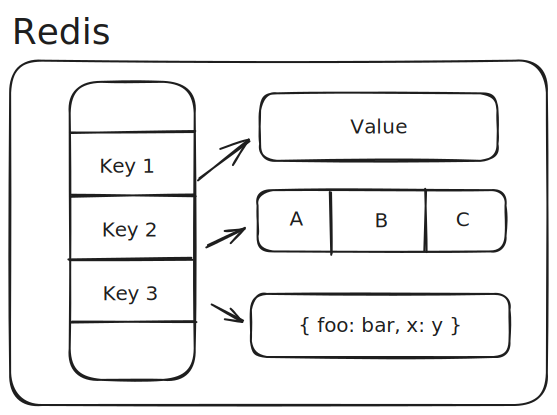
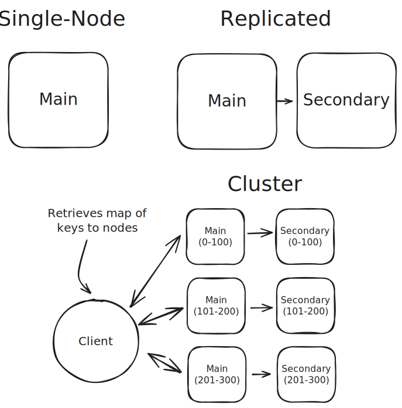
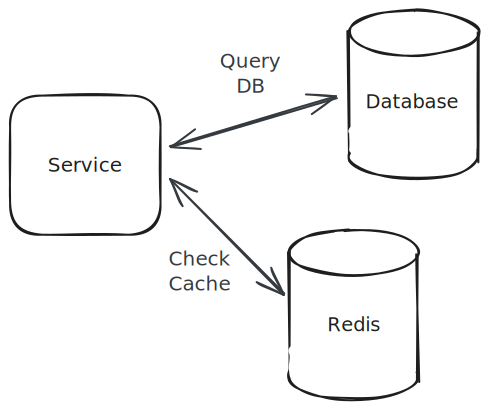
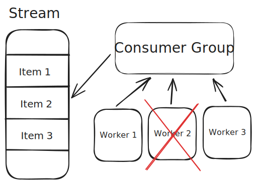
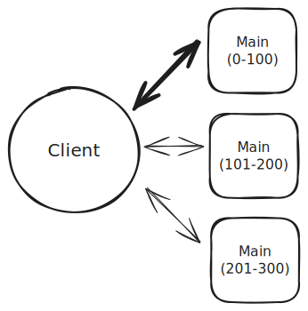

Redis
=====


Intro
-----


System designs can involve a dizzying array of different [technologies](/learn/system-design/in-a-hurry/key-technologies), [concepts](/learn/system-design/in-a-hurry/core-concepts) and [patterns](/learn/system-design/in-a-hurry/patterns), but one technology (arguably) stands above the rest in terms of its *versatility:* Redis. This versatility is important in an interview setting because it allows you to go deep. Instead of learning about dozens of different technologies, you can learn a few useful ones and learn them deeply, which magnifies the chances that you're able to get to the level your interviewer is expecting.


Beyond versatility, Redis is great for its *simplicity*. Redis has a ton of features which resemble data structures you're probably used to from coding (hashes, sets, sorted sets, streams, etc) and which, given a few basics, are easy to reason about how they behave in a distributed system. While many databases involve a lot of magic (optimizers, query planners, etc), with only minor exceptions Redis has remained quite simple and good at what it does best: executing simple operations **fast**.


Ok, Redis is versatile, simple, and useful for system design interviews. Let's learn how it works.


Redis Basics
------------


Redis is a self-described ["data structure store"](https://redis.io/docs/about/) written in C. It's in-memory 🫢 and single threaded 😱 making it very fast and easy to reason about.


:::tip


One important reason you might not want to use Redis is because you need **durability**. While there are some reasonable strategies for (using Redis' Append-Only File [AOF](https://redis.io/docs/management/persistence/)) to *minimize* data loss, you don't get the same guarantees you might get from e.g. a relational database about commits being written to disk. This is an intentional tradeoff made by the Redis team in favor of speed, but alternative implementations (e.g. [AWS' MemoryDB](https://aws.amazon.com/memorydb/)) will compromise a bit on speed to give you disk-based durability. If you need it, it's there!


:::


Some of the most fundamental data structures supported by Redis:


* Strings
* Hashes (Objects)
* Lists
* Sets
* Sorted Sets (Priority Queues)
* Bloom Filters
* Geospatial Indexes
* Time Series


In addition to simple data structures, Redis also supports different communication patterns like Pub/Sub and Streams, partially standing in for more complex setups like Apache Kafka or Amazon's Simple Notification Service.


The core structure underneath Redis is a key-value store. All data structures stored in Redis are stored in keys: whether those be simple like a string or complex like a sorted set of bloom filter.





The choice of keys is important as these keys might be stored in separate nodes based on your [infrastructure configuration](#infrastructure-configurations).


### Commands


Redis' wire protocol is a custom query language comprised of simple strings which are used for all functionality of Redis. The CLI is really simple, you can literally connect to a Redis instance and run these commands from the CLI.


```scdoc
SET foo 1  
GET foo     # Returns 1
INCR foo    # Returns 2
XADD mystream * name Sara surname OConnor # Adds an item to a stream
```


The [full set of commands](https://redis.io/commands/) is surpisingly readable, when grouped by data structure. As an example, Redis' Sets support simple operations like adding an element to the set (`SADD`), getting the number of elements or cardinality (`SCARD`), listing those elements (`SMEMBERS`) and checking existence (`SISMEMBER`) - close analogs to what you would have with a Set in any general purpose programming language.


### Infrastructure Configurations


Redis can run as a single node, with a high availability (HA) replica, or as a cluster. When operating as a cluster, Redis clients cache a set of "hash slots" which map keys to a specific node. This way clients can directly connect to the node which contains the data they are requesting.





Each node maintains some awareness of other nodes via a gossip protocol so, in limited instances, if you request a key from the wrong node you can be redirected to the correct node. But Redis' emphasis is on performance so hitting the correct endpoint first is a priority.


Compared to most databases, Redis clusters are surprisingly basic (and thus, have some pretty severe limitations on what they can do). Rather than solving scalability problems for you, Redis can be thought of as providing you some basic primitives on which you can solve them. As an example, with few exceptions, Redis expects all the data for a given request to be on a single node! **Choosing how to structure your keys is how you scale Redis.**


Performance
-----------


Redis is really, really fast. Redis can handle O(100k) writes per second and read latency is often in the microsecond range. This scale makes some anti-patterns for other database systems actually feasible with Redis. As an example, firing off 100 SQL requests to generate a list of items with a SQL database is a terrible idea, you're better off writing a SQL query which returns all the data you need in one request. On the other hand, the overhead for doing the same with Redis is rather low - while it'd be great to avoid it if you can, it's doable.


This is completely a function of the in-memory nature of Redis. It's not a good fit for every use case, but it's a great fit for many.


Capabilities
------------


### Redis as a Cache


The most common deployment scenario of Redis is as a cache. In this case, the root keys and values of Redis map to the keys and values in our cache. Redis can distribute this hash map trivially across all the nodes of our cluster enabling us to scale without much fuss - if we need more capacity we simply add nodes to the cluster.


When using Redis as a cache, you'll often employ a time to live (TTL) on each key. Redis guarantees you'll never read the value of a key after the TTL has expired and the TTL is used to decide which items to evict from the server - keeping the cache size manageable even in the case where you're trying to cache more items than memory allows.


Using Redis in this fashion doesn't solve one of the more important problems caches face: the ["hot key" problem](#hot-key-issues), though Redis is not unique in this respect vs alternatives like Memcached or other highly scaled databases like DynamoDB.





### Redis as a Distributed Lock


Another common use of Redis in system design settings is as a distributed lock. Occasionally we have data in our system and we need to maintain consistency during updates (e.g. the very common [Design Ticketmaster](/learn/system-design/problem-breakdowns/ticketmaster) system design question), or we need to make sure multiple people aren't performing an action at the same time (e.g. [Design Uber](/learn/system-design/problem-breakdowns/uber)).


:::warning


Most databases (including Redis) will offer *some* consistency guarantees. If your core database can provide consistency, don't rely on a distributed lock which may introduce extra complexity and issues. Your interviewer will likely ask you to think through the edge cases in order to make sure you really understand the concept.


:::


A very simple distributed lock with a timeout might use the atomic increment (`INCR`) with a TTL. When we want to try to acquire the lock, we run `INCR`. If the response is 1 (i.e. we own the lock), we proceed. If the response is > 1 (i.e. someone else has the lock), we wait and retry again later. When we're done with the lock, we can `DEL` the key so that other proceesses can make use of it.


More sophisticated locks in Redis can use the [Redlock algorithm](https://redis.io/docs/manual/patterns/distributed-locks/#the-redlock-algorithm).


### Redis for Leaderboards


Redis' sorted sets maintain ordered data which can be queried in log time which make them appropriate for leaderboard applications. The high write throughput and low read latency make this especially useful for scaled applications where something like a SQL DB will start to struggle.


In [Post Search](/learn/system-design/problem-breakdowns/fb-post-search) we have a need to find the posts which contain a given keyword (e.g. "tiger") which have the most likes (e.g. "Tiger Woods made an appearance..." @ 500 likes).


We can use Redis' sorted sets to maintain a list of the top liked posts for a given keyword. Periodically, we can remove low-ranked posts to save space.


```scdoc
ZADD tiger_posts 500 "SomeId1" # Add the Tiger woods post
ZADD tiger_posts 1 "SomeId2" # Add some tweet about zoo tigers
ZREMRANGEBYRANK tiger_posts 0 -5 # Remove all but the top 5 posts
```


### Redis for Rate Limiting


As a data structure server, implementing a wide variety of rate limiting algorithms is possible. A common algorithm is a fixed-window rate limiter where we guarantee that the number of requests does not exceed `N` over some fixed window of time `W`.


Implementation of this in Redis is simple. When a request comes in, we increment (`INCR`) the key for our rate limiter and check the response. If the response is greater than `N`, we wait. If it's less than N, we can proceed. We call `EXPIRE` on our key so that after time period `W`, the value is reset.


### Redis for Proximity Search


Redis natively supports geospatial indexes with commands like `GEOADD` and `GEORADIUS`. The basic commands are simple:


```text
GEOADD key longitude latitude member # Adds "member" to the index at key "key"
GEORADIUS key longitude latitude radius # Searches the index at key "key" at specified position and radius
```


The search command, in this instance, runs in O(N+log(M)) time where N is the number of elements in the radius and M is the number of members in our index.


### Redis for Event Sourcing


Redis' streams are append-only logs similar to Kafka's topics. The basic idea behind Redis streams is that we want to durably add items to a log and then have a distributed mechanism for consuming items from these logs. Redis solves this problem with streams (managed with commands like `XADD`) and consumer groups (commands like `XREADGROUP` and `XCLAIM`).





A simple example is a work queue. We want to add items to the queue and have them processed. At any point in time one of our workers might fail, and in these instances we'd like to re-process them once the failure is detected. With Redis streams we add items onto the queue with commands like `XADD` and have a single consumer group attached to the stream for our workers. This consumer group is maintaining a reference to the items processed via the stream and, in the case a worker fails, provides a way for a new worker to claim (`XCLAIM`) and restart processing that message.


Shortcomings and Remediations
-----------------------------


### Hot Key Issues


If our load is not evenly distributed across the keys in our Redis cluster, we can run into a problem known as the "hot key" issue. To illustrate it, let's pretend we're using Redis to cache the details of items in our ecommerce store. We have lots of items so we scale our cluster to 100 nodes and our items are evenly spread across them. So far, so good. Now imagine one day we have a surge of interest for *one particular item*, so much that the volume for this item matches the volume for the rest of the items.





Now the load on *one server* is dramatically higher than the rest of the servers. Unless we were severely overprovisioned (i.e. we were only using a small % of the existing CPU on each node), this server is now going to start failing.


There are lots of potential solutions for this, all with tradeoffs.


* We can add an in-memory cache in our clients so they aren't making so many requests to Redis for the same data.
* We can store the same data in multiple keys and randomize the requests so they are spread across the cluster.
* We can add read replica instances and dynamically scale these with load.


For an interview setting, the important thing is that you recognize potential hot key issues (+) and that you proactively design remediations (++).


Summary
-------


Redis is a powerful, versatile, and simple tool you can use in system design interviews. Because Redis' capabilities are based on simple data structures, reasoning through the scaling implications of your decisions is straightforward: allowing you to go deep with your interviewer without needing to know a lot of details about Redis internals.


