Real-time Updates
=================

Intro
-----


In many products, its helpful to get real-time updates from the system as things happen or as data changes. From chat applications where messages need to be delivered immediately to live dashboards that show you what's going on in real-time, users expect to be notified as soon as something happens.


There's two hops we have to be concerned with to make this happen: the connection between the client and the server, and the connection between the server and the data or events.


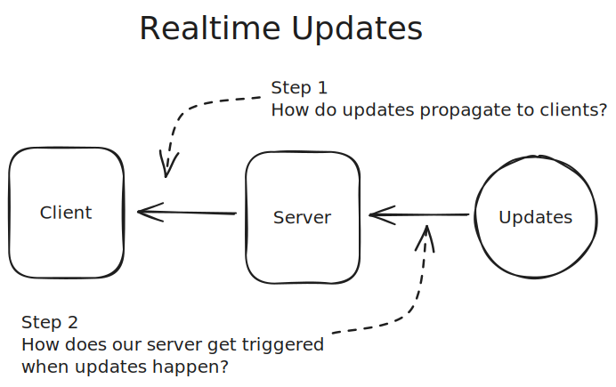


*How* this happens is an important part of system design - facilitating these real-time updates can have significant implications for your overall architecture and is often the source of interesting deep-dive interview questions ([Uber](/learn/system-design/deep-dives/uber), [Live Comments](/learn/system-design/deep-dives/fb-live-comments), [Whatsapp](/learn/system-design/deep-dives/whatsapp), [Google Docs](/learn/system-design/problem-breakdowns/google-docs), etc.). For mid-level engineers, this is frequently a bonus and will help set you apart from other candidates. For staff level engineers, some familiarity is expected.


In this deep dive, we'll cover the different methods for facilitating real-time updates in your system design. We'll start by giving a bit of background about the networking concepts that make real-time updates possible (you can skip this if you're already familiar!). We'll then dive into the first hop, with different protocols for facilitating connections from servers to clients with pros and cons that come up in an interview. Finally, we'll address the second hop: the push/pull issues you'll need to address on the server side.


Let's go!


Networking 101
--------------


Before diving into the different protocols for facilitating real-time updates, it's helpful to understand a bit about how networking works — in some sense the problems we're talking about here are just networking problems! Networks are built on a layered architecture (the so-called ["OSI model"](https://en.wikipedia.org/wiki/OSI_model)) which greatly simplifies the world for us application developers who sit on top of it.


### Networking Layers


In networks, each layer builds on the **abstractions** of the previous one. This way, when you're requesting a webpage, you don't need to know which voltages represent a `1` or a `0` on the network wire - you just need to know how to use the next layer down the stack. While the full networking stack is fascinating, there are three key layers that come up most often in system design interviews:


* **Network Layer (Layer 3):** At this layer is IP, the protocol that handles routing and addressing. It's responsible for breaking the data into packets, handling packet forwarding between networks, and providing best-effort delivery to any destination IP address on the network. However, there are no guarantees: packets can get lost, duplicated, or reordered along the way.
* **Transport Layer (Layer 4):** At this layer, we have TCP and UDP, which provide end-to-end communication services:
  + TCP is a **connection-oriented** protocol: before you can send data, you need to establish a connection with the other side. Once the connection is established, it ensures that the data is delivered correctly and in order. This is a great guarantee to have but it also means that TCP connections take time to establish, resources to maintain, and bandwidth to use.
  + UDP is a **connectionless** protocol: you can send data to any other IP address on the network without any prior setup. It does not ensure that the data is delivered correctly or in order. Spray and pray!
* **Application Layer (Layer 7):** At the final layer are the application protocols like DNS, HTTP, Websockets, WebRTC. These are common protocols that build on top of TCP to provide a layer of abstraction for different types of data typically associated with web applications. We'll get into them in a bit!


These layers work together to enable all our network communications. To see how they interact in practice, let's walk through a concrete example of how a simple web request works.


### Request Lifecycle


When you type a URL into your browser, several layers of networking protocols spring into action. Let's break down how these layers work together to retrieve a simple web page over HTTP. First, we use DNS to convert a human-readable domain name like `hellointerview.com` into an IP address like `32.42.52.62`. Then, a series of carefully orchestrated steps begins:


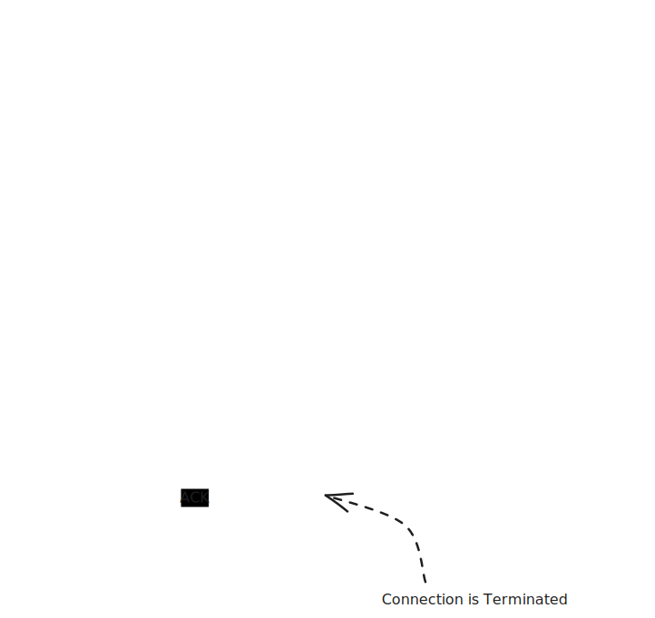


1. **DNS Resolution**: The client starts by resolving the domain name of the website to an IP address using DNS (Domain Name System)[1](#user-content-fn-dns).
2. **TCP Handshake**: The client initiates a TCP connection with the server using a three-way handshake:
   * **SYN**: The client sends a SYN (synchronize) packet to the server to request a connection.
   * **SYN-ACK**: The server responds with a SYN-ACK (synchronize-acknowledge) packet to acknowledge the request.
   * **ACK**: The client sends an ACK (acknowledge) packet to establish the connection.
3. **HTTP Request**: Once the TCP connection is established, the client sends an HTTP GET request to the server to request the web page.
4. **Server Processing**: The server processes the request, retrieves the requested web page, and prepares an HTTP response.
5. **HTTP Response**: The server sends the HTTP response back to the client, which includes the requested web page content.
6. **TCP Teardown**: After the data transfer is complete, the client and server close the TCP connection using a four-way handshake:
   * **FIN**: The client sends a FIN (finish) packet to the server to terminate the connection.
   * **ACK**: The server acknowledges the FIN packet with an ACK.
   * **FIN**: The server sends a FIN packet to the client to terminate its side of the connection.
   * **ACK**: The client acknowledges the server's FIN packet with an ACK.

While the specific details of TCP handshakes might seem technical, two key points are particularly relevant for system design interviews:

1. First, each round trip between client and server adds **latency** to our request, including those to establish connections before we send our application data.
2. Second, the TCP connection itself represents **state** that both the client and server must maintain. Unless we use features like HTTP keep-alive, we need to repeat this connection setup process for every request - a potentially significant overhead.

Understanding when connections are established and how they are managed is crucial to touching on the important choices relevant for realtime updates.

:::info


It's less common recently in BigTech, but it used to be a popular interview question to ask candidates to dive into the details of "what happens when you type (e.g.) `hellointerview.com` into your browser and press enter?".

Details like these aren't typically a part of a system design interview but it's helpful to understand the basics of networking. It may save you some headaches on the job!


:::

### With Load Balancers

In real-world systems, we typically have multiple servers working together behind a load balancer. Load balancers distribute incoming requests across these servers to ensure even load distribution and high availability. There are two main types of load balancers you'll encounter in system design interviews: Layer 4 and Layer 7.

These will have some implications for decisions we'll make later, but let's briefly cover the difference between the two.

#### Layer 4 Load Balancers

Layer 4 load balancers operate at the transport layer (TCP/UDP). They make routing decisions based on network information like IP addresses and ports, without looking at the actual content of the packets. The effect of a L4 load balancer is as-if you randomly selected a backend server and assumed that TCP connections were established directly between the client that server — this mental model is not far off.

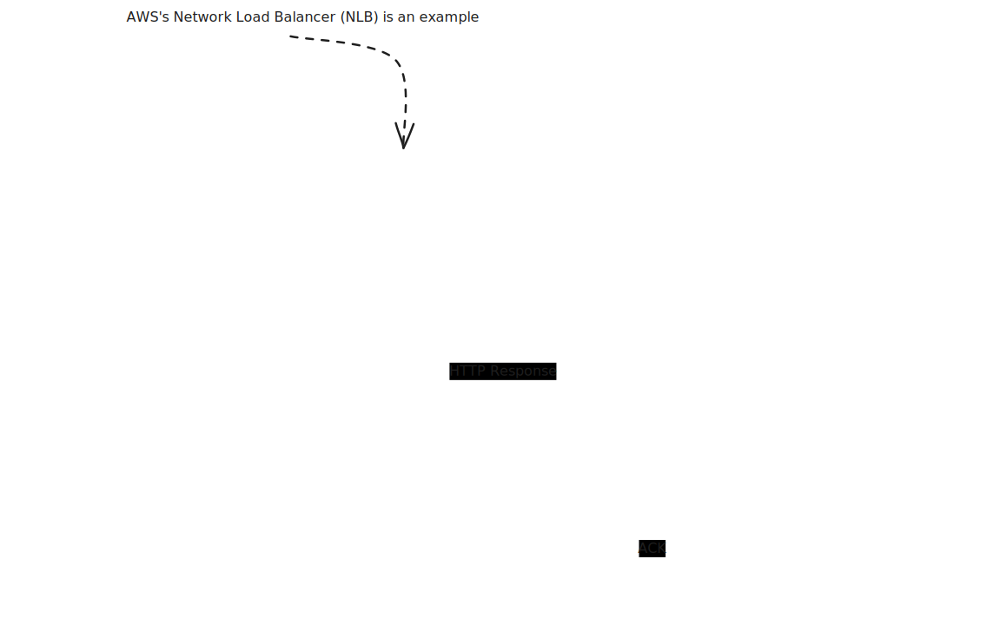

Key characteristics of L4 load balancers:

* Maintain persistent TCP connections between client and server.
* Fast and efficient due to minimal packet inspection.
* Cannot make routing decisions based on application data.
* Typically used when raw performance is the priority.

For example, if a client establishes a TCP connection through an L4 load balancer, that same server will handle all subsequent requests within that TCP session. This makes L4 load balancers particularly well-suited for protocols that require persistent connections, like WebSocket connections. At a conceptual level, *it's as if we have a direct TCP connection between client and server which we can use to communicate at higher layers*.

#### Layer 7 Load Balancers

Layer 7 load balancers operate at the application layer, understanding protocols like HTTP. They can examine the actual content of each request and make more intelligent routing decisions.


Key characteristics of L7 load balancers:

* Terminate incoming connections and create new ones to backend servers.
* Can route based on request content (URL, headers, cookies, etc.).
* More CPU-intensive due to packet inspection.
* Provide more flexibility and features.
* Better suited for HTTP-based traffic.

For example, an L7 load balancer could route all API requests to one set of servers while sending web page requests to another (providing similar functionality to an [API Gateway](/learn/system-design/deep-dives/api-gateway)), or it could ensure that all requests from a specific user go to the same server based on a cookie. The underlying TCP connection that's made to your server via an L7 load balancer is not all that relevant! It's just a way for the load balancer to forward L7 requests, like HTTP, to your server.

While L7 load balancers can help us to not have to worry about lower-level details like TCP connections, we aren't able to ignore the connection-level reality if we want peristent connections to consistent servers.

:::info


The choice between L4 and L7 load balancers often comes up in system design interviews when discussing real-time features. There are some L7 load balancers which explicitly support connection-oriented protocols like WebSockets, but generally speaking L4 load balancers are better for WebSocket connections, while L7 load balancers offer more flexibility for HTTP-based solutions like long polling. We'll get into more detail on this in the next section.


:::

Approaches for Client Updates
-----------------------------

Alright, now that we covered the necessary networking concepts, let's dive into the different approaches for facilitating real-time updates between clients and servers, our first "hop". As a motivating example, let's consider a chat application where users need to receive new messages sent to the chat room they are a part of.

### Simple Polling: The Baseline

The simplest possible approach is to have the client regularly poll the server for updates. This could be done with a simple HTTP request that the client makes at a regular interval. This doesn't technically qualify as real-time, but it's a good starting point and provides a good contrast for our other methods.

:::tip


A lot of interview questions don't *actually* require real-time updates. Think critically about the product and ask yourself whether lower frequency updates (e.g. every 2-5 seconds) would work. If so, you may want to propose a simple, polling-based approach. It's better to suggest a less-than-perfect solution than to fail to implement a complex one.

That said, do make this proposal to your interviewer before pulling the trigger. If they are dead-set on you talking about WebSockets, SSE, or WebRTC, you'll want to know that sooner than later!


:::

How does it work? It's dead simple! The client makes a request to the server at a regular interval and the server responds with the current state of the world. In our chat app, we would just constantly be polling for "what messages have I not received yet?".

```javascript
async function poll() {
  const response = await fetch('/api/updates');
  const data = await response.json();
  processData(data);
}

// Poll every 2 seconds
setInterval(poll, 2000);
```

##### Advantages

* Simple to implement.
* Stateless.
* No special infrastructure needed.
* Works with any standard networking infrastructure.
* Doesn't take much time to explain.

:::tip


This last point is underrated. If the crux of your problem is *not* real-time updates, you'll want to propose a simple, polling-based approach. You'll preserve your mental energy and interview time for the parts of the system that truly matter.


:::

##### Disadvantages

* Higher latency than other methods. Updates might be delayed as long as the polling interval + the time it takes to process the request.
* Limited update frequency.
* More bandwidth usage.
* Can be resource-intensive with many clients, establishing new connections, etc.

##### When to use simple polling

Simple polling is a great baseline and, absent a problem which specifically requires very-low latency, real-time updates, it's a great solution. It's also appropriate when the window where you need updates is short, like in our [Leetcode system design](/learn/system-design/problem-breakdowns/leetcode).

##### Things to Discuss in Your Interview

You'll want to be clear with your interviewer about the trade-offs you're making with polling vs other methods. A good explanation highlights the simplicity of the approach and gives yourself a backdoor if you discover that you need something more sophisticated. "I'm going to start with a simple polling approach so I can focus on X, but we can switch to something more sophisticated if we need to later."

The most common objection from interviewers to polling is either that it's too slow or that it's not efficient. Be prepared to discuss why the polling frequency you've chosen is apropriate and sufficient for the problem. On the efficiency front, it's great to be able to discuss how you can reduce the overhead. One way to do this is to take advantage of HTTP keep-alive connections. Setting an HTTP keep-alive which is longer than the polling interval will mean that, in most cases, you'll only need to establish a TCP connection once which minimizes some of the setup and teardown overhead.

### Long Polling: The Easy Solution

After a baseline for simple polling, long polling is the easiest approach to achieving near real-time updates. It builds on standard HTTP, making it easy to implement and scale.

The idea is also simple: the client makes a request to the server and the server holds the request open until new data is available. It's as if the server is just taking really long to process the request. The server then responds with the data, finalizes the HTTP requests, and the client immediately makes a **new** HTTP request. This repeats until the server has new data to send. If no data has come through in a long while, we might even return an empty response to the client so that they can make another request.

For our chat app, we would keep making a request to get the *next message*. If there was no message to retrieve, the server would just hold the request open until a new message was sent before responding to us. After we received that message, we'd make a new request for the next message.

1. Client makes HTTP request to server
2. Server holds request open until new data is available
3. Server responds with data
4. Client immediately makes new request
5. Process repeats

```javascript
// Client-side of long polling
async function longPoll() {
  while (true) {
    try {
      const response = await fetch('/api/updates');
      const data = await response.json();
      
      // Handle data
      processData(data);
    } catch (error) {
      // Handle error
      console.error(error);
      
      // Add small delay before retrying on error
      await new Promise(resolve => setTimeout(resolve, 1000));
    }
  }
}
```

The simplicity of the approach hides an important trade-off for high-frequency updates. Since the client needs to "call back" to the server after each receipt, the approach can introduce some extra latency:

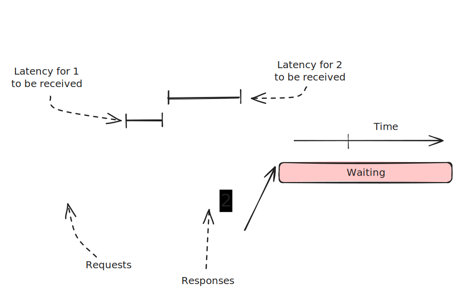

:::


*Assume the latency between the client and server is 100ms.*


:::

:::


*If we have 2 updates which occur within 10ms of each other, with long polling we'll receive the first update 100ms after it occurred (100ms of network latency) but the second update may be up to 290ms after it occurred (90ms for the first response to finish returning, 100ms for the second request to be made, and another 100ms to get the response).*


:::

##### Advantages

* Builds on standard HTTP and works everywhere HTTP works.
* Easy to implement.
* No special infrastructure needed.
* Stateless server-side.

##### Disadvantages

* Higher latency than alternatives.
* More HTTP overhead.
* Can be resource-intensive with many clients.
* Not suitable for frequent updates due to the issues mentioned above.
* Makes monitoring more painful since requests can hang around for a long time.
* Browsers limit the number of concurrent connections per domain, meaning you may only be able to have a few long-polling connections per domain.

##### When to Use Long Polling

Long polling is a great solution for near real-time updates with a simple implementation. It's a good choice when updates are infrequent and a simple solution is preferred. If the latency trade-off of a simple polling solution is at all an issue, long-polling is an obvious upgrade with minimal additional complexity.

Long Polling is a great solution for applications where a long async process is running but you want to know when it finishes, as soon as it finishes - like is often the case in payment processing. We'll long-poll for the payment status before showing the user a success page.

##### Things to Discuss in Your Interview

Because long-polling utilizes the existing HTTP infrastructure, there's not a bunch of extra infrastructure you're going to need to talk through. Even though the polling is "long", you still do need to be specific about the polling frequency. Keep in mind that each hop in your infrastructure needs to be aware of these lengthy requests: you don't want your load balancer hanging up on the client after 30 seconds when your long-polling server is happy to keep the connection open for 60 (15-30s is a pretty common polling interval that minimizes the fuss here).

### Server-Sent Events (SSE): The Efficient One-Way Street

SSE is an extension on long-polling that allows the server to send a stream of data to the client.

Normally HTTP responses have a header like `Content-Length` which tells the client how much data to expect. SSE instead uses a special header `Transfer-Encoding: chunked` which tells the client that the response is a series of chunks - we don't know how many there are or how big they are until we send them. This allows us to move from a single, atomic request/response to a more granular "stream" of data.

With SSE, instead of sending a full response once data becomes available, the server sends a chunk of data and then keeps the request open to send more data as needed. SSE is perfect for scenarios where servers need to push data to clients, but clients don't need to send data back frequently.

In our chat app, we would open up a request to stream messages and then each new message would be sent as a chunk to the client.

##### How SSE Works

1. Client establishes SSE connection
2. Server keeps connection open
3. Server sends messages when data changes or updates happen
4. Client receives updates in real-time

Modern browsers have built-in support for SSE through the `EventSource` object, making the client-side implementation straightforward.

```gdscript
// Client-side
const eventSource = new EventSource('/api/updates');

eventSource.onmessage = (event) => {
  const data = JSON.parse(event.data);
  updateUI(data);
};

// Server-side (Node.js/Express example)
app.get('/api/updates', (req, res) => {
  res.setHeader('Content-Type', 'text/event-stream');
  res.setHeader('Cache-Control', 'no-cache');
  res.setHeader('Connection', 'keep-alive');

  const sendUpdate = (data) => {
    res.write(`data: ${JSON.stringify(data)}\n\n`);
  };

  // Send updates when data changes
  dataSource.on('update', sendUpdate);

  // Clean up on client disconnect
  req.on('close', () => {
    dataSource.off('update', sendUpdate);
  });
});
```

##### Advantages

* Built into browsers.
* Automatic reconnection.
* Works over HTTP.
* More efficient than long polling due to less connection initiation/teardown.
* Simple to implement.

##### Disadvantages

* One-way communication only.
* Limited browser support (not an issue for modern browsers).
* Some proxies and networking equipment don't support streaming. Nasty to debug!
* Browsers limit the number of concurrent connections per domain, meaning you may only be able to have a few SSE connections per domain.
* Makes monitoring more painful since requests can hang around for a long time.

##### When to Use SSE

SSE is a great upgrade to long-polling because it eliminates the issues around high-frequency updates while still building on top of standard HTTP. That said, it comes with lesser overall support because you'll need both browsers and and/all infra between the client and server to support streaming responses.

A very popular use-case for SSE today is AI chat apps which frequently involve the need to stream new tokens (words) to the user as they are generated to keep the UI responsive.

An example of an infra gap is that many proxies and load balancers don't support streaming responses. In these cases, the proxy will try to buffer the response until it completes - which effectively blocks our stream in an annoying, opaque way that is hard to debug! [2](#user-content-fn-sse)

As an aside: most interviewers will not be familiar with the [infrastructure considerations associated with SSE](https://dev.to/miketalbot/server-sent-events-are-still-not-production-ready-after-a-decade-a-lesson-for-me-a-warning-for-you-2gie) and aren't going to ask you detailed questions about them. But if the role you're interviewing for is very frontend-centric be prepared in case they expect you to know your stuff!

##### Things to Discuss in Your Interview

SSE rides on existing HTTP infrastructure, so there's not a lot of extra infrastructure you'll need to talk through. You also don't have a polling interval to negotiate or tune.

Most SSE connections won't be super-long-lived (e.g. 30-60s is pretty typical), so if you need to send messages for a longer period you'll need to talk about how clients re-establish connections and how they deal with the gaps in between. The [SSE standard](https://html.spec.whatwg.org/multipage/server-sent-events.html) includes a "last event ID" which is intended to cover this gap, and the `EventSource` object in browsers explicitly handles this reconnection logic. If a client loses its connection, it can reconnect and provide the last event ID it received. The server can then use that ID to send all the events that occurred while the client was disconnected.

### WebSocket: The Full-Duplex Champion

WebSocket is the go-to choice for true bi-directional communication between client and server. If you have high frequency writes *and* reads, WebSocket is the champ.

##### How WebSocket Works

Websocket builds on HTTP through an "upgrade" protocol, which allows an existing TCP connection to change L7 protocols. This is super convenient because it means you can utilize some of the existing HTTP session information (e.g. cookies, headers, etc.) to your advantage.

:::warning


Just because clients can upgrade from HTTP to WebSocket doesn't mean that the infrastructure will support it. Every piece of infrastructure between the client and server will need to support WebSocket connections.


:::

Once a connection is established, both client and server can send "messages" to each other which are effectively opaque binary blobs. You can shove strings, JSON, Protobufs, or anything else in there. Think of WebSockets like a TCP connection with some niceties that make establishing the connection easier, especially for browsers.

1. Client initiates WebSocket handshake over HTTP
2. Connection upgrades to WebSocket protocol
3. Both client and server can send messages
4. Connection stays open until explicitly closed

For our chat app, we'd connect to a WebSocket endpoint over HTTP, sharing our authentication token via cookies. The connection would get upgraded to a WebSocket connection and then we'd be able to receive messages back to the client over the connection as they happen. Bonus: we'd also be able to send messages to other users in the chat room!

```gdscript
// Client-side
const ws = new WebSocket('ws://api.example.com/socket');

ws.onmessage = (event) => {
  const data = JSON.parse(event.data);
  handleUpdate(data);
};

ws.onclose = () => {
  // Implement reconnection logic
  setTimeout(connectWebSocket, 1000);
};

// Server-side (Node.js/ws example)
const WebSocket = require('ws');
const wss = new WebSocket.Server({ port: 8080 });

wss.on('connection', (ws) => {
  ws.on('message', (message) => {
    // Handle incoming messages
    const data = JSON.parse(message);
    processMessage(data);
  });

  // Send updates to client
  dataSource.on('update', (data) => {
    ws.send(JSON.stringify(data));
  });
});
```

##### Extra Challenges

Because the Websocket is a *persistent connection*, we need our infrastructure to support it. Some L7 load balancers support websockets, but support is generally spotty (remember that L7 load balancers aren't guaranteeing we're using the same TCP connection for each incoming request). L4 load balancers will support websockets natively since the same TCP connection is used for each request.

When we have long-running connections we have another problem: deployments. When servers are redeployed, we either need to sever all old connections and have them reconnect or have the new servers take over and keep the connections alive. Generally speaking you should prefer the former since it's simpler, but it does have some ramifications on how "persistent" you expect the connection to be. You also need to be able to handle situations where a client needs to reconnect and may have missed updates while they were disconnected.

Finally, balancing load across websocket servers can be more complex. If the connections are truly long-running, we have to "stick with" each allocation decision we made. If we have a load balancer that wants to send a new request to a different server, it can't do that if it would break an existing websocket connection.

Because of all the issues associated with *stateful* connections, many architectures will terminate WebSockets into a WebSocket service early in their infrastructure. This service can then handle the connection management and scaling concerns and allows the rest of the system to remain *stateless*. The WebSocket service is also less likely to change meaning it requires less deployments which churn connections.

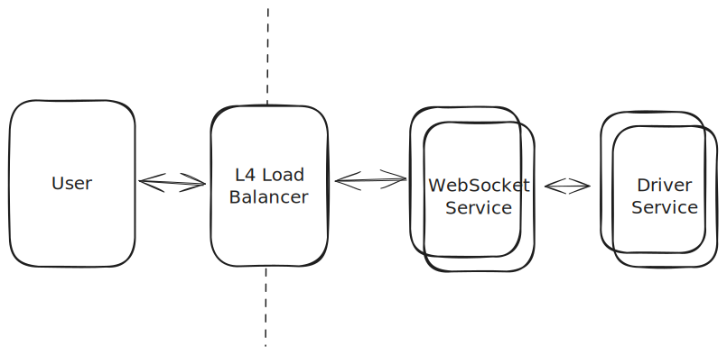

##### Advantages

* Full-duplex (read and write) communication.
* Lower latency than HTTP due to reduced overhead (e.g. no headers).
* Efficient for frequent messages.
* Wide browser support.

##### Disadvantages

* More complex to implement.
* Requires special infrastructure.
* Stateful connections, can make load balancing and scaling more complex.
* Need to handle reconnection.

##### When to Use WebSockets

Generally speaking, if you need **high-frequency**, bi-directional communication, you're going to want to use WebSocket. I'm emphasizing high-frequency here because you can always make additional requests/connections for writes: a very common pattern is to have SSE subscriptions for updates and do writes over simple HTTP POST/PUT whenever they occur.

I often find candidates too eagerly adopting Websockets when they could be using SSE or simple polling instead. Because of the additional complexity and infra lift, you'll want to defer to SSE unless you have a specific need for this bi-directional communication.

##### Things to Discuss in Your Interview

Websockets are a powerful tool, but they do come with a lot of complexity. You'll want to talk through how you'll manage connections and deal with reconnections. You'll also need to consider how your deployment strategy will handle server restarts.

Managing *statefulness* is a big part of the conversation. Senior/staff candidates will frequently talk about how to minimize the spread of state across their architecture.

There's also a lot to discuss about how to scale WebSocket servers. Load can be uneven which can result in hotspots and failures. Using a "least connections" strategy for the load balancer can help, as well as minimizing the amount of work the WebSocket servers need to do as they process messages. Using the reference architecture above and offloading more intensive processing to other services (which can scale independently) can help.

### WebRTC: The Peer-to-Peer Solution

Our last option is the most unique. WebRTC enables direct peer-to-peer communication between browsers, perfect for video/audio calls and some data sharing like document editors.

Clients talk to a central "signaling server" which keeps track of which peers are available together with their connection information. Once a client has the connection information for another peer, they can try to establish a direct connection without going through any intermediary servers.

In practice, most clients don't allow inbound connections for security reasons (the exception would be servers which broadcast their availability on specific ports at specific addresses) using devices like NAT (network address translation). So if we stopped there, most peers wouldn't be able to "speak" to each other.

The WebRTC standard includes two methods to work around these restrictions:

* **STUN**: "Session Traversal Utilities for NAT" is a protocol and a set of techniques like "hole punching" which allows peers to establish publically routable addresses and ports. I won't go into details here, but as hacky as it sounds it's a standard way to deal with NAT traversal and it involves repeatedly creating open ports and sharing them via the signaling server with peers.
* **TURN**: "Traversal Using Relays around NAT" is effectively a relay service, a way to bounce requests through a central server which can then be routed to the appropriate peer.


In practice, the signaling server is relatively lightweight and isn't handling much of the bandwidth as the bulk of the traffic is handled by the peer-to-peer connections. But interestingly the signaling server does effectively act as a real-time update system for its clients (so they can find their peers and update their connection info) so it either needs to utilize WebSockets, SSE, or some other approach detailed above.

For our chat app, we'd connect to our signaling server over a WebSocket connection to find all of our peers (others in the chat room). Once we'd identified them and exchanged connection information, we'd be able to establish direct peer-to-peer connections with them. Chat messages would be broadcast by room participants to all of their peers (or, if you want to be extra fancy, bounced between participants until they settle).

##### How WebRTC Works

Ok, but how does it work?

1. Peers discover each other through signaling server.
2. Exchange connection info (ICE candidates)
3. Establish direct peer connection, using STUN/TURN if needed
4. Stream audio/video or send data directly

Pretty simple, apart from the acronyms and NAT traversal.

```javascript
// Simplified WebRTC setup
async function startCall() {
  const pc = new RTCPeerConnection();
  
  // Get local stream
  const stream = await navigator.mediaDevices.getUserMedia({
    video: true,
    audio: true
  });
  
  // Add tracks to peer connection
  stream.getTracks().forEach(track => {
    pc.addTrack(track, stream);
  });
  
  // Create and send offer
  const offer = await pc.createOffer();
  await pc.setLocalDescription(offer);
  
  // Send offer to signaling server
  signalingServer.send(offer);
}
```

##### When to Use WebRTC

WebRTC is the most complex and heavyweight of the options we've discussed. It's overkill for most real-time update use cases, but it's a great tool for scenarios like video/audio calls, screen sharing, and gaming.

The notable exception is that it can be used to reduce server load. If you have a system where clients need to talk to each other frequently, you could use WebRTC to reduce the load on *your* servers by having clients establish their own connections. [Canva took this approach with presence/pointer sharing in their canvas editor](https://www.canva.dev/blog/engineering/realtime-mouse-pointers/) and it's a popular approach from collaborative document editing like [Google Docs](/learn/system-design/problem-breakdowns/google-docs) when used in conjunction with CRDTs which are better suited for a peer-to-peer architecture.

##### Advantages

* Direct peer communication
* Lower latency
* Reduced server costs
* Native audio/video support

##### Disadvantages

* Complex setup (> WebSockets)
* Requires signaling server
* NAT/firewall issues
* Connection setup delay

##### Things to Discuss in Your Interview

If you're building a WebRTC app in a system design interview, it should be really obvious why you're using it. Either you're trying to do video conferencing or the scale strictly requires you to have clients talk to each other directly.

:::tip


Some interviews will get cute and introduce unrealistic constraints to try to get you to think outside the box, like "the system must run on Raspberry Pi". These *might* be a case where a peer-to-peer architecture makes sense, but tread carefully.


:::

Having some knowledge of the infra requirements (STUN/TURN, signaling servers, etc.) will give you the flexibility to make the best design decision for your system. You'll also want to speak pretty extensively about the communication patterns between peer clients and any eventual synchronization to a central server (almost all design questions will have some calling home to the mothership to store data or report results).

### Client Update Overview

There are a lot of options for delivering events from the server to the client. Being familiar with the trade-offs associated with each will give you the flexibility to make the best design decision for your system. If you're in a hurry, the following flowchart will help you choose the right tool for the job.

* If you're not latency sensitive, **simple polling** is a great baseline. You should probably start here unless you have a specific need in your system.
* If you don't need bi-directional communication, **SSE** is a great choice. It's lightweight and works well for many use cases. There are some infrastructure considerations to keep in mind, but they're less invasive than with WebSocket and generally interviewers are less familiar with them or less critical if you don't address them.
* If you need frequent, bi-directional communication, **WebSocket** is the way to go. It's more complex, but the performance benefits are huge.
* Finally, if you need to do audio/video calls, **WebRTC** is the only way to go. In some instances peer-to-peer collaboration can be enhanced with WebRTC, but you're unlikely to see it in a system design interview.


But now that we have the first hop out of the way, let's talk about how updates propagate from their source to the server in question.

Server-Side Push/pull
---------------------

Now that we've established our options for the hop from server to client (Simple Polling, Long-Polling, SSE, WebSockets, WebRTC), let's talk about how we can propagate updates from the source to the server.

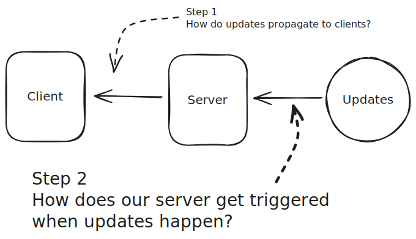

Invariably our system is somehow *producing* updates that we want to propagate to our clients. This could be other users making edits to a shared documents, drivers making location updates, or friends sending messages to a shared chat.

Making sure these updates get to their ultimate destination is closely tied to how we propagate updates from the source to the server. Said differently, we need a **trigger**.

When it comes to triggering, there's three patterns that you'll commonly see:

1. Pulling via Polling
2. Pushing via Consistent Hashes
3. Pushing via Pub/Sub

### Pulling with Simple Polling

With Simple Polling, we're using a **pull-based** model. Our client is constantly asking the server for updates and the server needs to maintain the state necessary to respond to those requests. The most common way to do this is to have a database where we can store the updates (e.g. all of the messages in the chat room), and from this database our clients can pull the updates they need when they can. For our chat app, we'd basically be polling for "what messages have been sent to the room with a timestamp larger than the last message I received?".


Remember with polling we're tolerating delay! We use the poll itself as the trigger, even though the actual update may have occurred some time prior.

The nice thing about this from a system design perspective is that we've *decoupled* the source of the update from the client receiving it. The line that receives the updates is interrupted (by the DB) from the line that produces them - data is not *flowing* from the producer to the consumer. The downside is that we've lost the real-time aspect of our updates.

##### Advantages

* Dead simple to implement.
* State is constrained to our DB.
* No special infrastructure.
* Doesn't take much time to explain.

##### Disadvantages

* High latency.
* Excess DB load when updates are infrequent and polling is frequent.

##### When to Use Pull-Based Polling

Pull-based polling is great when you want your user experience to be somewhat more responsive to changes that happen on the backend, but responding quickly is not the main thing. Generally speaking, if you need real-time updates this is not the best approach, but again there are a lot of use-cases where real-time updates are actually not required!

##### Things to Discuss in Your Interview

When you're using Pull-based Polling, you'll want to talk about how you're storing the updates. If you're using a database, you'll want to discuss how you're querying for the updates and how that might change given your load.

In many instances where this approach might be used, the number of clients can actually be quite large. If you have a million clients polling every 10 seconds, you've got 100k TPS of read volume! This is easy to forget about.

### Pushing via Consistent Hashes

The remaining approaches involve **pushing** updates to the clients. In many of the client update mechanisms that we discussed above (long-polling, SSE, WebSockets) the client has a persistent connection to one server and that server is responsible for sending updates to the client.

But this creates a problem! For our chat application, in order to send a message to `User C`, we need to know which server they are connected to.

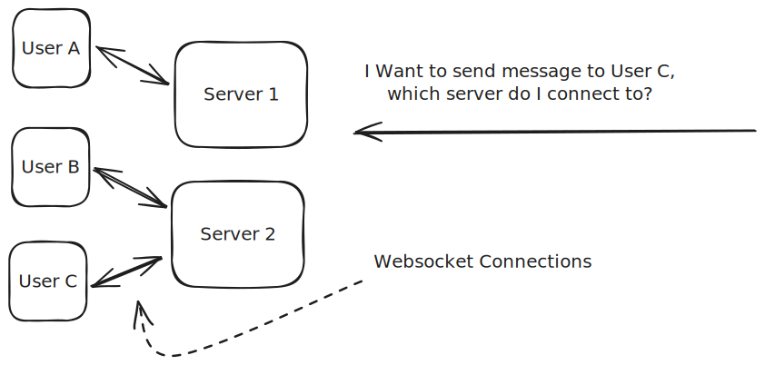

Ideally, when an a message needs to be sent, I would:

1. Figure out which server `User C` is connected to.
2. Send the message to that server.
3. That server will look up which (websocket, SSE, long-polling) request is associated with `User C`.
4. The server will then write the message via the appropriate connection.

There are two common ways to handle this situation, and the first is to use **hashing**. Let's build up our intuition for this in two steps.

##### Simple Hashing

Our first approach might be to use a simple modulo operation to figure out which server is responsible for a given user. Then, we'll always have 1 server who "owns" the connections for that user.

To do this, we'll have a central service that knows how many servers there are `N` and can assign them each a number `0` through `N-1`. This is frequently Apache Zookeeper or Etcd which allows us to manage this metadata and allows the servers to keep in sync as it updates, though in practice there are many alternatives.

We'll make the server number `n` responsible for user `n % N`. When clients initially connect to our service, we can either:
a. Directly connect them to the appropriate server (e.g. by having them know the hash, `N`, and the server addressess associated with each index).
b. Have them randomly connect to any of the servers and have that server redirect them to the appropriate server based on internal data.

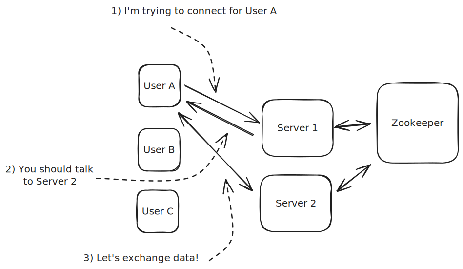

When a client connects, the following happens:

1. The client connects to a random server.
2. The server looks up the client's hash in Zookeeper to figure out which server is responsible for them.
3. The server redirects the client to the appropriate server.
4. The client connects to the correct server.
5. The server adds that client to a map of connections.

Now we're ready to send updates and messages!

When we want to send messages to `User C`, we can simply hash the user's id to figure out which server is responsible for them and send the message there.

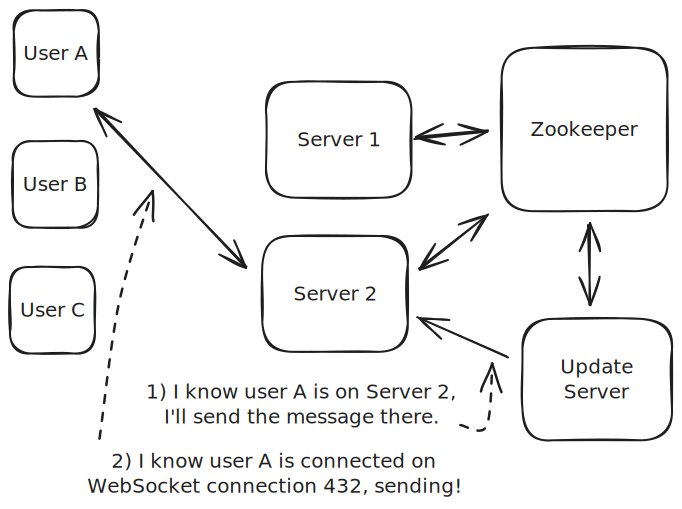

1. Our Update Server stays connected to Zookeeper and knows the addresses of all servers and the modulo `N`.
2. When the Update Server needs to send a message to `User C`, it can hash the user's id to figure out which server is responsible for them (Server 2) and sends the message there.
3. Server 2 receives the message, looks up which connection is associated with `User C`, and sends the message to that connection.

This approach works because we always know that a single server is responsible for a given user (or entity, or ID, or whatever). All inbound connections go to that server and, if we want to use the connection associated with that entity, we know to pass it to that server for forwarding to the end client.

##### Consistent Hashing

The hashing approach works great when `N` is fixed. If we know that we'll always have 4 servers, we can use modulo 4 to figure out which server is responsible for a given user. But what happens when we want to scale our service?

If N goes up from 4 to 5 or down from 4 to 3, almost all of our users need to be moved to a new server! This is a problem. First, we're going to need to disconnect those users from the server they're currently connected to, then have them reconnect to the new server. This disconnect/reconnect is expensive and, in the worst case, happens all at once. Secondly, we need to route update messages to the new, correct server. There may be a transitionary period where we aren't sure whether the updates need to go to Server 1 or Server 2. During that period, we'll likely need to write to both servers to make sure we don't lose any updates.

All this to say that moving connections between servers is expensive and should be minimized if possible!

Consistent Hashing is the solution. Consistent Hashing provides a way to map users to servers in a way that minimizes the number of re-mappings when we scale our service. The simplest way to think of this is that our hash function puts the servers onto a circle or ring.

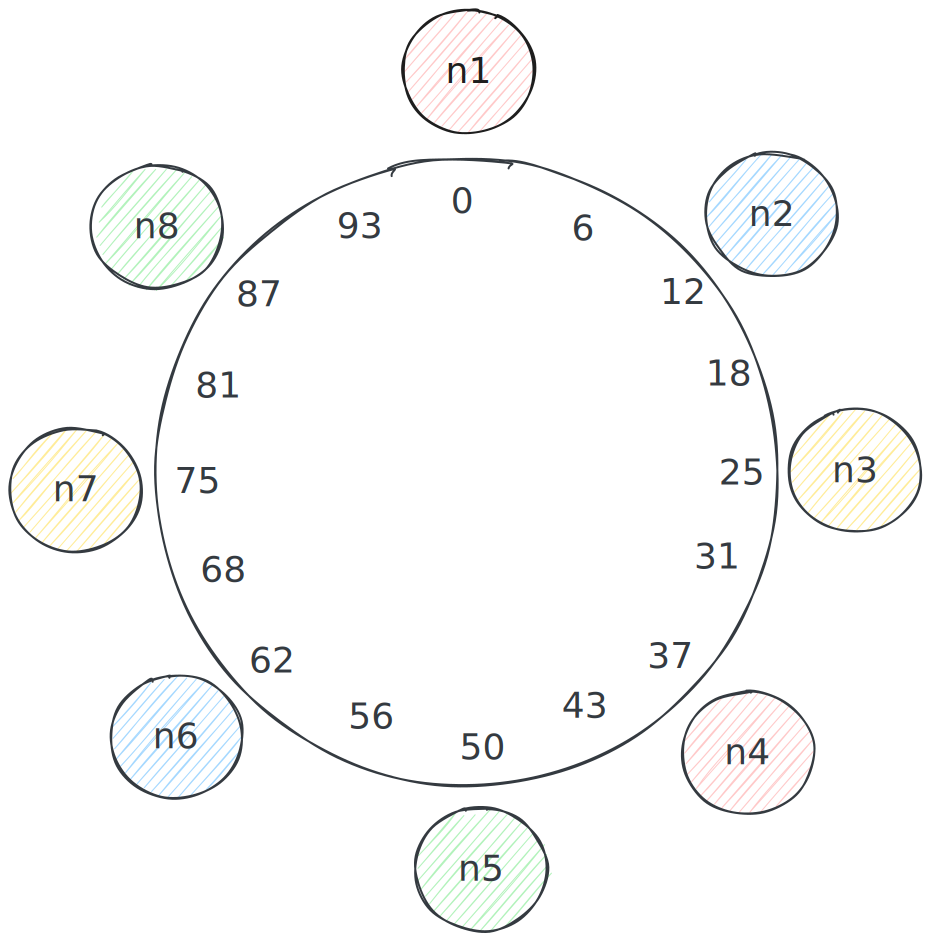

By mapping our servers onto a ring, we can add or remove servers while minimizing the number of re-mappings. When we add a new server, we simply move the server's position clockwise around the ring. When we remove a server, we move the server's position counter-clockwise. This maximizes the number of entities that are mapped to the same server when we're changing the number of servers!

When we remove a server, we're only needed to relocate the entities that are on the "edge" of the ring segment associated with that server.

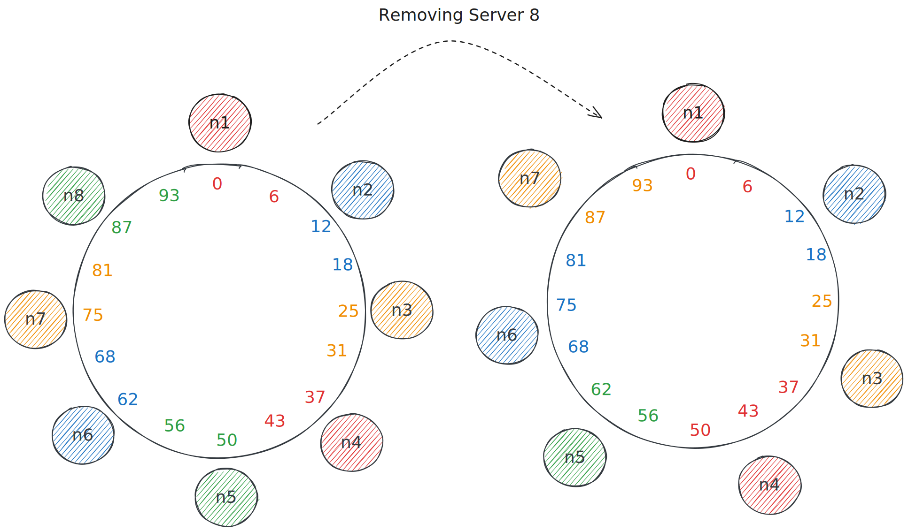

##### Advantages

* Predictable server assignment
* Minimal connection disruption during scaling
* No central coordination needed for routing
* Works well with stateful connections
* Easy to add/remove servers

##### Disadvantages

* Complex to implement correctly
* Requires coordination service (like Zookeeper)
* Can lead to uneven distribution if hash function isn't well-designed
* All servers need to maintain routing information
* Connection state is lost if a server fails

##### When to Use Consistent Hashing

Consistent hashing is ideal when you need to maintain persistent connections (WebSocket/SSE) and your system needs to scale dynamically. Connection state is expensive to transfer and you can tolerate some connection loss during server failures. You also need a coordination service available.

The consistent hashing approach also works particularly well if we need to maintain a lot of state associated with a given connection. As an example, for [the Google Docs design](/learn/system-design/problem-breakdowns/google-docs), our connections are associated with a specific document, and we need to retain a lot of state about that document in order to provide the collaborative editing functionality.

Consistent hashing isn't great for situations where we don't need to maintain a lot of state associated with a given connection. If we're just passing small messages to a large number of clients, we're probably better off using the next approach: Pub/Sub.

##### Things to Discuss in Your Interview

If you introduce a consistent hashing approach in an interview, you'll want to be able to discuss not only how the updates are routed (e.g. a cooordination service like Zookeeper or etcd). Interviewers are usually interested to understand how the system scales: what happens when we need to increase or decrease the number of nodes. For those instances, you'll want to be able to share your knowledge about consistent hashing but also talk about the orchestration logic necessary to make it work. In practice, this usually means:

1. Signaling the beginning of a scaling event. Recording both the old and new server assignments.
2. Slowly disconnecting clients from the old server and having them reconnect to their newly assigned server.
3. Signaling the end of the scaling event and updating the coordination service with the new server assignments.
4. In the interim, having messages which are sent to both the old and new server until they're fully transitioned.

The mechanics of discovering the initial server assignments is also interesting. Having clients know about the internal structure of your system can be problematic, but there are performance tradeoffs associated with redirecting clients to the correct server or requiring them to do a round-trip to a central server to look up the correct one. Especially during scaling events, any central registration service may become a bottleneck so it's important to discuss the tradeoffs with your interviewer.

### Pushing via Pub/Sub

Another approach to triggering updates is to use a **pub/sub** model. In this model, we have a single service that is responsible for collecting updates from the source and then broadcasting them to all interested clients. Popular options here include Kafka and Redis.

The pub/sub service becomes the biggest source of *state* for our realtime updates. Our persistent connections are now made to lightweight servers which simply subscribe to the relevant topics and forward the updates to the appropriate clients. I'll refer to these servers as *endpoint* servers.

When clients connect, we don't need them to connect to a specific endpoint server (like we did with consistent hashing) and instead can connect to any of them. Once connected, the endpoint server will register the client with the pub/sub server so that any updates can be sent to them.

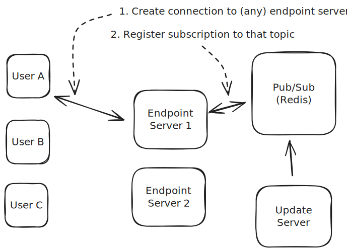

On the connection side, the following happens:

1. The client establishes a connection with an endpoint server.
2. The endpoint server registers the client with the Pub/Sub service, often by creating a topic, subscribing to it, and keeping a mapping from topics to the connections associated with them.

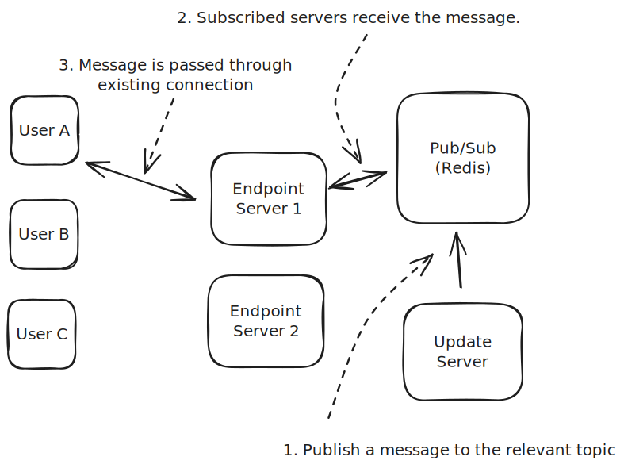

On the update broadcasting side, the following happens:

1. Updates are pushed to the Pub/Sub service to the relevant topic.
2. The Pub/Sub service broadcasts the update to all clients subscribed to that topic.
3. The endpoint server receives the update, looks up which client is subscribed to that topic, and forwards the update to that client over the existing connection.

For our chat application, we'll create a topic for each user. When the client connects to our endpoint, it will subscribe to the topic associated with the connected user. When we need to send messages, we publish them to that user's topic and the Pub/Sub service will broadcast them to all of the subscribed servers - then these servers will forward them to the appropriate clients over the existing connections.

##### Advantages

* Managing load on endpoint servers is easy, we can use a simple load balancer with "least connections" strategy.
* We can broadcast updates to a large number of clients efficiently.
* We minimize the proliferation of state through our system.

##### Disadvantages

* We don't know whether subscribers are connected to the endpoint server, or when they disconnect.
* The Pub/Sub service becomes a single point of failure and bottleneck.
* We introduce an additional layer of indirection which can add to latency.
* There exist many-to-many connections between Pub/Sub service hosts and the endpoint servers.

##### When to Use Pub/Sub

Pub/Sub is a great choice when you need to broadcast updates to a large number of clients. It's easy to set up and requires little overhead on the part of the endpoint servers. The latency impact is minimal (<10ms). If you don't need to respond to connect/disconnect events or maintain a lot of state associated with a given client, this is a great approach.

##### Things to Discuss in Your Interview

If you're using a pub/sub model, you'll probably need to talk about the single point of failure and bottleneck of the pub/sub service. Redis cluster is a popular way to scale pub/sub service which involves sharding the subscriptions by their key across multiple hosts. This scales up the number of subscriptions you can support and the throughput.

Introducing a cluster for the Pub/Sub component means you'll manage the many-to-many connections between the pub/sub service and the endpoint servers (each endpoint server will be connected to all hosts in the cluster). In some cases this can be managed by carefully choosing topics to partition the service, but in many cases the number of nodes in the cluster is small.

For inbound connections to the endpoint servers, you'll probably want to use a load balancer with a "least connections" strategy. This will help ensure that you're distributing the load across the servers in the cluster. Since the connection itself (and the messages sent across it) are effectively the only resource being consumed, load balancing based on connections is a great way to manage the load.

### Overview of Server-Side Push/Pull

As with the client connections, on the server-side we have multiple options for how we can propagate updates to the endpoint servers (and eventually to the clients). If you can use a polling model, it's still the easiest approach! If polling isn't possible, a Pub/Sub model is a great first choice which minimizes the amount of state we need to manage in the system, avoids detailed questions about scaling orchestration, and provides a simple way to broadcast updates to a large number of clients. Pub/Sub will work generally across applications, but consistent hashing is a more specialized approach that you should reserve for specific situations.

You might choose a consistent hashing approach if (a) you are creating deep infra components, or (b) you need to maintain a lot of state associated with a given client. If your connections require a substantial amount of resources to maintain, by coupling the end-user connections to the single server which hosts them.

In short:

1. Prefer polling if possible!
2. If you do need real-time updates, consider Pub/Sub. It applies to most use-cases and is easy to implement.
3. Finally, if your application requires a lot of state/resources for each connection, consistent hashing will provide a more optimal use of resources.

Wrapping Up
-----------

When it comes to real-time updates in System Design interviews, you have a lot of different options! You can break down the problem into two hops:

1. How do clients connect and receive updates from my system?
2. How do I trigger updates from the source and get them to the clients?

The easiest solution is polling. If you can get away with it, use it! Only consider the other options if you have a specific need that requires a more complex solution. Exhaust other interesting aspects of the system first to avoid running out of time discussing peripheral details.

For getting updates to the clients, your options include long-polling, SSE, WebSockets, and WebRTC. The right choice depends on your system's needs. SSE and WebSockets are the most general solution and apply to most use-cases, if you're forced to choose - go with them. Knowing about the pros and cons of each will give you the flexibility to make the best design decision for your system and, more importantly, to help communicate the tradeoffs to your interviewer.

For triggering updates from the source, you can either use Pub/Sub or consistent hashing. Generally speaking, prefer Pub/Sub for ease of implementation, flexibility, and the limited number of moving parts and edge cases that your interviewer might need you to discuss. If you end up with an application where each connection requires a lot of resources and state: consider whether you would be better served with consistent hashing.

Overall real-time update applications bring a lot of interesting complexity to system design: low latency, scaling, networking issues, and the need to manage multiple services and state. By learning about the options available to you, you'll be able to make the best design decision for your system and communicate your reasoning to your interviewer. Good luck!


Footnotes
---------

1. DNS technically can run over TCP or UDP, but we'll exclude that for simplicity in this illustration. [↩](#user-content-fnref-dns)
2. We use SSE extensively for Hello Interview and the amount of time we've spent dealing with networking edge cases is mind boggling. [↩](#user-content-fnref-sse)


