<!-- b95d8c376d011de6223b9c5c68ed684f -->
Data Structures for Big Data
============================

Intro
-----

Some systems need to process absolutely massive amounts of data. These problems disproportionately show up in system design interviews as a way to try to stress test the depth of your knowledge. In these cases, simple scaling and adding more machines may be insufficient — you'll need to lean on specialized data structures to solve the problem.

But most system design interviews don't actually require you to implement data structures on the fly and aren't focused at this low level, so why bother? Well, in many cases utilizing a specialized data structure will actually change the *shape* of the solution and make the surrounding system fundamentally different. Understanding these differences is a super power and can help you design systems that are more efficient, scalable, and performant.

The catch is that these data structures are uncommon for a reason. Employing a bloom filter when a simple hash table would suffice is a red flag for an interviewer. So this is good knowledge to have, but don't forget to keep it simple!

In this deep dive we'll do a few things:

1. We'll build out your arsenal of potential approaches, expanding your view of available data structures.
2. We'll highlight specific scenarios where these data structures are commonly used.
3. Finally, we'll point out some common pitfalls and places where you might get tripped up or tempted to over-engineer.

Let's do it.

:::warning
While occasionally useful for mid-level system design interviews, I would not recommend starting here if you're relatively new to system design. There is much higher ROI in mastering core concepts and key technologies first.

A candidate who nails the implementation of Count-Min Sketch but hasn't internalized things like caching, load balancing, and partitioning is going to struggle to design a performant system architecture. Don't stress out about these details!
:::

Bloom Filter
------------

Our first data structure is probably the most well-known and a great starting point for our discussion. A bloom filter is a probabilistic data structure which is analogous to a set (refresher: sets allow you to insert elements and check their membership).

The most common implementation of a set uses a hash table. With a hash table we can insert elements in `O(1)` time and check membership in `O(1)` time. Very fast! Unfortunately, we need to have memory for each possible element in a hash table, which is infeasible for very large sets. Imagine we had trillions of items and we wanted to keep track of all their ids.

Bloom filters help us here by making a compromise. They are dramatically more memory efficient than hash tables but relax the guarantees of a set. Bloom filters can tell you:

* Whether an element is likely in a set, with some configurable probability
* When an element is definitely **not** in a set

This sounds a bit unusual, so let's take a step back to build up some intuition before explaining how it works.

### Intuition

Pretend we have a village with 1,000 people each with a very simple but unique stamp they use to mark documents. We want to keep track of who attended a meeting but we only have a single pad of paper and no pens, only stamps!

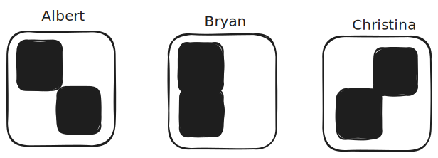

Because we're so nice, we want to send treats as a thank you to those who attended the meeting. But while we're generous and ok if we send a few treats to people who didn't actually attend, but we want to minimize the treats we waste on the absentees (boo them). To solve this problem we're going to have all of our villagers stamp a single piece of paper for the meeting with their stamps.

To figure out who *definitely* didn't attend the meeting, our approach is pretty simple: we can look at the shape of each villager's stamp and see if ink covers all of the grooves of their stamp. If it is, they might have attended. If it's not, there's no way they could have stamped the paper - no treats for them!

Here's an example of what the pad may have looked like after the meeting:

Let's analyze it. In this case:

* Albert's circle and plus lines are present, so he probably attended
* Bryan's circle and diagonal line are present, so he probably attended
* Christina's vertical line is present but her square **is not**, so she definitely did not attend

For Albert and Bryan, it's likely they attended the meeting, so we'll send them treats. We can conclude that Christina definitely did not attend the meeting because the upper-right square is not present, so we don't need to send her treats.

Cool! Instead of needing 1000 pads of paper for the villagers to stamp, we only needed 1 and we were able to prove that Christina didn't attend the meeting. This is the essence of a bloom filter!

Now to test this analogy a bit more, let's consider what happens if the paper looked like this:

In this case we can't say anything with certainty about Christina! It's possible she attended, but it's also possible that 1 person with a lower-left square and 1 person with an upper-right square stamped the paper. Or someone with a completely solid stamp attended. We don't know.

In this case we have to send treats to everyone and we fail to save any treats - our approach fails.

We see a few things here:

1. By using overlapping stamps we can make some statements about the membership of the set (i.e. the people who failed to attend the meeting).
2. While we can sometimes prove that an element is *not* in the set, we can never prove it *is* in the set. There's always a chance stamps from others overlap with the one we're testing.
3. We want our "stamps" to be both unique and limited. A stamp which is a solid square breaks our approach!

### How it Works

This is the basic idea behind a bloom filter! Instead of stamps, we can use hash functions.

For each element we insert, we'll hash its value `k` times, using `k` different hash functions.

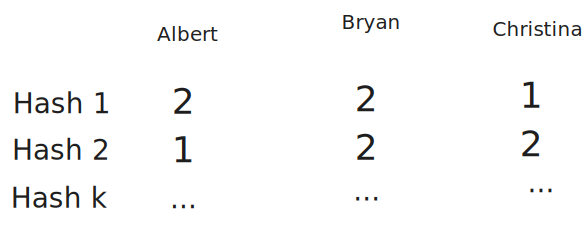

If we set the bit to 1 at each of these positions, we get a [bitmask](https://en.wikipedia.org/wiki/Mask_(computing)). And it kind of looks like our stamps!

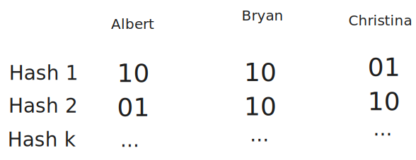

By only setting a single bit for each bit vector, we avoid the "solid stamp" problem above, and by having many hash functions we maximize the uniqueness of each member and minimize the chance of overlap.

Now we can "stamp" our bloom filter with the bitmask by using a bitwise `OR` operation (or basically setting the bits to 1).

Our bloom filter starts empty, like this:

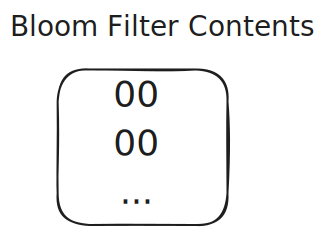

Then when Albert is added, we take the bits from his hashes and set the bits in our bloom filter:

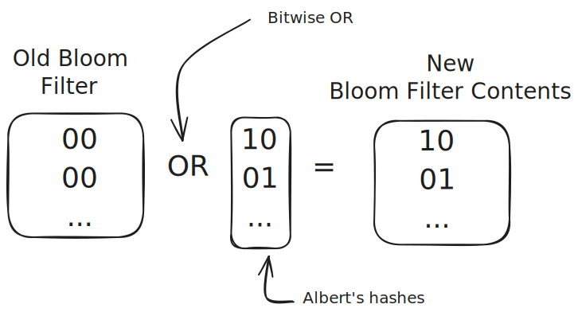

And finally when Bryan is added, we take the bits from his hashes and set the bits in our bloom filter:

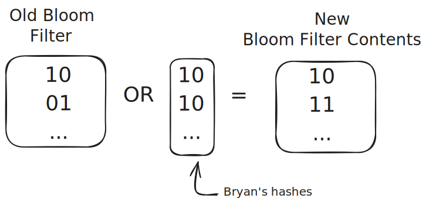

To check if an element is in the set, we again hash it `k` times and check if all the bits are set. If any of them are not, we know for certain the element is not in the set. If all of them are set, we say the element is in the set with a certain probability.

Since the first bit of the Hash 1 and the second bit of the Hash 2 are set, we know that Albert *might* be in the set. Since the second bit of Hash 1 is not set, we know that Christina is *definitely not* in the set.

As more bits are set, our bloom filter becomes less useful and less certain. If we set every single bit, we can't make any statements about the presence of any elements - just like the saturated stamp pad.

In practice, a bloom filter needs to be sized correctly by carefully choosing `m` and `k` above. We can always add more bits, but doing so increases the size of the bloom filter — and saving space is the entire reason we're using it in the first place!The math for choosing `m` and `k` is pretty simple, but I'll spare you the details. You can read more on [the Wikipedia page](https://en.wikipedia.org/wiki/Bloom_filter#Probability_of_false_positives).

:::tip
One important thing to realize is that the required size of a bloom filter is probably larger than you'd think. If we want to store 1B 4-byte elements with a 1% false positive rate (that being: the bloom filter tells us an element is present when it isn't), we need a bloom filter which is approximately 1GB in size! For a well-optimized hash table, we'd likely need around 5GB. This is a large savings (80%) but you shouldn't expect that your Bloom filter is going to be several orders of magnitude smaller than a hash table. It's not a small data structure!
:::

### Use-Cases and Pitfalls

The use-cases for a bloom filter meet three conditions:

1. You need to be querying for membership in a set.
2. You need to be space constrained (otherwise just use a hash table!).
3. You need to be able to tolerate a false positive rate.

In practice, while (1) is common, (2) is rarer for many systems as a hard constraint, and (3) is difficult to design around. The most common use-cases in an interview setting we see overlap with caching.

Another thing to note is that standard bloom filters do **not** support removing elements. The "stamp" is permanent! As a result, they're not great for sets where items are updated or removed commonly.
#### Web Crawling

With [web crawling](/learn/system-design/problem-breakdowns/web-crawler), we're traversing a gigantic graph of web pages. Since our goal is coverage, we need to make sure we're not duplicating work and re-crawling pages in a cycle or loop. To do this, we need to keep track of all the pages we've already seen.

URLs can be large and the set of all crawled URLs can be massive, so storing all of the visited URLs in a hash table can be cumbersome. Additionally, re-crawling a page is a waste of time but not a disaster, we can tolerate some false positives. This is a great use-case for a bloom filter.

Instead of keeping a hash table of all the visited URLs, we can have a centralized bloom filter. This will allow us to make a statement like "we've definitely not seen this URL before" without having to store the full URL itself.
#### Cache Optimizations

With most caches, we're storing the result of an expensive calculation in a cache, using a distributed cache like Redis or Memcached. A common pattern is to first check the cache to see if it has the result we're looking for and, if it doesn't, we can fire off the expensive calculation, store the result in the cache, and then return it to the user.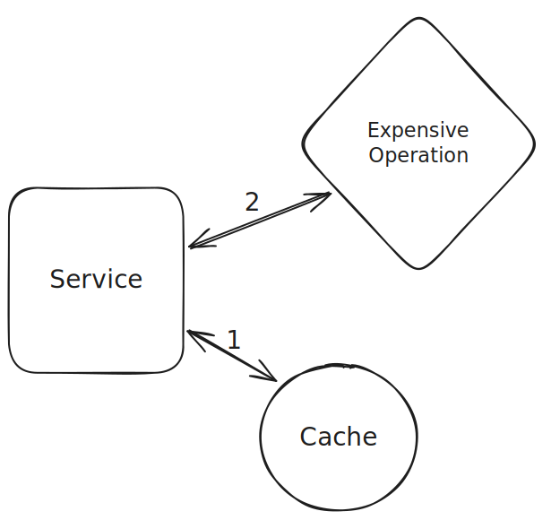Most caches are very fast (single digit millisecond latency), but even so we're adding a small amount of time to *all* requests to check the cache. This dramatically speeds up cache hits and saves our expensive operation from being run needlessly, but adds even more latency to cache misses. If the time to hit the cache is `C` milliseconds, and the time for the expensive operation is `E` milliseconds, cache misses take `C+E` milliseconds.

Can we improve this? Behold our trusty bloom filter. When we get a request we can check our bloom filter. If the item is definitely not in the cache, we can skip straight to running our expensive operation directly. If it's possible it's in the cache, we fall back to the previous behavior of checking the cache first.

:::warning
Two things should be noted here. First: most caches support an eviction policy like a Time to Live (TTL). Our bloom filter explicitly does not support removal of items so will become less accurate over time.

Secondly: most caches have multiple clients/writers. If we're using a bloom filter to shortcut cache checks, we may be missing out on potential cache hits where other clients have already written the result to the cache.

Tradeoffs!
:::

Count-Min Sketch
----------------

Bloom filters tell us about whether an item exists in a set of items, but many more use-cases require more than just presence or absence. We want counts!Enter count-min sketch. This funny sounding data structure is a natural extension of bloom filters which allows us to estimate the number of times an item has appeared in a stream of data — or, more accurately, allows us to put an upper bound on the number of times and item has appeared in a stream of data.
### Intuition

With a bloom filter we used a hash function to create a unique signature for an item. Then we flipped all the bits to 1 which were set in that signature. This allowed us to see whether a given signature had been seen before. What if instead of setting a bit to 1, we *incremented* a counter.

Let's play this out with our meeting example as before. Instead of trying to figure out who had come to the meeting, we want to figure out how many times a given person has attended multiple meetings.

To do this we'll dig some numbered holes. Each villager will be assigned a set of holes and, when they attend a meeting, will drop 1 marble in each. Let's pretend these are the hole assignments.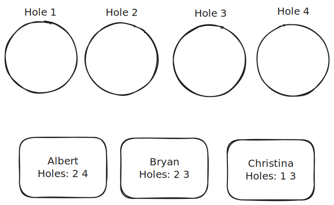Let's work this through for a few attendances to get the picture.

After Albert attends his first meeting, he drops 1 marble into holes 2 and 4.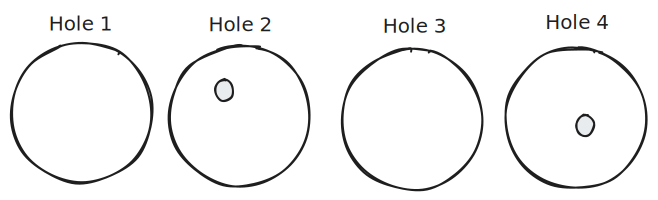After Albert attends his second meeting, he does the same thing.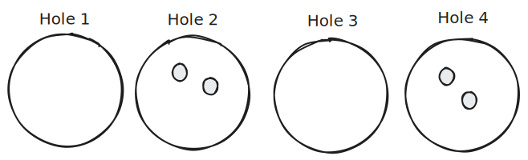After Bryan attends his first meeting, he drops marbles into holes 2 and 3.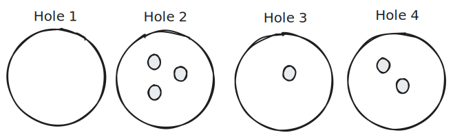Now, let's try to figure out how many meetings Albert, Bryan, and Christina have attended. To do this, we can look at the *minimum* of the number of marbles in each hole assigned to a given user.

* Albert was assigned holes 2 and 4 where the marble counts are 3 and 2 respectively. We can interpret this to mean that Albert must have attended no more than 2 meetings. If he had attended more, hole 4 would have had more marbles!
* Bryan was assigned holes 2 and 3 where the counts are 3 and 1 respectively. This means Bryan must have attended no more than 1 meeting. If he had attended more, hole 3 would have had more marbles!
* Lastly Christina was assigned holes 1 and 3 where the counts were 0 and 1 respectively. We know for certain Christina did not attend any meetings, as her attendance has to be <= 0.

I hope that's clear. By taking the minimum of the counts associated with the positions assigned to each user, we can put an upper bound on the number of times that user has been incremented in our count-min sketch.

Now, just to finish off this intuition, let's imagine we only had 1 hole for all of our people. Albert drops 2 marbles into the hole and Bryan drops 1. The best we can say in this instance is that all of Albert, Bryan, and Christina attended <= 3 meetings — that doesn't tell us much!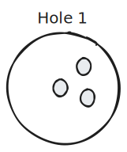Similarly assume we had N holes for N users. In this case we can actually just count the attendance for each. If Albert has his own hole, Bryan has his own, and Christina has her own - we know the exact number. But we used as much space as just counting for each user, which is useless!Count-min sketch allows us to make statements where the number of counts is significantly less than the number of unique IDs we want to count. It helps us to save space!
### How It Works

In Count-Min Sketch, the "sketch" is the holes and "count-min" is the way that we can arrive at an upper bound on the number of times an item has been counted. Instead of holes, we'll use a 2d array of counters. And instead of keeping a list of assignments, we'll use an array of hash functions.

Let's use the same hashes as before for our villagers:Now, after Albert has attended 2 meetings and Bryan has attended 1 our sketch looks like this: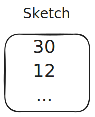The math works pretty much the same way. To find an upper bound on the number of times Albert has been incremented in the sketch, we grab the values of every counter where Albert has a positive bit in the hash. In this case, we see 3 and 2. We then take the minimum of these two numbers to establish our upper bound!Just like with a bloom filter, the number of hashes we use and the width of those hashes control the space-accuracy tradeoff.

* Width w: Controls collision probability. More width = fewer collisions = better accuracy
* Depth d: Controls confidence in the estimate. More depth = higher confidence

The error in the count-min sketch has mathematically-defined bounds which are a function of the width and depth.

The key tradeoff is that we get approximate counts using bounded space, versus exact counts that would require space proportional to the number of unique items.
### Use-Cases and Pitfalls

Count-min sketch can work great when you have a huge volume of data and not enough storage to count every item. It's a great way to get a quick and dirty count of your data. Three properties need to be in place for it to be a good fit:

1. You need to be querying for counts.
2. We need to have *known* items — our sketch does not tell us which items are present after we hash them.
3. You need to be space constrained (otherwise just use a hash table!).
4. You need to be able to tolerate an approximation (specifically, an upper-bound).

In your interview, don't forget that count-min sketch still requires a non-trivial amount of memory even though we're saving some!If you encounter a problem where you need to count a very large number of items, there's a good chance you can use count-min sketch to help. But the caveat is that you'll likely need to bend your requirements to make it work! Let's talk about a couple examples.
#### Top K

One example of this is if we want to keep a sorted list of the top K YouTube videos. Since there are billions of YouTube videos and billions of daily views, this can involve a ton of data.

To get to a strong approximate solution, we can use count-min sketch.

1. We'll set up a sorted list of the top K videos.
2. When each view comes in for a `videoId`, we can increment that count in our count-min sketch.
3. After incrementing, we can check the count for this video ID. If this video is present in our sorted list (or larger than the smallest video in our sorted list), we can add/update it to our sorted list.

This approach gives us a good approximation of the top K videos and requires a significantly smaller amount of space than a full hash table!
#### Caching

Another use-case is in caching. Caches often want to know which items are most popular. The "Least Frequently Used" (LFU) cache eviction policy is common for removing items from the cache that aren't being used frequently (and thus unlikely to be used soon).

If we want to keep track of the most popular items in our cache, we can use a count-min sketch to count the number of hits each item gets. When our counts update, we can update a sorted list or heap to keep track of the most popular items. Items not on this list are candidates for eviction.

:::warning
One common pitfall for count-min sketch is when other parts of the system depend on the counts. Saving some bytes may not be as important when all parts of the system benefit from precision.

In Redis' instance, they don't use count-min sketch! They actually keep a pseudo-counter in 16 bits alongside each key that incorporates both recency information and frequency information. This makes it easier to implement both LRU and LFU eviction policies!
:::

HyperLogLog
-----------

Where count-min sketch is great for counting raw values, frequently we want to know the number of unique items in a dataset. For example, knowing how many users visited a page is one of the most common use-cases for product analytics.

HyperLogLog (HLL) is a probabilistic data structure designed to solve this problem: counting unique elements in a dataset (known as cardinality estimation). While this might sound simple, traditional approaches like using a HashSet become impractical when dealing with billions of items, as the memory requirements grow linearly with the number of unique elements.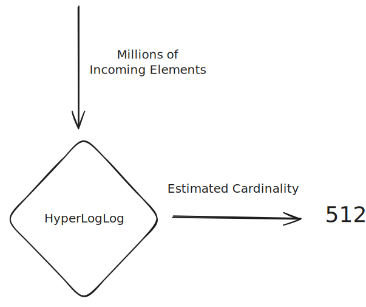
### Intuition

Let's develop an intuition for how HyperLogLog works through a thought experiment. Imagine you're flipping coins and counting how many flips it takes to get heads. If you do this many times, you'll notice something interesting about the longest streak of tails you encounter.

If you've only flipped the coin 4 times:

* Getting 1 tail before heads is common
* Getting 2 tails is less common
* Getting 3 tails would be quite rare (12.5% chance)

But if you've flipped it 1000 times:

* Seeing a streak of 8 or 9 tails becomes quite likely
* The longest streak you've seen gives us a rough idea of how many flips you've done

This is the key insight behind HyperLogLog. When we look at the binary representation of numbers:

* A number starting with 1 occurs 50% of the time
* Starting with 01 occurs 25% of the time
* Starting with 001 occurs 12.5% of the time
* And so on...

By looking at the longest streak of zeros in a set of hashed values, we can estimate how many unique values we've seen!
### How it Works

The actual implementation is more sophisticated than just counting zeros. Because we don't want our estimates to get thrown off by a single accidentally rare hash, we're going to build some redundancy into our estimates by using multiple buckets.

Each incoming element is hashed to get a uniform binary string. The first `b` bits of the hash are used as a bucket index, and the remaining bits are used for the counting process. Using 2^b buckets helps improve (reduce variance) our estimates.

For each bucket, we maintain a register that stores the maximum number of leading zeros (plus one) seen in that bucket. We're basically partitioning the space of possible hashes.

When a new element arrives, we only update if we see more leading zeros than what's currently stored in the register.

The resulting estimate is the harmonic mean of the registers, with some corrections for large and small ranges where it's easier to know the true values.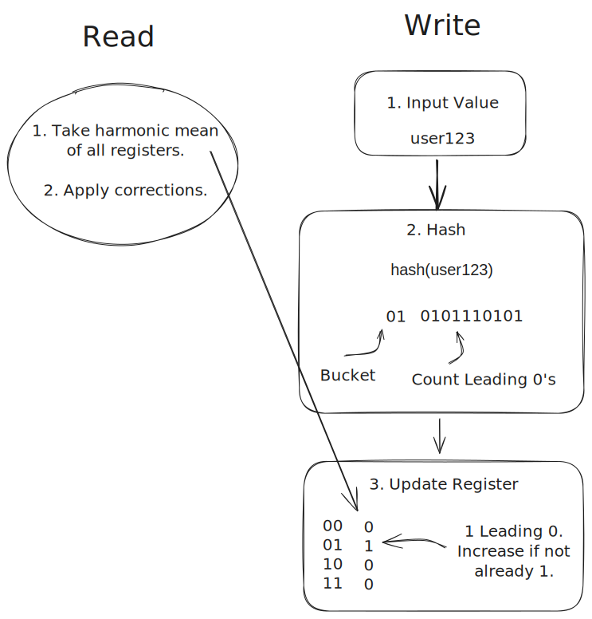:::tip
The accuracy vs. memory tradeoff in HyperLogLog is remarkably efficient:

* 1.5KB of memory → ~2% error for billions of items
* 3KB of memory → ~1.6% error
* 6KB of memory → ~1.2% error
  The error rate scales with 1/√m where m is the number of registers.

:::

### Use-Cases and Pitfalls

HyperLogLog is perfect when you need to:

1. Count unique items in a very large dataset
2. Have limited memory available
3. Can tolerate small estimation errors

There are dozens of implementations, but both Redis and PostgresSQL support HyperLogLog out of the box.

The main pitfalls to watch for:

1. Don't use HLL if you require exact counts — it won't provide that answer.
2. If you expect a small number of unique items, HLL will add overhead with no benefit. Use a hash set!

#### Analytics and Metrics Systems

Modern analytics systems frequently use HyperLogLog for metrics like:

* Daily/Monthly Active Users (DAU/MAU)
* Unique visitors per page
* Distinct search terms
* Unique IP addresses

By using HyperLogLog we can get a great approximation of these values without requiring a lot of memory. Either (a) we can keep pre-calculations which are updated in a streaming fashion as new data arrives, or (b) we can scan the data and use HyperLogLog to efficiently estimate the cardinality.
#### Security

A powerful signal to many security systems is the *entropy* of the inputs. As one example, consider an anti-scraping system. We need to find IP addresses which are scraping our site and stealing user data. We could clearly look at the IP addresses which are making the most requests and block them, but what if those are just large corporate proxies with many users? We could have a lot of collateral damage!HyperLogLog might provide some better signals here. If we expect real users to re-visit some popular pages on the site but scrapers to only focus on net-new pages, we can look at the number of distinct URLs by IP address to find them.

HyperLogLog can help us to estimate the proportion of requests which are being made to unique URLs without requiring a gigantic hash table of all the URLs this IP has visited.
#### Cache Sizing and Analysis

When designing caching systems, understanding your working set size is crucial:

* How many unique keys are accessed?
* What's the turnover rate of unique items?
* Should we partition the cache?

HLL helps answer these questions without excessive memory overhead.

Conclusion
----------

If you need to count items, check membership, or estimate cardinality and can tolerate some error, these data structures will dramatically increase the scalability of your design. Knowing when to use them (and when not!) is a great way to show off depth in system design interviews.

