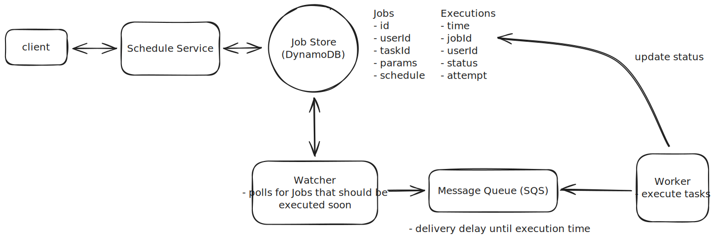
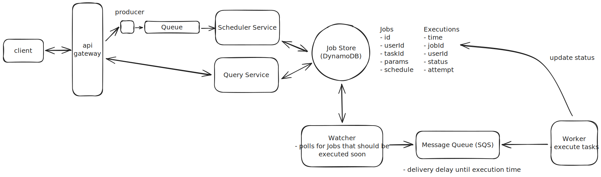
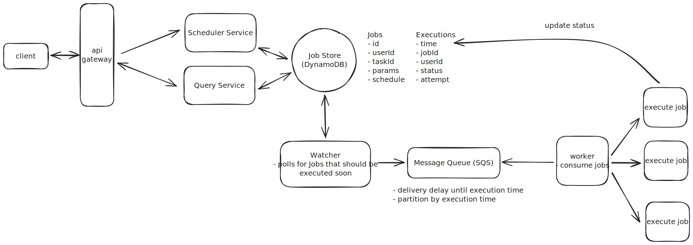
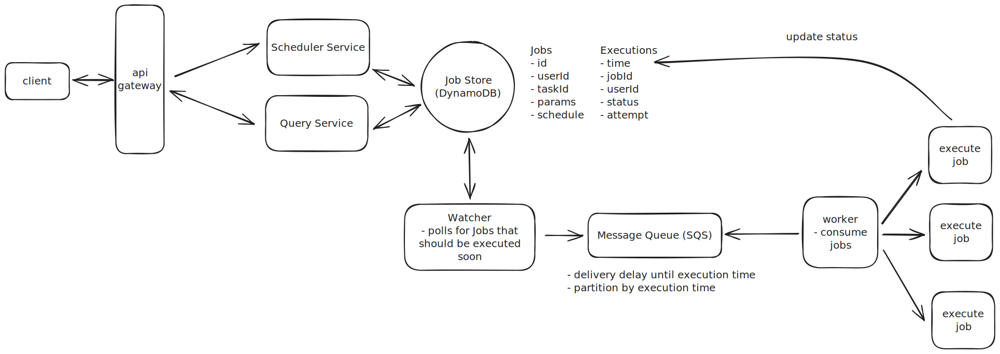
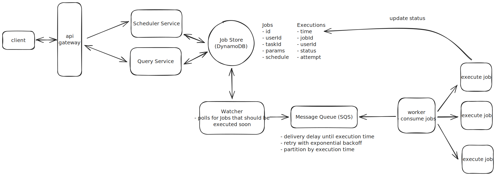

Design a Distributed Job Scheduler
==================================

```
Author: Evan King
Level : MEDIUM
```


Understanding the Problem
-------------------------


:::problem


**⏰ What is a Job Scheduler**
A job scheduler is a program that automatically schedules and executes jobs at specified times or intervals. It is used to automate repetitive tasks, run scheduled maintenance, or execute batch processes.


:::


There are two key terms worth defining before we jump into solving the problem:


* **Task**: A task is the abstract concept of work to be done. For example, "send an email". Tasks are reusable and can be executed multiple times by different jobs.
* **Job**: A job is an instance of a task. It is made up of the task to be executed, the schedule for when the task should be executed, and parameters needed to execute the task. For example, if the task is "send an email" then a job could be "send an email to [john@example.com](mailto:john@example.com) at 10:00 AM Friday".


The main responsibility of a job scheduler is to take a set of jobs and execute them according to the schedule.


### [Functional Requirements](https://www.hellointerview.com/learn/system-design/in-a-hurry/delivery#1-functional-requirements-1)


**Core Requirements**


1. Users should be able to schedule jobs to be executed immediately, at a future date, or on a recurring schedule (ie. "every day at 10:00 AM").
2. Users should be able monitor the status of their jobs.


**Below the line (out of scope)**


* Users should be able to cancel or reschedule jobs.


### [Non-Functional Requirements](https://www.hellointerview.com/learn/system-design/in-a-hurry/delivery#2-non-functional-requirements-1)


Now is a good time to ask about the scale of the system in your interview. If I were your interviewer, I would explain that the system should be able to execute 10k jobs per second.


**Core Requirements**

1. The system should be highly available (availability > consistency).
2. The system should execute jobs within 2s of their scheduled time.
3. The system should be scalable to support up to 10k jobs per second.
4. The system should ensure [at-least-once](https://blog.bytebytego.com/i/51197752/At-Least-Once) execution of jobs.

**Below the line (out of scope)**

* The system should enforce security policies.
* The system should have a CI/CD pipeline.

On the whiteboard, this might look like:


The Set Up
----------

### Planning the Approach

For this question, which is less of a user-facing product and more focused on data processing, we're going to follow the delivery framework outlined [here](https://www.hellointerview.com/learn/system-design/in-a-hurry/delivery), focusing on the core entities, then the API, and then the data flow before diving into the high-level design and ending with deep dives.

### [Defining the Core Entities](https://www.hellointerview.com/learn/system-design/in-a-hurry/delivery#core-entities-2-minutes)

We recommend that you start with a broad overview of the primary entities, even for questions more focused on infrastructure, like this one. It is not necessary to know every specific column or detail yet. We will focus on the intricacies, such as columns and fields, later when we have a clearer grasp of the system.

:::tip


Just make sure that you let your interviewer know your plan so you're on the same page. I'll often explain that I'm going to start with just a simple list, but as we get to the high-level design, I'll document the data model more thoroughly.


:::

To satisfy our key functional requirements, we'll need the following entities:

1. **Task**: Represents a task to be executed.
2. **Job**: Represents an instance of a task to be executed at a given time with a given set of parameters.
3. **Schedule**: Represents a schedule for when a job should be executed, either a CRON expression or a specific DateTime.
4. **User**: Represents a user who can schedule jobs and view the status of their jobs.

In the actual interview, this can be as simple as a short list like this. Just make sure you talk through the entities with your interviewer to ensure you are on the same page.


### [The API](https://www.hellointerview.com/learn/system-design/in-a-hurry/delivery#4-api-or-system-interface)

Your goal is to simply go one-by-one through the core requirements and define the APIs that are necessary to satisfy them. Usually, these map 1:1 to the functional requirements, but there are times when multiple endpoints are needed to satisfy an individual functional requirement.

First, let's create a job:

```tsql
POST /jobs
{
  "task_id": "send_email",
  "schedule": "0 10 * * *",
  "parameters": {
    "to": "john@example.com",
    "subject": "Daily Report"
  }
}
```

Next, let's query the status of our jobs:

```ecl
GET /jobs?user_id={user_id}&status={status}&start_time={start_time}&end_time={end_time} -> Job[]
```

### [Data Flow](https://www.hellointerview.com/learn/system-design/in-a-hurry/delivery#optional-data-flow-5-minutes)

Before diving into the technical design, let's understand how data flows through our system. The data flow represents the journey from when a request enters our system to when it produces the final output.

Understanding this flow early in our design process serves multiple purposes. First, it helps ensure we're aligned with our interviewer on the core functionality before getting into implementation details. Second, it provides a clear roadmap that will guide our high-level design decisions. Finally, it allows us to identify potential bottlenecks or issues before we commit to specific architectural choices.

1. A user schedules a job by providing the task to be executed, the schedule for when the task should be executed, and the parameters needed to execute the task.
2. The job is persisted in the system.
3. The job is picked up by a worker and executed at the scheduled time.
   * If the job fails, it is retried with exponential backoff.
4. Update the job status in the system.

:::info


Note that this is simple, we will improve upon as we go, but it's important to start simple and build up from there.


:::

[High-Level Design](https://www.hellointerview.com/learn/system-design/in-a-hurry/delivery#high-level-design-10-15-minutes-1)
-----------------------------------------------------------------------------------------------------------------------------

We start by building an MVP that works to satisfy the core functional requirements. This does not need to scale or be perfect. It's just a foundation for us to build upon later. We will walk through each functional requirement, making sure each is satisfied by the high-level design.

### 1) Users should be able to schedule jobs to be executed immediately, at a future date, or on a recurring schedule

When a user schedules a job, they'll provide the task to be executed, the schedule for when the job should be executed, and the parameters needed to execute the task. Let's walk through how this works:

1. The user makes a request to a `/jobs` endpoint with:
   
   * Task ID (which task to run)
   * Schedule (when to run it)
   * Parameters (what inputs the task needs)
2. We store the job in our database with a status of `PENDING`. This ensures that:
   
   * We have a persistent record of all jobs
   * We can recover jobs if our system crashes
   * We can track the job's status throughout its lifecycle


When it comes to choosing a database, the hard truth is that any modern database will work. Given no need for strong consistency and our data has few relationships, I'm going to opt for a flexible key value store like [DynamoDB](https://www.hellointerview.com/learn/system-design/deep-dives/dynamodb) to make scaling later on easier. If you're interviewing at a company that prefers open-source solutions, you might go with [Cassandra](https://www.hellointerview.com/learn/system-design/deep-dives/cassandra) instead. But, like I said, Postgres or MySQL would work just as well, you'd just need to pay closer attention to scaling later on.

Let's start with a simple schema for our Jobs table to see why this approach needs refinement:

```json
{
  "job_id": "123e4567-e89b-12d3-a456-426614174000",
  "user_id": "user_123",
  "task_id": "send_email",
  "scheduled_at": 1715548800,
  "parameters": {
    "to": "john@example.com",
    "subject": "Daily Report"
  },
  "status": "PENDING"
}
```

This works fine for one-time jobs, but it breaks down when we consider recurring schedules. Consider a daily email report that needs to run at 10 AM every day. We could store the CRON expression (`0 10 * * *`) in our table, but then how do we efficiently find which jobs need to run in the next few minutes? We'd need to evaluate every single CRON expression in our database—clearly not scalable.

This brings us to a key insight: we need to separate the *definition* of a job from its *execution instances*. Think of it like a calendar: you might have an event that repeats every Monday, but in your calendar app, you see individual instances of that event on each Monday. This is exactly what we need.

Let's split our data into two tables. First, our Jobs table stores the job definitions:

```json
{
  "job_id": "123e4567-e89b-12d3-a456-426614174000",  // Partition key for easy lookup by job_id
  "user_id": "user_123", 
  "task_id": "send_email",
  "schedule": {
    "type": "CRON" | "DATE" 
    "expression": "0 10 * * *"  // Every day at 10:00 AM for CRON, specific date for DATE
  },
  "parameters": {
    "to": "john@example.com",
    "subject": "Daily Report"
  }
}
```

Then, our `Executions` table tracks each individual time a job should run:

```json
{
  "time_bucket": 1715547600,  // Partition key (Unix timestamp rounded down to hour)
  "execution_time": "1715548800-123e4567-e89b-12d3-a456-426614174000",  // Sort key (exact execution time and the jobId since partition key and sort key must be unique)
  "job_id": "123e4567-e89b-12d3-a456-426614174000",
  "user_id": "user_123", 
  "status": "PENDING",
  "attempt": 0
}
```

By using a time bucket (Unix timestamp rounded down to the nearest hour) as our partition key, we achieve efficient querying while avoiding hot partition issues. For example, to find jobs that need to run in the next few minutes, we only need to query the current hour's bucket and possibly the next hour's bucket. The time bucket can be easily calculated:

```scdoc
time_bucket = (execution_time // 3600) * 3600  # Round down to nearest hour
```

First, by querying only 1-2 partitions to find upcoming jobs, we maintain efficient read operations. The hourly buckets ensure jobs are well-distributed across partitions, preventing hotspots. Second, when a recurring job completes, we can easily schedule its next occurrence by calculating the next execution time and creating a new entry in the `Executions` table. The job definition stays the same, but we keep creating new execution instances.

:::tip


This pattern of separating the definition of something from its instances is common in system design. You'll see it in calendar systems (event definition vs. occurrences), notification systems (template vs. individual notifications), and many other places. It's a powerful way to handle recurring or templated behaviors. See the [GoPuff Breakdown](https://www.hellointerview.com/learn/system-design/problem-breakdowns/gopuff) for another example of this.


:::

When a worker node is ready to execute jobs, it simply queries the Executions table for entries where:

* `execution_time` is within the next few minutes
* `status` is "PENDING"

The worker can then look up the full job details in the Jobs table and execute the task.

:::warning


This simple approach is a great start, but don't stop reading here! We expand on this significantly later in the deep-dives in order to ensure the system is scalable, fault tolerant, and handles job failures gracefully.


:::

### 2) Users should be able monitor the status of their jobs.

First, the obvious bit, when a job is executed we need to update the status on the Executions table with any of `COMPLETED`, `FAILED`, `IN_PROGRESS`, `RETRYING`, etc.


But how can we query for the status of all jobs for a given user?

With the current design, querying jobs by userId would require an inefficient two-step process:

1. Query the `Jobs` table to find all job\_ids for a user (an inefficient full table scan)
2. Query the `Executions` table to find the status of each job

To solve this, we'll add a [Global Secondary Index (GSI)](https://www.hellointerview.com/learn/system-design/deep-dives/dynamodb#secondary-indexes) on the `Executions` table:

* Partition Key: `user_id`
* Sort Key: `execution_time`

This GSI allows us to efficiently find all executions for a user, sort them by execution time, support pagination, and filter by status if needed. The index provides a fast and scalable way to query execution data from the user's perspective.

The GSI adds some write overhead and cost, but it's a worthwhile trade-off to support efficient user queries without compromising our primary access pattern of finding jobs that need to run soon.

:::tip


This is a common pattern in DynamoDB (and similar NoSQL databases) where you maintain multiple access patterns through GSIs rather than denormalizing the data. The alternative would be duplicating the user\_id in the base table, which would make the data model more complex and harder to maintain.


:::

Now, users simply need to query the GSI by user\_id and get a list of executions sorted by execution\_time.

[Potential Deep Dives](https://www.hellointerview.com/learn/system-design/in-a-hurry/delivery#deep-dives-10-minutes-1)
----------------------------------------------------------------------------------------------------------------------

### 1) How can we ensure the system executes jobs within 2s of their scheduled time?

Our current design has some key limitations that prevent us from executing jobs at the precision we require.

The single, most obvious, limitation is that we are querying the database every few minutes to find jobs that are due for execution. The frequency with which we decide to run our cron that queries for upcoming jobs is naturally the upper bound of how often we can be executing jobs. If we ran the cron every 2 minutes, then a job could be executed as much as 2 minutes early or late.

The next consideration would be to run the cron more frequently. However, to meet our precision requirement, this would mean running it every 2 seconds or less. This won't work for a whole host of reasons.

1. With 10k jobs per second, each query would need to fetch and process around 20k jobs (jobs due in the next 2 seconds). This is a large payload to transfer and process frequently.
2. Even with proper indexing, querying for 20k jobs could take several hundred milliseconds. Add in network latency and serialization time, and we might spend 500ms just getting the job data.
3. After retrieving the jobs, we still need time to initialize them, distribute them to workers, and begin execution. This processing overhead further reduces our precision window.
4. Running such large queries every 2 seconds puts significant load on the database, which could impact other operations and overall system stability.

As you can see, this isn't the best idea. Instead, we can get more clever and introduce a two-layered scheduler architecture which marries durability with precision.

1. **Phase 1: Query the database**: Just like in our current design, we will query the `Executions` table for jobs that are due for execution in the next ~5 minutes (leaving some buffer for network latency, etc.).
2. **Phase 2: Message queue**: We'll take the list of jobs returned by our query and push them to a message queue, ordered by `execution_time`. Workers will then pull jobs from the queue in order and execute the job.


This two-layered approach provides significant advantages by decoupling the database querying from job execution. By running database queries just once every 5 minutes, we reduce database load while maintaining precision through the message queue. The message queue's high throughput and ordering guarantees mean we can execute jobs with sub-second precision, removing the upper bound on execution frequency that existed in our previous design.

Okay, we're making progress, but what about new jobs that are created and expected to run in less than 5 minutes? Currently, we'd write this job to the database, but the cron that runs every 5 minutes would never see it. We either missed it entirely, or we'd catch it the next time the cron runs, which could be as much as 5 minutes later.

We could try to put the job directly into the message queue, but this introduces a new problem. Message queues like Kafka process messages in order, so any new job would go to the end of the queue. This means if we have a 5 minute window of jobs in the queue, the new job would wait behind all of them before being processed - even if it's scheduled to run sooner. This would make it impossible to execute the job within our 2 second precision requirement.

Instead, we could replace our log-based message queue with a queue system that can handle job prioritization based on execution time. Let's examine our main options:

:::solution-good

#### Good Solution: Redis Sorted Sets

**Approach**

Redis Sorted Sets (ZSET) offer a straightforward way to implement a priority queue, using the execution timestamp as the score for ordering. When a job needs to be scheduled, we can add it to the sorted set with its execution time as the score. Workers can then efficiently query for the next jobs to execute by fetching entries with scores less than the current timestamp.

**Challenges**

While Redis provides excellent performance characteristics with sub-millisecond latency and atomic operations, it comes with significant operational complexity in a distributed environment. You'll need to implement your own retry logic, handle failure scenarios, and carefully manage Redis replication to avoid single points of failure. The solution can work well at moderate scale, but requires substantial operational expertise and custom code to run reliably in production.


:::

:::solution-good

#### Good Solution: RabbitMQ

**Approach**

RabbitMQ provides a robust message queuing system with a delayed message exchange plugin for scheduling. The system handles message persistence out of the box and provides publisher confirms to ensure reliable delivery. Jobs can be scheduled by publishing messages with a delay parameter, and RabbitMQ's clustering capabilities provide high availability.

**Challenges**

While RabbitMQ is a mature message broker, its delayed message functionality is plugin-based rather than native, which can be less reliable at scale. The system requires manual implementation of retry logic and has higher operational overhead than managed solutions. Scaling horizontally requires careful cluster configuration and monitoring, and the delayed message implementation may not be as precise as purpose-built scheduling systems.


:::

:::solution-great

#### Great Solution: Amazon SQS

**Approach**

Amazon SQS provides a fully managed queue service with native support for delayed message delivery. When scheduling a job, we simply send a message to SQS with a delay value (called a "SQS Delivery Delay"), and SQS handles the rest.

For example, if we want to schedule a job to run in 10 seconds, we can send a message to SQS with a delay of 10 seconds. SQS will then deliver the message to our worker after the delay. Easy as that!

This eliminates the need for managing infrastructure while providing all the features we need out of the box. The delivery delay feature ensures messages remain invisible until their scheduled execution time, while visibility timeouts handle worker failures after messages are consumed. Dead-letter queues capture failed jobs for investigation. High availability is guaranteed across multiple availability zones, and the service scales automatically to handle our load. The native delayed message delivery feature effectively turns SQS into a distributed priority queue, but without the operational complexity of managing it ourselves.


:::

For our use case, SQS would be the best choice due to its native support for delayed message delivery (effectively making it a priority queue based on time), automatic handling of worker failures through visibility timeouts, and excellent scaling characteristics for our load of 10k jobs per second.



To recap, our new two-layered scheduler architecture looks like this:

1. A user creates a new job which is written to the database.
2. A cron job runs every 5 minutes to query the database for jobs that are due for execution in the next ~5 minutes.
3. The cron job sends these jobs to SQS with appropriate delay values.
4. Workers receive messages from SQS when they're ready for execution.
5. If a new job is created with a scheduled time < 5 minutes from the current time, it's sent directly to SQS with the appropriate delay.

:::warning


Keep in mind that many interviewers or companies will prefer that you avoid managed services like SQS. If this is the case, you can implement your own priority queue using Redis or a similar data store. Just check in with them to get a gauge on what is and isn't allowed.


:::

### 2) How can we ensure the system is scalable to support up to 10k jobs per second?

In any interview, when you get to talking about scale my suggestion is to work left to right looking for any bottlenecks and addressing them one-by-one.

**Job Creation**

For us, this means starting with job creation. If job creation was evenly distributed with job execution, this would mean we have 10k jobs being created per second. This is unlikely, since we support recurring jobs, but it's an upper bound. I would likely ask my interviewer at this point if we have any expectations about what percent of jobs are recurring vs. one-time. If the proportion is small, meaning most jobs are one-time, then our Job Creation service might end up being a bottleneck.

To handle high job creation rates, we can introduce a message queue like Kafka or RabbitMQ between our API and Job Creation service. This queue acts as a buffer during traffic spikes, allowing the Job Creation service to process requests at a sustainable rate rather than being overwhelmed. The message queue also enables horizontal scaling by letting us add more Job Creation service instances as consumers, while providing durability to ensure no job creation requests are lost if the service experiences issues.

:::warning


Adding a message queue between the API and Job Creation service is likely overcomplicating the design. The database should be able to handle the write throughput directly, and we'll always need some service in front of it that can scale horizontally. Unless there's expensive business logic in the Job Creation service that we want to isolate, it's better to keep the architecture simpler and just scale the service itself.

In an interview setting, while this pattern might impress some interviewers, it's worth noting that simpler solutions are often better. Focus on properly scaling your database and service layer before adding additional components. I'll leave it in the diagram but consider it optional.


:::



**Jobs DB**

As discussed earlier, we chose DynamoDB or Cassandra for our `Jobs` and `Executions` tables. This was a good choice for scale since DynamoDB can handle thousands of writes per second per partition. We've already set up our partition keys optimally:

* Jobs table: Partitioned by job\_id to distribute load across jobs
* Executions table: Partitioned by execution\_time to enable efficient querying of upcoming jobs

With proper provisioning, these tables should easily handle our load of 10k operations per second and scale nearly infinitely to support an increasing number of jobs.

Notably, once a job has been executed, we need to keep it around for users to query. But once a reasonable amount of time has passed (say 1 year) we can move it off to a cheaper storage solution like S3.

**Message Queue Capacity**

Let's do some quick math to understand our SQS requirements. For each 5-minute window, we need to process around 3 million jobs (`10k jobs/second * 300 seconds`). While SQS messages can be up to 256KB in size, our messages will be quite small, around 200 bytes each containing just the job ID, execution time, and metadata.

SQS automatically handles scaling and message distribution across consumers, which is one of its biggest advantages. We don't need to worry about manual sharding or partitioning - AWS handles all of that for us under the hood. The service can handle our throughput requirements of 10,000 messages per second without any special configuration, though we'll need to request a quota increase from AWS as the default limit is 3,000 messages per second with batching.

We might still want multiple queues, but only for functional separation (like different queues for different job priorities or types), not for scaling purposes.



:::info


Even if you went with the Redis priority queue, 3 million jobs would easily fit in memory, so there's nothing to worry about there. You would just end up being more concerned with fault tolerance in case Redis goes down.


:::

**Workers**

For the worker layer, we need to carefully consider our compute options. The two main choices are containers (using ECS or Kubernetes) and Lambda functions.

1. **Containers**: tend to be more cost-effective for steady workloads and are better suited for long-running jobs since they maintain state between executions. However, they do require more operational overhead and don't scale as elastically as serverless options.
2. **Lambda functions**: are truly serverless with minimal operational overhead. They're perfect for short-lived jobs under 15 minutes and can auto-scale instantly to match workload. The main drawbacks are that cold starts could impact our 2-second precision requirement, and they tend to be more expensive for steady, high-volume workloads like ours.

Given our requirements - processing 10k jobs per second with 2-second precision in a steady, predictable workload - I'd use containers with ECS and auto-scaling groups, but there is no wrong answer here. Containers give us the best balance of cost efficiency and operational simplicity while meeting our performance needs. We can optimize this setup by using spot instances to reduce costs, configuring auto-scaling based on queue depth, pre-warming the container pool to handle our baseline load, and setting up scaling policies to handle any unexpected spikes in demand.



### 3) How can we ensure at-least-once execution of jobs?

Our main concern is how we process failures. If a worker fails to process a job for any reason, we want to ensure that the job is retried a reasonable number of times before giving up (let's say 3 retries per job).

Importantly, jobs can fail within a worker for one of two reasons:

1. **Visible failure**: The job fails visibly in some way. Most likely this is because of a bug in the task code or incorrect input parameters.
2. **Invisible failure**: The job fails invisibly. Most likely this means the worker itself went down.

Let's start with the easier of the two cases: **Visible failures**.

For visible failures, we are careful to wrap the task code in a try/catch block so that we can log the error and mark the job as failed. We can then retry the job a few times with exponential backoff before giving up. Upon failure, we'll write to the `Executions` table to update the job's status to `RETRYING` with the number of attempts made so far.

We can then put the job back into the Message Queue (SQS) to be retried again in a few seconds (exponentially increasing this delay with each failure). If a job is retried 3 times and still fails, we can mark its status as `FAILED` in the `Executions` table and the job will no longer be retried.

Fortunately, SQS even handles exponential backoff for us out of the box, making the implementation of this pattern quite simple.

Now let's consider the more interesting case: **Invisible failures**. When a worker crashes or becomes unresponsive, we need a reliable way to detect this and retry the job. Let's examine different approaches to handling these failures:

:::solution-bad

#### Bad Solution: Health Check Endpoints

**Approach**

One solution is to implement a health monitoring system where each worker exposes a health check endpoint like `GET /health`. A central monitoring service continuously polls these endpoints at regular intervals, typically every few seconds. When a worker fails to respond to multiple consecutive health checks, the monitoring service marks it as failed and its jobs are reassigned to healthy workers.

**Challenges**

Health checks don't scale well in a distributed system with thousands of workers, as the monitoring service needs to constantly poll each one. Network issues between the monitoring service and workers can trigger false positives, leading to unnecessary job retries. The approach also requires building and maintaining additional infrastructure for health monitoring, and complex coordination is needed between the health checker and job scheduler to handle race conditions. Not to mention the issues that arise if a monitoring service itself goes down.


:::

:::solution-good

#### Good Solution: Job Leasing

**Approach**

Job leasing implements a distributed locking mechanism using a database to track ownership of jobs. When a worker wants to process a job, it first attempts to acquire a lease by updating the job record with its worker ID and an expiration timestamp.

For example, if Worker A wants to process Job 123, it would update the database: "Job 123 is leased to Worker A until 10:30:15". While processing the job, the worker must periodically extend its lease by updating the expiration timestamp. If Worker A is still processing at 10:30:00, it would update the lease to expire at 10:30:30, giving itself another 15 seconds. If Worker A crashes or becomes unresponsive, it will fail to renew its lease, and when the expiration time passes, another worker can acquire the lease and retry the job.

**Challenges**

This pattern requires careful implementation to handle distributed system complexities. The database must process frequent lease renewal operations, which at our scale of 10k jobs per second could mean 50k lease updates per second (assuming 5-second lease intervals).

Clock synchronization between workers becomes important too - if Worker A's clock says 10:30:00 but Worker B's clock says 10:30:20, Worker B might steal the job while Worker A is still processing. Network partitions create additional complexity: if Worker A can't reach the database to renew its lease but is still processing the job, another worker might start processing the same job, leading to duplicate execution.


:::

:::solution-great

#### Great Solution: SQS Visibility Timeout

**Approach**

Amazon SQS provides a built-in mechanism for handling worker failures through visibility timeouts. When a worker receives a message from the queue, SQS automatically makes that message invisible to other workers for a configurable period. The worker processes the message and deletes it upon successful completion. If the worker crashes or fails to process the message within the visibility timeout period, SQS automatically makes the message visible again for other workers to process.

To optimize for quick failure recovery while still supporting longer-running jobs, we can set a relatively short visibility timeout (e.g. 30 seconds) and have workers periodically "heartbeat" by calling the ChangeMessageVisibility API to extend the timeout. For example, a worker processing a 5-minute job would extend the visibility timeout every 15 seconds. This way, if the worker crashes, other workers can pick up the job within 30 seconds rather than waiting for a longer timeout to expire.

**Benefits**

This approach handles worker failures without requiring any additional infrastructure or complex coordination. The combination of short visibility timeouts and periodic heartbeating gives us fast failure detection while still supporting long-running jobs. Failed messages are automatically moved to a dead-letter queue after a configurable number of retries, and the heartbeat mechanism ensures we maintain precise control over job ownership without adding complexity.


:::



Lastly, one consequence of at-least-once execution is that we need to ensure our task code is idempotent. In other words, running the task multiple times should have the same outcome as running it just once.

Here are a few ways we can handle idempotency:

:::solution-bad

#### Bad Solution: No Idempotency Controls

**Approach**

The simplest approach is to just execute the job every time it's received. For example, if the job is "send welcome email", we would send the email each time the job is processed, potentially resulting in duplicate emails.

**Challenges**

This can lead to serious data consistency issues. A job that transfers money could transfer it multiple times. A job that updates a counter could increment it too many times. This is clearly not acceptable for most real-world applications.


:::

:::solution-good

#### Good Solution: Deduplication Table

**Approach**

Before executing a job, we check a deduplication table to see if this specific job execution has already been processed. We store each successful job execution with a unique identifier combining the job ID and execution timestamp. If we find a matching record, we skip the execution.

**Challenges**

This adds database operations to every job execution and requires maintaining another table. The deduplication table needs to be cleaned up periodically to prevent unbounded growth. There's also a small race condition window between checking and writing to the deduplication table.


:::

:::solution-great

#### Great Solution: Idempotent Job Design

**Approach**

Design jobs to be naturally idempotent by using idempotency keys and conditional operations. For example, instead of "increment counter", the job would be "set counter to X". Instead of "send welcome email", we'd first check if the welcome email flag is already set in the user's profile. Each job execution includes a unique identifier that downstream services can use to deduplicate requests.

This is the most robust approach, essentially offloading idempotency concerns to the task's implementation.


:::

[What is Expected at Each Level?](https://www.hellointerview.com/blog/the-system-design-interview-what-is-expected-at-each-level)
---------------------------------------------------------------------------------------------------------------------------------

### Mid-level

Mid-level candidates are expected to be able to produce a reasonably high-level design with a clear and cohesive data model. From there, they should be able to respond appropriately to interviewer inquiries about durability, precise scheduling, and retries. I don't expect them to know the right answers to these questions without guidance, but I do expect to see strong problem-solving skills and an ability to work with me, the interviewer, to arrive at reasonable solutions.

### Senior

For senior candidates, I expect much more autonomy. They should lead the conversation around two deep dives and show some hands-on experience with any of the relevant technologies. They should specifically be able to articulate the need for a two-phased architecture, even if they choose Redis or a different option for the priority queue. I want to see that they proactively identify issues and quickly adapt to scenarios I throw their way, like "what happens if a worker goes down mid-job execution."

### Staff+

Staff candidates are the cream of the crop. I expect they breeze through the setup and the high-level design and spend most of their time leading deep dives. They should proactively lead the discussion and understand the major bottlenecks of the system, proposing well-justified solutions. Typically, they'll have a deep understanding of at least one technology in question and be able to explain, justified with hands-on experience, why one approach is better than another. As always, while not a strict requirement, the best staff candidates have the ability to teach the interviewer something, no matter how small.


