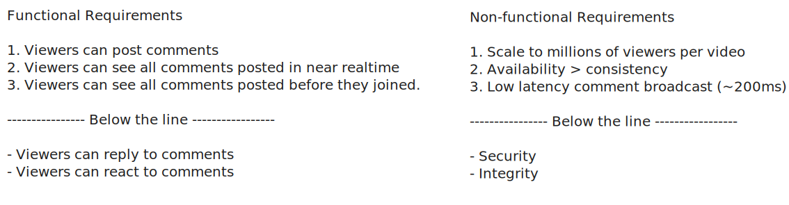
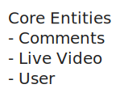
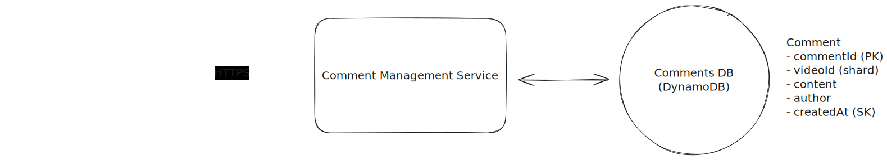
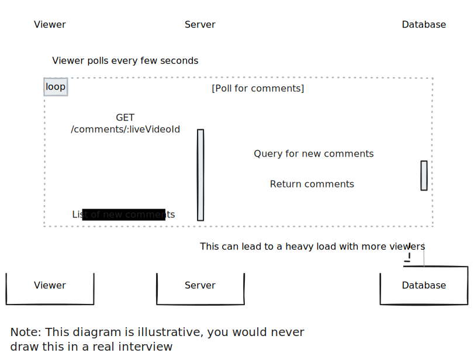
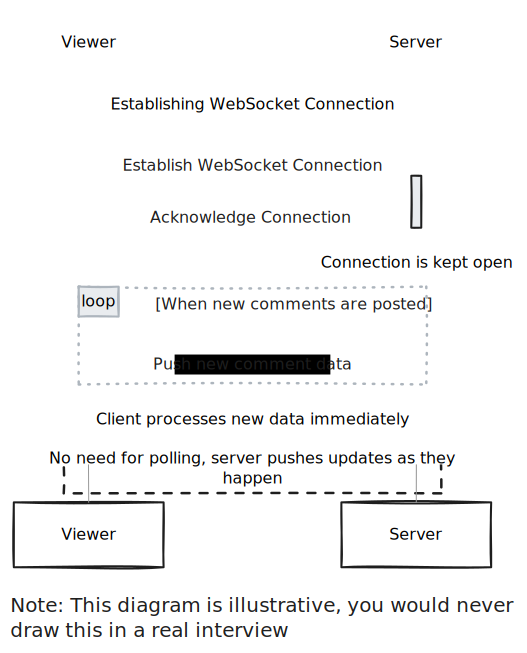
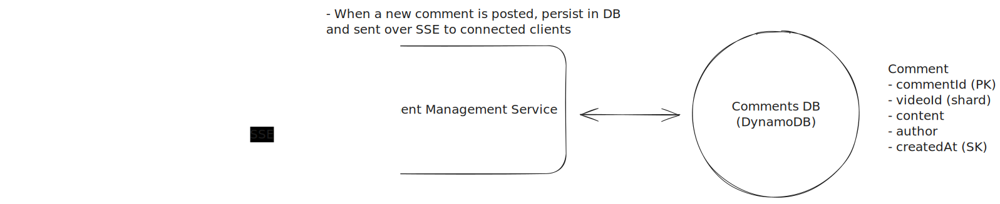
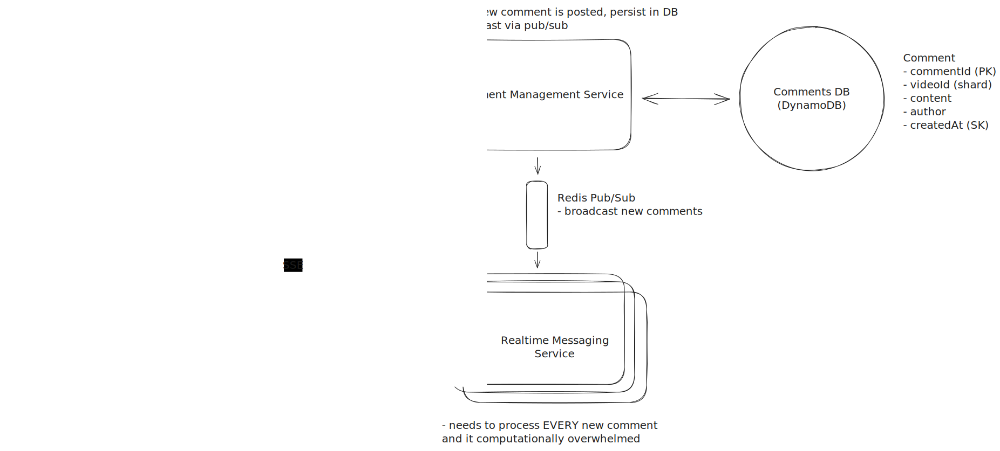
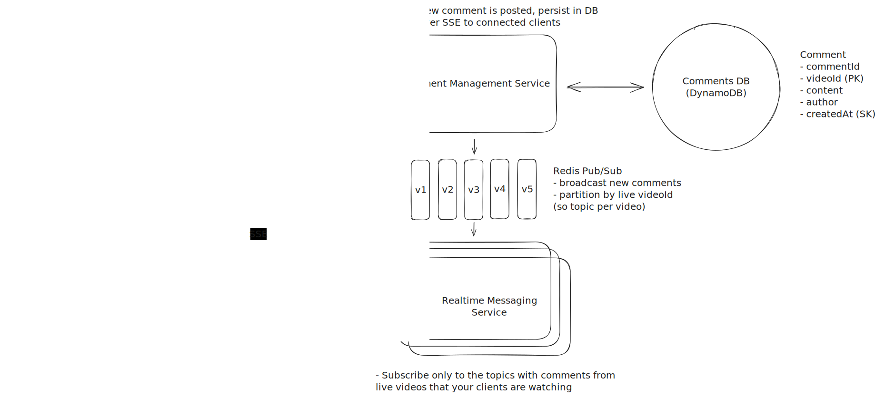
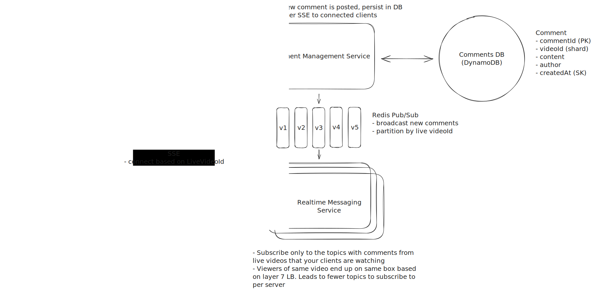
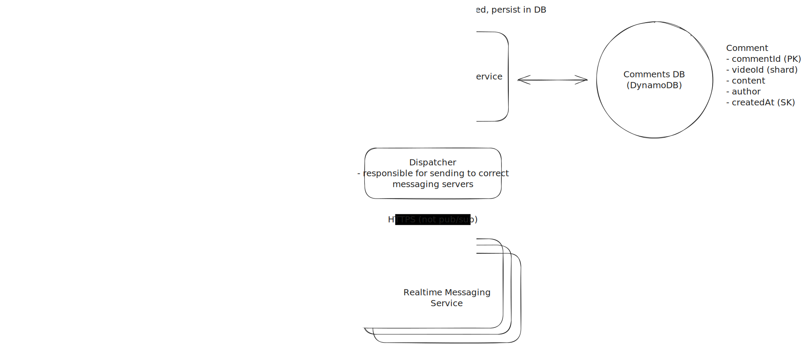

Design Facebook Live Comments
=============================

```
Author: Evan King
```


Understanding the Problem
-------------------------


:::problem

**📹 What are Facebook Live Comments?**
Facebook Live Comments is a feature that enables viewers to post comments on a live video feed. Viewers can see a continuous stream of comments in near-real-time.

:::


### [Functional Requirements](https://www.hellointerview.com/learn/system-design/in-a-hurry/delivery#1-functional-requirements)


**Core Requirements**


1. Viewers can post comments on a Live video feed.
2. Viewers can see new comments being posted while they are watching the live video.
3. Viewers can see comments made before they joined the live feed.


**Below the line (out of scope):**


* Viewers can reply to comments
* Viewers can react to comments


### [Non-Functional Requirements](https://www.hellointerview.com/learn/system-design/in-a-hurry/delivery#2-non-functional-requirements)


**Core Requirements**


1. The system should scale to support millions of concurrent videos and thousands of comments per second per live video.
2. The system should prioritize availability over consistency, eventual consistency is fine.
3. The system should have low latency, broadcasting comments to viewers in near-real time (< 200ms)


**Below the line (out of scope):**


* The system should be secure, ensuring that only authorized users can post comments.
* The system should enforce integrity constraints, ensuring that comments are appropriate (ie. not spam, hate speech, etc.)


:::info

**🤩 Fun Fact!**
Humans generally perceive interactions as real-time if they occur within 200 milliseconds. Any delay shorter than 200 milliseconds in a user interface is typically perceived as instantaneous so when developing real-time systems, this is the target latency to aim for.

:::


:::info

**🤩 Fun Fact!**
The most popular Facebook Live video was called Chewbacca Mom which features a mom thoroughly enjoying a plastic, roaring Chewbacca mask. It has been viewed over 180 million times. Check it out [here](https://www.youtube.com/watch?v=y3yRv5Jg5TI).

:::


Here's how your requirements section might look on your whiteboard:





The Set Up
----------


### Planning the Approach


Before you move on to designing the system, it's important to start by taking a moment to plan your strategy. Fortunately, for these common product style system design questions, the plan should be straightforward: build your design up sequentially, going one by one through your functional requirements. This will help you stay focused and ensure you don't get lost in the weeds as you go. Once you've satisfied the functional requirements, you'll rely on your non-functional requirements to guide you through layering on depth and complexity to your design.


### [Defining the Core Entities](https://www.hellointerview.com/learn/system-design/in-a-hurry/delivery#core-entities-2-minutes)


I like to begin with a broad overview of the primary entities. Initially, establishing these key entities will guide our thought process and lay a solid foundation as we progress towards defining the API. Think of these as the "nouns" of the system.


:::tip

Why just the entities and not the whole data model at this point? The reality is we're too early in the design and likely can't accurately enumerate all the columns/fields yet. Instead, we start by grasping the core entities and then build up the data model as we progress with the design.

:::


For this particular problem, we only have three core entities:


1. **User**: A user can be a viewer or a broadcaster.
2. **Live Video**: The video that is being broadcasted by a user (this is owned and managed by a different team, but is relevant as we will need to integrate with it).
3. **Comment**: The message posted by a user on a live video.


In your interview, this can be as simple as a bulleted list like:





Now, let's carry on to outline the API, tackling each functional requirement in sequence. This step-by-step approach will help us maintain focus and manage scope effectively.


### [API or System Interface](https://www.hellointerview.com/learn/system-design/in-a-hurry/delivery#api-or-system-interface-5-minutes)


We'll need a simple POST endpoint to create a comment.


```
POST /comments/:liveVideoId
Header: JWT | SessionToken
{
    "message": "Cool video!"
} 
```


:::warning

Note that the userId is not passed in the request body. Instead, it is a part of the request header, either by way of a session token or a [JWT](https://jwt.io/). This is a common pattern in modern web applications. The client is responsible for storing the session token or JWT and passing it in the request header. The server then validates the token and extracts the userId from it. This is a more secure approach than passing the userId in the request body because it prevents users from tampering with the request and impersonating other users.

:::


We also need to be able to fetch past comments for a given live video.


```
GET /comments/:liveVideoId?cursor={last_comment_id}&pagesize=10
```


Pagination will be important for this endpoint. More on that later when we get deeper into the design.


[High-Level Design](https://www.hellointerview.com/learn/system-design/in-a-hurry/delivery#high-level-design-10-15-minutes)
---------------------------------------------------------------------------------------------------------------------------


To get started with our high-level design, let's begin by addressing the first functional requirement.


### 1) Viewers can post comments on a Live video feed


First things first, we need to make sure that users are able to post a comment.


This should be rather simple. Users will initiate a POST request to the `POST /comments/:liveVideoId` endpoint with the comment message. The server will then validate the request and store the comment in the database.





1. **Commenter Client**: The commenter client is a web or mobile application that allows users to post comments on a live video feed. It is responsible for authenticating the user and sending the comment to the Comment Management Service.
2. **Comment Management Service**: The comment management service is responsible for creating and querying comments. It receives comments from the commenter client and stores them in the comments database. It will also be responsible for retrieving comments from the comments database and sending them to the viewer client -- more on that later.
3. **Comments Database**: For the comments database, we'll choose DynamoDB because it is a fast, scalable, and highly available database. It's is a good fit for our use case because we are storing simple comments that don't require complex relationships or transactions, though, other databases like Postgres or MySQL would work here as well.


Let's walk through exactly what happens when a user posts a new comment.


1. The users drafts a comment from their device (commenter client)
2. The commenter client sends the comment to the comment management service via the `POST /comments/:liveVideoId` API endpoint.
3. The comment management service receives the request and stores the comment in the comments database.


Great, that was easy, but things get a little more complicated when we start to consider how users will view comments.


### 2) Viewers can see new comments being posted while they are watching the live video.


Now that we've handled comment creation, we need to tackle the challenge of comment distribution - ensuring that when one user posts a comment, all other viewers of the live video can see it.


We can start with the simplest approach: polling.


A working, though naive, approach is to have the clients poll for new comments every few seconds. We would use the `GET /comments/:liveVideoId?since={last_comment_id}` endpoint, adding a `since` parameter to the request that points to the last comment id that the client has seen. The server would then return all comments that were posted after the `since` comment and the client would append them to the list of comments displayed on the screen.





This is a start, but it doesn't scale. As the number of comments and viewers grows, the polling frequency will need to increase to keep up with the demand. This will put a lot of strain on the database and will result in many unnecessary requests (since most of the times there will be no new comments to fetch). In order to meet our requirements of "near real-time" comments, we would need to poll the database every few milliseconds, which isn't feasible.


:::warning

In your interview, if you already know the more accurate, yet complex, solution, you can jump right to it. Just make sure you justify your decision and explain the tradeoffs.

In the case that you are seeing a problem for the first time, starting simple like this is great and sets a foundation for you to build upon in the deep dives.

:::


### 3) Viewers can see comments made before they joined the live feed


When a user joins a live video, they need two things:


1. They should immediately start seeing new comments as they are posted in real-time
2. They should see a history of comments that were posted before they joined


For the history of comments, users should be able to scroll up to view progressively older comments - this UI pattern is called "[infinite scrolling](https://builtin.com/ux-design/infinite-scroll)" and is commonly used in chat applications.


We can fetch the initial set of recent comments using our `GET /comments/:liveVideoId` endpoint. While we could use the `since` parameter we added earlier, that would give us comments newer than a timestamp - the opposite of what we want for loading historical comments. What we really want is something that will "give me the N most recent comments that occurred before a certain timestamp".


To do that, we can introduce pagination. Pagination is a common technique used to break up a large set of results into smaller chunks. It is typically used in conjunction with infinite scrolling to allow users to load more results as they scroll down the page.


Whenever you have a requirement that involves loading a large set of results, you should consider pagination.


When it comes to implementing pagination, there are two main approaches: offset pagination and cursor pagination.


:::solution-bad
#### Bad Solution: Offset Pagination

**Approach**

The simplest approach is to use offset pagination. Offset pagination is a technique that uses an offset to specify the starting point for fetching a set of results. Initially, the offset is set to 0 to load the most recent comments, and it increases by the number of comments fetched each time the user scrolls to load more (known as the page size). While this approach is straightforward to implement, it poses significant challenges in the context of a fast-moving, high-volume comment feed.

Example request: `GET /comments/:liveVideoId?offset=0&pagesize=10`

**Challenges**

First, offset pagination is inefficient as the volume of comments grows. The database must count through all rows preceding the offset for each query, leading to slower response times with larger comment volumes. Most importantly, offset pagination is not stable. If a comment is added or deleted while the user is scrolling, the offset will be incorrect and the user will see duplicate or missing comments.

:::

:::solution-great
#### Great Solution: Cursor Pagination

**Approach**

A better approach is to use cursor pagination. Cursor pagination is a technique that uses a cursor to specify the starting point for fetching a set of results. The cursor is a unique identifier that points to a specific item in the list of results. Initially, the cursor is set to the most recent comment, and it is updated each time the user scrolls to load more. This approach is more efficient than offset pagination because the database does not need to count through all rows preceding the cursor for each query (assuming we built an index on the cursor field). Additionally, cursor pagination is stable, meaning that if a comment is added or deleted while the user is scrolling, the cursor will still point to the correct item in the list of results.

Example request: `GET /comments/:liveVideoId?cursor={last_comment_id}&pageSize=10`

Since we chose DynamoDB for our comments database, we can use the `last_comment_id` as the cursor via DynamoDB's `LastEvaluatedKey` feature. The query will look something like this:

```
{
    "TableName": "comments",
    "KeyConditionExpression": "liveVideoId = :liveVideoId",
    "ScanIndexForward": false,
    "Limit": `pagSize`,
    "ExclusiveStartKey": {
        "liveVideoId": "liveVideoId",
        "last_comment_id": "last_comment_id"
    }
}
```
**Challenges**

While cursor pagination reduces database load compared to offset pagination, it still requires a database query for each new page of results, which can be significant in a high-traffic environment like ours.

:::


Cursor based pagination is a better fit for our use case. Unlike offset pagination, it's more efficient as we don't need to scan through all preceding rows. It's stable - new comments won't disrupt the cursor's position during scrolling. It works well with DynamoDB's LastEvaluatedKey feature, and it scales better since performance remains consistent as comment volume grows.


[Potential Deep Dives](https://www.hellointerview.com/learn/system-design/in-a-hurry/delivery#deep-dives-10-minutes)
--------------------------------------------------------------------------------------------------------------------


### 1) How can we ensure comments are broadcasted to viewers in real-time?


Our simple polling solution was a good start, but it's not going to pass the interview. Instead of having the client "guess" when new comments are ready and requesting them, we can use a push based model. This way the server can push new comments to the client as soon as they are created.


There are two main ways we can implement this. Websockets and Server Sent Events (SSE). Let's weigh the pros and cons of each.


:::solution-good
#### Good Solution: Websockets

**Approach**

Websockets are a two-way communication channel between a client and a server. The client opens a connection to the server and keeps it open. The server keeps a connection open and sends new data to the client without requiring additional requests. When a new comment arrives, the Comment Management Server distributes it to all clients, enabling them to update the comment feed. This is much more efficient as it eliminates polling and enables the server to immediately push new comments to the client upon creation.

**Challenges**

Websockets are a good solution, and for real-time chat applications that have a more balanced read/write ratio, they are optimal. However, for our use case, the read/write ratio is not balanced. Comment creation is a relatively infrequent event, so while most viewers will never post a comment, they will be viewing/reading all comments.

Because of this imbalance, it doesn't make sense to open a two-way communication channel for each viewer, given that the overhead of maintaining the connection is high.



:::

:::solution-great
#### Great Solution: Server Sent Events (SSE)

**Approach**

A better approach is to use Server Sent Events (SSE). SSE is a persistent connection that operates over standard HTTP, making it simpler to implement than WebSockets. The server can push data to the client in real-time, while client-to-server communication happens through regular HTTP requests.

This is a better solution given our read/write ratio imbalance. The infrequent comment creation can use standard HTTP POST requests, while the frequent reads benefit from SSE's efficient one-way streaming.

**Challenges**

SSE introduces several infrastructure challenges that need careful consideration. Some proxies and load balancers lack support for streaming responses, leading to buffering issues that can be difficult to track down. Browsers also impose limits on concurrent SSE connections per domain, which creates problems for users trying to watch multiple live videos simultaneously. The long-lived nature of SSE connections complicates monitoring and debugging efforts.

SSE connections typically only last 30-60 seconds before needing to reconnect. This short lifespan could create gaps in the comment stream, but modern browsers provide robust solutions. The EventSource API handles reconnection automatically and tracks the last received event ID. This allows clients to request any missed comments when reconnecting, ensuring a smooth viewing experience even through brief disconnections.

:::





Here is our updated flow:


1. User posts a comment and it is persisted to the database (as explained above)
2. In order for all viewers to see the comment, the Comment Management Service will send the comment over SSE to all connected clients that are subscribed to that live video.
3. The Commenter Client will receive the comment and add it to the comment feed for the viewer to see.


:::info

Astute readers have probably recognized that this solution does not scale. You're right. We'll get to that in the next deep dive.

:::


### 2) How will the system scale to support millions of concurrent viewers?


We landed on Server Sent Events (SSE) being the appropriate technology. Now we need to figure out how to scale it. With SSE, we need to maintain an open connection for each viewer. Modern servers and operating systems can handle large numbers of concurrent connections—commonly in the range of 100k to 1M—on a single listening port. Realistically, system resources like CPU, memory, and file descriptors become the bottleneck before you hit any theoretical limit. If we want to support many millions of concurrent viewers, we simply won’t be able to do it on a single machine. We must scale horizontally by adding more servers.


The question then becomes how do we distribute the load across multiple servers and ensure each server knows which comments to send to which viewers?


:::info

Contrary to a common misconception, the capacity isn’t limited to 65,535 connections. That number refers to the range of port numbers, not the number of connections a single server port can handle. Each TCP connection is identified by a unique combination of source IP, source port, destination IP, and destination port. With proper OS tuning and resource allocation, a single listening port can handle hundreds of thousands or even millions of concurrent SSE connections.

In practice, however, the server’s hardware and OS limits—rather than the theoretical port limit—determine the maximum number of simultaneous connections.

:::


Before we dive into solutions, let's understand the core challenge with horizontal scaling:


When we add more servers to handle the load, viewers watching the same live video may end up connected to different servers. For example:


* UserA is watching Live Video 1 and connected to Server 1
* UserB is watching Live Video 1 but connected to Server 2


Now imagine a new comment is posted on Live Video 1. If this comment request hits Server 1:


* Server 1 can easily send it to UserA since they're directly connected
* But Server 1 has no way to send it to UserB, who is connected to Server 2


This is our key challenge: How do we ensure all viewers see new comments, regardless of which server they're connected to?


:::solution-bad
#### Bad Solution: Horizontal Scaling with Load Balancer and Pub/Sub

**Approach**

The first thing we need to do is separate out the write and read traffic by creating Realtime Messaging Servers that are responsible for sending comments to viewers. We separate this out because the write traffic is much lower than the read traffic and we need to be able to scale the read traffic independently.

To distribute incoming traffic evenly across our multiple servers we can use a simple load balancing algorithm like [round robin](https://www.nginx.com/resources/glossary/round-robin-load-balancing/#:~:text=What%20Is%20Round%2DRobin%20Load,to%20each%20server%20in%20turn). Upon connecting to a Realtime Messaging Server through the load balancer, the client needs to send a message informing the server of which live video it is watching. The Realtime Messaging Server then updates a mapping in local memory with this information. This map would look something like this:

```
{
    "liveVideoId1": ["sseConnection1", "sseConnection2", "sseConnection3"],
    "liveVideoId2": ["sseConnection4", "sseConnection5", "sseConnection6"],
    "liveVideoId3": ["sseConnection7", "sseConnection8", "sseConnection9"],
}
```

Where `sseConnection{N}` is a pointer to the SSE connection for that viewer. Now, anytime a new comment is created, the server can loop through the list of viewers for that live video and send the comment to each one.

The question then becomes how does each Realtime Messaging Server know that a new comment was created? The most common solution is to introduce pub/sub.

A pub/sub system is a messaging system that uses a publish/subscribe model. Publishers send messages to a channel or topic, and subscribers receive messages from a channel or topic. In our case, the comment management service would publish a message to a channel whenever a new comment is created. The Realtime Messaging Servers would all subscribe to this channel and receive the message. They would then send the comment to all the viewers that are watching the live video.

**Challenges**

This approach works, but it is not very efficient. Each Realtime Messaging Server needs to process every comment, even if it is not broadcasting the live video. This leads to inefficiency, slow performance, and high compute intensity that’s impractical at FB scale.



:::

:::solution-good
#### Good Solution: Pub/Sub Partitioning into Channels per Live Video

**Approach**

To improve upon the previous approach, we can partition the comment stream into different channels based on the live video. Each Realtime Messaging Server would subscribe only to the channels it needs, determined by the viewers connected to it.

Since having a channel per live video will consume a lot of resources and, in some cases like with Kafka may even be infeasible, we can use a hashing function to distribute the load across multiple channels.

We can create N channels and determine which channel to broadcast a comment to based on `hash(liveVideoId) % N`.

This ensures there is a reasonable upper bound on the number of channels.

**Challenges**

While this approach is more efficient, it is not perfect. With the load balancer using round robin, there's a risk that a server could end up with viewers subscribed to many different streams, replicating the issue from the previous approach.



:::

:::solution-great
#### Great Solution: Partitioned Pub/Sub with Layer 7 Load Balancer

**Approach**

To address the issue of servers handling viewers from many different live videos, we need a more intelligent allocation strategy. The goal is to have each server primarily handle viewers of the same live video, making it easier to limit the number of topics or channels each server needs to subscribe to.

There are two ways we can achieve this allocation, both require some scripting or configuration.

**Option 1: Intelligent Routing via Scripts or Configuration**
A Layer 7 load balancer or API gateway can leverage consistent hashing based on the `liveVideoId`. By inspecting the request—such as a header or path parameter that includes the `liveVideoId`—the load balancer can apply a hashing function that always routes viewers of the same video to the same server. Tools like NGINX or Envoy can be scripted with Lua or configuration directives to achieve this content-based routing, reducing overhead and keeping related viewers together.

**Option 2: Dynamic Lookup via a Coordination Service (e.g., Zookeeper)**
Instead of relying on hashing alone, we can store a dynamic mapping of `liveVideoId` to a specific server in a coordination service like Zookeeper. The load balancer or custom proxy layer queries Zookeeper to determine the correct server for each `liveVideoId`. As traffic patterns change, new servers can register themselves or existing mappings can be updated in Zookeeper, and the load balancer will route future requests accordingly. This approach offers more flexibility but introduces operational complexity and requires caching and careful failure handling.

The reality is this is pretty complex, and you would not be expected to go into too much detail here in an interview. Just explaining that you need a way to colocate viewers of the same live video to the same server is good enough. Then mention what some high level options would be.



:::

:::warning

Advanced candidates may point out the tradeoffs in different pub/sub systems. For example, Kafka is a popular pub/sub system that is highly scalable and fault-tolerant, but it has a hard time adapting to scenarios where dynamic subscription and unsubscription based on user interactions, such as scrolling through a live feed or switching live videos, is required. This is due to its pull-based model leading to degraded latency, limited scalability as consumers need to subscribe to all topics, and operational complexity. Redis, on the other hand, is a more suitable option for scenarios requiring dynamic subscription and unsubscription thanks to its efficient in-memory storage and support for both blocking and non-blocking consumption methods, leading to improved latency.

However, the main concern with Redis is its potential for data loss due to periodic disk writes and the challenges of memory limitation, which could be a bottleneck for scalability. Additionally, while Redis offers high availability configurations like Redis Sentinel or Redis Active-Active, these add to the operational complexity of managing a Redis-based system. The pub/sub solution is the "correct academic answer" and should clearly pass the interview, but the reality is choosing the right pub/sub system is a complex decision that requires a deep understanding of the system's requirements and tradeoffs.

:::

:::solution-great
#### Great Solution: Scalable Dispatcher Instead of Pub/Sub

**Approach**

All our previous approaches relied on a pub/sub system, where each Realtime Messaging Server subscribes to topics and receives comments as they're published. This means the comment creation service doesn’t need to know the destination server; it just publishes messages and the right servers pick them up. While standard and effective, this approach adds complexity in managing subscriptions and scaling read-heavy workloads.

An alternative approach inverts the model: the service creating comments directly routes each new comment to the correct Realtime Messaging Server. To achieve this, we introduce a Dispatcher Service. Instead of broadcasting to topics, the Dispatcher Service determines the exact server responsible for the viewers of a given live video and sends the comment there.

So when a new comment comes in, the receiving server asks the Dispatcher Service, "What are all the other servers I should send this comment to?"

At a high-level, here is how it works:

1. **Maintaining Dynamic Mappings:** The Dispatcher Service keeps a dynamic map of which Realtime Messaging Server is responsible for which liveVideoId. This can be stored in memory and periodically refreshed from a consistent store (like Zookeeper or etcd), or updated via heartbeats and registration protocols as servers join or leave.
2. **Registration & Discovery:** When a Realtime Messaging Server comes online, it registers with the Dispatcher Service (or the coordination store it consults). The Dispatcher updates its internal mapping to reflect which server is now serving particular live videos. Likewise, if a server scales down or fails, the Dispatcher updates the mapping accordingly.
3. **Direct Routing:** Upon receiving a new comment, the comment management service calls the Dispatcher Service to determine the correct server. The Dispatcher uses its current mapping and forwards the comment directly to the responsible Realtime Messaging Server, which then sends it to connected viewers.
4. **Scalability & Redundancy:** In high-demand scenarios, multiple Dispatcher instances can run in parallel behind a load balancer. They all consult the same coordination data, ensuring consistency. This replication adds redundancy, making the system more resilient to failures.



**Challenges**

The main challenge is ensuring the Dispatcher Service’s mapping is accurate and up-to-date. Rapid changes in viewer distribution (e.g., a viral stream causing a sudden influx of viewers) require that the Dispatcher’s view of the system be refreshed frequently. This might involve coordination services like Zookeeper or etcd, which must efficiently propagate changes to all Dispatcher instances.

Another difficulty is maintaining consistency across multiple Dispatcher instances. If they each cache routing information, updates must be coordinated to prevent stale mappings. Strong consistency can be achieved through a distributed coordination service, careful cache invalidation policies, and possibly a leader election mechanism to manage updates safely.

:::


Both the pub/sub approach with viewer co-location and the dispatcher service approach are great solutions. The pub/sub is typically easier with fewer corner cases, so it is the one I would use in an interview, but both are "correct" answers.


[What is Expected at Each Level?](https://www.hellointerview.com/blog/the-system-design-interview-what-is-expected-at-each-level)
---------------------------------------------------------------------------------------------------------------------------------


Ok, that was a lot. You may be thinking, “how much of that is actually required from me in an interview?” Let’s break it down.


### Mid-level


**Breadth vs. Depth:** A mid-level candidate will be mostly focused on breadth (80% vs 20%). You should be able to craft a high-level design that meets the functional requirements you've defined, but many of the components will be abstractions with which you only have surface-level familiarity.


**Probing the Basics:** Your interviewer will spend some time probing the basics to confirm that you know what each component in your system does. For example, if you add an API Gateway, expect that they may ask you what it does and how it works (at a high level). In short, the interviewer is not taking anything for granted with respect to your knowledge.


**Mixture of Driving and Taking the Backseat:** You should drive the early stages of the interview in particular, but the interviewer doesn’t expect that you are able to proactively recognize problems in your design with high precision. Because of this, it’s reasonable that they will take over and drive the later stages of the interview while probing your design.


**The Bar for FB Live Comments:** For this question, I expect that candidates proactively realize the limitations with a polling approach and start to reason around a push based model. With only minor hints they should be able to come up with the pub/sub solution and should be able to scale it with some help from the interviewer.


### Senior


**Depth of Expertise**: As a senior candidate, expectations shift towards more in-depth knowledge — about 60% breadth and 40% depth. This means you should be able to go into technical details in areas where you have hands-on experience. It's crucial that you demonstrate a deep understanding of key concepts and technologies relevant to the task at hand.


**Advanced System Design**: You should be familiar with advanced system design principles. For example, knowing how to use pub/sub for broadcasting messages. You’re also expected to understand some of the challenges that come with it and discuss detailed scaling strategies (it’s ok if this took some probing/hints from the interviewer). Your ability to navigate these advanced topics with confidence and clarity is key.


**Articulating Architectural Decisions**: You should be able to clearly articulate the pros and cons of different architectural choices, especially how they impact scalability, performance, and maintainability. You justify your decisions and explain the trade-offs involved in your design choices.


**Problem-Solving and Proactivity**: You should demonstrate strong problem-solving skills and a proactive approach. This includes anticipating potential challenges in your designs and suggesting improvements. You need to be adept at identifying and addressing bottlenecks, optimizing performance, and ensuring system reliability.


**The Bar for Fb Live Comments:** For this question, E5 candidates are expected to speed through the initial high level design so you can spend time discussing, in detail, how to scale the system. You should be able to reason through the limitations of the initial design and come up with a pub/sub solution with minimal hints. You should proactively lead the scaling discussion and be able to reason through the trade-offs of different solutions.


### Staff+


**Emphasis on Depth**: As a staff+ candidate, the expectation is a deep dive into the nuances of system design — I'm looking for about 40% breadth and 60% depth in your understanding. This level is all about demonstrating that, while you may not have solved this particular problem before, you have solved enough problems in the real world to be able to confidently design a solution backed by your experience.


You should know which technologies to use, not just in theory but in practice, and be able to draw from your past experiences to explain how they’d be applied to solve specific problems effectively. The interviewer knows you know the small stuff (REST API, data normalization, etc) so you can breeze through that at a high level so you have time to get into what is interesting.


**High Degree of Proactivity**: At this level, an exceptional degree of proactivity is expected. You should be able to identify and solve issues independently, demonstrating a strong ability to recognize and address the core challenges in system design. This involves not just responding to problems as they arise but anticipating them and implementing preemptive solutions. Your interviewer should intervene only to focus, not to steer.


**Practical Application of Technology**: You should be well-versed in the practical application of various technologies. Your experience should guide the conversation, showing a clear understanding of how different tools and systems can be configured in real-world scenarios to meet specific requirements.


**Complex Problem-Solving and Decision-Making**: Your problem-solving skills should be top-notch. This means not only being able to tackle complex technical challenges but also making informed decisions that consider various factors such as scalability, performance, reliability, and maintenance.


**Advanced System Design and Scalability**: Your approach to system design should be advanced, focusing on scalability and reliability, especially under high load conditions. This includes a thorough understanding of distributed systems, load balancing, caching strategies, and other advanced concepts necessary for building robust, scalable systems.


**The Bar for FB Live Comments:** For a staff+ candidate, expectations are high regarding depth and quality of solutions, particularly when it comes to scaling the broadcasting of comments. I expect staff+ candidates to not only identify the pub/sub solution but proactively call out the limitations around reliability or scalability and suggest solutions. They likely have a good understanding of the exact technology they would use and can discuss the trade-offs of different solutions in detail.


