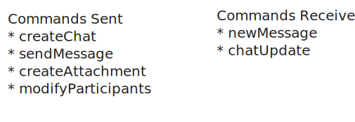
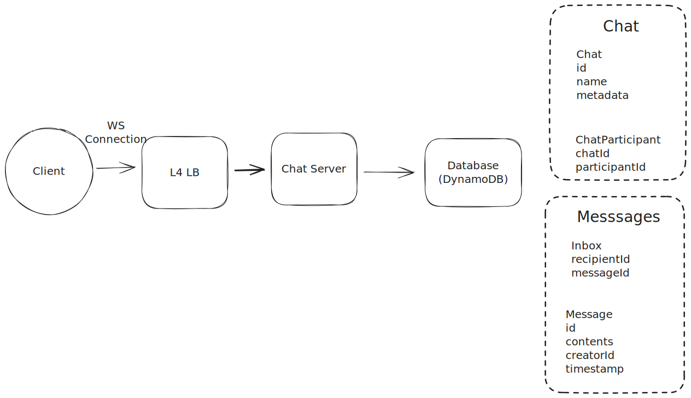
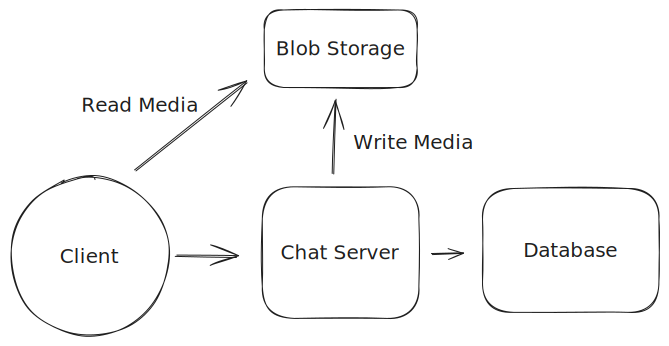
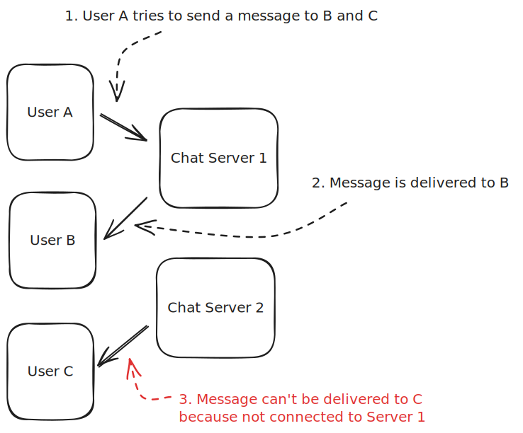
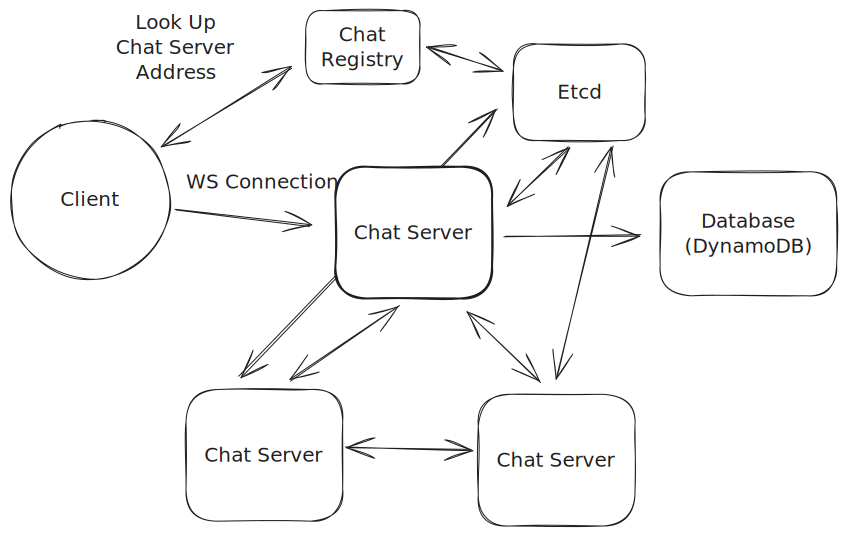
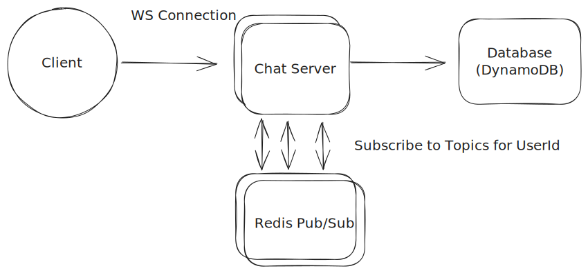
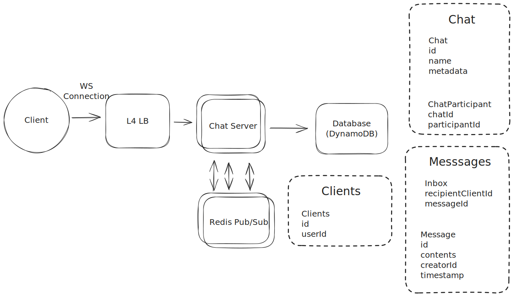

Design Whatsapp or Messenger
============================

```
Author: Stefan Mai
Level : MEDIUM
```


Understanding the Problem
-------------------------


:::problem

**🚗 What is [Whatsapp](https://www.whatsapp.com/)?**
Whatsapp is a messaging service that allows users to send and receive encrypted messages and calls from their phones and computers. Whatsapp was famously originally built on Erlang (no longer!) and renowned for handling high scale with limited engineering and infrastructure outlay.

:::


### [Functional Requirements](https://www.hellointerview.com/learn/system-design/in-a-hurry/delivery#1-functional-requirements)


Apps like WhatsApp and Messenger have tons of features, but your interviewer doesn't want you to cover them all. The most obvious capabilities are almost definitely in-scope but it's good to ask your interviewer if they want you to move beyond. Spending too much time in requirements will make it harder for you to give detail in the rest of the interview, so we won't dawdle too long here!


**Core Requirements**


1. Users should be able to start group chats with multiple participants (limit 100).
2. Users should be able to send/receive messages.
3. Users should be able to receive messages sent while they are not online (up to 30 days).
4. Users should be able to send/receive media in their messages.


:::info

That third requirement isn't obvious to everyone (but it's interesting to design) and If I'm your interviewer I'll probably guide you to it.

:::


**Below the line (out of scope)**


1. Audio/Video calling.
2. Interactions with businesses.
3. Registration and profile management.


### [Non-Functional Requirements](https://www.hellointerview.com/learn/system-design/in-a-hurry/delivery#2-non-functional-requirements)


**Core Requirements**


1. Messages should be delivered to available users with low latency, < 500ms.
2. We should guarantee deliverability of messages - they should make their way to users.
3. The system should be able to handle billions of users with high throughput (we'll estimate later).
4. Messages should be stored on centralized servers no longer than necessary.
5. The system should be resilient against failures of individual components.


**Below the line (out of scope)**


1. Exhaustive treatment of security concerns.
2. Spam and scraping prevention systems.


:::warning

Adding features that are out of scope is a "nice to have". It shows product thinking and gives your interviewer a chance to help you reprioritize based on what they want to see in the interview. That said, it's very much a nice to have. If additional features are not coming to you quickly (or you've already burned some time), don't waste your time and move on. It's easy to use precious time defining features that are out of scope, which provides negligible value for a hiring decision.

:::


The Set Up
----------


### Planning the Approach


Before you move on to designing the system, it's important to start by taking a moment to plan your strategy for the session. For this problem, we might first recognize that 1:1 messages are simply a special case of larger chats (with 2 participants), so we'll solve for that general case.


After this, we should be able to start our design by walking through our core requirements and solving them as simply as possible. This will get us started with a system that is probably slow and not scalable, but a good starting point for us to optimize in the deep dives.


In our deep dives we'll address scaling, optimizations, and any additional features/functionality the interviewer might want to throw on the fire.


### [Defining the Core Entities](https://www.hellointerview.com/learn/system-design/in-a-hurry/delivery#core-entities-2-minutes)


In the core entities section, we'll think through the main "nouns" of our system. The intent here is to give us the right language to reason through the problem and set the stage for our API and data model.


:::tip

Interviewers aren't evaluating you on what you list for core entitites, they're an intermediate step to help you reason through the problem. That doesn't mean they don't matter though! Getting the entities wrong is a great way to start building on a broken foundation - so spend a few moments to get them right and keep moving.

:::


We can walk through our functional requirements to get an idea of what the core entities are. We need:


* Users
* Chats (2-100 users)
* Messages
* Clients (a user might have multiple devices)


We'll use this language to reason through the problem.


### [API or System Interface](https://www.hellointerview.com/learn/system-design/in-a-hurry/delivery#system-interface-2-minutes)


Next, we'll want to think through the API of our system. Unlike a lot of other products where a REST API is probably appropriate, for a chat app, we're going to have high-frequency updates being both sent and received. This is a perfect use case for a [bi-directional socket connection](/learn/system-design/deep-dives/realtime-updates)!


For this interview, we'll just use websockets although a simple TLS connection would do. The idea will be that users will open the app and connect to the server, opening this socket which will be used to send and receive commands which represent our API.


Just knowing that we have a websocket connection is useful, but we'll need to know what commands we want to exchange on the socket.


First, let's be able to create a chat.


```
// -> createChat
{
    "participants": [],
    "name": ""
} -> {
    "chatId": ""
}
```


Now we should be able to send messages on the chat.


```
// -> sendMessage
{
    "chatId": "",
    "message": "",
    "attachments": []
} -> "SUCCESS" | "FAILURE"
```


We need a way to create attachments (note: I'm going to amend this later in the writeup).


```
// -> createAttachment
{
    "body": ...,
    "hash": 
} -> {
    "attachmentId": ""
}
```


And we need a way to add/remove users to the chat.


```
// -> modifyChatParticipants
{
    "chatId": "",
    "userId": "",
    "operation": "ADD" | "REMOVE"
} -> "SUCCESS" | "FAILURE"
```


Each of these commands will have a parallel commands that is sent to other clients. When the command has been received by clients, they'll send an `ack` command back to the server letting it know the command has been received (and it doesn't have to be sent again)!


:::tip

The message receipt acknowledgement is a bit non-obvious but crucial to making sure we don't lose messages. By forcing clients to ack, we can know for certain that the message has been delivered all the way to the client.

:::


When a chat is created or updated ...


```
// <- chatUpdate
{
    "chatId": "",
    "participants": [],
} -> "RECEIVED"
```


When a message is received ...


```
// <- newMessage
{
    "chatId": "",
    "userId": ""
    "message": "",
    "attachments": []
} -> "RECEIVED"
```


Etc ...


Note that enumerating all of these APIs can take time! In the actual interview, I might shortcut by only writing the command names and not the full API. It's also usually a good idea to summarize the API initially before you build out the high-level design in case things need to change. "I'll come back to this as I learn more" is completely acceptable!


Our whiteboard might look like this:





Now that we have a base to work with let's figure out how we can make them real while we satisfy our requirements.


[High-Level Design](https://www.hellointerview.com/learn/system-design/in-a-hurry/delivery#high-level-design-10-15-minutes)
---------------------------------------------------------------------------------------------------------------------------


### 1) Users should be able to start group chats with multiple participants (limit 100)


For our first requirement, we need a way for a user to create a chat. We'll start with a simple service behind an L4 load balancer (to support Websockets!) which can write `Chat` metadata to a database. Let's use [DynamoDB](/learn/system-design/deep-dives/dynamodb) for fast key/value performance and scalability here, although we have lots of other options.


The steps here are:


1. User connects to the service and sends a `createChat` message.
2. The service, inside a transaction, creates a `Chat` record in the database and creates a `ChatParticipant` record for each user in the chat.
3. The service returns the `chatId` to the user.


On the chat table, we'll usually just want to look up the details by the chat's ID. Having a simple primary key on the chat `id` is good enough for this.


For the `ChatParticipant` table, we'll want to be able to (1) look up all participants for a given chat and (2) look up all chats for a given user.


1. We can do this with a composite primary key on the `chatId` and `participantId` fields. A range lookup on the `chatId` will give us all participants for a given chat.
2. We'll need a [Global Secondary Index (GSI)](/learn/system-design/deep-dives/dynamodb#global-secondary-indexes) with `participantId` as the partition key and `chatId` as the sort key. This will allow us to efficiently query all chats for a given user. The GSI will automatically be kept in sync with the base table by DynamoDB.


Great! We got some chats. How about messages?


### 2) Users should be able to send/receive messages.


To allow users to send/receive messages, we're going to need to start taking advantage of the websocket connection that we established. To keep things simple while we get off the ground, let's assume we have a single host for our Chat Server.


This is obviously a terrible solution for scale (and you might say so to your interviewer to keep them from itching), but it's a good starting point that will allow us to incrementally solve those problems as we go.


:::tip

For infrastructure-style interviews, I highly recommend reasoning about a solution on a single host first. Oftentimes the path to scale is straightforward from there. On the other hand if you solve scale first without thinking about how the actual mechanics of your solution work underneath, you're likely to back yourself into a corner.

:::


When users make Websocket connections to our Chat Server, we'll want to keep track of their connection with a simple hash map which will map a user id to a websocket connection. This way we know which users are connected and can send them messages.


To send a message:


1. User sends a `sendMessage` message to the Chat Server.
2. The Chat Server looks up all participants in the chat via the `ChatParticipant` table.
3. The Chat Server looks up the websocket connection for each participant in its internal hash table and sends the message via each connection.


We're making some really strong assumptions here! We're assuming all users are online, connected to the same Chat Server, and that we have a websocket connection for each of them. But under those conditions we're moving, so let's keep going.


### 3) Users should be able to receive messages sent while they are not online (up to 30 days).


With our next requirement, we're forced to undo some of those assumptions. We're going to need to start storing messages in our database so that we can deliver them to users even when they're offline. We'll take this as an opportunity to add some robustness to our system.


Let's keep an "Inbox" for each user which will contain all undelivered messages. When messages are sent, we'll write them to the inbox of each recipient user. If they're already online, we can go ahead and try to deliver the message immediately. If they're not online, we'll store the message and wait for them to come back later.





So, to send a message:


1. User sends a `sendMessage` message to the Chat Server.
2. The Chat Server looks up all participants in the chat via the `ChatParticipant` table.
3. The Chat Server creates a transaction which both (a) writes the message to our `Message` table and (b) creates an entry in our `Inbox` table for each recipient.
4. The Chat Server returns a `SUCCESS` or `FAILURE` to the user with the final message id.
5. The Chat Server looks up the websocket connection for each participant and attempts to deliver the message to each of them via `newMessage`.
6. (For connected clients) Upon receipt, the client will send an `ack` message to the Chat Server to indicate they've received the message. The Chat Server will then delete the message from the `Inbox` table.


For clients who aren't connected, we'll keep the messages in the `Inbox` table. Once the client connects to our service later, we'll:


1. Look up the user's `Inbox` and find any undelivered message IDs.
2. For each message ID, look up the message in the `Message` table.
3. Write those messages to the client's connection via the `newMessage` message.
4. Upon receipt, the client will send an `ack` message to the Chat Server to indicate they've received the message.
5. The Chat Server will then delete the message from the `Inbox` table.


Finally, we'll need to periodically clean up the old messages in the `Inbox` and messages tables. We can do this with a simple cron job which will delete messages older than 30 days.


Great! We knocked out some of the durability issues of our initial solution and enabled offline delivery. Our solution still doesn't scale and we've got a lot more work to do, so let's keep moving.


### 4) Users should be able to send/receive media in their messages.


Our final requirement is that users should be able to send/receive media in their messages.


Users sending and receiving media is annoying. It's bandwidth- and storage- intensive. While we could potentially do this with our Chat Server and database, it's better to use purpose-built technologies for this. This is in fact how Whatsapp actually works: attachments are uploaded via a separate HTTP service.


:::solution-bad
#### Bad Solution: Keep attachments in DB

##### Approach

The worst approach is to have the Chat Server accept the attachment media over our websocket connection and save it in our database. Then we'll need to add an additional message type for users to retrieve attachments.


##### Challenges

This is not a good solution. First, most databases (including DynamoDB) aren't optimized for handling large binary blobs. Second, we're crippling the bandwidth available to our Chat Servers by occupying them with comparitively dumb storage and retrieval. There are better solutions!

:::

:::solution-good
#### Good Solution: Send attachments via chat server

##### Approach

A straightforward approach is to have the Chat Server accept the attachment media, then push it off to blob storage with a TTL of 30 days (remember we don't need to keep messages forever!).

Users who want to retrieve a particular attachment can then query the blob storage directly (via a pre-signed URL for authorization). Ideally, we'd find a way to expire the media once it had been received by all recipients. While we could put a CDN in front of our blob storage, since we're capped at 100 participants the cache benefits are going to be relatively small.



##### Challenges

Unfortunately, our Chat Servers still have to handle the incoming media and forward it to the blob storage (a wasted step). Expiring attachments once they've been downloaded by all recipients isn't handled. Managing encryption and security will require extra steps.

:::

:::solution-great
#### Great Solution: Manage attachments separately

##### Approach

An ideal approach is that we give our users permission (e.g. via pre-signed URLs) to upload directly to the blob storage. As an example, they might send a `getAttachmentTarget` message to the Chat Server which returns a pre-signed URL. Once uploaded, the user will have a URL for the attachment which they can send to the Chat Server as an opaque URL.

Then, our solution works much like the "Good" solution. Users who want to retrieve a particular attachment can then query the blob storage directly (via a pre-signed URL for authorization). Ideally, we'd find a way to expire the media once it had been received by all recipients. While we could put a CDN in front of our blob storage, since we're capped at 100 participants the cache benefits are going to be relatively small.


##### Challenges

Expiring attachments once they've been downloaded by all recipients isn't handled. Managing encryption and security will require extra steps.

:::


Ok awesome, so we have a system which has real-time delivery of messages, persistence to handle offline use-cases, and attachments.


[Potential Deep Dives](https://www.hellointerview.com/learn/system-design/in-a-hurry/delivery#deep-dives-10-minutes)
--------------------------------------------------------------------------------------------------------------------


With the core functional requirements met, it's time to dig into the non-functional requirements via deep dives and solve some of the issues we've earmarked to this point. This includes solving obvious scalability issues as well as auxillary questions which demonstrate your command of system design.


:::tip

The degree to which a candidate should proactively lead the deep dives is a function of their seniority. In this problem, all levels should be quick to point out that my single-host solution isn't going to scale. But beyond these bottlenecks, it's reasonable in a mid-level interview for the interviewer to drive the majority of the deep dives. However, in senior and staff+ interviews, the level of agency and ownership expected of the candidate increases. They should be able to proactively look around corners and identify potential issues with their design, proposing solutions to address them.

:::


### 1) How can we handle billons of simultaneous users?


Our single-host system is convenient but unrealistic. Serving billions of users via a single machine isn't possible and it would make deployments and failures a nightmare. So what can we do? The obvious answer is to try to scale out the number of Chat Servers we have.


If we have 1b users, we might expect 200m of them to be connected at any one time. Whatsapp famously served 1-2m users per host, but this will require us to have hundreds of chat servers. That's a lot of simultaneous connections (!).


:::tip

Note that I've included some back-of-the-envelope calculations here. Your interviewer will likely expect them, but you'll get more mileage from your calculations by doing them just-in-time: when you need to figure out a scaling bottleneck.

:::


Adding more chat servers also introduces some new problems: now the sending and receiving users might be connected to different hosts. If User A is trying to send a message to User B and C, but User B and C are connected to different Chat Servers, we're going to have a problem.





The issue is one of of routing: we're going to need to route messages to the right Chat Servers in order to deliver them. We have a few options here which are discussed in greatest depth in the [Realtime Updates Deep Dive](/learn/system-design/deep-dives/realtime-updates).


:::solution-bad
#### Bad Solution: Naively horizontally scale

##### Approach

The most naive (broken) solution is to put a load balancer in front of our Chat Servers and scale horizontally.

##### Challenges

This won't work. A given server might accept a message to be sent to a Chat, but we're no longer guaranteed it will have the connections to each of the clients who needs to receive it. We won't be able to deliver the events and messages!

:::

:::solution-bad
#### Bad Solution: Keep a kafka topic per user

##### Approach

Many candidates instinctively reach for a queue or stream in order to solve the scaling problem. One example solution would be to create a Kafka topic for every user in the system. The idea here would be that we could keep our `Inbox` table as a Kafka topic. Then our Chat Servers will subscribe to the topic and deliver messages to the user.

Under this proposal, when a user connects to our Chat Server, they'd subscribe to the topic for their user ID. When we need to send a message to a given user we'd publish the message to the topic for that user. This message would be received by all the chat servers that have subscribed to that topic, and then the message could be passed on to the websocket connection for that user.

##### Challenges

This unfortunately doesn't work - Kafka is not built for billions of topics and carries significant overhead for each one (order of 50kb per topic).

There are potential fixes that you might conceive, like creating "super topics" which group together all of the users on a given Chat Server, but you'll quickly find yourself reinventing the good aspects for alternative solutions below with little of the benefit.

:::

:::solution-good
#### Good Solution: Consistent Hashing of Chat Servers

##### Approach

Another approach for us to use is to always assign users to a specific Chat Server based on their user ID. If we do this correctly, we'll always know which Chat Server is responsible for a given user so, when we need to send them messages, we can do so directly.

To do this we'll need to keep a central registry of how many Chat Servers we have, their addresses, and the which segments of a consistent hash space they own. We might use a service like Zookeeper or Etcd to do this.

When a request comes in, we'll connect them to the Chat Server they are assigned to based on their user id. When a new event is created, Chat Servers will connect directly with the Chat Server that "owns" that user id, then call an API which delivers a notification the connected user (if they're connected).



##### Challenges

Each Chat Server will need to maintain connections with each other Chat Server which will require that we keep our Chat Servers big in size and small in number.

Increasing the number of Chat Servers requires careful orchestration of dropping connections so that users reconnect to other servers without triggering a thundering herd (we need to be able to support users moving between servers). During scaling we need to ensure that events are sent to both servers to prevent dropping messages.

All of these are solvable problems but your interviewer will expect you to talk about them and how to pull it off.

:::

:::solution-great
#### Great Solution: Offload to Pub/Sub

##### Approach

The last approach is to use a purpose-built system for the bouncing messages between servers.

Redis Pub/Sub is a good example which uses a very lightweight hashmap of socket connections to allow you to ferry messages to arbitrary destinations. With Pub/Sub you can create a subscription for a given user ID and then publish messages to that subscription which are received "at most once" by the subscribers.

On connection:

1. When users connect to our Chat Server, we're connect to Pub/Sub to subscribe to the topic for that user ID.
2. Any messages received on that subscription are then forwarded on to the websocket connection for that user.

When a message needs to be sent:

1. We publish the message to the Pub/Sub topic for the relevant user ID.
2. The message is received by all subscribing Chat Servers.
3. Those Chat Servers then forward the message to the user's websocket connection.

Pub/Sub is "at most once" which means it doesn't guarantee delivery. If there's no subscribers listening, that pub/sub message is lost. But this is ok in our design, because we already manage the durability of our messages with our `Inbox` table. If clients aren't connected, they'll receive the message when they connect later and retrieve all of the undelivered messages (we can also periodically poll for undelivered messages for transient failures in between).



##### Challenges

The Pub/Sub implementation introduces additional latency because we need to ferry messages via Redis. This is small (single-digit milliseconds) but it's still a cost.

We also have all-to-all relationship between Chat Servers and Redis cluster servers - we'll need to have connections between each Chat Server and each Redis server.

:::


### 2) What do we do to handle multiple clients for a given user?


To this point we've assumed a user has a single device, but many users have multiple devices: a phone, a tablet, a desktop or laptop - maybe even a work computer. Imagine my phone had received the latest message but my laptop was off. When I wake it up, I want to make sure that all of the latest messages are delivered to my laptop so that it's in sync. We can no longer rely on the user-level "Inbox" table to keep track of delivery!


Having multiple clients/devices introduces some new problems:


* First, we'll need to add a way for our design to resolve a user to 1 or more clients that may be active at any one time.
* Second, we need a way to deactivate clients so that we're not unncessarily storing messages for a client which does not exist any longer.
* Lastly, we need to update our message delivery system so that it can handle multiple clients.


Let's see if we can account for this with minimal changes to our design.


* We'll need to create a new `Clients` table to keep track of clients by user id.
* When we look up participants for a chat, we'll need to look up all of the clients for that user.
* Chat servers will subscribe to a topic with the `clientId` vs the `userId`.
* When we send a message, we'll need to send it to all of the clients for that user.
* We'll need to update our `Inbox` table to be per-client rather than per-user.


We'll probably want to introduce some limits (3 clients per account) to avoid blowing up our storage and throughput.





[What is Expected at Each Level?](https://www.hellointerview.com/blog/the-system-design-interview-what-is-expected-at-each-level)
---------------------------------------------------------------------------------------------------------------------------------


Ok, that was a lot. You may be thinking, “how much of that is actually required from me in an interview?” Let’s break it down.


### Mid-level


**Breadth vs. Depth:** A mid-level candidate will be mostly focused on breadth (80% vs 20%). You should be able to craft a high-level design that meets the functional requirements you've defined, but many of the components will be abstractions with which you only have surface-level familiarity.


**Probing the Basics:** Your interviewer will spend some time probing the basics to confirm that you know what each component in your system does. For example, if you use websockets, expect that they may ask you what it does and how they work (at a high level). In short, the interviewer is not taking anything for granted with respect to your knowledge.


**Mixture of Driving and Taking the Backseat:** You should drive the early stages of the interview in particular, but the interviewer doesn’t expect that you are able to proactively recognize problems in your design with high precision. Because of this, it’s reasonable that they will take over and drive the later stages of the interview while probing your design.


**The Bar for Whatsapp:** For this question, an E4 candidate will have clearly defined the API, landed on a high-level design that is functional and meets the requirements. Their scaling solution will have rough edges but they'll have some knowledge of its flaws.


### Senior


**Depth of Expertise**: As a senior candidate, expectations shift towards more in-depth knowledge — about 60% breadth and 40% depth. This means you should be able to go into technical details in areas where you have hands-on experience. It's crucial that you demonstrate a deep understanding of key concepts and technologies relevant to the task at hand.


**Advanced System Design**: You should be familiar with advanced system design principles. For example, knowing about the consistent hashing for this problem is essential. You’re also expected to understand the mechanics of long-running sockets. Your ability to navigate these advanced topics with confidence and clarity is key.


**Articulating Architectural Decisions**: You should be able to clearly articulate the pros and cons of different architectural choices, especially how they impact scalability, performance, and maintainability. You justify your decisions and explain the trade-offs involved in your design choices.


**Problem-Solving and Proactivity**: You should demonstrate strong problem-solving skills and a proactive approach. This includes anticipating potential challenges in your designs and suggesting improvements. You need to be adept at identifying and addressing bottlenecks, optimizing performance, and ensuring system reliability.


**The Bar for Whatsapp:** For this question, E5 candidates are expected to speed through the initial high level design so you can spend time discussing, in detail, scaling and robustness issues in the design. You should also be able to discuss the pros and cons of different architectural choices, especially how they impact scalability, performance, and maintainability.


### Staff+


**Emphasis on Depth**: As a staff+ candidate, the expectation is a deep dive into the nuances of system design — I'm looking for about 40% breadth and 60% depth in your understanding. This level is all about demonstrating that, while you may not have solved this particular problem before, you have solved enough problems in the real world to be able to confidently design a solution backed by your experience.


You should know which technologies to use, not just in theory but in practice, and be able to draw from your past experiences to explain how they’d be applied to solve specific problems effectively. The interviewer knows you know the small stuff so you can breeze through that at a high level so you have time to get into what is interesting.


**High Degree of Proactivity**: At this level, an exceptional degree of proactivity is expected. You should be able to identify and solve issues independently, demonstrating a strong ability to recognize and address the core challenges in system design. This involves not just responding to problems as they arise but anticipating them and implementing preemptive solutions. Your interviewer should intervene only to focus, not to steer.


**Practical Application of Technology**: You should be well-versed in the practical application of various technologies. Your experience should guide the conversation, showing a clear understanding of how different tools and systems can be configured in real-world scenarios to meet specific requirements.


**Complex Problem-Solving and Decision-Making**: Your problem-solving skills should be top-notch. This means not only being able to tackle complex technical challenges but also making informed decisions that consider various factors such as scalability, performance, reliability, and maintenance.


**Advanced System Design and Scalability**: Your approach to system design should be advanced, focusing on scalability and reliability, especially under high load conditions. This includes a thorough understanding of distributed systems, load balancing, caching strategies, and other advanced concepts necessary for building robust, scalable systems.


**The Bar for Whatsapp:** For a staff+ candidate, expectations are high regarding depth and quality of solutions, particularly for the complex scenarios discussed earlier. Great candidates are going 2 or 3 levels deep to discuss failure modes, bottlenecks, and other issues with their design. There's ample discussion to be had around fault tolerance, database optimization, regionalization and cell-based architecture and more.


References
----------


* [What Happens When You Make a Move in Lichess](https://www.davidreis.me/2024/what-happens-when-you-make-a-move-in-lichess)


