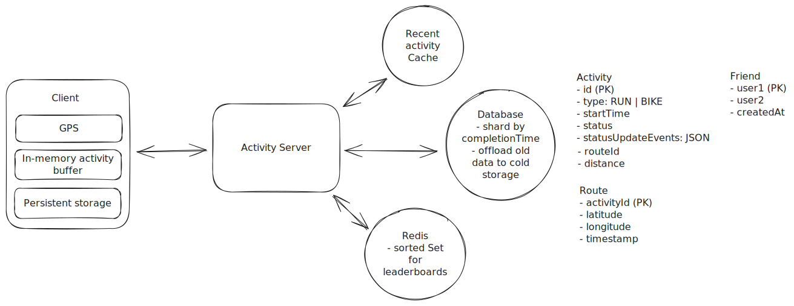

Design a Fitness Tracking App Like Strava
=========================================

```
Author: Evan King
```


Understanding the Problem
-------------------------


:::problem

**🏃‍♂️🚴‍♀️ What is [Strava](https://www.strava.com/)?**
Strava is a fitness tracking application that allows users to record and share their physical activities, primarily focusing on running and cycling, with their network. It provides detailed analytics on performance, routes, and allows social interactions among users.

:::


While Strava supports a wide variety of activities, we'll focus on running and cycling for this question.


### [Functional Requirements](https://www.hellointerview.com/learn/system-design/in-a-hurry/delivery#1-functional-requirements)


**Core Requirements**


1. Users should be able to start, pause, stop, and save their runs and rides.
2. While running or cycling, users should be able to view activity data, including route, distance, and time.
3. Users should be able to view details about their own completed activities as well as the activities of their friends.


**Below the Line (Out of Scope)**


* Adding or deleting friends (friend management).
* Authentication and authorization.
* Commenting or liking runs.


### [Non-Functional Requirements](https://www.hellointerview.com/learn/system-design/in-a-hurry/delivery#2-non-functional-requirements)


**Core Requirements**


1. The system should be highly available (availability >> consistency).
2. The app should function in remote areas without network connectivity.
3. The app should provide the athlete with accurate and up-to-date local statistics during the run/ride.
4. The system should scale to support 10 million concurrent activities.


**Below the Line (Out of Scope)**

* Compliance with data privacy regulations like GDPR.
* Advanced security measures

Here is how it might look on the whiteboard:


The Set Up
----------

### Planning the Approach

### [Defining the Core Entities](https://www.hellointerview.com/learn/system-design/in-a-hurry/delivery#core-entities-2-minutes)

Let's begin by outlining the main entities of our system. At this point, we don't need to delve into every specific detail or column. We'll address the finer points, such as individual fields, once we have a better overall picture. For now, identifying these key entities will help shape our thinking and provide a solid foundation as we move towards defining the API.

To satisfy our key functional requirements, we'll identify the following core entities:

1. **User**: Represents a person using the app. Contains profile information and settings.
2. **Activity**: Represents an individual running or cycling activity. Includes activity type (run/ride), start time, end time, route data (GPS coordinates), distance, and duration.
3. **Route**: A collection of GPS coordinates recorded during the activity (this could also just be a field on the Activity entity).
4. **Friend**: Represents a connection between users for sharing activities (note: friend management is out of scope, but the concept is necessary for sharing).

In the actual interview, this can be as simple as a short list like this. Just make sure you talk through the entities with your interviewer to ensure you are on the same page.


### [The API](https://www.hellointerview.com/learn/system-design/in-a-hurry/delivery#4-api-or-system-interface)

We'll define the APIs that allow the mobile app to interact with the backend services.

Our goal is to simply go one-by-one through the core requirements and define the APIs that are necessary to satisfy them. Usually, these map 1:1 to the functional requirements, but there are times when multiple endpoints are needed to satisfy an individual functional requirement or where a single endpoint meets the needs of multiple functional requirements (as is the case with our activity state update endpoint below).

First, we'll define an endpoint that can be used to create a new activity.

```
// Create a new activity
POST /activities -> Activity
{
    type: "RUN" | "RIDE"
}

```

Next, we'll add an endpoint that can be used to update the state of that activity.

```
// Update the state of an activity
PATCH /activities/:activityId -> Activity
{
    state: "STARTED" | "PAUSED" 
}

```
:::tip

We use PATCH here because we only want to update a subset of the activity's fields. Whereas PUT would require sending the entire resource, with PATCH we only send the fields that are being updated -- a, albeit minor, improvement in efficiency.

In your interview, PUT and PATCH are functionally equivalent. However, you will come across some interviewers who are RESTful API hawks and will argue this point with you, so it's best to be prepared.

:::

When it comes to tracking activity data, we'll add a POST endpoint that is used to update the activity's route and distance.

```
// Add a new location to the activity's route
POST /activities/:activityId/routes -> Activity
{
    location: GPSCoordinate,
}

```

When it comes to sharing activities with friends, we'll say that this happens automatically when an activity is saved, so instead of a endpoint for sharing, we can just update our existing endpoint that updates the activity state to include a "COMPLETE" state.

```
// Mark an activity as complete using the same endpoint we use to update the activity state
PATCH /activities/:activityId -> Activity
{
    state: "COMPLETE"
}

```

To view activities, we'll need a list view that shows either our activities or the activities of our friends. This list will just show basic information about the activity, such as the distance, duration, and date.

```
// Get a list of activities for a user
GET /activities?mode={USER|FRIENDS}&page={page}&pageSize={pageSize} -> Partial<Activity>[]

```
:::info

The `Partial<Activity>` type simply means that we are returning a subset of the activity fields. This is done to limit the amount of data we send over the network. This notation is what I use and is derived from TypeScript, but you can use whatever notation you'd like. This is just a personal preference.

:::

When we click on an activity, we'll want to see more details about like the maps with the route and any additional metrics or details (that are out of scope for this question).

```
// Get an activity by id
GET /activities/:activityId -> Activity

```

[High-Level Design](https://www.hellointerview.com/learn/system-design/in-a-hurry/delivery#high-level-design-10-15-minutes)
---------------------------------------------------------------------------------------------------------------------------

Let's address each functional requirement and design components to satisfy them. The best strategy here, especially if it's a question you've never seen before, is to start with the simplest possible system that satisfies the functional requirements and then layer on complexity to satisfy the non-functional requirements during your deep dives.

:::tip

I often get asked, "If I already know the more complex design, should I still start simple?" The answer is nuanced. If you have a well-thought-out, more sophisticated solution in mind, it's perfectly acceptable to present it during the high-level design. That said, it's crucial to strike a balance. Going deep too early can result in you running out of time before you've met all the functional requirements and, thus, not answered the question.

:::

### 1) Users should be able to start, pause, stop, and save their runs and rides.

We need to design a system that correctly handles both our create activity endpoint and our update activity state endpoint.

We can start by sketching out a very basic client-server architecture:


1. **Client App**: Users interact with the system through a mobile app.
2. **Activity Service**: Handles incoming requests for creating and updating activities.
3. **Database**: Stores information about activities, including route, distance, and time.

A user is going to start by opening the app and clicking the "Start Activity" button:

1. The client app will make a POST request to `/activities` to create a new activity, specifying whether it's a run or a ride.
2. The Activity Service will create the activity in the database and return the activity object to the client.
3. If the user opts to pause or resume their activity, they'll make a PATCH request to `/activities/:activityId` with the updated state and the Activity Service will update the activity in the database accordingly.
4. When the activity is over, the user will click the "Save Activity" button. This will trigger a PATCH request to `/activities/:activityId` with the state set to "COMPLETE".

One interesting part of the design is how to handle the activity time when a user pauses their activity. A naive approach to handling the amount of time elapsed in an activity would be to manage time based on a `startTimeStamp` and then, when an activity is ended, calculate the elapsed time by subtracting the `startTimeStamp` from the current time.

However, this approach would be problematic if a user pauses their activity. The `startTimeStamp` would remain unchanged and the elapsed time would continue to increment, which would be inaccurate.

One common way we could handle this, we can maintain time via a log of status update and timestamp pairs. For example, we could have the following log:

```
[
    { status: "STARTED", timestamp: "2021-01-01T00:00:00Z" },
    { status: "PAUSED", timestamp: "2021-01-01T00:10:00Z" },
    { status: "RESUMED", timestamp: "2021-01-01T00:15:00Z" },
    { status: "STOPPED", timestamp: "2021-01-01T00:20:00Z" }
]

```

When the user clicks "Stop Activity", we can calculate the elapsed time by summing the durations between each pair of timestamps, excluding pauses. In the example above, the elapsed time would be 15 minutes (10 minutes + 5 minutes).

This may seem like overkill for our simple requirement, but it would allow for natural expansions into a feature that shows athletes when they were paused and for how long, as well as a breakdown of "total time" vs "active time."

### 2) While running or cycling, users should be able to view activity data, including route, distance, and time.

When the activity is in progress we need to both update the state and display the activity data to the user.

The first, and most important, part of this is to accurately track the distance and route of the activity. We can do this by recording the user's GPS coordinates at a constant interval. We make the assumption that they are using a modern smartphone with GPS capabilities, so we can use the GPS coordinates to calculate the distance using the [Haversine formula](https://en.wikipedia.org/wiki/Haversine_formula).


Here is how this would work:

1. The client app will record the user's GPS coordinates at a constant interval, let's say 2 seconds for a bike ride and 5 seconds for a run. To do this, we'll utilize the built-in location services provided by both iOS and Android:
   * For iOS: We'll use the Core Location framework, specifically the `CLLocationManager` class. We can set up location updates using `startUpdatingLocation()` method and implement the `locationManager(_:didUpdateLocations:)` delegate method to receive location updates.
   * For Android: We'll use the Google Location Services API, part of Google Play Services. We can use the `FusedLocationProviderClient` class and call `requestLocationUpdates()` method to receive periodic location updates.
2. The client app will then send these new coordinates to our `/activities/:activityId` endpoint.
3. The Activity Service will update the Route table in the database for this activity with the new coordinates and the time the coordinates were recorded.
4. We will also update the distance field by calculating the distance between the new coordinate and the previous one using the Haversine formula.

:::info

You absolutely do not need to know the libraries and frameworks to use here to get GPS coordinates. The point of this question is to test your knowledge of system design, not mobile development. However, it is important to understand that most modern smartphones have built-in GPS capabilities and that most mobile apps use the relevant libraries and frameworks to access this data. I've just included them here to give you an idea of how it works in practice.

:::

Astute readers are likely already yelling at their screen as they've realized that we don't need to send these updates to the server, instead handling the logic locally on the client. You're right. We'll get into this in the deep dive. The reality is most of the time I ask this question, candidates overlook this optimization and we get to it later in the interview.

### 3) Users should be able to view details about their own completed activities as well as the activities of their friends.

Once activities are completed, we should have them already saved in the database and all we needed to do was update their state to "COMPLETE" using the same endpoint we used to update the activity state.

When it comes to viewing activities, we only need to query the DB for the activities with this "COMPLETE" state, while also filtering on the `mode` query param to either show the user's activities or their friends' activities which can be done with a simple WHERE clause.

Example query:

```
SELECT * FROM activities 
WHERE state = "COMPLETE"
AND userId === :userId -- if mode is USER
AND userId IN (SELECT friendId FROM friends WHERE userId = :userId) -- if mode is FRIENDS
LIMIT :pageSize OFFSET (:page - 1) * :pageSize
```

Our friends table will have two columns, `userId` and `friendId`. We'll consider relationships to be bi-directional, so for each new friendship we will add two entries to the table, one with the `userId` and `friendId` and the other with the `userId` and `friendId` reversed. By making the first column the primary key, we can ensure querying for a user's friends is efficient.

This initial GET request returns a list of activities with just the basic information and the `activityId` for each activity. When the user clicks on an activity, we can make a second, more detailed GET request using the `activityId` to get the full activity details.


The full flow is thus,

1. User navigates to the activities list page on the app.
2. Client makes a GET request to `/activities?mode={USER|FRIENDS}&page={page}&pageSize={pageSize}` to get the list of activities.
3. The list of activities is rendered in the UI and the user clicks on an activity to view details.
4. Client makes a GET request to `/activities/:activityId` to get the full activity details to render on a new details page.

For showing the map, we can use a combination of the route data and the Google Maps API. We can pass the array of coordinates to the Google Maps API and it will draw a line connecting all the points.

[Potential Deep Dives](https://www.hellointerview.com/learn/system-design/in-a-hurry/delivery#deep-dives-10-minutes)
--------------------------------------------------------------------------------------------------------------------

At this point, we have a basic, functioning system that satisfies the functional requirements. However, there are a number of areas we could dive deeper into to improve efficiency, offline functionality, scalability, and realtime-sharing.

This list of deep dives is, of course, not exhaustive. It is instead an accumulation of some of the most popular directions I've seen this interview take.

### 1) How can we support tracking activities while offline?

Many athletes will opt to workout in remote areas with no network connectivity, but they still want to be able to track their activities. This brings us to an impactful realization that re-shapes the entire system.

The key insight is that, so long as we don't support realtime-sharing of activities, we can record activity data locally, directly on the clients device and only sync activity data back to the server when the activity completes and/or the user is back online.

Importantly, this actually solves several problems for us:

1. We can track activities without worrying about network reliability on the client side.
2. Even when the client has a fine network connection, we save network bandwidth by avoiding pinging location updates to the server every few seconds (instead, only sending on run completion or pause).
3. Showing accurate and up-to-date activity data to the user is easy as it all happens synchronously on their device.

:::tip

This question highlights an important, often overlooked aspect of system design: the client as an active participant. Modern smartphones and browsers have access to a wide variety of sensors, substantial memory and processing power, and significant local storage. Many candidates overlook the client's capabilities, focusing solely on server-side solutions. However, for systems like Strava, Dropbox, or Spotify, the client often plays a critical role in the overall design, enabling features like offline functionality, reducing server load, and improving user experience.

:::

So how does this work in practice?

1. Just like in our high-level design, we use on-device location services to record the user's GPS coordinates at a constant interval.
2. We record this event data locally on the device in an in-memory buffer (e.g., an array of GPS coordinate and timestamp pairs).
3. To prevent data loss in case of device shutdown or battery depletion, we'll periodically persist this buffer to the device's local storage every ~10 seconds:
   * For iOS: We can use Core Data for larger, structured datasets, or UserDefaults for smaller amounts of simple key-value data.
   * For Android: We can use Room database for larger, structured datasets, or SharedPreferences for smaller amounts of simple key-value data.
4. When the app is reopened or the activity is resumed, we first check local storage for any saved data and load it into our in-memory buffer before continuing to record new data.
5. Once the activity is complete and the device is online, we send all the accumulated data to our server in a single request. For very long activities, we might need to implement a chunking strategy to handle large amounts of data efficiently.
6. We can also implement a background sync mechanism that attempts to upload data periodically when a connection becomes available, even if the activity isn't complete yet. This balances efficiency with data durability.
7. Upon confirmation that the data was saved to our remote database, we can delete the local buffer and are ready to go again.

This approach ensures that even if the device unexpectedly shuts down, we'll only lose a maximum of 10 seconds of activity data (or whatever interval we choose for our periodic saves). However, it's important to balance the frequency of GPS tracking and data persistence with battery life considerations.

:::info

The exact implementation details may vary depending on the mobile platform and the size of the data being stored. For larger datasets, using a local SQLite database
might be more appropriate than options like UserDefaults or SharedPreferences. But the details of this are reserved more for Mobile System Design interviews, not a
general SWE interview.

:::

:::tip

We're done with our first deep dive, and we still have a simple client-server architecture. Why? Especially when most of our other breakdowns use microservices? The truth is, there is no one right answer here. But in this case, we offloaded so much of the write load to the client that we don't have a ton for our backend to do. What we do have still needs to scale, and we will get to that in a bit, but we don't need separate microservices to scale independently given no significant read/write skew across different paths. It could be argued that this will make it harder for the engineering team to grow, with everyone touching the same codebase, but if Meta can famously manage it, so can we.

:::

### 2) How can we scale to support 10 million concurrent activities?

Now that we track activities locally, scaling our backend became pretty easy! We cut down on the number of requests our backend services receive by a factor of 100x since we only send data once a run completes now. Our production engineering team is going to be thrilled, so too the finance team.

We do still have some potential bottlenecks that are worth addressing.

Let's start by looking at our database. With ~100M DAU doing an activity each day we add up to ~100M new activities each day. Over a year, that's ~36500M activities or ~36.5B activities.

To estimate the amount of storage we need for each activity, we can break it down as follows:

* Basic metadata like status, userID, start/end time, etc should be pretty cheap. Let's say ~100 bytes per activity.
* The route is the most expensive part. If the average activity is 30 minutes and we take GPS coordinates, on average, every ~3 seconds, then we'll have about 600 points per activity. Each route row needs a latitude and longitude field as well as a timestamp. This is an additional `(8bytes + 8bytes + 8bytes) * 600 = ~15KB`.

`15KB * 36.5B = 547.5TB of data each year`

This is a good amount of data, but it's far from unmanageable. Here are some things we could do to handle this:

1. We can shard our database to split the data across multiple database instances. We can shard by the time that the activity was completed since the majority of our queries will want to see recent activities.
2. We could introduce data tiering. The chances that someone wants to view a run from several years ago are pretty low. To reduce storage costs, we could move older data to cheaper storage tiers:
   * Hot data (recent activities) stays in fast, expensive storage
   * Warm data (3-12 months old) moves to slower, cheaper storage
   * Cold data (>1 year old) moves to archival storage like S3
3. We can introduce caching if needed. If we find that we are frequently querying the same activities, we can introduce caching to reduce the read load on our database. This would not be a priority for me, as read throughput should be pretty low. but its the first thing we would do if load times become unacceptable.

What database should we choose?

Hot take. It doesn't really matter. This is a large but totally manageable amount of data; there is no crazy read or write throughput, and data is relational but not heavily so. Realistically, all popular major database technologies would work great here.

For the Activity Service, given both read and write throughput should be pretty low, I see no reason to break this into microservices that scale independently. Instead, when we run into issues with memory, cpu, or network limitation we can just scale the service horizontally.


### 3) How can we support realtime sharing of activities with friends?

One common follow up question in this interview is, w"hat happens when you want to allow friends to follow along with activities in real-times". In this case, friends don't just see activity statistics once completed, but they can watch you mid run/bike ride -- seeing your stats and routes update in near real-time.

This moves the design closer to other popular realtime systems like [FB Live Comments](https://www.hellointerview.com/learn/system-design/problem-breakdowns/fb-live-comments) or [Whatsapp](https://www.hellointerview.com/learn/system-design/problem-breakdowns/whatsapp).

To enable real-time sharing with friends, we'll reintroduce periodic server updates during activities. While maintaining local device logic for user-facing data, we'll send location updates to the server every 2-5 seconds. As the server gets these updates, they'll be persisted in the database and broadcast to all of the user's friends.

Now, I know what you're likely thinking, "Websockets!" This isn't wrong per se, you could absolutely implement this with websockets or SSE, but I'd strongly argue it's over-engineering the problem.

While you could introduce a real-time tracking service which connects to friends clients via Websocket or SSE and use pub-sub to broadcast updates to friends, this introduces a lot of unecessary complexity.

Instead, there are two key insights that suggest a simpler, polling mechanism will be more effective:

1. Updates are predictable: Unlike with Messenger or Live Comments, we know that the next update should come in the next 2-5 seconds. This predictability allows for efficient polling intervals.
2. Real-time precision isn't critical: Friends don't need to see up-to-the-second information. A slight delay of a few seconds is acceptable and won't significantly impact the user experience.

Informed by these insights, we can implement a simple polling mechanism where friends' clients periodically request updates at the same interval that the athlete's device is sending updates to the server (offset by a few seconds to account for latency).

We can further enhance the user experience by implementing a smart buffering system. This approach involves intentionally lagging the displayed location data by one or two update intervals (e.g., 5-10 seconds). By buffering the data, we can create a smoother, more continuous animation of the athlete's movement. This eliminates the jarring effect of sudden position changes that can occur with real-time updates. To friends viewing the activity, the athlete will appear to be in constant motion, creating a more engaging, "live-stream-like" experience. While this approach sacrifices absolute real-time accuracy, it provides a significantly improved visual experience that better matches users' expectations of how a live tracking feature should look and feel. The intentional lag also helps compensate for any network latency, ensuring a more consistent experience across different network conditions.

### 4) How can we expose a leaderboard of top athletes?

Another natural extension to this problem could be to expose a leader board of the top athletes by activity type and distance. We could filter by country, region, city, etc.

Here are some approaches we could take:

:::solution-bad
#### Bad Solution: Naive Approach

##### Approach

The simplest thing we can do is to query the DB for all activities and then group them by user and sum the distance. We can assume we have some user table with basic information like name, email, country, etc.

This would look something like this:

```
SELECT
    u.name,
    SUM(a.distance) as total_distance
FROM activities a
JOIN users u ON a.userId = u.userId
WHERE a.state = "COMPLETE"
AND a.type = "RUN"
GROUP BY u.userId
ORDER BY total_distance DESC
```

Naturally, this query will be pretty slow given it is running an aggregation over millions of activities. There are several ways we can optimize this.

##### Challenges

This approach faces significant scalability issues. As the number of activities increases, query performance will degrade rapidly. The system would need to scan and aggregate millions of records for each leaderboard request, leading to high latency and increased database load. Additionally, this method doesn't account for the dynamic nature of leaderboards, where rankings can change frequently as new activities are logged.

:::

:::solution-good
#### Good Solution: Periodic Aggregation

##### Approach

To improve on the naive approach, we can implement a periodic aggregation system. This involves creating a separate leaderboard table that stores pre-calculated totals for each user. A background job would run at regular intervals (e.g., daily) to update these aggregates based on new activities. The leaderboard query then becomes a simple SELECT from this pre-aggregated table, sorted by total distance.


##### Challenges

While this method significantly reduces query time for leaderboard requests, it introduces eventual consistency. The leaderboard won't reflect real-time changes, potentially leading to user confusion if their latest activity isn't immediately reflected in their ranking. In addition, determining the optimal frequency for updates can be tricky – too frequent updates could strain system resources, while infrequent updates lead to stale data.

:::

:::solution-great
#### Great Solution: Real-time Leaderboard with Redis

##### Approach

For a more scalable and real-time solution, we can leverage [Redis](https://www.hellointerview.com/learn/system-design/deep-dives/redis), an in-memory data structure store. We'll use Redis Sorted Sets to maintain leaderboards, with user IDs as members and their total distances as scores. When a new activity is logged, we increment the user's score in the sorted set. To query the leaderboard, we simply retrieve the top N members from the sorted set, which Redis can do extremely efficiently.

What happens when we want to filter by country or time range?

To handle filtering by country or time range, we can extend our Redis-based approach:

1. For country filtering:
   * We can create separate sorted sets for each country, e.g., "leaderboard:run:USA", "leaderboard:run:Canada", etc.
   * When an activity is logged, we update both the global leaderboard and the country-specific leaderboard.
   * To query a country-specific leaderboard, we simply use the appropriate country-specific sorted set.

```
# Add an activity to the leaderboard
redis.zadd(f"leaderboard:run:global", {user_id: timestamp})
redis.zadd(f"leaderboard:run:USA", {user_id: timestamp})

# Query the leaderboard
redis.zrange(f"leaderboard:run:global", 0, -1, desc=True)
```

1. For time range filtering, we have a more sophisticated approach that combines both sorted sets and hashes:
   * We'll use a combination of Redis sorted sets and hashes to store both timestamp and distance information.
   * For each activity, we'll store:
     1. A sorted set entry with the activity ID as the member and timestamp as the score.
     2. A hash entry with the activity ID as the key, containing fields for user ID and distance.
   * When querying the leaderboard for a specific time range:
     1. Use ZRANGEBYSCORE to get activity IDs within the desired time range.
     2. For these activity IDs, retrieve the corresponding user IDs and distances from the hash.
     3. Aggregate the distances by user ID in-memory.
     4. Sort the aggregated results to produce the final leaderboard.

Here's a pseudo-code example of how this might work:

```
# When logging a new activity
activity_id = generate_unique_id()
redis.zadd("activities:timestamps", {activity_id: timestamp})
redis.hset(f"activity:{activity_id}", mapping={"user_id": user_id, "distance": distance})

# Querying the leaderboard for last 24 hours
now = current_timestamp()
day_ago = now - 24*60*60
activity_ids = redis.zrangebyscore("activities:timestamps", day_ago, now)

user_distances = {}
for activity_id in activity_ids:
    activity_data = redis.hgetall(f"activity:{activity_id}")
    user_id = activity_data["user_id"]
    distance = float(activity_data["distance"])
    user_distances[user_id] = user_distances.get(user_id, 0) + distance

# Sort users by total distance
leaderboard = sorted(user_distances.items(), key=lambda x: x[1], reverse=True)
```

This approach allows us to efficiently filter by time range and aggregate distances, providing a real-time leaderboard that can be customized for different time periods. We can cache the results with a short TTL to limit the in-memory aggregation while still ensuring freshness.



##### Challenges

The main challenge with this approach is ensuring data consistency between Redis and our primary database. We need to implement a robust system to handle failures and retries when updating Redis. Additionally, we must consider Redis's memory limitations – storing complete leaderboard data for all possible combinations of activity types, time ranges, and geographical filters could consume significant memory. To mitigate this, we might need to implement a caching strategy where we only keep the most frequently accessed leaderboards in Redis and calculate less common ones on-demand.

:::


