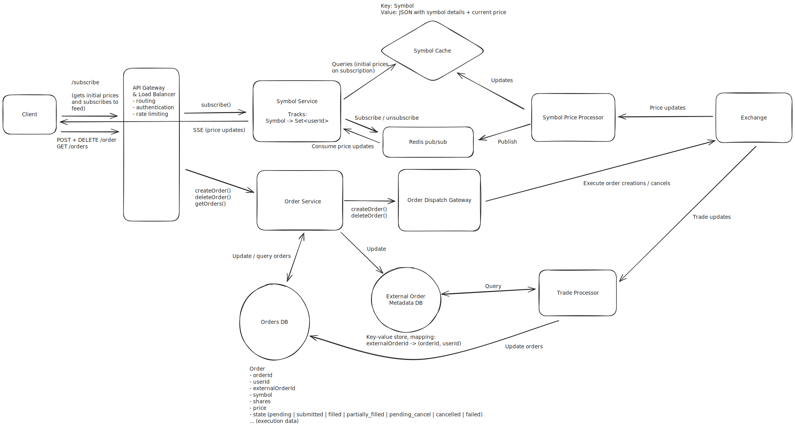
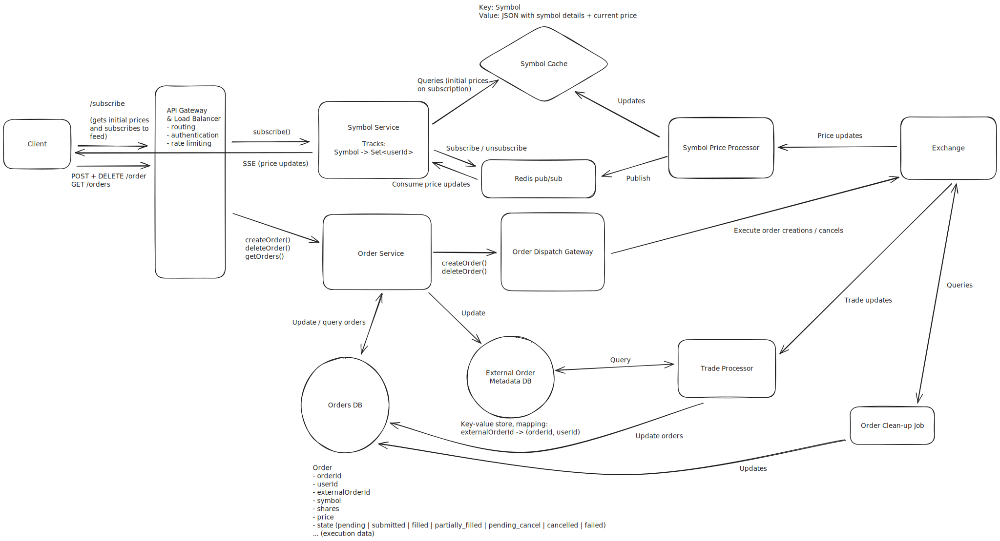

Design a Stock Trading App Like Robinhood
=========================================

```
Author: Joseph Antonakakis
```


Understanding the Problem
-------------------------


:::problem

**📈 What is [Robinhood](https://robinhood.com/)?**
Robinhood is a commission-free trading platform for stocks, ETFs, options, and cryptocurrencies. It features real-time market data and basic order management. Robinhood isn't an exchange in its own right, but rather a stock broker; it routes trades through market makers ("exchanges") and is compensated by those exchanges via [payment for order flow](https://en.wikipedia.org/wiki/Payment_for_order_flow).

:::


### Background: Financial Markets


There's some basic financial terms to understand before jumping into this design:


* **Symbol**: An abbreviation used to uniquely identify a stock (e.g. `META`, `AAPL`). Also known as a "ticker".
* **Order**: An order to buy or sell a stock. Can be a *market order* or a *limit order*.
* **Market Order**: An order to trigger immediate purchase or sale of a stock at the current market price. Has no price target and just specifies a number of shares.
* **Limit Order**: An order to purchase or sell a stock at a specified price. Specifies a number of shares and a target price, and can sit on an exchange waiting to be filled or cancelled by the original creator of the order.


Outside of the above financial details, it's worth understanding the responsibilities of Robinhood as a business / system. **Robinhood is a brokerage and interfaces with external entities that actually manage order filling / cancellation.** This means that we're building a brokerage system that facilitates customer orders and provides a customer stock data. *We are not building an exchange.*


For the purposes of this problem, we can assume Robinhood is interfacing with an "exchange" that has the following capabilities:


* **Order Processing**: Synchronously places orders and cancels orders via request/response API.
* **Trade Feed**: Offers subscribing to a trade feed for symbols. "Pushes" data to the client every time a trade occurs, including the symbol, price per share, number of shares, and the `orderId`.


:::infoFor this interview, the interviewer is offering up an external API (the exchange) to aid in building the system. As a candidate, it's in your best interest to briefly clarify the exchange interface (APIs, both synchronous and asynchronous) so you have an idea of the tools at your disposal. Typically, the assumptions you make about the interface have broad consequences in your design, so it's a good idea to align with the interviewer on the details.:::


### [Functional Requirements](https://www.hellointerview.com/learn/system-design/in-a-hurry/delivery#1-functional-requirements)


**Core Requirements**


1. Users can see live prices of stocks.
2. Users can manage orders for stocks (market / limit orders, create / cancel orders).


**Below the line (out of scope)**


* Users can trade outside of market hours.
* Users can trade ETFs, options, crypto.
* Users can see the [order book](https://www.investopedia.com/terms/o/order-book.asp) in real time.


:::infoThis question focuses on stock viewing and ordering. It excludes advanced trading behaviors and doesn't primarily involve viewing historical stock or portfolio data. If you're unsure what features to focus on for a feature-rich app like Robinhood or similar, have some brief back and forth with the interviewer to figure out what part of the system they care the most about.:::


### [Non-Functional Requirements](https://www.hellointerview.com/learn/system-design/in-a-hurry/delivery#2-non-functional-requirements)

**Core Requirements**

1. The system prefers high consistency for order management; it's *essential* for users to see up-to-date order information when making trades.
2. The system should scale to a high number of trades per day (20M daily active users, 5 trades per day on average, 1000s of symbols).
3. The system should have low latency when reflecting symbol price updates and when placing orders (under 200ms).
4. The system should minimize the number of active clients connecting to an external exchange API. Exchange data feeds / client connections are typically expensive.

**Below the line (out of scope)**

* The system connects to multiple exchanges for stock trading.
* The system manages trading fees / calculations (we can assume fees are not in scope).
* The system enforces daily limits on trading behavior.
* The system protects against bot usage.

Here's how it might look on a whiteboard:

:::warningFor this question, given the small number of functional requirements, the non-functional requirements are even more important to pin down. They characterize the complexity of these deceptively simple live price / order placement capabilities. Enumerating these challenges is important, as it will deeply affect your design.:::

The Set Up
----------

### Planning the Approach

Before you move on to designing the system, it's important to start by taking a moment to plan your strategy. Generally, we recommend building your design up sequentially, going one by one through your functional requirements. This will help you stay focused and ensure you don't get lost in the weeds as you go. Once you've satisfied the functional requirements, you'll rely on your non-functional requirements to guide you through the deep dives.

### [Defining the Core Entities](https://www.hellointerview.com/learn/system-design/in-a-hurry/delivery#core-entities-2-minutes)

Let's go through each high level entity. I like to do this upfront before diving into other aspects of the system so we have a list of concepts to refer back to when talking about the details of the system. At this stage, it isn't necessary to enumerate every column or detail. It's all about laying the foundation.

For Robinhood, the primary entities are pretty straightforward:

1. **User**: A user of the system.
2. **Symbol**: A stock being traded.
3. **Order**: An order for a buy or sell, created by a user.

In the actual interview, this can be as simple as a short list like this. Just make sure you talk through the entities with your interviewer to ensure you are on the same page.


### [The API](https://www.hellointerview.com/learn/system-design/in-a-hurry/delivery#api-design-5-minutes)

The API is the primary interface that users will interact with. It's important to define the API early on, as it will guide your high-level design. We just need to define an endpoint for each of our functional requirements.

Let's start with an endpoint to get a symbol, which will include details and price data. We might have an endpoint like this:

```
GET /symbol/:name
Response: Symbol
```

To create an order, an endpoint might look like this:

```
POST /order
Request: {
  position: "buy",
  symbol: "META",
  priceInCents: 52210,
  numShares: 10
}
Response: Order
```
:::tip

Note we're using `priceInCents` instead of `price` to avoid floating point precision issues. Especially for financial application it's better to use integers to avoid errors and [financial scams](https://screenrant.com/justice-league-incarnate-superman-iii-scheme-easter-egg).

:::

To cancel an order, the endpoint could be as simple as:

```
DELETE /order/:id
Response: {
  ok: true
}
```

Finally, to list orders for a user, the request could be:

```
GET /orders
Response: Order[] (paginated)
```
:::infoWith each of these requests, the user information will be passed in the headers (either via session token or JWT). This is a common pattern for APIs and is a good way to ensure that the user is authenticated and authorized to perform the action while preserving security. You should avoid passing user information in the request body, as this can be easily manipulated by the client.:::

[High-Level Design](https://www.hellointerview.com/learn/system-design/in-a-hurry/delivery#high-level-design-10-15-minutes)
---------------------------------------------------------------------------------------------------------------------------

### 1) Users can see live prices of stocks

The first requirement of Robinhood is allowing users to see the live price of stocks. This might be one stock or many stocks, depending on what the user is viewing in the UI. To keep our design extensible, let's assume a user can see many live stock prices at once. To support this design, let's analyze a few options.

:::solution-bad
#### Bad Solution: Polling Exchange Directly

##### Approach

This solution involves polling the exchange directly for price data per symbol. The client would poll every few seconds (per symbol), and update the price shown to the user based on the response.

##### Challenges

This is a simple approach that will not scale and will not minimize exchange client connections / calls. There's a few fundamental problems with this design:

* **Redundant Exchange Calls**: This approach is a very inefficient way to get price information in terms of exchange call volume. It involves polling, which happens indiscriminately, even if the price has not changed. Additionally, it involves many clients requesting the same information from the exchange, which is wasteful. If 5000 clients are requesting a price at the same time, the price isn't different per client, yet we're expending 5000 calls (repeatedly) to disperse this information.
* **Slow Updates**: If we're pursuing a polling solution, we'll see slower updates than we'd like to pricing information of symbols. In the non-functional requirements, we indicated we wanted a reasonably short SLA to update clients about symbol prices (under 200ms), and the only way we'd guarantee that with this solution is if we poll data every 200ms, which is unreasonable.

For a design like this, we can rule out polling the exchange directly as a viable option.

:::

:::solution-good
#### Good Solution: Polling Internal Cache

##### Approach

This solution still involves polling for price information, but we're polling a symbol service that performs a key-value look-up on an internal cache that is kept up-to-date by a symbol price processor that is listening to prices on the exchange.

This approach prevents excess connections to the exchange by "proxying" it with a service that listens and records the most essential detail: the symbol price. This price is then made available to clients of Robinhood via polling.

##### Challenges

This approach is certainly an improvement, but is still subject to some issues. Clients still indiscriminately poll, even if the price has not changed, leading to some wasted HTTP traffic. Additionally, this approach is a slow way to get price updates; the polling interval dictates the worst-case SLA for a price update propagating to the client. Can we do better?

:::

:::solution-great
#### Great Solution: Server Sent Event (SSE) Price Updates

##### Approach

A great approach here involves Server Sent Events (SSE). SSE is a persistent connection (similar to websockets), but it is unidirectional and goes over HTTP instead of a separate protocol. For this example, the client isn't sending us data, so SSE is a superior choice to websockets. For more details on reasoning through the websocket vs. SSE trade-off analysis, feel free to reference our [FB Live Comments write-up](https://www.hellointerview.com/learn/system-design/problem-breakdowns/fb-live-comments#2-viewers-can-see-all-comments-in-near-real-time-as-they-are-posted).

This approach involves re-working our API to instead have a `/subscribe` `POST` request, with a body containing a list of symbols we want to subscribe to. Our backend can then setup a SSE connection between the client and a symbol service, and send the client an initial list of symbol prices. This initial list of prices is serviced by a cache that is kept up-to-date by a processor that is listening to the exchange. Additionally, that processor is sending our symbol service those prices so that the symbol service can send that data to clients that have subscribed to price updates for different symbols.

##### Challenges

Adding SSE introduces challenges, mainly involving maintaining a connection between client and server. The load balancer will need to be configured to support "sticky sessions" so that a user and server can maintain a connection to promote data transfer. Additionally, a persistent connection means we have to consider how disconnects / reconnects work. Finally, we need to consider how we route user connections and symbol data. Several of these details are covered later in our deep dive sections, so stay tuned.

:::

### 2) Users can manage orders for stocks

The second requirement of Robinhood is allowing users to manage orders for stocks. Users should be able to create orders (limit or market), cancel outstanding orders, and list user orders.

Let's consider our options for creating and cancelling orders via the exchange.

:::solution-bad
#### Bad Solution: Send Orders Directly to Exchange

##### Approach

This solution involves directly interacting with the exchange to submit orders. Any orders issued by the client are directly submitted to the exchange.

##### Challenges

While this is a "mainline" way to submit orders that cuts out any incurred latency from a backend proxying the exchange, it can lead to large number of exchange clients and concurrent requests, which will be very expensive. Additionally, there's no clear path for the client to check status of an order, outside of polling the exchange or directly listening to trade feeds, both of which aren't viable solutions. Finally, the client is exclusively responsible for tracking orders. This isn't great, as we can't consider the client's storage to be reliable; the user might uninstall the app or the phone hardware might fail.

Let's consider other solutions.

:::

:::solution-good
#### Good Solution: Send Orders to Dispatch Service via Queue

##### Approach

This solution involves sending orders to an order service, which enqueues them for an order dispatch service. This soluton avoids excess exchange clients by proxying the exchange order execution with the order dispatch service. This service can bear the responsibility of efficient exchange communication. This service sends orders to this dispatch service via a queue. The queue prevents the dispatch service from being overloaded, and the queue volume can serve as a metric that the dispatch service could elastically scale off of.

##### Challenges

This approach is on the right track as it proxies the exchange and allows a path for elastic scalability in the face of increased order load (e.g. bursts in trading traffic). However, this approach breaks down when we consider our tight order SLA (under 200ms as a goal).

If we consider moments of high queue load, perhaps during high trading traffic and before the order dispatch service has scaled up, orders might take a while to be dispatched to the exchange, which could violate our goal SLA. In particular sensitive moments of trading, this can be really bad for users. Imagine a user who wants to quickly order stocks or quickly cancel an outstanding order. It would be unacceptable for them to be left waiting for our dispatcher to eventually handle their order, or for our service to start more machines up to scale up given increased queue load.

What other options do we have?

:::

:::solution-great
#### Great Solution: Order Gateway

##### Approach

This approach involves sending our orders directly from the order service to an order dispatch gateway. The gateway would enable external internet communication with the exchange via the order service. The gateway would make the requests to the exchange appear as if they were originating from a small set of IPs.

For this approach, our gateway would be an [AWS NAT gateway](https://docs.aws.amazon.com/vpc/latest/userguide/vpc-nat-gateway.html) which would allow for our order services to make requests to the exchange but then appear under a single or small number of IPs ([elastic IPs](https://docs.aws.amazon.com/AWSEC2/latest/UserGuide/elastic-ip-addresses-eip.html), in AWS terms).

Given that the gateway is managing outbound requests, this approach relies on the order service that is accepting requests from the client to play a role in actually managing orders. This service will run business logic to manage orders and will scale up / down as necessary given order volume. Given this search is being routed to from clients, we might make the auto-scaling criterion for this service quite sensitive (e.g. auto-scale when average 50% CPU usage is hit across the fleet) or we might over-provision this service to absorb trading spikes.

##### Challenges

This approach requires our order service to do more to manage orders, meaning it will need to be written in a way that is both efficient for client interaction and efficient for exchange interaction (e.g. potentially batching orders together).

:::

Now that we know how we'll dispatch orders to the exchange, we also must consider how we'll store orders on our side for the purposes of exposing them to the user. The user should be able to `GET /orders` to see all their outstanding orders, so how might we keep data on our side to service this request?

In order to track orders, we can stand up an order database that is updated when orders are created or cancelled. The order database will be a relational database to promote consistency via ACID guarantees, and will be partitioned on `userId` (the ID of the user submitting order changes). This will make querying orders of a user fast, as the query will go to a single node.

The order itself will contain information about the order submitted / cancelled. It will also contain data about the state of the order (`pending` prior to being submitted to the exchange, `submitted` when it's submitted to the exchange, etc.). Finally, the order will contain an `externalOrderId` field, which will be populated by the ID that the exchange responds with when the order service submits the order synchronously.

Additionally, to keep these orders up-to-date, we'll need some sort of trade processor tailing the exchange's trades to see if orders maintained on our side get updated.

:::infoOf note, this trade processor would be a fleet of machines that are connected to the exchange in some way to receive price updates. The communication interface here doesn't matter too much. For most systems like this, a client of the exchange like Robinhood would setup a webhook endpoint and register that with the exchange, and the exchange would call the webhook whenever it had updates. In the case of webhooks, the trade processor would have a load balancer and a fleet of machines serving that webhook endpoint. For the sake of simplicity, we visualize the trade processor as a single square on our flowchart.:::

:::infoYou might be wondering how we concretely reflect updates based on the exchange's trade feed. Stay tuned, as we'll dive into this in one of our deep dive sections.:::

[Potential Deep Dives](https://www.hellointerview.com/learn/system-design/in-a-hurry/delivery#deep-dives-10-minutes)
--------------------------------------------------------------------------------------------------------------------

### 1) How can the system scale up live price updates?

It's worth considering how the system will scale live price updates. If many users are subscribing to price updates from several stocks, the system will need to ensure that price updates are successfully propagated to the user via SSE.

The main problem we need to solve is: **how do we route symbol price updates to the symbol service servers connected to users who care about those symbol updates?**

To enable this functionality in a scalable way, we can leverage [Redis pub/sub](https://redis.io/docs/latest/develop/interact/pubsub/) to publish / subscribe to price updates. Users can subscribe to price updates via the symbol service and the symbol service can ensure it is subscribed to symbol price updates via Redis for all the symbols the users care about. The new system diagram might look like this now:

:::infoWant to learn more about Redis? Check out our [Redis deep dive](https://www.hellointerview.com/learn/system-design/deep-dives/redis) for in-depth discussion of the different ways Redis can be used practically in system design interviews.:::

Let's walk through the full workflow for price updates:

1. A user subscribes via a symbol service server. The server tracks `Symbol -> Set<userId>` mapping, so it adds an entry for each symbol the user is subscribed to.
2. The symbol service server is managing subscriptions to Redis pub/sub for channels corresponding to each symbol. It ensures that it has an active subscription for each symbol the user is subscribed to. If it lacks a subscription, it subscribes to the channel for the symbol.
3. When a symbol changes price, that price update is processed by the symbol price processor, which publishes that price update to Redis. Each symbol service server that is subscribed to that symbol's price updates get the price update via subscription. They then fan-out and send that price update to all users who care about that symbol's price updates.
4. If a user unsubscribes from symbols or disconnects (detected via some heartbeat mechanism), the symbol service server will go through each symbol they were subscribed to and removes them from the `Set<userId>`. If the symbol service server no longer has any users subscribed to a symbol, it can unsubscribe from the Redis channel for that symbol.

The above would scale as it would enable our users to evenly distribute load across the symbol service. Additionally, it would be self-regulating in managing what price updates are being propagated to symbol service servers.

### 2) How does the system track order updates?

When digging into the order dispatch flow, it's worth clarifying how we'll ensure our order DB is updated as orders are updated on the exchange.

Firstly, it's not clear from our current design how the trade processor might reflect updates in the orders DB, based off just a trade. There's no efficient way for the trade processor to look-up a trade via the `externalOrderId` to update a row in the `Order` table, given that the table is partitioned by `userId` . This necessitates a separate key-value data store mapping `externalOrderId` to the `(orderId, userId)` that is corresponds to. For this key-value store, we could use something like [RocksDB](https://rocksdb.org/). This key-value store would be populated by the order service after an order is submitted to the exchange synchronously.

This new key-value store enables the trade processor to quickly determine whether the trade involved an order from our system, and subsequently look up the order (go to shard via `userId` -> look up `Order` via `orderId`) to update the `Order`'s details. The new system diagram might look like this:



### 3) How does the system manage order consistency?

Order consistency is extremely important and worth deep-diving into. Order consistency is defined as orders being stored with consistency on our side and also consistently managed on the exchange side. As we'll get into, fault-tolerance is important for maintaining order consistency.

Before we dig in, we firstly can revisit our order storage mechansim. Our order database is going to be a horizontally partitioned relational database (e.g. Postgres). All order updates will happen on a single node (the partition that the order exists on). All order reads will also occur on a single node, as we'll be partitioning by `userId`.

When an order is created, the system goes through the following workflow:

1. Store an order in the order database with `pending` as the status. *It's important that this is stored first because then we have a record of the client could. If we didn't store this first, then the client could create an order on the exchange, the system could fail, and then our system has no way of knowing there's an outstanding order.*
2. Submit the order to the exchange. Get back `externalOrderId` immediately (the order submission is synchronous).
3. Write `externalOrderId` to our key-value database and update the order in the order database with status as `submitted` and `externalOrderId` as the ID received from the DB.
4. Respond to the client that the order was successful.

The above workflow seems very reasonable, but it might break down if failures occur at different parts of the process. Let's consider several failures, and ways we can mitigate these failures if they pose a risk to our consistency:

* **Failure storing order**: If there's a failure storing the order, we can respond with a failure to the client and stop the workflow.
* **Failure submitting order to exchange**: If there's a failure submitting the order to the exchange, we can mark the order as `failed` and respond to the client.
* **Failure processing order after exchange submission**: If there's an error updating the database after an exchange submission, we might consider having a "clean-up" job that deals with outstanding, `pending` orders in the database. Most exchange APIs offer a `clientOrderId` metadata field when submitting an order (see [E\*TRADE example](https://apisb.etrade.com/docs/api/order/api-order-v1.html#/definitions/PreviewOrderRequest)) so the "clean-up" job can asynchronously query the exchange to see if the order went through via this `clientOrderId` identifier, and do one of two things: 1) record the `externalOrderId` if the order did go through, or 2) mark the order as `failed` if the order didn't go through.

Now that we've considered the order flow, let's consider the cancel flow. When an order is cancelled, the system goes through the following workflow:

1. Update order status to `pending_cancel`. *We do this first to enable resolving failed cancels later.*
2. Submit the order cancellation to the exchange.
3. Record the order cancellation in the database.
4. Respond to the client that the cancellation was successful.

Let's walk through different failures to ensure we are safe from inconsistency:

* **Failure updating status to `pending_cancel`**: If there's a failure updating the order status upfront, we respond with a failure to the client and stop the workflow.
* **Failure cancelling order**: If there's a failure cancelling the order via the exchange, we can respond with a failure to the client and rely on a "clean-up" process to scan `pending_cancel` orders (ensure they are cancelled).
* **Failure storing `cancelled` status in DB**: If there's a failure updating the order status in the DB, we can rely on a "clean-up" process to `pending_cancel` orders (ensure they are cancelled, or no-op and just update status to `cancelled` if they have already been cancelled).

Based on the above analysis, we have 1) a clear understanding of the order create and cancel workflows, and 2) identified the need for a "clean-up" background process to ensure our order state becomes consistent in the face of failures at different points in our order / cancel workflows. Below is the updated system diagram reflecting our changes:



### Some additional deep dives you might consider

Robinhood, like most fintech systems, is a complex and interesting application, and it's hard to cover every possible consideration in this guide. Here are a few additional deep dives you might consider:

1. **Excess price updates**: If a set of stocks has a lot of trades or price updates, how might the system handle the load and avoid overwhelming the client? This might be interesting to cover.
2. **Limiting exchange correspondence**: While we certainly covered ways we'd "proxy" the exchange and avoid excess concurrent connections / clients, it might be worthwhile to dive into other ways the system might limit exchange correspondence, while still scaling and serving the userbase (e.g. perhaps considering batching orders into single requests).
3. **Live order updates**: It might be worthwile to dive into how the system would propagate order updates to the user in real time (e.g. if the user is looking at orders in the app, they see their orders get filled in real time if they're waiting on the exchange).
4. **Historical price / portfolio value data**: In this design, we didn't focus on historical price / portfolio data at all, but some interviewers might consider this a requirement. It's worthwhile to ponder how a system would enable showing historical price data (over different time windows) and historical user portfolio value.

[What is Expected at Each Level?](https://www.hellointerview.com/blog/the-system-design-interview-what-is-expected-at-each-level)
---------------------------------------------------------------------------------------------------------------------------------

Ok, that was a lot. You may be thinking, "how much of that is actually required from me in an interview?" Let’s break it down.

### Mid-level

**Breadth vs. Depth:** A mid-level candidate will be mostly focused on breadth (80% vs 20%). You should be able to craft a high-level design that meets the functional requirements you've defined, but many of the components will be abstractions with which you only have surface-level familiarity.

**Probing the Basics:** Your interviewer will spend some time probing the basics to confirm that you know what each component in your system does. For example, if you add an API Gateway, expect that they may ask you what it does and how it works (at a high level). In short, the interviewer is not taking anything for granted with respect to your knowledge.

**Mixture of Driving and Taking the Backseat:** You should drive the early stages of the interview in particular, but the interviewer doesn’t expect that you are able to proactively recognize problems in your design with high precision. Because of this, it’s reasonable that they will take over and drive the later stages of the interview while probing your design.

**The Bar for Robinhood:** For this question, an E4 candidate will have clearly defined the API endpoints and data model, landed on a high-level design that is functional for price updates and ordering. I don't expect candidates to know in-depth information about specific technologies, but the candidate should converge on ideas involving efficient price update propagation and consistent order management. I also expect the candidate to know effectivew ways of proxying the exchange to avoid excess connections / clients.

### Senior

**Depth of Expertise**: As a senior candidate, expectations shift towards more in-depth knowledge — about 60% breadth and 40% depth. This means you should be able to go into technical details in areas where you have hands-on experience. It's crucial that you demonstrate a deep understanding of key concepts and technologies relevant to the task at hand.

**Advanced System Design**: You should be familiar with advanced system design principles (different technologies, their use-cases, how they fit together). Your ability to navigate these advanced topics with confidence and clarity is key.

**Articulating Architectural Decisions**: You should be able to clearly articulate the pros and cons of different architectural choices, especially how they impact scalability, performance, and maintainability. You justify your decisions and explain the trade-offs involved in your design choices.

**Problem-Solving and Proactivity**: You should demonstrate strong problem-solving skills and a proactive approach. This includes anticipating potential challenges in your designs and suggesting improvements. You need to be adept at identifying and addressing bottlenecks, optimizing performance, and ensuring system reliability.

**The Bar for Robinhood:** For this question, E5 candidates are expected to quickly go through the initial high-level design so that they can spend time discussing, in detail, how to handle real-time price propagation and consistent orders. I expect the candidate to design a reasonable, scalable solution for live prices, and I expect the candidate to design a good order workflow with some mindfulness of consistency / fault tolerance.

### Staff+

**Emphasis on Depth**: As a staff+ candidate, the expectation is a deep dive into the nuances of system design — I'm looking for about 40% breadth and 60% depth in your understanding. This level is all about demonstrating that, while you may not have solved this particular problem before, you have solved enough problems in the real world to be able to confidently design a solution backed by your experience.

You should know which technologies to use, not just in theory but in practice, and be able to draw from your past experiences to explain how they’d be applied to solve specific problems effectively. The interviewer knows you know the small stuff (REST API, data normalization, etc.) so you can breeze through that at a high level so you have time to get into what is interesting.

**High Degree of Proactivity**: At this level, an exceptional degree of proactivity is expected. You should be able to identify and solve issues independently, demonstrating a strong ability to recognize and address the core challenges in system design. This involves not just responding to problems as they arise but anticipating them and implementing preemptive solutions. Your interviewer should intervene only to focus, not to steer.

**Practical Application of Technology**: You should be well-versed in the practical application of various technologies. Your experience should guide the conversation, showing a clear understanding of how different tools and systems can be configured in real-world scenarios to meet specific requirements.

**Complex Problem-Solving and Decision-Making**: Your problem-solving skills should be top-notch. This means not only being able to tackle complex technical challenges but also making informed decisions that consider various factors such as scalability, performance, reliability, and maintenance.

**Advanced System Design and Scalability**: Your approach to system design should be advanced, focusing on scalability and reliability, especially under high load conditions. This includes a thorough understanding of distributed systems, load balancing, caching strategies, and other advanced concepts necessary for building robust, scalable systems.

**The Bar for Robinhood:** For a staff-level candidate, expectations are high regarding the depth and quality of solutions, especially for the complex scenarios discussed earlier. Exceptional candidates delve deeply into each of the topics mentioned above and may even steer the conversation in a different direction, focusing extensively on a topic they find particularly interesting or relevant. They are also expected to possess a solid understanding of the trade-offs between various solutions and to be able to articulate them clearly, treating the interviewer as a peer.


